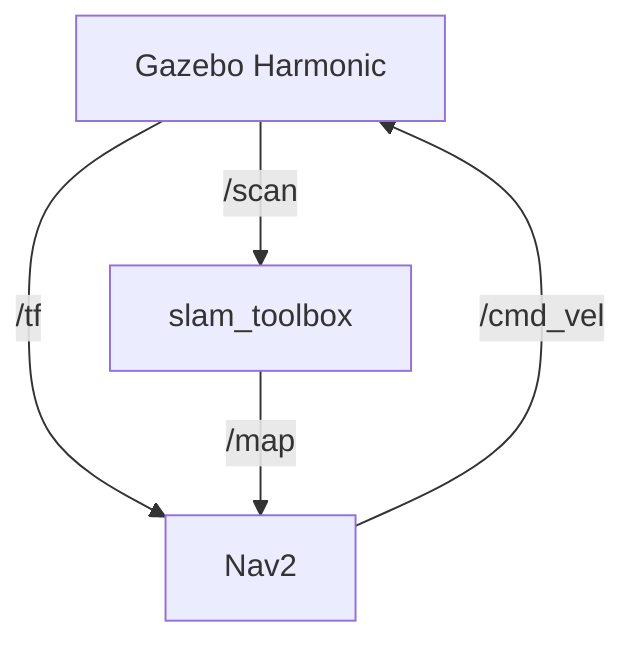

# 自律走行システムの仕組み (Navigation2)

Meistar の自律走行システムは、ROS 2 の標準ナビゲーションスタックである **Nav2** をベースに構成されています。

## システム構成図

## 各コンポーネントの役割

### 1. 自己位置推定 (Localization)
- **AMCL (Adaptive Monte Carlo Localization)**:
  - 地図とLiDARデータを照らし合わせ、ロボットが地図上のどこにいるかを推定します。
  - `/tf` トピックを通じて、`map` -> `odom` の変換を提供します。

### 2. 経路計画 (Planning)
- **Global Planner (NavfnPlanner)**:
  - 地図全体を見て、現在地から目的地までの最短経路（ルート）を計算します。
- **Local Controller (MPPI / DWB)**:
  - 障害物を避けながら、グローバルパスに沿って動くための具体的な速度指令（`cmd_vel`）を生成します。

### 3. 障害物監視 (Collision Monitor)
- ロボットの周囲に仮想的な「停止ゾーン」や「減速ゾーン」を設定し、衝突の危険がある場合に強制的にブレーキをかけます。

## 重要な設定ファイル
- `config/nav2_params.yaml`: Nav2 の全ノード（Planner, Controller, Recovery 等）のパラメータが記述されています。
- `config/bridge.yaml`: Gazebo と ROS 2 間の通信（時計の同期、センサーデータ等）を定義しています。

## 運用のアドバイス
- **マップの品質**: SLAM で作成した地図にノイズが多いと、自己位置推定が不安定になります。綺麗な地図を保存して使用することをお勧めします。
- **計算負荷**: MPPI コントローラは計算負荷が高いため、動作が重い場合は設定を見直すか、DWB コントローラへの切り替えを検討してください。
