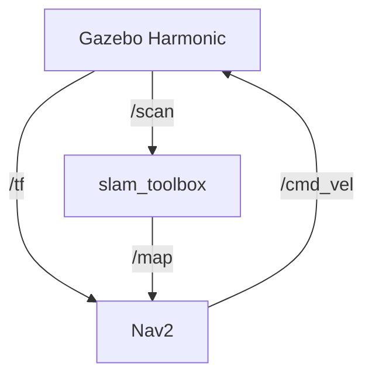

This file is a merged representation of the entire codebase, combining all repository files into a single document.
Generated by Repopack on: 2026-04-25T00:42:37.656Z

# File Summary

## Purpose
This file contains a packed representation of the entire repository's contents.
It is designed to be easily consumable by AI systems for analysis, code review,
or other automated processes.

## File Format
The content is organized as follows:
1. This summary section
2. Repository information
3. Repository structure
4. Multiple file entries, each consisting of:
  a. A header with the file path (## File: path/to/file)
  b. The full contents of the file in a code block

## Usage Guidelines
- This file should be treated as read-only. Any changes should be made to the
  original repository files, not this packed version.
- When processing this file, use the file path to distinguish
  between different files in the repository.
- Be aware that this file may contain sensitive information. Handle it with
  the same level of security as you would the original repository.

## Notes
- Some files may have been excluded based on .gitignore rules and Repopack's
  configuration.
- Binary files are not included in this packed representation. Please refer to
  the Repository Structure section for a complete list of file paths, including
  binary files.

## Additional Info

For more information about Repopack, visit: https://github.com/yamadashy/repopack

# Repository Structure
```
install/
  meistar_description/
    share/
      colcon-core/
        packages/
          meistar_description
      meistar_description/
        hook/
          cmake_prefix_path.dsv
          cmake_prefix_path.ps1
          cmake_prefix_path.sh
        package.bash
        package.dsv
        package.ps1
        package.sh
        package.zsh
  ros2_autonomous_nav/
    lib/
      python3.12/
        site-packages/
          ros2-autonomous-nav.egg-link
      ros2_autonomous_nav/
        waypoint_follower
    share/
      colcon-core/
        packages/
          ros2_autonomous_nav
      ros2_autonomous_nav/
        hook/
          ament_prefix_path.dsv
          ament_prefix_path.ps1
          ament_prefix_path.sh
          pythonpath.dsv
          pythonpath.ps1
          pythonpath.sh
        package.bash
        package.dsv
        package.ps1
        package.sh
        package.zsh
  _local_setup_util_ps1.py
  _local_setup_util_sh.py
  .colcon_install_layout
  local_setup.bash
  local_setup.ps1
  local_setup.sh
  local_setup.zsh
  setup.bash
  setup.ps1
  setup.sh
  setup.zsh
original/
  build/
    meistar_description/
      .cmake/
        api/
          v1/
            reply/
              codemodel-v2-ae1a34ae436480c087b6.json
              directory-.-a56d0673c2e129eb50d2.json
              index-2026-04-23T21-44-32-0956.json
              target-meistar_description_uninstall-416470d7516f5e956431.json
              target-uninstall-214d4e71a8af21d1ae36.json
      ament_cmake_core/
        stamps/
          ament_prefix_path.sh.stamp
          nameConfig-version.cmake.in.stamp
          nameConfig.cmake.in.stamp
          package_xml_2_cmake.py.stamp
          package.xml.stamp
          path.sh.stamp
          templates_2_cmake.py.stamp
        meistar_descriptionConfig-version.cmake
        meistar_descriptionConfig.cmake
        package.cmake
      ament_cmake_environment_hooks/
        ament_prefix_path.dsv
        local_setup.bash
        local_setup.dsv
        local_setup.sh
        local_setup.zsh
        package.dsv
        path.dsv
      ament_cmake_index/
        share/
          ament_index/
            resource_index/
              package_run_dependencies/
                meistar_description
              parent_prefix_path/
                meistar_description
      ament_cmake_package_templates/
        templates.cmake
      ament_cmake_symlink_install/
        ament_cmake_symlink_install_uninstall_script.cmake
        ament_cmake_symlink_install.cmake
      ament_cmake_uninstall_target/
        ament_cmake_uninstall_target.cmake
      CMakeFiles/
        3.28.3/
          CompilerIdC/
            CMakeCCompilerId.c
          CompilerIdCXX/
            CMakeCXXCompilerId.cpp
          CMakeCCompiler.cmake
          CMakeCXXCompiler.cmake
          CMakeSystem.cmake
        meistar_description_uninstall.dir/
          build.make
          cmake_clean.cmake
          compiler_depend.make
          compiler_depend.ts
          DependInfo.cmake
          progress.make
        uninstall.dir/
          build.make
          cmake_clean.cmake
          compiler_depend.make
          compiler_depend.ts
          DependInfo.cmake
          progress.make
        cmake.check_cache
        CMakeConfigureLog.yaml
        CMakeDirectoryInformation.cmake
        CMakeRuleHashes.txt
        Makefile.cmake
        Makefile2
        progress.marks
        TargetDirectories.txt
      cmake_args.last
      cmake_install.cmake
      CMakeCache.txt
      colcon_build.rc
      colcon_command_prefix_build.sh
      CTestConfiguration.ini
      CTestCustom.cmake
      CTestTestfile.cmake
      Makefile
      symlink_install_manifest.txt
    .built_by
  docs/
    navigation.md
    setup_guide.md
  install/
    meistar_description/
      share/
        colcon-core/
          packages/
            meistar_description
        meistar_description/
          hook/
            cmake_prefix_path.dsv
            cmake_prefix_path.ps1
            cmake_prefix_path.sh
          package.bash
          package.dsv
          package.ps1
          package.sh
          package.zsh
    _local_setup_util_ps1.py
    _local_setup_util_sh.py
    .colcon_install_layout
    local_setup.bash
    local_setup.ps1
    local_setup.sh
    local_setup.zsh
    setup.bash
    setup.ps1
    setup.sh
    setup.zsh
  src/
    meistar_description/
      config/
        bridge.yaml
        nav2_params.yaml
        params.yaml
      launch/
        all_system.launch.py
        spawn.launch.py
      urdf/
        robot.urdf.xacro
      worlds/
        my_custom_world.sdf
        my_world.sdf
      CMakeLists.txt
      package.xml
  kill_all.sh
  README.md
  start_all.sh
ros2-autonomous-nav/
  config/
    mapper_params_online_async.yaml
    mapping_nav_params.yaml
    nav2_params.yaml
    nav2_rviz.rviz
  docs/
    next_steps.md
  launch/
    mapping_nav.launch.py
    robot_nav.launch.py
    slam_map.launch.py
  maps/
    nav_world.yaml
  scripts/
    generate_map.py
    waypoint_follower.py
  urdf/
    my_robot_cpu.urdf
    my_robot_gpu.urdf
  worlds/
    my_custom_world.sdf
    nav_world.sdf
  .gitignore
  create_short.py
  create_thumbnail.py
  drive.sh
  edit_video.py
  generate_voiceover.py
  LICENSE
  navigate.sh
  package.xml
  README_JA.md
  README.md
  render_code_snippets.py
  run.sh
  rviz.sh
  save_map.sh
  setup.cfg
  setup.py
  slam.sh
  start_mapping.sh
  start_nav.sh
  waypoints.sh
  youtube_description.txt
start_mapping_nav.sh
```

# Repository Files

## File: install/meistar_description/share/colcon-core/packages/meistar_description
```
urdf:xacro
```

## File: install/meistar_description/share/meistar_description/hook/cmake_prefix_path.dsv
```
prepend-non-duplicate;CMAKE_PREFIX_PATH;
```

## File: install/meistar_description/share/meistar_description/hook/cmake_prefix_path.ps1
```powershell
# generated from colcon_powershell/shell/template/hook_prepend_value.ps1.em

colcon_prepend_unique_value CMAKE_PREFIX_PATH "$env:COLCON_CURRENT_PREFIX"
```

## File: install/meistar_description/share/meistar_description/hook/cmake_prefix_path.sh
```bash
# generated from colcon_core/shell/template/hook_prepend_value.sh.em

_colcon_prepend_unique_value CMAKE_PREFIX_PATH "$COLCON_CURRENT_PREFIX"
```

## File: install/meistar_description/share/meistar_description/package.bash
```bash
# generated from colcon_bash/shell/template/package.bash.em

# This script extends the environment for this package.

# a bash script is able to determine its own path if necessary
if [ -z "$COLCON_CURRENT_PREFIX" ]; then
  # the prefix is two levels up from the package specific share directory
  _colcon_package_bash_COLCON_CURRENT_PREFIX="$(builtin cd "`dirname "${BASH_SOURCE[0]}"`/../.." > /dev/null && pwd)"
else
  _colcon_package_bash_COLCON_CURRENT_PREFIX="$COLCON_CURRENT_PREFIX"
fi

# function to source another script with conditional trace output
# first argument: the path of the script
# additional arguments: arguments to the script
_colcon_package_bash_source_script() {
  if [ -f "$1" ]; then
    if [ -n "$COLCON_TRACE" ]; then
      echo "# . \"$1\""
    fi
    . "$@"
  else
    echo "not found: \"$1\"" 1>&2
  fi
}

# source sh script of this package
_colcon_package_bash_source_script "$_colcon_package_bash_COLCON_CURRENT_PREFIX/share/meistar_description/package.sh"

# setting COLCON_CURRENT_PREFIX avoids determining the prefix in the sourced scripts
COLCON_CURRENT_PREFIX="$_colcon_package_bash_COLCON_CURRENT_PREFIX"

# source bash hooks
_colcon_package_bash_source_script "$COLCON_CURRENT_PREFIX/share/meistar_description/local_setup.bash"

unset COLCON_CURRENT_PREFIX

unset _colcon_package_bash_source_script
unset _colcon_package_bash_COLCON_CURRENT_PREFIX
```

## File: install/meistar_description/share/meistar_description/package.dsv
```
source;share/meistar_description/hook/cmake_prefix_path.ps1
source;share/meistar_description/hook/cmake_prefix_path.dsv
source;share/meistar_description/hook/cmake_prefix_path.sh
source;share/meistar_description/local_setup.bash
source;share/meistar_description/local_setup.dsv
source;share/meistar_description/local_setup.ps1
source;share/meistar_description/local_setup.sh
source;share/meistar_description/local_setup.zsh
```

## File: install/meistar_description/share/meistar_description/package.ps1
```powershell
# generated from colcon_powershell/shell/template/package.ps1.em

# function to append a value to a variable
# which uses colons as separators
# duplicates as well as leading separators are avoided
# first argument: the name of the result variable
# second argument: the value to be prepended
function colcon_append_unique_value {
  param (
    $_listname,
    $_value
  )

  # get values from variable
  if (Test-Path Env:$_listname) {
    $_values=(Get-Item env:$_listname).Value
  } else {
    $_values=""
  }
  $_duplicate=""
  # start with no values
  $_all_values=""
  # iterate over existing values in the variable
  if ($_values) {
    $_values.Split(":") | ForEach {
      # not an empty string
      if ($_) {
        # not a duplicate of _value
        if ($_ -eq $_value) {
          $_duplicate="1"
        }
        if ($_all_values) {
          $_all_values="${_all_values}:$_"
        } else {
          $_all_values="$_"
        }
      }
    }
  }
  # append only non-duplicates
  if (!$_duplicate) {
    # avoid leading separator
    if ($_all_values) {
      $_all_values="${_all_values}:${_value}"
    } else {
      $_all_values="${_value}"
    }
  }

  # export the updated variable
  Set-Item env:\$_listname -Value "$_all_values"
}

# function to prepend a value to a variable
# which uses colons as separators
# duplicates as well as trailing separators are avoided
# first argument: the name of the result variable
# second argument: the value to be prepended
function colcon_prepend_unique_value {
  param (
    $_listname,
    $_value
  )

  # get values from variable
  if (Test-Path Env:$_listname) {
    $_values=(Get-Item env:$_listname).Value
  } else {
    $_values=""
  }
  # start with the new value
  $_all_values="$_value"
  # iterate over existing values in the variable
  if ($_values) {
    $_values.Split(":") | ForEach {
      # not an empty string
      if ($_) {
        # not a duplicate of _value
        if ($_ -ne $_value) {
          # keep non-duplicate values
          $_all_values="${_all_values}:$_"
        }
      }
    }
  }
  # export the updated variable
  Set-Item env:\$_listname -Value "$_all_values"
}

# function to source another script with conditional trace output
# first argument: the path of the script
# additional arguments: arguments to the script
function colcon_package_source_powershell_script {
  param (
    $_colcon_package_source_powershell_script
  )
  # source script with conditional trace output
  if (Test-Path $_colcon_package_source_powershell_script) {
    if ($env:COLCON_TRACE) {
      echo ". '$_colcon_package_source_powershell_script'"
    }
    . "$_colcon_package_source_powershell_script"
  } else {
    Write-Error "not found: '$_colcon_package_source_powershell_script'"
  }
}


# a powershell script is able to determine its own path
# the prefix is two levels up from the package specific share directory
$env:COLCON_CURRENT_PREFIX=(Get-Item $PSCommandPath).Directory.Parent.Parent.FullName

colcon_package_source_powershell_script "$env:COLCON_CURRENT_PREFIX/share/meistar_description/hook/cmake_prefix_path.ps1"
colcon_package_source_powershell_script "$env:COLCON_CURRENT_PREFIX/share/meistar_description/local_setup.ps1"

Remove-Item Env:\COLCON_CURRENT_PREFIX
```

## File: install/meistar_description/share/meistar_description/package.sh
```bash
# generated from colcon_core/shell/template/package.sh.em

# This script extends the environment for this package.

# function to prepend a value to a variable
# which uses colons as separators
# duplicates as well as trailing separators are avoided
# first argument: the name of the result variable
# second argument: the value to be prepended
_colcon_prepend_unique_value() {
  # arguments
  _listname="$1"
  _value="$2"

  # get values from variable
  eval _values=\"\$$_listname\"
  # backup the field separator
  _colcon_prepend_unique_value_IFS=$IFS
  IFS=":"
  # start with the new value
  _all_values="$_value"
  # workaround SH_WORD_SPLIT not being set in zsh
  if [ "$(command -v colcon_zsh_convert_to_array)" ]; then
    colcon_zsh_convert_to_array _values
  fi
  # iterate over existing values in the variable
  for _item in $_values; do
    # ignore empty strings
    if [ -z "$_item" ]; then
      continue
    fi
    # ignore duplicates of _value
    if [ "$_item" = "$_value" ]; then
      continue
    fi
    # keep non-duplicate values
    _all_values="$_all_values:$_item"
  done
  unset _item
  # restore the field separator
  IFS=$_colcon_prepend_unique_value_IFS
  unset _colcon_prepend_unique_value_IFS
  # export the updated variable
  eval export $_listname=\"$_all_values\"
  unset _all_values
  unset _values

  unset _value
  unset _listname
}

# since a plain shell script can't determine its own path when being sourced
# either use the provided COLCON_CURRENT_PREFIX
# or fall back to the build time prefix (if it exists)
_colcon_package_sh_COLCON_CURRENT_PREFIX="/home/so/Meistar/install/meistar_description"
if [ -z "$COLCON_CURRENT_PREFIX" ]; then
  if [ ! -d "$_colcon_package_sh_COLCON_CURRENT_PREFIX" ]; then
    echo "The build time path \"$_colcon_package_sh_COLCON_CURRENT_PREFIX\" doesn't exist. Either source a script for a different shell or set the environment variable \"COLCON_CURRENT_PREFIX\" explicitly." 1>&2
    unset _colcon_package_sh_COLCON_CURRENT_PREFIX
    return 1
  fi
  COLCON_CURRENT_PREFIX="$_colcon_package_sh_COLCON_CURRENT_PREFIX"
fi
unset _colcon_package_sh_COLCON_CURRENT_PREFIX

# function to source another script with conditional trace output
# first argument: the path of the script
# additional arguments: arguments to the script
_colcon_package_sh_source_script() {
  if [ -f "$1" ]; then
    if [ -n "$COLCON_TRACE" ]; then
      echo "# . \"$1\""
    fi
    . "$@"
  else
    echo "not found: \"$1\"" 1>&2
  fi
}

# source sh hooks
_colcon_package_sh_source_script "$COLCON_CURRENT_PREFIX/share/meistar_description/hook/cmake_prefix_path.sh"
_colcon_package_sh_source_script "$COLCON_CURRENT_PREFIX/share/meistar_description/local_setup.sh"

unset _colcon_package_sh_source_script
unset COLCON_CURRENT_PREFIX

# do not unset _colcon_prepend_unique_value since it might be used by non-primary shell hooks
```

## File: install/meistar_description/share/meistar_description/package.zsh
```
# generated from colcon_zsh/shell/template/package.zsh.em

# This script extends the environment for this package.

# a zsh script is able to determine its own path if necessary
if [ -z "$COLCON_CURRENT_PREFIX" ]; then
  # the prefix is two levels up from the package specific share directory
  _colcon_package_zsh_COLCON_CURRENT_PREFIX="$(builtin cd -q "`dirname "${(%):-%N}"`/../.." > /dev/null && pwd)"
else
  _colcon_package_zsh_COLCON_CURRENT_PREFIX="$COLCON_CURRENT_PREFIX"
fi

# function to source another script with conditional trace output
# first argument: the path of the script
# additional arguments: arguments to the script
_colcon_package_zsh_source_script() {
  if [ -f "$1" ]; then
    if [ -n "$COLCON_TRACE" ]; then
      echo "# . \"$1\""
    fi
    . "$@"
  else
    echo "not found: \"$1\"" 1>&2
  fi
}

# function to convert array-like strings into arrays
# to workaround SH_WORD_SPLIT not being set
colcon_zsh_convert_to_array() {
  local _listname=$1
  local _dollar="$"
  local _split="{="
  local _to_array="(\"$_dollar$_split$_listname}\")"
  eval $_listname=$_to_array
}

# source sh script of this package
_colcon_package_zsh_source_script "$_colcon_package_zsh_COLCON_CURRENT_PREFIX/share/meistar_description/package.sh"
unset convert_zsh_to_array

# setting COLCON_CURRENT_PREFIX avoids determining the prefix in the sourced scripts
COLCON_CURRENT_PREFIX="$_colcon_package_zsh_COLCON_CURRENT_PREFIX"

# source zsh hooks
_colcon_package_zsh_source_script "$COLCON_CURRENT_PREFIX/share/meistar_description/local_setup.zsh"

unset COLCON_CURRENT_PREFIX

unset _colcon_package_zsh_source_script
unset _colcon_package_zsh_COLCON_CURRENT_PREFIX
```

## File: install/ros2_autonomous_nav/lib/python3.12/site-packages/ros2-autonomous-nav.egg-link
```
/home/so/Meistar/build/ros2_autonomous_nav
.
```

## File: install/ros2_autonomous_nav/lib/ros2_autonomous_nav/waypoint_follower
```
#!/usr/bin/python3
# EASY-INSTALL-ENTRY-SCRIPT: 'ros2-autonomous-nav','console_scripts','waypoint_follower'
import re
import sys

# for compatibility with easy_install; see #2198
__requires__ = 'ros2-autonomous-nav'

try:
    from importlib.metadata import distribution
except ImportError:
    try:
        from importlib_metadata import distribution
    except ImportError:
        from pkg_resources import load_entry_point


def importlib_load_entry_point(spec, group, name):
    dist_name, _, _ = spec.partition('==')
    matches = (
        entry_point
        for entry_point in distribution(dist_name).entry_points
        if entry_point.group == group and entry_point.name == name
    )
    return next(matches).load()


globals().setdefault('load_entry_point', importlib_load_entry_point)


if __name__ == '__main__':
    sys.argv[0] = re.sub(r'(-script\.pyw?|\.exe)?$', '', sys.argv[0])
    sys.exit(load_entry_point('ros2-autonomous-nav', 'console_scripts', 'waypoint_follower')())
```

## File: install/ros2_autonomous_nav/share/colcon-core/packages/ros2_autonomous_nav
```
nav2_amcl:nav2_behaviors:nav2_bringup:nav2_bt_navigator:nav2_controller:nav2_lifecycle_manager:nav2_map_server:nav2_planner:nav2_simple_commander:nav2_velocity_smoother:robot_state_publisher:ros_gz_bridge:ros_gz_sim:rviz2:slam_toolbox:teleop_twist_keyboard
```

## File: install/ros2_autonomous_nav/share/ros2_autonomous_nav/hook/ament_prefix_path.dsv
```
prepend-non-duplicate;AMENT_PREFIX_PATH;
```

## File: install/ros2_autonomous_nav/share/ros2_autonomous_nav/hook/ament_prefix_path.ps1
```powershell
# generated from colcon_powershell/shell/template/hook_prepend_value.ps1.em

colcon_prepend_unique_value AMENT_PREFIX_PATH "$env:COLCON_CURRENT_PREFIX"
```

## File: install/ros2_autonomous_nav/share/ros2_autonomous_nav/hook/ament_prefix_path.sh
```bash
# generated from colcon_core/shell/template/hook_prepend_value.sh.em

_colcon_prepend_unique_value AMENT_PREFIX_PATH "$COLCON_CURRENT_PREFIX"
```

## File: install/ros2_autonomous_nav/share/ros2_autonomous_nav/hook/pythonpath.dsv
```
prepend-non-duplicate;PYTHONPATH;lib/python3.12/site-packages
```

## File: install/ros2_autonomous_nav/share/ros2_autonomous_nav/hook/pythonpath.ps1
```powershell
# generated from colcon_powershell/shell/template/hook_prepend_value.ps1.em

colcon_prepend_unique_value PYTHONPATH "$env:COLCON_CURRENT_PREFIX/lib/python3.12/site-packages"
```

## File: install/ros2_autonomous_nav/share/ros2_autonomous_nav/hook/pythonpath.sh
```bash
# generated from colcon_core/shell/template/hook_prepend_value.sh.em

_colcon_prepend_unique_value PYTHONPATH "$COLCON_CURRENT_PREFIX/lib/python3.12/site-packages"
```

## File: install/ros2_autonomous_nav/share/ros2_autonomous_nav/package.bash
```bash
# generated from colcon_bash/shell/template/package.bash.em

# This script extends the environment for this package.

# a bash script is able to determine its own path if necessary
if [ -z "$COLCON_CURRENT_PREFIX" ]; then
  # the prefix is two levels up from the package specific share directory
  _colcon_package_bash_COLCON_CURRENT_PREFIX="$(builtin cd "`dirname "${BASH_SOURCE[0]}"`/../.." > /dev/null && pwd)"
else
  _colcon_package_bash_COLCON_CURRENT_PREFIX="$COLCON_CURRENT_PREFIX"
fi

# function to source another script with conditional trace output
# first argument: the path of the script
# additional arguments: arguments to the script
_colcon_package_bash_source_script() {
  if [ -f "$1" ]; then
    if [ -n "$COLCON_TRACE" ]; then
      echo "# . \"$1\""
    fi
    . "$@"
  else
    echo "not found: \"$1\"" 1>&2
  fi
}

# source sh script of this package
_colcon_package_bash_source_script "$_colcon_package_bash_COLCON_CURRENT_PREFIX/share/ros2_autonomous_nav/package.sh"

unset _colcon_package_bash_source_script
unset _colcon_package_bash_COLCON_CURRENT_PREFIX
```

## File: install/ros2_autonomous_nav/share/ros2_autonomous_nav/package.dsv
```
source;share/ros2_autonomous_nav/hook/pythonpath.ps1
source;share/ros2_autonomous_nav/hook/pythonpath.dsv
source;share/ros2_autonomous_nav/hook/pythonpath.sh
source;share/ros2_autonomous_nav/hook/ament_prefix_path.ps1
source;share/ros2_autonomous_nav/hook/ament_prefix_path.dsv
source;share/ros2_autonomous_nav/hook/ament_prefix_path.sh
source;../../build/ros2_autonomous_nav/share/ros2_autonomous_nav/hook/pythonpath_develop.ps1
source;../../build/ros2_autonomous_nav/share/ros2_autonomous_nav/hook/pythonpath_develop.dsv
source;../../build/ros2_autonomous_nav/share/ros2_autonomous_nav/hook/pythonpath_develop.sh
```

## File: install/ros2_autonomous_nav/share/ros2_autonomous_nav/package.ps1
```powershell
# generated from colcon_powershell/shell/template/package.ps1.em

# function to append a value to a variable
# which uses colons as separators
# duplicates as well as leading separators are avoided
# first argument: the name of the result variable
# second argument: the value to be prepended
function colcon_append_unique_value {
  param (
    $_listname,
    $_value
  )

  # get values from variable
  if (Test-Path Env:$_listname) {
    $_values=(Get-Item env:$_listname).Value
  } else {
    $_values=""
  }
  $_duplicate=""
  # start with no values
  $_all_values=""
  # iterate over existing values in the variable
  if ($_values) {
    $_values.Split(":") | ForEach {
      # not an empty string
      if ($_) {
        # not a duplicate of _value
        if ($_ -eq $_value) {
          $_duplicate="1"
        }
        if ($_all_values) {
          $_all_values="${_all_values}:$_"
        } else {
          $_all_values="$_"
        }
      }
    }
  }
  # append only non-duplicates
  if (!$_duplicate) {
    # avoid leading separator
    if ($_all_values) {
      $_all_values="${_all_values}:${_value}"
    } else {
      $_all_values="${_value}"
    }
  }

  # export the updated variable
  Set-Item env:\$_listname -Value "$_all_values"
}

# function to prepend a value to a variable
# which uses colons as separators
# duplicates as well as trailing separators are avoided
# first argument: the name of the result variable
# second argument: the value to be prepended
function colcon_prepend_unique_value {
  param (
    $_listname,
    $_value
  )

  # get values from variable
  if (Test-Path Env:$_listname) {
    $_values=(Get-Item env:$_listname).Value
  } else {
    $_values=""
  }
  # start with the new value
  $_all_values="$_value"
  # iterate over existing values in the variable
  if ($_values) {
    $_values.Split(":") | ForEach {
      # not an empty string
      if ($_) {
        # not a duplicate of _value
        if ($_ -ne $_value) {
          # keep non-duplicate values
          $_all_values="${_all_values}:$_"
        }
      }
    }
  }
  # export the updated variable
  Set-Item env:\$_listname -Value "$_all_values"
}

# function to source another script with conditional trace output
# first argument: the path of the script
# additional arguments: arguments to the script
function colcon_package_source_powershell_script {
  param (
    $_colcon_package_source_powershell_script
  )
  # source script with conditional trace output
  if (Test-Path $_colcon_package_source_powershell_script) {
    if ($env:COLCON_TRACE) {
      echo ". '$_colcon_package_source_powershell_script'"
    }
    . "$_colcon_package_source_powershell_script"
  } else {
    Write-Error "not found: '$_colcon_package_source_powershell_script'"
  }
}


# a powershell script is able to determine its own path
# the prefix is two levels up from the package specific share directory
$env:COLCON_CURRENT_PREFIX=(Get-Item $PSCommandPath).Directory.Parent.Parent.FullName

colcon_package_source_powershell_script "$env:COLCON_CURRENT_PREFIX/share/ros2_autonomous_nav/hook/pythonpath.ps1"
colcon_package_source_powershell_script "$env:COLCON_CURRENT_PREFIX/share/ros2_autonomous_nav/hook/ament_prefix_path.ps1"
colcon_package_source_powershell_script "$env:COLCON_CURRENT_PREFIX/../../build/ros2_autonomous_nav/share/ros2_autonomous_nav/hook/pythonpath_develop.ps1"

Remove-Item Env:\COLCON_CURRENT_PREFIX
```

## File: install/ros2_autonomous_nav/share/ros2_autonomous_nav/package.sh
```bash
# generated from colcon_core/shell/template/package.sh.em

# This script extends the environment for this package.

# function to prepend a value to a variable
# which uses colons as separators
# duplicates as well as trailing separators are avoided
# first argument: the name of the result variable
# second argument: the value to be prepended
_colcon_prepend_unique_value() {
  # arguments
  _listname="$1"
  _value="$2"

  # get values from variable
  eval _values=\"\$$_listname\"
  # backup the field separator
  _colcon_prepend_unique_value_IFS=$IFS
  IFS=":"
  # start with the new value
  _all_values="$_value"
  # workaround SH_WORD_SPLIT not being set in zsh
  if [ "$(command -v colcon_zsh_convert_to_array)" ]; then
    colcon_zsh_convert_to_array _values
  fi
  # iterate over existing values in the variable
  for _item in $_values; do
    # ignore empty strings
    if [ -z "$_item" ]; then
      continue
    fi
    # ignore duplicates of _value
    if [ "$_item" = "$_value" ]; then
      continue
    fi
    # keep non-duplicate values
    _all_values="$_all_values:$_item"
  done
  unset _item
  # restore the field separator
  IFS=$_colcon_prepend_unique_value_IFS
  unset _colcon_prepend_unique_value_IFS
  # export the updated variable
  eval export $_listname=\"$_all_values\"
  unset _all_values
  unset _values

  unset _value
  unset _listname
}

# since a plain shell script can't determine its own path when being sourced
# either use the provided COLCON_CURRENT_PREFIX
# or fall back to the build time prefix (if it exists)
_colcon_package_sh_COLCON_CURRENT_PREFIX="/home/so/Meistar/install/ros2_autonomous_nav"
if [ -z "$COLCON_CURRENT_PREFIX" ]; then
  if [ ! -d "$_colcon_package_sh_COLCON_CURRENT_PREFIX" ]; then
    echo "The build time path \"$_colcon_package_sh_COLCON_CURRENT_PREFIX\" doesn't exist. Either source a script for a different shell or set the environment variable \"COLCON_CURRENT_PREFIX\" explicitly." 1>&2
    unset _colcon_package_sh_COLCON_CURRENT_PREFIX
    return 1
  fi
  COLCON_CURRENT_PREFIX="$_colcon_package_sh_COLCON_CURRENT_PREFIX"
fi
unset _colcon_package_sh_COLCON_CURRENT_PREFIX

# function to source another script with conditional trace output
# first argument: the path of the script
# additional arguments: arguments to the script
_colcon_package_sh_source_script() {
  if [ -f "$1" ]; then
    if [ -n "$COLCON_TRACE" ]; then
      echo "# . \"$1\""
    fi
    . "$@"
  else
    echo "not found: \"$1\"" 1>&2
  fi
}

# source sh hooks
_colcon_package_sh_source_script "$COLCON_CURRENT_PREFIX/share/ros2_autonomous_nav/hook/pythonpath.sh"
_colcon_package_sh_source_script "$COLCON_CURRENT_PREFIX/share/ros2_autonomous_nav/hook/ament_prefix_path.sh"
_colcon_package_sh_source_script "$COLCON_CURRENT_PREFIX/../../build/ros2_autonomous_nav/share/ros2_autonomous_nav/hook/pythonpath_develop.sh"

unset _colcon_package_sh_source_script
unset COLCON_CURRENT_PREFIX

# do not unset _colcon_prepend_unique_value since it might be used by non-primary shell hooks
```

## File: install/ros2_autonomous_nav/share/ros2_autonomous_nav/package.zsh
```
# generated from colcon_zsh/shell/template/package.zsh.em

# This script extends the environment for this package.

# a zsh script is able to determine its own path if necessary
if [ -z "$COLCON_CURRENT_PREFIX" ]; then
  # the prefix is two levels up from the package specific share directory
  _colcon_package_zsh_COLCON_CURRENT_PREFIX="$(builtin cd -q "`dirname "${(%):-%N}"`/../.." > /dev/null && pwd)"
else
  _colcon_package_zsh_COLCON_CURRENT_PREFIX="$COLCON_CURRENT_PREFIX"
fi

# function to source another script with conditional trace output
# first argument: the path of the script
# additional arguments: arguments to the script
_colcon_package_zsh_source_script() {
  if [ -f "$1" ]; then
    if [ -n "$COLCON_TRACE" ]; then
      echo "# . \"$1\""
    fi
    . "$@"
  else
    echo "not found: \"$1\"" 1>&2
  fi
}

# function to convert array-like strings into arrays
# to workaround SH_WORD_SPLIT not being set
colcon_zsh_convert_to_array() {
  local _listname=$1
  local _dollar="$"
  local _split="{="
  local _to_array="(\"$_dollar$_split$_listname}\")"
  eval $_listname=$_to_array
}

# source sh script of this package
_colcon_package_zsh_source_script "$_colcon_package_zsh_COLCON_CURRENT_PREFIX/share/ros2_autonomous_nav/package.sh"
unset convert_zsh_to_array

unset _colcon_package_zsh_source_script
unset _colcon_package_zsh_COLCON_CURRENT_PREFIX
```

## File: install/_local_setup_util_ps1.py
```python
# Copyright 2016-2019 Dirk Thomas
# Licensed under the Apache License, Version 2.0

import argparse
from collections import OrderedDict
import os
from pathlib import Path
import sys


FORMAT_STR_COMMENT_LINE = '# {comment}'
FORMAT_STR_SET_ENV_VAR = 'Set-Item -Path "Env:{name}" -Value "{value}"'
FORMAT_STR_USE_ENV_VAR = '$env:{name}'
FORMAT_STR_INVOKE_SCRIPT = '_colcon_prefix_powershell_source_script "{script_path}"'  # noqa: E501
FORMAT_STR_REMOVE_LEADING_SEPARATOR = ''  # noqa: E501
FORMAT_STR_REMOVE_TRAILING_SEPARATOR = ''  # noqa: E501

DSV_TYPE_APPEND_NON_DUPLICATE = 'append-non-duplicate'
DSV_TYPE_PREPEND_NON_DUPLICATE = 'prepend-non-duplicate'
DSV_TYPE_PREPEND_NON_DUPLICATE_IF_EXISTS = 'prepend-non-duplicate-if-exists'
DSV_TYPE_SET = 'set'
DSV_TYPE_SET_IF_UNSET = 'set-if-unset'
DSV_TYPE_SOURCE = 'source'


def main(argv=sys.argv[1:]):  # noqa: D103
    parser = argparse.ArgumentParser(
        description='Output shell commands for the packages in topological '
                    'order')
    parser.add_argument(
        'primary_extension',
        help='The file extension of the primary shell')
    parser.add_argument(
        'additional_extension', nargs='?',
        help='The additional file extension to be considered')
    parser.add_argument(
        '--merged-install', action='store_true',
        help='All install prefixes are merged into a single location')
    args = parser.parse_args(argv)

    packages = get_packages(Path(__file__).parent, args.merged_install)

    ordered_packages = order_packages(packages)
    for pkg_name in ordered_packages:
        if _include_comments():
            print(
                FORMAT_STR_COMMENT_LINE.format_map(
                    {'comment': 'Package: ' + pkg_name}))
        prefix = os.path.abspath(os.path.dirname(__file__))
        if not args.merged_install:
            prefix = os.path.join(prefix, pkg_name)
        for line in get_commands(
            pkg_name, prefix, args.primary_extension,
            args.additional_extension
        ):
            print(line)

    for line in _remove_ending_separators():
        print(line)


def get_packages(prefix_path, merged_install):
    """
    Find packages based on colcon-specific files created during installation.

    :param Path prefix_path: The install prefix path of all packages
    :param bool merged_install: The flag if the packages are all installed
      directly in the prefix or if each package is installed in a subdirectory
      named after the package
    :returns: A mapping from the package name to the set of runtime
      dependencies
    :rtype: dict
    """
    packages = {}
    # since importing colcon_core isn't feasible here the following constant
    # must match colcon_core.location.get_relative_package_index_path()
    subdirectory = 'share/colcon-core/packages'
    if merged_install:
        # return if workspace is empty
        if not (prefix_path / subdirectory).is_dir():
            return packages
        # find all files in the subdirectory
        for p in (prefix_path / subdirectory).iterdir():
            if not p.is_file():
                continue
            if p.name.startswith('.'):
                continue
            add_package_runtime_dependencies(p, packages)
    else:
        # for each subdirectory look for the package specific file
        for p in prefix_path.iterdir():
            if not p.is_dir():
                continue
            if p.name.startswith('.'):
                continue
            p = p / subdirectory / p.name
            if p.is_file():
                add_package_runtime_dependencies(p, packages)

    # remove unknown dependencies
    pkg_names = set(packages.keys())
    for k in packages.keys():
        packages[k] = {d for d in packages[k] if d in pkg_names}

    return packages


def add_package_runtime_dependencies(path, packages):
    """
    Check the path and if it exists extract the packages runtime dependencies.

    :param Path path: The resource file containing the runtime dependencies
    :param dict packages: A mapping from package names to the sets of runtime
      dependencies to add to
    """
    content = path.read_text()
    dependencies = set(content.split(os.pathsep) if content else [])
    packages[path.name] = dependencies


def order_packages(packages):
    """
    Order packages topologically.

    :param dict packages: A mapping from package name to the set of runtime
      dependencies
    :returns: The package names
    :rtype: list
    """
    # select packages with no dependencies in alphabetical order
    to_be_ordered = list(packages.keys())
    ordered = []
    while to_be_ordered:
        pkg_names_without_deps = [
            name for name in to_be_ordered if not packages[name]]
        if not pkg_names_without_deps:
            reduce_cycle_set(packages)
            raise RuntimeError(
                'Circular dependency between: ' + ', '.join(sorted(packages)))
        pkg_names_without_deps.sort()
        pkg_name = pkg_names_without_deps[0]
        to_be_ordered.remove(pkg_name)
        ordered.append(pkg_name)
        # remove item from dependency lists
        for k in list(packages.keys()):
            if pkg_name in packages[k]:
                packages[k].remove(pkg_name)
    return ordered


def reduce_cycle_set(packages):
    """
    Reduce the set of packages to the ones part of the circular dependency.

    :param dict packages: A mapping from package name to the set of runtime
      dependencies which is modified in place
    """
    last_depended = None
    while len(packages) > 0:
        # get all remaining dependencies
        depended = set()
        for pkg_name, dependencies in packages.items():
            depended = depended.union(dependencies)
        # remove all packages which are not dependent on
        for name in list(packages.keys()):
            if name not in depended:
                del packages[name]
        if last_depended:
            # if remaining packages haven't changed return them
            if last_depended == depended:
                return packages.keys()
        # otherwise reduce again
        last_depended = depended


def _include_comments():
    # skipping comment lines when COLCON_TRACE is not set speeds up the
    # processing especially on Windows
    return bool(os.environ.get('COLCON_TRACE'))


def get_commands(pkg_name, prefix, primary_extension, additional_extension):
    commands = []
    package_dsv_path = os.path.join(prefix, 'share', pkg_name, 'package.dsv')
    if os.path.exists(package_dsv_path):
        commands += process_dsv_file(
            package_dsv_path, prefix, primary_extension, additional_extension)
    return commands


def process_dsv_file(
    dsv_path, prefix, primary_extension=None, additional_extension=None
):
    commands = []
    if _include_comments():
        commands.append(FORMAT_STR_COMMENT_LINE.format_map({'comment': dsv_path}))
    with open(dsv_path, 'r') as h:
        content = h.read()
    lines = content.splitlines()

    basenames = OrderedDict()
    for i, line in enumerate(lines):
        # skip over empty or whitespace-only lines
        if not line.strip():
            continue
        # skip over comments
        if line.startswith('#'):
            continue
        try:
            type_, remainder = line.split(';', 1)
        except ValueError:
            raise RuntimeError(
                "Line %d in '%s' doesn't contain a semicolon separating the "
                'type from the arguments' % (i + 1, dsv_path))
        if type_ != DSV_TYPE_SOURCE:
            # handle non-source lines
            try:
                commands += handle_dsv_types_except_source(
                    type_, remainder, prefix)
            except RuntimeError as e:
                raise RuntimeError(
                    "Line %d in '%s' %s" % (i + 1, dsv_path, e)) from e
        else:
            # group remaining source lines by basename
            path_without_ext, ext = os.path.splitext(remainder)
            if path_without_ext not in basenames:
                basenames[path_without_ext] = set()
            assert ext.startswith('.')
            ext = ext[1:]
            if ext in (primary_extension, additional_extension):
                basenames[path_without_ext].add(ext)

    # add the dsv extension to each basename if the file exists
    for basename, extensions in basenames.items():
        if not os.path.isabs(basename):
            basename = os.path.join(prefix, basename)
        if os.path.exists(basename + '.dsv'):
            extensions.add('dsv')

    for basename, extensions in basenames.items():
        if not os.path.isabs(basename):
            basename = os.path.join(prefix, basename)
        if 'dsv' in extensions:
            # process dsv files recursively
            commands += process_dsv_file(
                basename + '.dsv', prefix, primary_extension=primary_extension,
                additional_extension=additional_extension)
        elif primary_extension in extensions and len(extensions) == 1:
            # source primary-only files
            commands += [
                FORMAT_STR_INVOKE_SCRIPT.format_map({
                    'prefix': prefix,
                    'script_path': basename + '.' + primary_extension})]
        elif additional_extension in extensions:
            # source non-primary files
            commands += [
                FORMAT_STR_INVOKE_SCRIPT.format_map({
                    'prefix': prefix,
                    'script_path': basename + '.' + additional_extension})]

    return commands


def handle_dsv_types_except_source(type_, remainder, prefix):
    commands = []
    if type_ in (DSV_TYPE_SET, DSV_TYPE_SET_IF_UNSET):
        try:
            env_name, value = remainder.split(';', 1)
        except ValueError:
            raise RuntimeError(
                "doesn't contain a semicolon separating the environment name "
                'from the value')
        try_prefixed_value = os.path.join(prefix, value) if value else prefix
        if os.path.exists(try_prefixed_value):
            value = try_prefixed_value
        if type_ == DSV_TYPE_SET:
            commands += _set(env_name, value)
        elif type_ == DSV_TYPE_SET_IF_UNSET:
            commands += _set_if_unset(env_name, value)
        else:
            assert False
    elif type_ in (
        DSV_TYPE_APPEND_NON_DUPLICATE,
        DSV_TYPE_PREPEND_NON_DUPLICATE,
        DSV_TYPE_PREPEND_NON_DUPLICATE_IF_EXISTS
    ):
        try:
            env_name_and_values = remainder.split(';')
        except ValueError:
            raise RuntimeError(
                "doesn't contain a semicolon separating the environment name "
                'from the values')
        env_name = env_name_and_values[0]
        values = env_name_and_values[1:]
        for value in values:
            if not value:
                value = prefix
            elif not os.path.isabs(value):
                value = os.path.join(prefix, value)
            if (
                type_ == DSV_TYPE_PREPEND_NON_DUPLICATE_IF_EXISTS and
                not os.path.exists(value)
            ):
                comment = f'skip extending {env_name} with not existing ' \
                    f'path: {value}'
                if _include_comments():
                    commands.append(
                        FORMAT_STR_COMMENT_LINE.format_map({'comment': comment}))
            elif type_ == DSV_TYPE_APPEND_NON_DUPLICATE:
                commands += _append_unique_value(env_name, value)
            else:
                commands += _prepend_unique_value(env_name, value)
    else:
        raise RuntimeError(
            'contains an unknown environment hook type: ' + type_)
    return commands


env_state = {}


def _append_unique_value(name, value):
    global env_state
    if name not in env_state:
        if os.environ.get(name):
            env_state[name] = set(os.environ[name].split(os.pathsep))
        else:
            env_state[name] = set()
    # append even if the variable has not been set yet, in case a shell script sets the
    # same variable without the knowledge of this Python script.
    # later _remove_ending_separators() will cleanup any unintentional leading separator
    extend = FORMAT_STR_USE_ENV_VAR.format_map({'name': name}) + os.pathsep
    line = FORMAT_STR_SET_ENV_VAR.format_map(
        {'name': name, 'value': extend + value})
    if value not in env_state[name]:
        env_state[name].add(value)
    else:
        if not _include_comments():
            return []
        line = FORMAT_STR_COMMENT_LINE.format_map({'comment': line})
    return [line]


def _prepend_unique_value(name, value):
    global env_state
    if name not in env_state:
        if os.environ.get(name):
            env_state[name] = set(os.environ[name].split(os.pathsep))
        else:
            env_state[name] = set()
    # prepend even if the variable has not been set yet, in case a shell script sets the
    # same variable without the knowledge of this Python script.
    # later _remove_ending_separators() will cleanup any unintentional trailing separator
    extend = os.pathsep + FORMAT_STR_USE_ENV_VAR.format_map({'name': name})
    line = FORMAT_STR_SET_ENV_VAR.format_map(
        {'name': name, 'value': value + extend})
    if value not in env_state[name]:
        env_state[name].add(value)
    else:
        if not _include_comments():
            return []
        line = FORMAT_STR_COMMENT_LINE.format_map({'comment': line})
    return [line]


# generate commands for removing prepended underscores
def _remove_ending_separators():
    # do nothing if the shell extension does not implement the logic
    if FORMAT_STR_REMOVE_TRAILING_SEPARATOR is None:
        return []

    global env_state
    commands = []
    for name in env_state:
        # skip variables that already had values before this script started prepending
        if name in os.environ:
            continue
        commands += [
            FORMAT_STR_REMOVE_LEADING_SEPARATOR.format_map({'name': name}),
            FORMAT_STR_REMOVE_TRAILING_SEPARATOR.format_map({'name': name})]
    return commands


def _set(name, value):
    global env_state
    env_state[name] = value
    line = FORMAT_STR_SET_ENV_VAR.format_map(
        {'name': name, 'value': value})
    return [line]


def _set_if_unset(name, value):
    global env_state
    line = FORMAT_STR_SET_ENV_VAR.format_map(
        {'name': name, 'value': value})
    if env_state.get(name, os.environ.get(name)):
        line = FORMAT_STR_COMMENT_LINE.format_map({'comment': line})
    return [line]


if __name__ == '__main__':  # pragma: no cover
    try:
        rc = main()
    except RuntimeError as e:
        print(str(e), file=sys.stderr)
        rc = 1
    sys.exit(rc)
```

## File: install/_local_setup_util_sh.py
```python
# Copyright 2016-2019 Dirk Thomas
# Licensed under the Apache License, Version 2.0

import argparse
from collections import OrderedDict
import os
from pathlib import Path
import sys


FORMAT_STR_COMMENT_LINE = '# {comment}'
FORMAT_STR_SET_ENV_VAR = 'export {name}="{value}"'
FORMAT_STR_USE_ENV_VAR = '${name}'
FORMAT_STR_INVOKE_SCRIPT = 'COLCON_CURRENT_PREFIX="{prefix}" _colcon_prefix_sh_source_script "{script_path}"'  # noqa: E501
FORMAT_STR_REMOVE_LEADING_SEPARATOR = 'if [ "$(echo -n ${name} | head -c 1)" = ":" ]; then export {name}=${{{name}#?}} ; fi'  # noqa: E501
FORMAT_STR_REMOVE_TRAILING_SEPARATOR = 'if [ "$(echo -n ${name} | tail -c 1)" = ":" ]; then export {name}=${{{name}%?}} ; fi'  # noqa: E501

DSV_TYPE_APPEND_NON_DUPLICATE = 'append-non-duplicate'
DSV_TYPE_PREPEND_NON_DUPLICATE = 'prepend-non-duplicate'
DSV_TYPE_PREPEND_NON_DUPLICATE_IF_EXISTS = 'prepend-non-duplicate-if-exists'
DSV_TYPE_SET = 'set'
DSV_TYPE_SET_IF_UNSET = 'set-if-unset'
DSV_TYPE_SOURCE = 'source'


def main(argv=sys.argv[1:]):  # noqa: D103
    parser = argparse.ArgumentParser(
        description='Output shell commands for the packages in topological '
                    'order')
    parser.add_argument(
        'primary_extension',
        help='The file extension of the primary shell')
    parser.add_argument(
        'additional_extension', nargs='?',
        help='The additional file extension to be considered')
    parser.add_argument(
        '--merged-install', action='store_true',
        help='All install prefixes are merged into a single location')
    args = parser.parse_args(argv)

    packages = get_packages(Path(__file__).parent, args.merged_install)

    ordered_packages = order_packages(packages)
    for pkg_name in ordered_packages:
        if _include_comments():
            print(
                FORMAT_STR_COMMENT_LINE.format_map(
                    {'comment': 'Package: ' + pkg_name}))
        prefix = os.path.abspath(os.path.dirname(__file__))
        if not args.merged_install:
            prefix = os.path.join(prefix, pkg_name)
        for line in get_commands(
            pkg_name, prefix, args.primary_extension,
            args.additional_extension
        ):
            print(line)

    for line in _remove_ending_separators():
        print(line)


def get_packages(prefix_path, merged_install):
    """
    Find packages based on colcon-specific files created during installation.

    :param Path prefix_path: The install prefix path of all packages
    :param bool merged_install: The flag if the packages are all installed
      directly in the prefix or if each package is installed in a subdirectory
      named after the package
    :returns: A mapping from the package name to the set of runtime
      dependencies
    :rtype: dict
    """
    packages = {}
    # since importing colcon_core isn't feasible here the following constant
    # must match colcon_core.location.get_relative_package_index_path()
    subdirectory = 'share/colcon-core/packages'
    if merged_install:
        # return if workspace is empty
        if not (prefix_path / subdirectory).is_dir():
            return packages
        # find all files in the subdirectory
        for p in (prefix_path / subdirectory).iterdir():
            if not p.is_file():
                continue
            if p.name.startswith('.'):
                continue
            add_package_runtime_dependencies(p, packages)
    else:
        # for each subdirectory look for the package specific file
        for p in prefix_path.iterdir():
            if not p.is_dir():
                continue
            if p.name.startswith('.'):
                continue
            p = p / subdirectory / p.name
            if p.is_file():
                add_package_runtime_dependencies(p, packages)

    # remove unknown dependencies
    pkg_names = set(packages.keys())
    for k in packages.keys():
        packages[k] = {d for d in packages[k] if d in pkg_names}

    return packages


def add_package_runtime_dependencies(path, packages):
    """
    Check the path and if it exists extract the packages runtime dependencies.

    :param Path path: The resource file containing the runtime dependencies
    :param dict packages: A mapping from package names to the sets of runtime
      dependencies to add to
    """
    content = path.read_text()
    dependencies = set(content.split(os.pathsep) if content else [])
    packages[path.name] = dependencies


def order_packages(packages):
    """
    Order packages topologically.

    :param dict packages: A mapping from package name to the set of runtime
      dependencies
    :returns: The package names
    :rtype: list
    """
    # select packages with no dependencies in alphabetical order
    to_be_ordered = list(packages.keys())
    ordered = []
    while to_be_ordered:
        pkg_names_without_deps = [
            name for name in to_be_ordered if not packages[name]]
        if not pkg_names_without_deps:
            reduce_cycle_set(packages)
            raise RuntimeError(
                'Circular dependency between: ' + ', '.join(sorted(packages)))
        pkg_names_without_deps.sort()
        pkg_name = pkg_names_without_deps[0]
        to_be_ordered.remove(pkg_name)
        ordered.append(pkg_name)
        # remove item from dependency lists
        for k in list(packages.keys()):
            if pkg_name in packages[k]:
                packages[k].remove(pkg_name)
    return ordered


def reduce_cycle_set(packages):
    """
    Reduce the set of packages to the ones part of the circular dependency.

    :param dict packages: A mapping from package name to the set of runtime
      dependencies which is modified in place
    """
    last_depended = None
    while len(packages) > 0:
        # get all remaining dependencies
        depended = set()
        for pkg_name, dependencies in packages.items():
            depended = depended.union(dependencies)
        # remove all packages which are not dependent on
        for name in list(packages.keys()):
            if name not in depended:
                del packages[name]
        if last_depended:
            # if remaining packages haven't changed return them
            if last_depended == depended:
                return packages.keys()
        # otherwise reduce again
        last_depended = depended


def _include_comments():
    # skipping comment lines when COLCON_TRACE is not set speeds up the
    # processing especially on Windows
    return bool(os.environ.get('COLCON_TRACE'))


def get_commands(pkg_name, prefix, primary_extension, additional_extension):
    commands = []
    package_dsv_path = os.path.join(prefix, 'share', pkg_name, 'package.dsv')
    if os.path.exists(package_dsv_path):
        commands += process_dsv_file(
            package_dsv_path, prefix, primary_extension, additional_extension)
    return commands


def process_dsv_file(
    dsv_path, prefix, primary_extension=None, additional_extension=None
):
    commands = []
    if _include_comments():
        commands.append(FORMAT_STR_COMMENT_LINE.format_map({'comment': dsv_path}))
    with open(dsv_path, 'r') as h:
        content = h.read()
    lines = content.splitlines()

    basenames = OrderedDict()
    for i, line in enumerate(lines):
        # skip over empty or whitespace-only lines
        if not line.strip():
            continue
        # skip over comments
        if line.startswith('#'):
            continue
        try:
            type_, remainder = line.split(';', 1)
        except ValueError:
            raise RuntimeError(
                "Line %d in '%s' doesn't contain a semicolon separating the "
                'type from the arguments' % (i + 1, dsv_path))
        if type_ != DSV_TYPE_SOURCE:
            # handle non-source lines
            try:
                commands += handle_dsv_types_except_source(
                    type_, remainder, prefix)
            except RuntimeError as e:
                raise RuntimeError(
                    "Line %d in '%s' %s" % (i + 1, dsv_path, e)) from e
        else:
            # group remaining source lines by basename
            path_without_ext, ext = os.path.splitext(remainder)
            if path_without_ext not in basenames:
                basenames[path_without_ext] = set()
            assert ext.startswith('.')
            ext = ext[1:]
            if ext in (primary_extension, additional_extension):
                basenames[path_without_ext].add(ext)

    # add the dsv extension to each basename if the file exists
    for basename, extensions in basenames.items():
        if not os.path.isabs(basename):
            basename = os.path.join(prefix, basename)
        if os.path.exists(basename + '.dsv'):
            extensions.add('dsv')

    for basename, extensions in basenames.items():
        if not os.path.isabs(basename):
            basename = os.path.join(prefix, basename)
        if 'dsv' in extensions:
            # process dsv files recursively
            commands += process_dsv_file(
                basename + '.dsv', prefix, primary_extension=primary_extension,
                additional_extension=additional_extension)
        elif primary_extension in extensions and len(extensions) == 1:
            # source primary-only files
            commands += [
                FORMAT_STR_INVOKE_SCRIPT.format_map({
                    'prefix': prefix,
                    'script_path': basename + '.' + primary_extension})]
        elif additional_extension in extensions:
            # source non-primary files
            commands += [
                FORMAT_STR_INVOKE_SCRIPT.format_map({
                    'prefix': prefix,
                    'script_path': basename + '.' + additional_extension})]

    return commands


def handle_dsv_types_except_source(type_, remainder, prefix):
    commands = []
    if type_ in (DSV_TYPE_SET, DSV_TYPE_SET_IF_UNSET):
        try:
            env_name, value = remainder.split(';', 1)
        except ValueError:
            raise RuntimeError(
                "doesn't contain a semicolon separating the environment name "
                'from the value')
        try_prefixed_value = os.path.join(prefix, value) if value else prefix
        if os.path.exists(try_prefixed_value):
            value = try_prefixed_value
        if type_ == DSV_TYPE_SET:
            commands += _set(env_name, value)
        elif type_ == DSV_TYPE_SET_IF_UNSET:
            commands += _set_if_unset(env_name, value)
        else:
            assert False
    elif type_ in (
        DSV_TYPE_APPEND_NON_DUPLICATE,
        DSV_TYPE_PREPEND_NON_DUPLICATE,
        DSV_TYPE_PREPEND_NON_DUPLICATE_IF_EXISTS
    ):
        try:
            env_name_and_values = remainder.split(';')
        except ValueError:
            raise RuntimeError(
                "doesn't contain a semicolon separating the environment name "
                'from the values')
        env_name = env_name_and_values[0]
        values = env_name_and_values[1:]
        for value in values:
            if not value:
                value = prefix
            elif not os.path.isabs(value):
                value = os.path.join(prefix, value)
            if (
                type_ == DSV_TYPE_PREPEND_NON_DUPLICATE_IF_EXISTS and
                not os.path.exists(value)
            ):
                comment = f'skip extending {env_name} with not existing ' \
                    f'path: {value}'
                if _include_comments():
                    commands.append(
                        FORMAT_STR_COMMENT_LINE.format_map({'comment': comment}))
            elif type_ == DSV_TYPE_APPEND_NON_DUPLICATE:
                commands += _append_unique_value(env_name, value)
            else:
                commands += _prepend_unique_value(env_name, value)
    else:
        raise RuntimeError(
            'contains an unknown environment hook type: ' + type_)
    return commands


env_state = {}


def _append_unique_value(name, value):
    global env_state
    if name not in env_state:
        if os.environ.get(name):
            env_state[name] = set(os.environ[name].split(os.pathsep))
        else:
            env_state[name] = set()
    # append even if the variable has not been set yet, in case a shell script sets the
    # same variable without the knowledge of this Python script.
    # later _remove_ending_separators() will cleanup any unintentional leading separator
    extend = FORMAT_STR_USE_ENV_VAR.format_map({'name': name}) + os.pathsep
    line = FORMAT_STR_SET_ENV_VAR.format_map(
        {'name': name, 'value': extend + value})
    if value not in env_state[name]:
        env_state[name].add(value)
    else:
        if not _include_comments():
            return []
        line = FORMAT_STR_COMMENT_LINE.format_map({'comment': line})
    return [line]


def _prepend_unique_value(name, value):
    global env_state
    if name not in env_state:
        if os.environ.get(name):
            env_state[name] = set(os.environ[name].split(os.pathsep))
        else:
            env_state[name] = set()
    # prepend even if the variable has not been set yet, in case a shell script sets the
    # same variable without the knowledge of this Python script.
    # later _remove_ending_separators() will cleanup any unintentional trailing separator
    extend = os.pathsep + FORMAT_STR_USE_ENV_VAR.format_map({'name': name})
    line = FORMAT_STR_SET_ENV_VAR.format_map(
        {'name': name, 'value': value + extend})
    if value not in env_state[name]:
        env_state[name].add(value)
    else:
        if not _include_comments():
            return []
        line = FORMAT_STR_COMMENT_LINE.format_map({'comment': line})
    return [line]


# generate commands for removing prepended underscores
def _remove_ending_separators():
    # do nothing if the shell extension does not implement the logic
    if FORMAT_STR_REMOVE_TRAILING_SEPARATOR is None:
        return []

    global env_state
    commands = []
    for name in env_state:
        # skip variables that already had values before this script started prepending
        if name in os.environ:
            continue
        commands += [
            FORMAT_STR_REMOVE_LEADING_SEPARATOR.format_map({'name': name}),
            FORMAT_STR_REMOVE_TRAILING_SEPARATOR.format_map({'name': name})]
    return commands


def _set(name, value):
    global env_state
    env_state[name] = value
    line = FORMAT_STR_SET_ENV_VAR.format_map(
        {'name': name, 'value': value})
    return [line]


def _set_if_unset(name, value):
    global env_state
    line = FORMAT_STR_SET_ENV_VAR.format_map(
        {'name': name, 'value': value})
    if env_state.get(name, os.environ.get(name)):
        line = FORMAT_STR_COMMENT_LINE.format_map({'comment': line})
    return [line]


if __name__ == '__main__':  # pragma: no cover
    try:
        rc = main()
    except RuntimeError as e:
        print(str(e), file=sys.stderr)
        rc = 1
    sys.exit(rc)
```

## File: install/.colcon_install_layout
```
isolated
```

## File: install/local_setup.bash
```bash
# generated from colcon_bash/shell/template/prefix.bash.em

# This script extends the environment with all packages contained in this
# prefix path.

# a bash script is able to determine its own path if necessary
if [ -z "$COLCON_CURRENT_PREFIX" ]; then
  _colcon_prefix_bash_COLCON_CURRENT_PREFIX="$(builtin cd "`dirname "${BASH_SOURCE[0]}"`" > /dev/null && pwd)"
else
  _colcon_prefix_bash_COLCON_CURRENT_PREFIX="$COLCON_CURRENT_PREFIX"
fi

# function to prepend a value to a variable
# which uses colons as separators
# duplicates as well as trailing separators are avoided
# first argument: the name of the result variable
# second argument: the value to be prepended
_colcon_prefix_bash_prepend_unique_value() {
  # arguments
  _listname="$1"
  _value="$2"

  # get values from variable
  eval _values=\"\$$_listname\"
  # backup the field separator
  _colcon_prefix_bash_prepend_unique_value_IFS="$IFS"
  IFS=":"
  # start with the new value
  _all_values="$_value"
  _contained_value=""
  # iterate over existing values in the variable
  for _item in $_values; do
    # ignore empty strings
    if [ -z "$_item" ]; then
      continue
    fi
    # ignore duplicates of _value
    if [ "$_item" = "$_value" ]; then
      _contained_value=1
      continue
    fi
    # keep non-duplicate values
    _all_values="$_all_values:$_item"
  done
  unset _item
  if [ -z "$_contained_value" ]; then
    if [ -n "$COLCON_TRACE" ]; then
      if [ "$_all_values" = "$_value" ]; then
        echo "export $_listname=$_value"
      else
        echo "export $_listname=$_value:\$$_listname"
      fi
    fi
  fi
  unset _contained_value
  # restore the field separator
  IFS="$_colcon_prefix_bash_prepend_unique_value_IFS"
  unset _colcon_prefix_bash_prepend_unique_value_IFS
  # export the updated variable
  eval export $_listname=\"$_all_values\"
  unset _all_values
  unset _values

  unset _value
  unset _listname
}

# add this prefix to the COLCON_PREFIX_PATH
_colcon_prefix_bash_prepend_unique_value COLCON_PREFIX_PATH "$_colcon_prefix_bash_COLCON_CURRENT_PREFIX"
unset _colcon_prefix_bash_prepend_unique_value

# check environment variable for custom Python executable
if [ -n "$COLCON_PYTHON_EXECUTABLE" ]; then
  if [ ! -f "$COLCON_PYTHON_EXECUTABLE" ]; then
    echo "error: COLCON_PYTHON_EXECUTABLE '$COLCON_PYTHON_EXECUTABLE' doesn't exist"
    return 1
  fi
  _colcon_python_executable="$COLCON_PYTHON_EXECUTABLE"
else
  # try the Python executable known at configure time
  _colcon_python_executable="/usr/bin/python3"
  # if it doesn't exist try a fall back
  if [ ! -f "$_colcon_python_executable" ]; then
    if ! /usr/bin/env python3 --version > /dev/null 2> /dev/null; then
      echo "error: unable to find python3 executable"
      return 1
    fi
    _colcon_python_executable=`/usr/bin/env python3 -c "import sys; print(sys.executable)"`
  fi
fi

# function to source another script with conditional trace output
# first argument: the path of the script
_colcon_prefix_sh_source_script() {
  if [ -f "$1" ]; then
    if [ -n "$COLCON_TRACE" ]; then
      echo "# . \"$1\""
    fi
    . "$1"
  else
    echo "not found: \"$1\"" 1>&2
  fi
}

# get all commands in topological order
_colcon_ordered_commands="$($_colcon_python_executable "$_colcon_prefix_bash_COLCON_CURRENT_PREFIX/_local_setup_util_sh.py" sh bash)"
unset _colcon_python_executable
if [ -n "$COLCON_TRACE" ]; then
  echo "$(declare -f _colcon_prefix_sh_source_script)"
  echo "# Execute generated script:"
  echo "# <<<"
  echo "${_colcon_ordered_commands}"
  echo "# >>>"
  echo "unset _colcon_prefix_sh_source_script"
fi
eval "${_colcon_ordered_commands}"
unset _colcon_ordered_commands

unset _colcon_prefix_sh_source_script

unset _colcon_prefix_bash_COLCON_CURRENT_PREFIX
```

## File: install/local_setup.ps1
```powershell
# generated from colcon_powershell/shell/template/prefix.ps1.em

# This script extends the environment with all packages contained in this
# prefix path.

# check environment variable for custom Python executable
if ($env:COLCON_PYTHON_EXECUTABLE) {
  if (!(Test-Path "$env:COLCON_PYTHON_EXECUTABLE" -PathType Leaf)) {
    echo "error: COLCON_PYTHON_EXECUTABLE '$env:COLCON_PYTHON_EXECUTABLE' doesn't exist"
    exit 1
  }
  $_colcon_python_executable="$env:COLCON_PYTHON_EXECUTABLE"
} else {
  # use the Python executable known at configure time
  $_colcon_python_executable="/usr/bin/python3"
  # if it doesn't exist try a fall back
  if (!(Test-Path "$_colcon_python_executable" -PathType Leaf)) {
    if (!(Get-Command "python3" -ErrorAction SilentlyContinue)) {
      echo "error: unable to find python3 executable"
      exit 1
    }
    $_colcon_python_executable="python3"
  }
}

# function to source another script with conditional trace output
# first argument: the path of the script
function _colcon_prefix_powershell_source_script {
  param (
    $_colcon_prefix_powershell_source_script_param
  )
  # source script with conditional trace output
  if (Test-Path $_colcon_prefix_powershell_source_script_param) {
    if ($env:COLCON_TRACE) {
      echo ". '$_colcon_prefix_powershell_source_script_param'"
    }
    . "$_colcon_prefix_powershell_source_script_param"
  } else {
    Write-Error "not found: '$_colcon_prefix_powershell_source_script_param'"
  }
}

# get all commands in topological order
$_colcon_ordered_commands = & "$_colcon_python_executable" "$(Split-Path $PSCommandPath -Parent)/_local_setup_util_ps1.py" ps1

# execute all commands in topological order
if ($env:COLCON_TRACE) {
  echo "Execute generated script:"
  echo "<<<"
  $_colcon_ordered_commands.Split([Environment]::NewLine, [StringSplitOptions]::RemoveEmptyEntries) | Write-Output
  echo ">>>"
}
if ($_colcon_ordered_commands) {
  $_colcon_ordered_commands.Split([Environment]::NewLine, [StringSplitOptions]::RemoveEmptyEntries) | Invoke-Expression
}
```

## File: install/local_setup.sh
```bash
# generated from colcon_core/shell/template/prefix.sh.em

# This script extends the environment with all packages contained in this
# prefix path.

# since a plain shell script can't determine its own path when being sourced
# either use the provided COLCON_CURRENT_PREFIX
# or fall back to the build time prefix (if it exists)
_colcon_prefix_sh_COLCON_CURRENT_PREFIX="/home/so/Meistar/install"
if [ -z "$COLCON_CURRENT_PREFIX" ]; then
  if [ ! -d "$_colcon_prefix_sh_COLCON_CURRENT_PREFIX" ]; then
    echo "The build time path \"$_colcon_prefix_sh_COLCON_CURRENT_PREFIX\" doesn't exist. Either source a script for a different shell or set the environment variable \"COLCON_CURRENT_PREFIX\" explicitly." 1>&2
    unset _colcon_prefix_sh_COLCON_CURRENT_PREFIX
    return 1
  fi
else
  _colcon_prefix_sh_COLCON_CURRENT_PREFIX="$COLCON_CURRENT_PREFIX"
fi

# function to prepend a value to a variable
# which uses colons as separators
# duplicates as well as trailing separators are avoided
# first argument: the name of the result variable
# second argument: the value to be prepended
_colcon_prefix_sh_prepend_unique_value() {
  # arguments
  _listname="$1"
  _value="$2"

  # get values from variable
  eval _values=\"\$$_listname\"
  # backup the field separator
  _colcon_prefix_sh_prepend_unique_value_IFS="$IFS"
  IFS=":"
  # start with the new value
  _all_values="$_value"
  _contained_value=""
  # iterate over existing values in the variable
  for _item in $_values; do
    # ignore empty strings
    if [ -z "$_item" ]; then
      continue
    fi
    # ignore duplicates of _value
    if [ "$_item" = "$_value" ]; then
      _contained_value=1
      continue
    fi
    # keep non-duplicate values
    _all_values="$_all_values:$_item"
  done
  unset _item
  if [ -z "$_contained_value" ]; then
    if [ -n "$COLCON_TRACE" ]; then
      if [ "$_all_values" = "$_value" ]; then
        echo "export $_listname=$_value"
      else
        echo "export $_listname=$_value:\$$_listname"
      fi
    fi
  fi
  unset _contained_value
  # restore the field separator
  IFS="$_colcon_prefix_sh_prepend_unique_value_IFS"
  unset _colcon_prefix_sh_prepend_unique_value_IFS
  # export the updated variable
  eval export $_listname=\"$_all_values\"
  unset _all_values
  unset _values

  unset _value
  unset _listname
}

# add this prefix to the COLCON_PREFIX_PATH
_colcon_prefix_sh_prepend_unique_value COLCON_PREFIX_PATH "$_colcon_prefix_sh_COLCON_CURRENT_PREFIX"
unset _colcon_prefix_sh_prepend_unique_value

# check environment variable for custom Python executable
if [ -n "$COLCON_PYTHON_EXECUTABLE" ]; then
  if [ ! -f "$COLCON_PYTHON_EXECUTABLE" ]; then
    echo "error: COLCON_PYTHON_EXECUTABLE '$COLCON_PYTHON_EXECUTABLE' doesn't exist"
    return 1
  fi
  _colcon_python_executable="$COLCON_PYTHON_EXECUTABLE"
else
  # try the Python executable known at configure time
  _colcon_python_executable="/usr/bin/python3"
  # if it doesn't exist try a fall back
  if [ ! -f "$_colcon_python_executable" ]; then
    if ! /usr/bin/env python3 --version > /dev/null 2> /dev/null; then
      echo "error: unable to find python3 executable"
      return 1
    fi
    _colcon_python_executable=`/usr/bin/env python3 -c "import sys; print(sys.executable)"`
  fi
fi

# function to source another script with conditional trace output
# first argument: the path of the script
_colcon_prefix_sh_source_script() {
  if [ -f "$1" ]; then
    if [ -n "$COLCON_TRACE" ]; then
      echo "# . \"$1\""
    fi
    . "$1"
  else
    echo "not found: \"$1\"" 1>&2
  fi
}

# get all commands in topological order
_colcon_ordered_commands="$($_colcon_python_executable "$_colcon_prefix_sh_COLCON_CURRENT_PREFIX/_local_setup_util_sh.py" sh)"
unset _colcon_python_executable
if [ -n "$COLCON_TRACE" ]; then
  echo "_colcon_prefix_sh_source_script() {
    if [ -f \"\$1\" ]; then
      if [ -n \"\$COLCON_TRACE\" ]; then
        echo \"# . \\\"\$1\\\"\"
      fi
      . \"\$1\"
    else
      echo \"not found: \\\"\$1\\\"\" 1>&2
    fi
  }"
  echo "# Execute generated script:"
  echo "# <<<"
  echo "${_colcon_ordered_commands}"
  echo "# >>>"
  echo "unset _colcon_prefix_sh_source_script"
fi
eval "${_colcon_ordered_commands}"
unset _colcon_ordered_commands

unset _colcon_prefix_sh_source_script

unset _colcon_prefix_sh_COLCON_CURRENT_PREFIX
```

## File: install/local_setup.zsh
```
# generated from colcon_zsh/shell/template/prefix.zsh.em

# This script extends the environment with all packages contained in this
# prefix path.

# a zsh script is able to determine its own path if necessary
if [ -z "$COLCON_CURRENT_PREFIX" ]; then
  _colcon_prefix_zsh_COLCON_CURRENT_PREFIX="$(builtin cd -q "`dirname "${(%):-%N}"`" > /dev/null && pwd)"
else
  _colcon_prefix_zsh_COLCON_CURRENT_PREFIX="$COLCON_CURRENT_PREFIX"
fi

# function to convert array-like strings into arrays
# to workaround SH_WORD_SPLIT not being set
_colcon_prefix_zsh_convert_to_array() {
  local _listname=$1
  local _dollar="$"
  local _split="{="
  local _to_array="(\"$_dollar$_split$_listname}\")"
  eval $_listname=$_to_array
}

# function to prepend a value to a variable
# which uses colons as separators
# duplicates as well as trailing separators are avoided
# first argument: the name of the result variable
# second argument: the value to be prepended
_colcon_prefix_zsh_prepend_unique_value() {
  # arguments
  _listname="$1"
  _value="$2"

  # get values from variable
  eval _values=\"\$$_listname\"
  # backup the field separator
  _colcon_prefix_zsh_prepend_unique_value_IFS="$IFS"
  IFS=":"
  # start with the new value
  _all_values="$_value"
  _contained_value=""
  # workaround SH_WORD_SPLIT not being set
  _colcon_prefix_zsh_convert_to_array _values
  # iterate over existing values in the variable
  for _item in $_values; do
    # ignore empty strings
    if [ -z "$_item" ]; then
      continue
    fi
    # ignore duplicates of _value
    if [ "$_item" = "$_value" ]; then
      _contained_value=1
      continue
    fi
    # keep non-duplicate values
    _all_values="$_all_values:$_item"
  done
  unset _item
  if [ -z "$_contained_value" ]; then
    if [ -n "$COLCON_TRACE" ]; then
      if [ "$_all_values" = "$_value" ]; then
        echo "export $_listname=$_value"
      else
        echo "export $_listname=$_value:\$$_listname"
      fi
    fi
  fi
  unset _contained_value
  # restore the field separator
  IFS="$_colcon_prefix_zsh_prepend_unique_value_IFS"
  unset _colcon_prefix_zsh_prepend_unique_value_IFS
  # export the updated variable
  eval export $_listname=\"$_all_values\"
  unset _all_values
  unset _values

  unset _value
  unset _listname
}

# add this prefix to the COLCON_PREFIX_PATH
_colcon_prefix_zsh_prepend_unique_value COLCON_PREFIX_PATH "$_colcon_prefix_zsh_COLCON_CURRENT_PREFIX"
unset _colcon_prefix_zsh_prepend_unique_value
unset _colcon_prefix_zsh_convert_to_array

# check environment variable for custom Python executable
if [ -n "$COLCON_PYTHON_EXECUTABLE" ]; then
  if [ ! -f "$COLCON_PYTHON_EXECUTABLE" ]; then
    echo "error: COLCON_PYTHON_EXECUTABLE '$COLCON_PYTHON_EXECUTABLE' doesn't exist"
    return 1
  fi
  _colcon_python_executable="$COLCON_PYTHON_EXECUTABLE"
else
  # try the Python executable known at configure time
  _colcon_python_executable="/usr/bin/python3"
  # if it doesn't exist try a fall back
  if [ ! -f "$_colcon_python_executable" ]; then
    if ! /usr/bin/env python3 --version > /dev/null 2> /dev/null; then
      echo "error: unable to find python3 executable"
      return 1
    fi
    _colcon_python_executable=`/usr/bin/env python3 -c "import sys; print(sys.executable)"`
  fi
fi

# function to source another script with conditional trace output
# first argument: the path of the script
_colcon_prefix_sh_source_script() {
  if [ -f "$1" ]; then
    if [ -n "$COLCON_TRACE" ]; then
      echo "# . \"$1\""
    fi
    . "$1"
  else
    echo "not found: \"$1\"" 1>&2
  fi
}

# get all commands in topological order
_colcon_ordered_commands="$($_colcon_python_executable "$_colcon_prefix_zsh_COLCON_CURRENT_PREFIX/_local_setup_util_sh.py" sh zsh)"
unset _colcon_python_executable
if [ -n "$COLCON_TRACE" ]; then
  echo "$(declare -f _colcon_prefix_sh_source_script)"
  echo "# Execute generated script:"
  echo "# <<<"
  echo "${_colcon_ordered_commands}"
  echo "# >>>"
  echo "unset _colcon_prefix_sh_source_script"
fi
eval "${_colcon_ordered_commands}"
unset _colcon_ordered_commands

unset _colcon_prefix_sh_source_script

unset _colcon_prefix_zsh_COLCON_CURRENT_PREFIX
```

## File: install/setup.bash
```bash
# generated from colcon_bash/shell/template/prefix_chain.bash.em

# This script extends the environment with the environment of other prefix
# paths which were sourced when this file was generated as well as all packages
# contained in this prefix path.

# function to source another script with conditional trace output
# first argument: the path of the script
_colcon_prefix_chain_bash_source_script() {
  if [ -f "$1" ]; then
    if [ -n "$COLCON_TRACE" ]; then
      echo "# . \"$1\""
    fi
    . "$1"
  else
    echo "not found: \"$1\"" 1>&2
  fi
}

# source chained prefixes
# setting COLCON_CURRENT_PREFIX avoids determining the prefix in the sourced script
COLCON_CURRENT_PREFIX="/opt/ros/jazzy"
_colcon_prefix_chain_bash_source_script "$COLCON_CURRENT_PREFIX/local_setup.bash"

# source this prefix
# setting COLCON_CURRENT_PREFIX avoids determining the prefix in the sourced script
COLCON_CURRENT_PREFIX="$(builtin cd "`dirname "${BASH_SOURCE[0]}"`" > /dev/null && pwd)"
_colcon_prefix_chain_bash_source_script "$COLCON_CURRENT_PREFIX/local_setup.bash"

unset COLCON_CURRENT_PREFIX
unset _colcon_prefix_chain_bash_source_script
```

## File: install/setup.ps1
```powershell
# generated from colcon_powershell/shell/template/prefix_chain.ps1.em

# This script extends the environment with the environment of other prefix
# paths which were sourced when this file was generated as well as all packages
# contained in this prefix path.

# function to source another script with conditional trace output
# first argument: the path of the script
function _colcon_prefix_chain_powershell_source_script {
  param (
    $_colcon_prefix_chain_powershell_source_script_param
  )
  # source script with conditional trace output
  if (Test-Path $_colcon_prefix_chain_powershell_source_script_param) {
    if ($env:COLCON_TRACE) {
      echo ". '$_colcon_prefix_chain_powershell_source_script_param'"
    }
    . "$_colcon_prefix_chain_powershell_source_script_param"
  } else {
    Write-Error "not found: '$_colcon_prefix_chain_powershell_source_script_param'"
  }
}

# source chained prefixes
_colcon_prefix_chain_powershell_source_script "/opt/ros/jazzy/local_setup.ps1"

# source this prefix
$env:COLCON_CURRENT_PREFIX=(Split-Path $PSCommandPath -Parent)
_colcon_prefix_chain_powershell_source_script "$env:COLCON_CURRENT_PREFIX/local_setup.ps1"
```

## File: install/setup.sh
```bash
# generated from colcon_core/shell/template/prefix_chain.sh.em

# This script extends the environment with the environment of other prefix
# paths which were sourced when this file was generated as well as all packages
# contained in this prefix path.

# since a plain shell script can't determine its own path when being sourced
# either use the provided COLCON_CURRENT_PREFIX
# or fall back to the build time prefix (if it exists)
_colcon_prefix_chain_sh_COLCON_CURRENT_PREFIX=/home/so/Meistar/install
if [ ! -z "$COLCON_CURRENT_PREFIX" ]; then
  _colcon_prefix_chain_sh_COLCON_CURRENT_PREFIX="$COLCON_CURRENT_PREFIX"
elif [ ! -d "$_colcon_prefix_chain_sh_COLCON_CURRENT_PREFIX" ]; then
  echo "The build time path \"$_colcon_prefix_chain_sh_COLCON_CURRENT_PREFIX\" doesn't exist. Either source a script for a different shell or set the environment variable \"COLCON_CURRENT_PREFIX\" explicitly." 1>&2
  unset _colcon_prefix_chain_sh_COLCON_CURRENT_PREFIX
  return 1
fi

# function to source another script with conditional trace output
# first argument: the path of the script
_colcon_prefix_chain_sh_source_script() {
  if [ -f "$1" ]; then
    if [ -n "$COLCON_TRACE" ]; then
      echo "# . \"$1\""
    fi
    . "$1"
  else
    echo "not found: \"$1\"" 1>&2
  fi
}

# source chained prefixes
# setting COLCON_CURRENT_PREFIX avoids relying on the build time prefix of the sourced script
COLCON_CURRENT_PREFIX="/opt/ros/jazzy"
_colcon_prefix_chain_sh_source_script "$COLCON_CURRENT_PREFIX/local_setup.sh"


# source this prefix
# setting COLCON_CURRENT_PREFIX avoids relying on the build time prefix of the sourced script
COLCON_CURRENT_PREFIX="$_colcon_prefix_chain_sh_COLCON_CURRENT_PREFIX"
_colcon_prefix_chain_sh_source_script "$COLCON_CURRENT_PREFIX/local_setup.sh"

unset _colcon_prefix_chain_sh_COLCON_CURRENT_PREFIX
unset _colcon_prefix_chain_sh_source_script
unset COLCON_CURRENT_PREFIX
```

## File: install/setup.zsh
```
# generated from colcon_zsh/shell/template/prefix_chain.zsh.em

# This script extends the environment with the environment of other prefix
# paths which were sourced when this file was generated as well as all packages
# contained in this prefix path.

# function to source another script with conditional trace output
# first argument: the path of the script
_colcon_prefix_chain_zsh_source_script() {
  if [ -f "$1" ]; then
    if [ -n "$COLCON_TRACE" ]; then
      echo "# . \"$1\""
    fi
    . "$1"
  else
    echo "not found: \"$1\"" 1>&2
  fi
}

# source chained prefixes
# setting COLCON_CURRENT_PREFIX avoids determining the prefix in the sourced script
COLCON_CURRENT_PREFIX="/opt/ros/jazzy"
_colcon_prefix_chain_zsh_source_script "$COLCON_CURRENT_PREFIX/local_setup.zsh"

# source this prefix
# setting COLCON_CURRENT_PREFIX avoids determining the prefix in the sourced script
COLCON_CURRENT_PREFIX="$(builtin cd -q "`dirname "${(%):-%N}"`" > /dev/null && pwd)"
_colcon_prefix_chain_zsh_source_script "$COLCON_CURRENT_PREFIX/local_setup.zsh"

unset COLCON_CURRENT_PREFIX
unset _colcon_prefix_chain_zsh_source_script
```

## File: original/build/meistar_description/.cmake/api/v1/reply/codemodel-v2-ae1a34ae436480c087b6.json
```json
{
	"configurations" : 
	[
		{
			"directories" : 
			[
				{
					"build" : ".",
					"hasInstallRule" : true,
					"jsonFile" : "directory-.-a56d0673c2e129eb50d2.json",
					"minimumCMakeVersion" : 
					{
						"string" : "3.15"
					},
					"projectIndex" : 0,
					"source" : ".",
					"targetIndexes" : 
					[
						0,
						1
					]
				}
			],
			"name" : "",
			"projects" : 
			[
				{
					"directoryIndexes" : 
					[
						0
					],
					"name" : "meistar_description",
					"targetIndexes" : 
					[
						0,
						1
					]
				}
			],
			"targets" : 
			[
				{
					"directoryIndex" : 0,
					"id" : "meistar_description_uninstall::@6890427a1f51a3e7e1df",
					"jsonFile" : "target-meistar_description_uninstall-416470d7516f5e956431.json",
					"name" : "meistar_description_uninstall",
					"projectIndex" : 0
				},
				{
					"directoryIndex" : 0,
					"id" : "uninstall::@6890427a1f51a3e7e1df",
					"jsonFile" : "target-uninstall-214d4e71a8af21d1ae36.json",
					"name" : "uninstall",
					"projectIndex" : 0
				}
			]
		}
	],
	"kind" : "codemodel",
	"paths" : 
	{
		"build" : "/home/so/Meistar/build/meistar_description",
		"source" : "/home/so/Meistar/src/meistar_description"
	},
	"version" : 
	{
		"major" : 2,
		"minor" : 6
	}
}
```

## File: original/build/meistar_description/.cmake/api/v1/reply/directory-.-a56d0673c2e129eb50d2.json
```json
{
	"backtraceGraph" : 
	{
		"commands" : 
		[
			"_install",
			"install",
			"include",
			"find_package"
		],
		"files" : 
		[
			"/opt/ros/jazzy/share/ament_cmake_core/cmake/symlink_install/install.cmake",
			"/opt/ros/jazzy/share/ament_cmake_core/cmake/ament_cmake_symlink_install-extras.cmake",
			"/opt/ros/jazzy/share/ament_cmake_core/cmake/ament_cmake_coreConfig.cmake",
			"/opt/ros/jazzy/share/ament_cmake/cmake/ament_cmake_export_dependencies-extras.cmake",
			"/opt/ros/jazzy/share/ament_cmake/cmake/ament_cmakeConfig.cmake",
			"CMakeLists.txt"
		],
		"nodes" : 
		[
			{
				"file" : 5
			},
			{
				"command" : 3,
				"file" : 5,
				"line" : 9,
				"parent" : 0
			},
			{
				"file" : 4,
				"parent" : 1
			},
			{
				"command" : 2,
				"file" : 4,
				"line" : 41,
				"parent" : 2
			},
			{
				"file" : 3,
				"parent" : 3
			},
			{
				"command" : 3,
				"file" : 3,
				"line" : 15,
				"parent" : 4
			},
			{
				"file" : 2,
				"parent" : 5
			},
			{
				"command" : 2,
				"file" : 2,
				"line" : 41,
				"parent" : 6
			},
			{
				"file" : 1,
				"parent" : 7
			},
			{
				"command" : 1,
				"file" : 1,
				"line" : 47,
				"parent" : 8
			},
			{
				"command" : 0,
				"file" : 0,
				"line" : 43,
				"parent" : 9
			}
		]
	},
	"installers" : 
	[
		{
			"backtrace" : 10,
			"component" : "Unspecified",
			"scriptFile" : "/home/so/Meistar/build/meistar_description/ament_cmake_symlink_install/ament_cmake_symlink_install.cmake",
			"type" : "script"
		}
	],
	"paths" : 
	{
		"build" : ".",
		"source" : "."
	}
}
```

## File: original/build/meistar_description/.cmake/api/v1/reply/index-2026-04-23T21-44-32-0956.json
```json
{
	"cmake" : 
	{
		"generator" : 
		{
			"multiConfig" : false,
			"name" : "Unix Makefiles"
		},
		"paths" : 
		{
			"cmake" : "/usr/bin/cmake",
			"cpack" : "/usr/bin/cpack",
			"ctest" : "/usr/bin/ctest",
			"root" : "/usr/share/cmake-3.28"
		},
		"version" : 
		{
			"isDirty" : false,
			"major" : 3,
			"minor" : 28,
			"patch" : 3,
			"string" : "3.28.3",
			"suffix" : ""
		}
	},
	"objects" : 
	[
		{
			"jsonFile" : "codemodel-v2-ae1a34ae436480c087b6.json",
			"kind" : "codemodel",
			"version" : 
			{
				"major" : 2,
				"minor" : 6
			}
		}
	],
	"reply" : 
	{
		"client-colcon-cmake" : 
		{
			"codemodel-v2" : 
			{
				"jsonFile" : "codemodel-v2-ae1a34ae436480c087b6.json",
				"kind" : "codemodel",
				"version" : 
				{
					"major" : 2,
					"minor" : 6
				}
			}
		}
	}
}
```

## File: original/build/meistar_description/.cmake/api/v1/reply/target-meistar_description_uninstall-416470d7516f5e956431.json
```json
{
	"backtrace" : 9,
	"backtraceGraph" : 
	{
		"commands" : 
		[
			"add_custom_target",
			"include",
			"find_package"
		],
		"files" : 
		[
			"/opt/ros/jazzy/share/ament_cmake_core/cmake/ament_cmake_uninstall_target-extras.cmake",
			"/opt/ros/jazzy/share/ament_cmake_core/cmake/ament_cmake_coreConfig.cmake",
			"/opt/ros/jazzy/share/ament_cmake/cmake/ament_cmake_export_dependencies-extras.cmake",
			"/opt/ros/jazzy/share/ament_cmake/cmake/ament_cmakeConfig.cmake",
			"CMakeLists.txt"
		],
		"nodes" : 
		[
			{
				"file" : 4
			},
			{
				"command" : 2,
				"file" : 4,
				"line" : 9,
				"parent" : 0
			},
			{
				"file" : 3,
				"parent" : 1
			},
			{
				"command" : 1,
				"file" : 3,
				"line" : 41,
				"parent" : 2
			},
			{
				"file" : 2,
				"parent" : 3
			},
			{
				"command" : 2,
				"file" : 2,
				"line" : 15,
				"parent" : 4
			},
			{
				"file" : 1,
				"parent" : 5
			},
			{
				"command" : 1,
				"file" : 1,
				"line" : 41,
				"parent" : 6
			},
			{
				"file" : 0,
				"parent" : 7
			},
			{
				"command" : 0,
				"file" : 0,
				"line" : 40,
				"parent" : 8
			}
		]
	},
	"id" : "meistar_description_uninstall::@6890427a1f51a3e7e1df",
	"name" : "meistar_description_uninstall",
	"paths" : 
	{
		"build" : ".",
		"source" : "."
	},
	"sourceGroups" : 
	[
		{
			"name" : "",
			"sourceIndexes" : 
			[
				0
			]
		},
		{
			"name" : "CMake Rules",
			"sourceIndexes" : 
			[
				1
			]
		}
	],
	"sources" : 
	[
		{
			"backtrace" : 9,
			"isGenerated" : true,
			"path" : "/home/so/Meistar/build/meistar_description/CMakeFiles/meistar_description_uninstall",
			"sourceGroupIndex" : 0
		},
		{
			"backtrace" : 0,
			"isGenerated" : true,
			"path" : "/home/so/Meistar/build/meistar_description/CMakeFiles/meistar_description_uninstall.rule",
			"sourceGroupIndex" : 1
		}
	],
	"type" : "UTILITY"
}
```

## File: original/build/meistar_description/.cmake/api/v1/reply/target-uninstall-214d4e71a8af21d1ae36.json
```json
{
	"backtrace" : 9,
	"backtraceGraph" : 
	{
		"commands" : 
		[
			"add_custom_target",
			"include",
			"find_package",
			"add_dependencies"
		],
		"files" : 
		[
			"/opt/ros/jazzy/share/ament_cmake_core/cmake/ament_cmake_uninstall_target-extras.cmake",
			"/opt/ros/jazzy/share/ament_cmake_core/cmake/ament_cmake_coreConfig.cmake",
			"/opt/ros/jazzy/share/ament_cmake/cmake/ament_cmake_export_dependencies-extras.cmake",
			"/opt/ros/jazzy/share/ament_cmake/cmake/ament_cmakeConfig.cmake",
			"CMakeLists.txt"
		],
		"nodes" : 
		[
			{
				"file" : 4
			},
			{
				"command" : 2,
				"file" : 4,
				"line" : 9,
				"parent" : 0
			},
			{
				"file" : 3,
				"parent" : 1
			},
			{
				"command" : 1,
				"file" : 3,
				"line" : 41,
				"parent" : 2
			},
			{
				"file" : 2,
				"parent" : 3
			},
			{
				"command" : 2,
				"file" : 2,
				"line" : 15,
				"parent" : 4
			},
			{
				"file" : 1,
				"parent" : 5
			},
			{
				"command" : 1,
				"file" : 1,
				"line" : 41,
				"parent" : 6
			},
			{
				"file" : 0,
				"parent" : 7
			},
			{
				"command" : 0,
				"file" : 0,
				"line" : 35,
				"parent" : 8
			},
			{
				"command" : 3,
				"file" : 0,
				"line" : 42,
				"parent" : 8
			}
		]
	},
	"dependencies" : 
	[
		{
			"backtrace" : 10,
			"id" : "meistar_description_uninstall::@6890427a1f51a3e7e1df"
		}
	],
	"id" : "uninstall::@6890427a1f51a3e7e1df",
	"name" : "uninstall",
	"paths" : 
	{
		"build" : ".",
		"source" : "."
	},
	"sources" : [],
	"type" : "UTILITY"
}
```

## File: original/build/meistar_description/ament_cmake_core/stamps/ament_prefix_path.sh.stamp
```
# copied from
# ament_cmake_core/cmake/environment_hooks/environment/ament_prefix_path.sh

ament_prepend_unique_value AMENT_PREFIX_PATH "$AMENT_CURRENT_PREFIX"
```

## File: original/build/meistar_description/ament_cmake_core/stamps/nameConfig-version.cmake.in.stamp
```
# generated from ament/cmake/core/templates/nameConfig-version.cmake.in
set(PACKAGE_VERSION "@PACKAGE_VERSION@")

set(PACKAGE_VERSION_EXACT False)
set(PACKAGE_VERSION_COMPATIBLE False)

if("${PACKAGE_FIND_VERSION}" VERSION_EQUAL "${PACKAGE_VERSION}")
  set(PACKAGE_VERSION_EXACT True)
  set(PACKAGE_VERSION_COMPATIBLE True)
endif()

if("${PACKAGE_FIND_VERSION}" VERSION_LESS "${PACKAGE_VERSION}")
  set(PACKAGE_VERSION_COMPATIBLE True)
endif()
```

## File: original/build/meistar_description/ament_cmake_core/stamps/nameConfig.cmake.in.stamp
```
# generated from ament/cmake/core/templates/nameConfig.cmake.in

# prevent multiple inclusion
if(_@PROJECT_NAME@_CONFIG_INCLUDED)
  # ensure to keep the found flag the same
  if(NOT DEFINED @PROJECT_NAME@_FOUND)
    # explicitly set it to FALSE, otherwise CMake will set it to TRUE
    set(@PROJECT_NAME@_FOUND FALSE)
  elseif(NOT @PROJECT_NAME@_FOUND)
    # use separate condition to avoid uninitialized variable warning
    set(@PROJECT_NAME@_FOUND FALSE)
  endif()
  return()
endif()
set(_@PROJECT_NAME@_CONFIG_INCLUDED TRUE)

# output package information
if(NOT @PROJECT_NAME@_FIND_QUIETLY)
  message(STATUS "Found @PROJECT_NAME@: @PACKAGE_VERSION@ (${@PROJECT_NAME@_DIR})")
endif()

# warn when using a deprecated package
if(NOT "@PACKAGE_DEPRECATED@" STREQUAL "")
  set(_msg "Package '@PROJECT_NAME@' is deprecated")
  # append custom deprecation text if available
  if(NOT "@PACKAGE_DEPRECATED@" STREQUAL "TRUE")
    set(_msg "${_msg} (@PACKAGE_DEPRECATED@)")
  endif()
  # optionally quiet the deprecation message
  if(NOT @PROJECT_NAME@_DEPRECATED_QUIET)
    message(DEPRECATION "${_msg}")
  endif()
endif()

# flag package as ament-based to distinguish it after being find_package()-ed
set(@PROJECT_NAME@_FOUND_AMENT_PACKAGE TRUE)

# include all config extra files
set(_extras "@PACKAGE_CONFIG_EXTRA_FILES@")
foreach(_extra ${_extras})
  include("${@PROJECT_NAME@_DIR}/${_extra}")
endforeach()
```

## File: original/build/meistar_description/ament_cmake_core/stamps/package_xml_2_cmake.py.stamp
```
#!/usr/bin/env python3

# Copyright 2014-2015 Open Source Robotics Foundation, Inc.
#
# Licensed under the Apache License, Version 2.0 (the "License");
# you may not use this file except in compliance with the License.
# You may obtain a copy of the License at
#
#     http://www.apache.org/licenses/LICENSE-2.0
#
# Unless required by applicable law or agreed to in writing, software
# distributed under the License is distributed on an "AS IS" BASIS,
# WITHOUT WARRANTIES OR CONDITIONS OF ANY KIND, either express or implied.
# See the License for the specific language governing permissions and
# limitations under the License.

import argparse
from collections import OrderedDict
import os
import sys

from catkin_pkg.package import parse_package_string


def main(argv=sys.argv[1:]):
    """
    Extract the information from package.xml and make them accessible to CMake.

    Parse the given package.xml file and
    print CMake code defining several variables containing the content.
    """
    parser = argparse.ArgumentParser(
        description='Parse package.xml file and print CMake code defining '
                    'several variables',
    )
    parser.add_argument(
        'package_xml',
        type=argparse.FileType('r', encoding='utf-8'),
        help='The path to a package.xml file',
    )
    parser.add_argument(
        'outfile',
        nargs='?',
        help='The filename where the output should be written to',
    )
    args = parser.parse_args(argv)

    try:
        package = parse_package_string(
            args.package_xml.read(), filename=args.package_xml.name)
    except Exception as e:
        print("Error parsing '%s':" % args.package_xml.name, file=sys.stderr)
        raise e
    finally:
        args.package_xml.close()

    lines = generate_cmake_code(package)
    if args.outfile:
        with open(args.outfile, 'w', encoding='utf-8') as f:
            for line in lines:
                f.write('%s\n' % line)
    else:
        for line in lines:
            print(line)


def get_dependency_values(key, depends):
    dependencies = []

    # Filter the dependencies, checking for any condition attributes
    dependencies.append((key, ' '.join([
        '"%s"' % str(d) for d in depends
        if d.condition is None or d.evaluate_condition(os.environ)
    ])))

    for d in depends:
        comparisons = [
            'version_lt',
            'version_lte',
            'version_eq',
            'version_gte',
            'version_gt']
        for comp in comparisons:
            value = getattr(d, comp, None)
            if value is not None:
                dependencies.append(('%s_%s_%s' % (key, str(d), comp.upper()),
                                     '"%s"' % value))
    return dependencies


def generate_cmake_code(package):
    """
    Return a list of CMake set() commands containing the manifest information.

    :param package: catkin_pkg.package.Package
    :returns: list of str
    """
    variables = []
    variables.append(('VERSION', '"%s"' % package.version))

    variables.append((
        'MAINTAINER',
        '"%s"' % (', '.join([str(m) for m in package.maintainers]))))

    variables.extend(get_dependency_values('BUILD_DEPENDS',
                                           package.build_depends))
    variables.extend(get_dependency_values('BUILDTOOL_DEPENDS',
                                           package.buildtool_depends))
    variables.extend(get_dependency_values('BUILD_EXPORT_DEPENDS',
                                           package.build_export_depends))
    variables.extend(get_dependency_values('BUILDTOOL_EXPORT_DEPENDS',
                                           package.buildtool_export_depends))
    variables.extend(get_dependency_values('EXEC_DEPENDS',
                                           package.exec_depends))
    variables.extend(get_dependency_values('TEST_DEPENDS',
                                           package.test_depends))
    variables.extend(get_dependency_values('GROUP_DEPENDS',
                                           package.group_depends))
    variables.extend(get_dependency_values('MEMBER_OF_GROUPS',
                                           package.member_of_groups))

    deprecated = [e.content for e in package.exports
                  if e.tagname == 'deprecated']
    variables.append(('DEPRECATED',
                      '"%s"' % ((deprecated[0] if deprecated[0] else 'TRUE')
                                if deprecated
                                else '')))

    lines = []
    lines.append('set(_AMENT_PACKAGE_NAME "%s")' % package.name)
    for (k, v) in variables:
        lines.append('set(%s_%s %s)' % (package.name, k, v))

    lines.append('set(%s_EXPORT_TAGS)' % package.name)
    replaces = OrderedDict()
    replaces['${prefix}/'] = ''
    replaces['\\'] = '\\\\'  # escape backslashes
    replaces['"'] = '\\"'  # prevent double quotes to end the CMake string
    replaces[';'] = '\\;'  # prevent semicolons to be interpreted as list separators
    for export in package.exports:
        export = str(export)
        for k, v in replaces.items():
            export = export.replace(k, v)
        lines.append('list(APPEND %s_EXPORT_TAGS "%s")' % (package.name, export))

    return lines


if __name__ == '__main__':
    main()
```

## File: original/build/meistar_description/ament_cmake_core/stamps/package.xml.stamp
```
<?xml version="1.0"?>
<?xml-model href="http://download.ros.org/schema/package_format3.xsd" schematypens="http://www.w3.org/2001/XMLSchema"?>
<package format="3">
  <name>meistar_description</name>
  <version>0.0.0</version>
  <description>TODO: Package description</description>
  <maintainer email="s25089@tokyo.kosen-ac.jp">so</maintainer>
  <license>TODO: License declaration</license>

  <buildtool_depend>ament_cmake</buildtool_depend>

  <depend>urdf</depend>
  <depend>xacro</depend>

  <test_depend>ament_lint_auto</test_depend>
  <test_depend>ament_lint_common</test_depend>

  <export>
    <build_type>ament_cmake</build_type>
  </export>
</package>
```

## File: original/build/meistar_description/ament_cmake_core/stamps/path.sh.stamp
```
# copied from ament_cmake_core/cmake/environment_hooks/environment/path.sh

if [ -d "$AMENT_CURRENT_PREFIX/bin" ]; then
  ament_prepend_unique_value PATH "$AMENT_CURRENT_PREFIX/bin"
fi
```

## File: original/build/meistar_description/ament_cmake_core/stamps/templates_2_cmake.py.stamp
```
#!/usr/bin/env python3

# Copyright 2014-2015 Open Source Robotics Foundation, Inc.
#
# Licensed under the Apache License, Version 2.0 (the "License");
# you may not use this file except in compliance with the License.
# You may obtain a copy of the License at
#
#     http://www.apache.org/licenses/LICENSE-2.0
#
# Unless required by applicable law or agreed to in writing, software
# distributed under the License is distributed on an "AS IS" BASIS,
# WITHOUT WARRANTIES OR CONDITIONS OF ANY KIND, either express or implied.
# See the License for the specific language governing permissions and
# limitations under the License.

import argparse
import os
import sys

from ament_package.templates import get_environment_hook_template_path
from ament_package.templates import get_package_level_template_names
from ament_package.templates import get_package_level_template_path
from ament_package.templates import get_prefix_level_template_names
from ament_package.templates import get_prefix_level_template_path

IS_WINDOWS = os.name == 'nt'


def main(argv=sys.argv[1:]):
    """
    Extract the information about templates provided by ament_package.

    Call the API provided by ament_package and
    print CMake code defining several variables containing information about
    the available templates.
    """
    parser = argparse.ArgumentParser(
        description='Extract information about templates provided by '
                    'ament_package and print CMake code defining several '
                    'variables',
    )
    parser.add_argument(
        'outfile',
        nargs='?',
        help='The filename where the output should be written to',
    )
    args = parser.parse_args(argv)

    lines = generate_cmake_code()
    if args.outfile:
        basepath = os.path.dirname(args.outfile)
        if not os.path.exists(basepath):
            os.makedirs(basepath)
        with open(args.outfile, 'w') as f:
            for line in lines:
                f.write('%s\n' % line)
    else:
        for line in lines:
            print(line)


def generate_cmake_code():
    """
    Return a list of CMake set() commands containing the template information.

    :returns: list of str
    """
    variables = []

    if not IS_WINDOWS:
        variables.append((
            'ENVIRONMENT_HOOK_LIBRARY_PATH',
            '"%s"' % get_environment_hook_template_path('library_path.sh')))
    else:
        variables.append(('ENVIRONMENT_HOOK_LIBRARY_PATH', ''))

    ext = '.bat.in' if IS_WINDOWS else '.sh.in'
    variables.append((
        'ENVIRONMENT_HOOK_PYTHONPATH',
        '"%s"' % get_environment_hook_template_path('pythonpath' + ext)))

    templates = []
    for name in get_package_level_template_names():
        templates.append('"%s"' % get_package_level_template_path(name))
    variables.append((
        'PACKAGE_LEVEL',
        templates))

    templates = []
    for name in get_prefix_level_template_names():
        templates.append('"%s"' % get_prefix_level_template_path(name))
    variables.append((
        'PREFIX_LEVEL',
        templates))

    lines = []
    for (k, v) in variables:
        if isinstance(v, list):
            lines.append('set(ament_cmake_package_templates_%s "")' % k)
            for vv in v:
                lines.append('list(APPEND ament_cmake_package_templates_%s %s)'
                             % (k, vv))
        else:
            lines.append('set(ament_cmake_package_templates_%s %s)' % (k, v))
    # Ensure backslashes are replaced with forward slashes because CMake cannot
    # parse files with backslashes in it.
    return [line.replace('\\', '/') for line in lines]


if __name__ == '__main__':
    main()
```

## File: original/build/meistar_description/ament_cmake_core/meistar_descriptionConfig-version.cmake
```
# generated from ament/cmake/core/templates/nameConfig-version.cmake.in
set(PACKAGE_VERSION "0.0.0")

set(PACKAGE_VERSION_EXACT False)
set(PACKAGE_VERSION_COMPATIBLE False)

if("${PACKAGE_FIND_VERSION}" VERSION_EQUAL "${PACKAGE_VERSION}")
  set(PACKAGE_VERSION_EXACT True)
  set(PACKAGE_VERSION_COMPATIBLE True)
endif()

if("${PACKAGE_FIND_VERSION}" VERSION_LESS "${PACKAGE_VERSION}")
  set(PACKAGE_VERSION_COMPATIBLE True)
endif()
```

## File: original/build/meistar_description/ament_cmake_core/meistar_descriptionConfig.cmake
```
# generated from ament/cmake/core/templates/nameConfig.cmake.in

# prevent multiple inclusion
if(_meistar_description_CONFIG_INCLUDED)
  # ensure to keep the found flag the same
  if(NOT DEFINED meistar_description_FOUND)
    # explicitly set it to FALSE, otherwise CMake will set it to TRUE
    set(meistar_description_FOUND FALSE)
  elseif(NOT meistar_description_FOUND)
    # use separate condition to avoid uninitialized variable warning
    set(meistar_description_FOUND FALSE)
  endif()
  return()
endif()
set(_meistar_description_CONFIG_INCLUDED TRUE)

# output package information
if(NOT meistar_description_FIND_QUIETLY)
  message(STATUS "Found meistar_description: 0.0.0 (${meistar_description_DIR})")
endif()

# warn when using a deprecated package
if(NOT "" STREQUAL "")
  set(_msg "Package 'meistar_description' is deprecated")
  # append custom deprecation text if available
  if(NOT "" STREQUAL "TRUE")
    set(_msg "${_msg} ()")
  endif()
  # optionally quiet the deprecation message
  if(NOT meistar_description_DEPRECATED_QUIET)
    message(DEPRECATION "${_msg}")
  endif()
endif()

# flag package as ament-based to distinguish it after being find_package()-ed
set(meistar_description_FOUND_AMENT_PACKAGE TRUE)

# include all config extra files
set(_extras "")
foreach(_extra ${_extras})
  include("${meistar_description_DIR}/${_extra}")
endforeach()
```

## File: original/build/meistar_description/ament_cmake_core/package.cmake
```
set(_AMENT_PACKAGE_NAME "meistar_description")
set(meistar_description_VERSION "0.0.0")
set(meistar_description_MAINTAINER "so <s25089@tokyo.kosen-ac.jp>")
set(meistar_description_BUILD_DEPENDS "urdf" "xacro")
set(meistar_description_BUILDTOOL_DEPENDS "ament_cmake")
set(meistar_description_BUILD_EXPORT_DEPENDS "urdf" "xacro")
set(meistar_description_BUILDTOOL_EXPORT_DEPENDS )
set(meistar_description_EXEC_DEPENDS "urdf" "xacro")
set(meistar_description_TEST_DEPENDS "ament_lint_auto" "ament_lint_common")
set(meistar_description_GROUP_DEPENDS )
set(meistar_description_MEMBER_OF_GROUPS )
set(meistar_description_DEPRECATED "")
set(meistar_description_EXPORT_TAGS)
list(APPEND meistar_description_EXPORT_TAGS "<build_type>ament_cmake</build_type>")
```

## File: original/build/meistar_description/ament_cmake_environment_hooks/ament_prefix_path.dsv
```
prepend-non-duplicate;AMENT_PREFIX_PATH;
```

## File: original/build/meistar_description/ament_cmake_environment_hooks/local_setup.bash
```bash
# generated from ament_package/template/package_level/local_setup.bash.in

# source local_setup.sh from same directory as this file
_this_path=$(builtin cd "`dirname "${BASH_SOURCE[0]}"`" && pwd)
# provide AMENT_CURRENT_PREFIX to shell script
AMENT_CURRENT_PREFIX=$(builtin cd "`dirname "${BASH_SOURCE[0]}"`/../.." && pwd)
# store AMENT_CURRENT_PREFIX to restore it before each environment hook
_package_local_setup_AMENT_CURRENT_PREFIX=$AMENT_CURRENT_PREFIX

# trace output
if [ -n "$AMENT_TRACE_SETUP_FILES" ]; then
  echo "# . \"$_this_path/local_setup.sh\""
fi
. "$_this_path/local_setup.sh"
unset _this_path

# unset AMENT_ENVIRONMENT_HOOKS
# if not appending to them for return
if [ -z "$AMENT_RETURN_ENVIRONMENT_HOOKS" ]; then
  unset AMENT_ENVIRONMENT_HOOKS
fi

# restore AMENT_CURRENT_PREFIX before evaluating the environment hooks
AMENT_CURRENT_PREFIX=$_package_local_setup_AMENT_CURRENT_PREFIX
# list all environment hooks of this package

# source all shell-specific environment hooks of this package
# if not returning them
if [ -z "$AMENT_RETURN_ENVIRONMENT_HOOKS" ]; then
  _package_local_setup_IFS=$IFS
  IFS=":"
  for _hook in $AMENT_ENVIRONMENT_HOOKS; do
    # restore AMENT_CURRENT_PREFIX for each environment hook
    AMENT_CURRENT_PREFIX=$_package_local_setup_AMENT_CURRENT_PREFIX
    # restore IFS before sourcing other files
    IFS=$_package_local_setup_IFS
    . "$_hook"
  done
  unset _hook
  IFS=$_package_local_setup_IFS
  unset _package_local_setup_IFS
  unset AMENT_ENVIRONMENT_HOOKS
fi

unset _package_local_setup_AMENT_CURRENT_PREFIX
unset AMENT_CURRENT_PREFIX
```

## File: original/build/meistar_description/ament_cmake_environment_hooks/local_setup.dsv
```
source;share/meistar_description/environment/ament_prefix_path.sh
source;share/meistar_description/environment/path.sh
```

## File: original/build/meistar_description/ament_cmake_environment_hooks/local_setup.sh
```bash
# generated from ament_package/template/package_level/local_setup.sh.in

# since this file is sourced use either the provided AMENT_CURRENT_PREFIX
# or fall back to the destination set at configure time
: ${AMENT_CURRENT_PREFIX:="/home/so/Meistar/install/meistar_description"}
if [ ! -d "$AMENT_CURRENT_PREFIX" ]; then
  if [ -z "$COLCON_CURRENT_PREFIX" ]; then
    echo "The compile time prefix path '$AMENT_CURRENT_PREFIX' doesn't " \
      "exist. Consider sourcing a different extension than '.sh'." 1>&2
  else
    AMENT_CURRENT_PREFIX="$COLCON_CURRENT_PREFIX"
  fi
fi

# function to append values to environment variables
# using colons as separators and avoiding leading separators
ament_append_value() {
  # arguments
  _listname="$1"
  _value="$2"
  #echo "listname $_listname"
  #eval echo "list value \$$_listname"
  #echo "value $_value"

  # avoid leading separator
  eval _values=\"\$$_listname\"
  if [ -z "$_values" ]; then
    eval export $_listname=\"$_value\"
    #eval echo "set list \$$_listname"
  else
    # field separator must not be a colon
    _ament_append_value_IFS=$IFS
    unset IFS
    eval export $_listname=\"\$$_listname:$_value\"
    #eval echo "append list \$$_listname"
    IFS=$_ament_append_value_IFS
    unset _ament_append_value_IFS
  fi
  unset _values

  unset _value
  unset _listname
}

# function to append non-duplicate values to environment variables
# using colons as separators and avoiding leading separators
ament_append_unique_value() {
  # arguments
  _listname=$1
  _value=$2
  #echo "listname $_listname"
  #eval echo "list value \$$_listname"
  #echo "value $_value"

  # check if the list contains the value
  eval _values=\$$_listname
  _duplicate=
  _ament_append_unique_value_IFS=$IFS
  IFS=":"
  if [ "$AMENT_SHELL" = "zsh" ]; then
    ament_zsh_to_array _values
  fi
  for _item in $_values; do
    # ignore empty strings
    if [ -z "$_item" ]; then
      continue
    fi
    if [ $_item = $_value ]; then
      _duplicate=1
    fi
  done
  unset _item

  # append only non-duplicates
  if [ -z "$_duplicate" ]; then
    # avoid leading separator
    if [ -z "$_values" ]; then
      eval $_listname=\"$_value\"
      #eval echo "set list \$$_listname"
    else
      # field separator must not be a colon
      unset IFS
      eval $_listname=\"\$$_listname:$_value\"
      #eval echo "append list \$$_listname"
    fi
  fi
  IFS=$_ament_append_unique_value_IFS
  unset _ament_append_unique_value_IFS
  unset _duplicate
  unset _values

  unset _value
  unset _listname
}

# function to prepend non-duplicate values to environment variables
# using colons as separators and avoiding trailing separators
ament_prepend_unique_value() {
  # arguments
  _listname="$1"
  _value="$2"
  #echo "listname $_listname"
  #eval echo "list value \$$_listname"
  #echo "value $_value"

  # check if the list contains the value
  eval _values=\"\$$_listname\"
  _duplicate=
  _ament_prepend_unique_value_IFS=$IFS
  IFS=":"
  if [ "$AMENT_SHELL" = "zsh" ]; then
    ament_zsh_to_array _values
  fi
  for _item in $_values; do
    # ignore empty strings
    if [ -z "$_item" ]; then
      continue
    fi
    if [ "$_item" = "$_value" ]; then
      _duplicate=1
    fi
  done
  unset _item

  # prepend only non-duplicates
  if [ -z "$_duplicate" ]; then
    # avoid trailing separator
    if [ -z "$_values" ]; then
      eval export $_listname=\"$_value\"
      #eval echo "set list \$$_listname"
    else
      # field separator must not be a colon
      unset IFS
      eval export $_listname=\"$_value:\$$_listname\"
      #eval echo "prepend list \$$_listname"
    fi
  fi
  IFS=$_ament_prepend_unique_value_IFS
  unset _ament_prepend_unique_value_IFS
  unset _duplicate
  unset _values

  unset _value
  unset _listname
}

# unset AMENT_ENVIRONMENT_HOOKS
# if not appending to them for return
if [ -z "$AMENT_RETURN_ENVIRONMENT_HOOKS" ]; then
  unset AMENT_ENVIRONMENT_HOOKS
fi

# list all environment hooks of this package
ament_append_value AMENT_ENVIRONMENT_HOOKS "$AMENT_CURRENT_PREFIX/share/meistar_description/environment/ament_prefix_path.sh"
ament_append_value AMENT_ENVIRONMENT_HOOKS "$AMENT_CURRENT_PREFIX/share/meistar_description/environment/path.sh"

# source all shell-specific environment hooks of this package
# if not returning them
if [ -z "$AMENT_RETURN_ENVIRONMENT_HOOKS" ]; then
  _package_local_setup_IFS=$IFS
  IFS=":"
  if [ "$AMENT_SHELL" = "zsh" ]; then
    ament_zsh_to_array AMENT_ENVIRONMENT_HOOKS
  fi
  for _hook in $AMENT_ENVIRONMENT_HOOKS; do
    if [ -f "$_hook" ]; then
      # restore IFS before sourcing other files
      IFS=$_package_local_setup_IFS
      # trace output
      if [ -n "$AMENT_TRACE_SETUP_FILES" ]; then
        echo "# . \"$_hook\""
      fi
      . "$_hook"
    fi
  done
  unset _hook
  IFS=$_package_local_setup_IFS
  unset _package_local_setup_IFS
  unset AMENT_ENVIRONMENT_HOOKS
fi

# reset AMENT_CURRENT_PREFIX after each package
# allowing to source multiple package-level setup files
unset AMENT_CURRENT_PREFIX
```

## File: original/build/meistar_description/ament_cmake_environment_hooks/local_setup.zsh
```
# generated from ament_package/template/package_level/local_setup.zsh.in

AMENT_SHELL=zsh

# source local_setup.sh from same directory as this file
_this_path=$(builtin cd -q "`dirname "${(%):-%N}"`" > /dev/null && pwd)
# provide AMENT_CURRENT_PREFIX to shell script
AMENT_CURRENT_PREFIX=$(builtin cd -q "`dirname "${(%):-%N}"`/../.." > /dev/null && pwd)
# store AMENT_CURRENT_PREFIX to restore it before each environment hook
_package_local_setup_AMENT_CURRENT_PREFIX=$AMENT_CURRENT_PREFIX

# function to convert array-like strings into arrays
# to wordaround SH_WORD_SPLIT not being set
ament_zsh_to_array() {
  local _listname=$1
  local _dollar="$"
  local _split="{="
  local _to_array="(\"$_dollar$_split$_listname}\")"
  eval $_listname=$_to_array
}

# trace output
if [ -n "$AMENT_TRACE_SETUP_FILES" ]; then
  echo "# . \"$_this_path/local_setup.sh\""
fi
# the package-level local_setup file unsets AMENT_CURRENT_PREFIX
. "$_this_path/local_setup.sh"
unset _this_path

# unset AMENT_ENVIRONMENT_HOOKS
# if not appending to them for return
if [ -z "$AMENT_RETURN_ENVIRONMENT_HOOKS" ]; then
  unset AMENT_ENVIRONMENT_HOOKS
fi

# restore AMENT_CURRENT_PREFIX before evaluating the environment hooks
AMENT_CURRENT_PREFIX=$_package_local_setup_AMENT_CURRENT_PREFIX
# list all environment hooks of this package

# source all shell-specific environment hooks of this package
# if not returning them
if [ -z "$AMENT_RETURN_ENVIRONMENT_HOOKS" ]; then
  _package_local_setup_IFS=$IFS
  IFS=":"
  for _hook in $AMENT_ENVIRONMENT_HOOKS; do
    # restore AMENT_CURRENT_PREFIX for each environment hook
    AMENT_CURRENT_PREFIX=$_package_local_setup_AMENT_CURRENT_PREFIX
    # restore IFS before sourcing other files
    IFS=$_package_local_setup_IFS
    . "$_hook"
  done
  unset _hook
  IFS=$_package_local_setup_IFS
  unset _package_local_setup_IFS
  unset AMENT_ENVIRONMENT_HOOKS
fi

unset _package_local_setup_AMENT_CURRENT_PREFIX
unset AMENT_CURRENT_PREFIX
```

## File: original/build/meistar_description/ament_cmake_environment_hooks/package.dsv
```
source;share/meistar_description/local_setup.bash
source;share/meistar_description/local_setup.dsv
source;share/meistar_description/local_setup.sh
source;share/meistar_description/local_setup.zsh
```

## File: original/build/meistar_description/ament_cmake_environment_hooks/path.dsv
```
prepend-non-duplicate-if-exists;PATH;bin
```

## File: original/build/meistar_description/ament_cmake_index/share/ament_index/resource_index/package_run_dependencies/meistar_description
```
urdf;xacro;ament_lint_auto;ament_lint_common
```

## File: original/build/meistar_description/ament_cmake_index/share/ament_index/resource_index/parent_prefix_path/meistar_description
```
/opt/ros/jazzy
```

## File: original/build/meistar_description/ament_cmake_package_templates/templates.cmake
```
set(ament_cmake_package_templates_ENVIRONMENT_HOOK_LIBRARY_PATH "/opt/ros/jazzy/lib/python3.12/site-packages/ament_package/template/environment_hook/library_path.sh")
set(ament_cmake_package_templates_ENVIRONMENT_HOOK_PYTHONPATH "/opt/ros/jazzy/lib/python3.12/site-packages/ament_package/template/environment_hook/pythonpath.sh.in")
set(ament_cmake_package_templates_PACKAGE_LEVEL "")
list(APPEND ament_cmake_package_templates_PACKAGE_LEVEL "/opt/ros/jazzy/lib/python3.12/site-packages/ament_package/template/package_level/local_setup.bash.in")
list(APPEND ament_cmake_package_templates_PACKAGE_LEVEL "/opt/ros/jazzy/lib/python3.12/site-packages/ament_package/template/package_level/local_setup.sh.in")
list(APPEND ament_cmake_package_templates_PACKAGE_LEVEL "/opt/ros/jazzy/lib/python3.12/site-packages/ament_package/template/package_level/local_setup.zsh.in")
set(ament_cmake_package_templates_PREFIX_LEVEL "")
list(APPEND ament_cmake_package_templates_PREFIX_LEVEL "/opt/ros/jazzy/lib/python3.12/site-packages/ament_package/template/prefix_level/local_setup.bash")
list(APPEND ament_cmake_package_templates_PREFIX_LEVEL "/opt/ros/jazzy/lib/python3.12/site-packages/ament_package/template/prefix_level/local_setup.sh.in")
list(APPEND ament_cmake_package_templates_PREFIX_LEVEL "/opt/ros/jazzy/lib/python3.12/site-packages/ament_package/template/prefix_level/local_setup.zsh")
list(APPEND ament_cmake_package_templates_PREFIX_LEVEL "/opt/ros/jazzy/lib/python3.12/site-packages/ament_package/template/prefix_level/setup.bash")
list(APPEND ament_cmake_package_templates_PREFIX_LEVEL "/opt/ros/jazzy/lib/python3.12/site-packages/ament_package/template/prefix_level/setup.sh.in")
list(APPEND ament_cmake_package_templates_PREFIX_LEVEL "/opt/ros/jazzy/lib/python3.12/site-packages/ament_package/template/prefix_level/setup.zsh")
list(APPEND ament_cmake_package_templates_PREFIX_LEVEL "/opt/ros/jazzy/lib/python3.12/site-packages/ament_package/template/prefix_level/_local_setup_util.py")
```

## File: original/build/meistar_description/ament_cmake_symlink_install/ament_cmake_symlink_install_uninstall_script.cmake
```
# generated from
# ament_cmake_core/cmake/symlink_install/ament_cmake_symlink_install_uninstall_script.cmake.in

set(install_manifest "/home/so/Meistar/build/meistar_description/symlink_install_manifest.txt")
if(NOT EXISTS "${install_manifest}")
  message(FATAL_ERROR "Cannot find symlink install manifest: ${install_manifest}")
endif()

file(READ "${install_manifest}" installed_files)
string(REGEX REPLACE "\n" ";" installed_files "${installed_files}")
foreach(installed_file ${installed_files})
  if(EXISTS "${installed_file}" OR IS_SYMLINK "${installed_file}")
    message(STATUS "Uninstalling: ${installed_file}")
    file(REMOVE "${installed_file}")
    if(EXISTS "${installed_file}" OR IS_SYMLINK "${installed_file}")
      message(FATAL_ERROR "Failed to remove '${installed_file}'")
    endif()

    # remove empty parent folders
    get_filename_component(parent_path "${installed_file}" PATH)
    ament_cmake_uninstall_target_remove_empty_directories("${parent_path}")
  endif()
endforeach()
```

## File: original/build/meistar_description/ament_cmake_symlink_install/ament_cmake_symlink_install.cmake
```
# generated from
# ament_cmake_core/cmake/symlink_install/ament_cmake_symlink_install.cmake.in

# create empty symlink install manifest before starting install step
file(WRITE "${CMAKE_CURRENT_BINARY_DIR}/symlink_install_manifest.txt")

#
# Reimplement CMake install(DIRECTORY) command to use symlinks instead of
# copying resources.
#
# :param cmake_current_source_dir: The CMAKE_CURRENT_SOURCE_DIR when install
#   was invoked
# :type cmake_current_source_dir: string
# :param ARGN: the same arguments as the CMake install command.
# :type ARGN: various
#
function(ament_cmake_symlink_install_directory cmake_current_source_dir)
  cmake_parse_arguments(ARG "OPTIONAL" "DESTINATION" "DIRECTORY;PATTERN;PATTERN_EXCLUDE" ${ARGN})
  if(ARG_UNPARSED_ARGUMENTS)
    message(FATAL_ERROR "ament_cmake_symlink_install_directory() called with "
      "unused/unsupported arguments: ${ARG_UNPARSED_ARGUMENTS}")
  endif()

  # make destination absolute path and ensure that it exists
  if(NOT IS_ABSOLUTE "${ARG_DESTINATION}")
    set(ARG_DESTINATION "/home/so/Meistar/install/meistar_description/${ARG_DESTINATION}")
  endif()
  if(NOT EXISTS "${ARG_DESTINATION}")
    file(MAKE_DIRECTORY "${ARG_DESTINATION}")
  endif()

  # default pattern to include
  if(NOT ARG_PATTERN)
    set(ARG_PATTERN "*")
  endif()

  # iterate over directories
  foreach(dir ${ARG_DIRECTORY})
    # make dir an absolute path
    if(NOT IS_ABSOLUTE "${dir}")
      set(dir "${cmake_current_source_dir}/${dir}")
    endif()

    if(EXISTS "${dir}")
      # if directory has no trailing slash
      # append folder name to destination
      set(destination "${ARG_DESTINATION}")
      string(LENGTH "${dir}" length)
      math(EXPR offset "${length} - 1")
      string(SUBSTRING "${dir}" ${offset} 1 dir_last_char)
      if(NOT dir_last_char STREQUAL "/")
        get_filename_component(destination_name "${dir}" NAME)
        set(destination "${destination}/${destination_name}")
      else()
        # remove trailing slash
        string(SUBSTRING "${dir}" 0 ${offset} dir)
      endif()
      
      # Create destination directory.
      # This does *not* solve the problem of empty directories WITHIN the install tree,
      # but does make sure that the top-level directory specified by the caller gets created.
      file(MAKE_DIRECTORY "${destination}")

      # glob recursive files
      set(relative_files "")
      foreach(pattern ${ARG_PATTERN})
        file(
          GLOB_RECURSE
          include_files
          RELATIVE "${dir}"
          "${dir}/${pattern}"
        )
        if(NOT include_files STREQUAL "")
          list(APPEND relative_files ${include_files})
        endif()
      endforeach()
      foreach(pattern ${ARG_PATTERN_EXCLUDE})
        file(
          GLOB_RECURSE
          exclude_files
          RELATIVE "${dir}"
          "${dir}/${pattern}"
        )
        if(NOT exclude_files STREQUAL "")
          list(REMOVE_ITEM relative_files ${exclude_files})
        endif()
      endforeach()
      list(SORT relative_files)

      foreach(relative_file ${relative_files})
        set(absolute_file "${dir}/${relative_file}")
        # determine link name for file including destination path
        set(symlink "${destination}/${relative_file}")

        # ensure that destination exists
        get_filename_component(symlink_dir "${symlink}" PATH)
        if(NOT EXISTS "${symlink_dir}")
          file(MAKE_DIRECTORY "${symlink_dir}")
        endif()

        _ament_cmake_symlink_install_create_symlink("${absolute_file}" "${symlink}")
      endforeach()
    else()
      if(NOT ARG_OPTIONAL)
        message(FATAL_ERROR
          "ament_cmake_symlink_install_directory() can't find '${dir}'")
      endif()
    endif()
  endforeach()
endfunction()

#
# Reimplement CMake install(FILES) command to use symlinks instead of copying
# resources.
#
# :param cmake_current_source_dir: The CMAKE_CURRENT_SOURCE_DIR when install
#   was invoked
# :type cmake_current_source_dir: string
# :param ARGN: the same arguments as the CMake install command.
# :type ARGN: various
#
function(ament_cmake_symlink_install_files cmake_current_source_dir)
  cmake_parse_arguments(ARG "OPTIONAL" "DESTINATION;RENAME" "FILES" ${ARGN})
  if(ARG_UNPARSED_ARGUMENTS)
    message(FATAL_ERROR "ament_cmake_symlink_install_files() called with "
      "unused/unsupported arguments: ${ARG_UNPARSED_ARGUMENTS}")
  endif()

  # make destination an absolute path and ensure that it exists
  if(NOT IS_ABSOLUTE "${ARG_DESTINATION}")
    set(ARG_DESTINATION "/home/so/Meistar/install/meistar_description/${ARG_DESTINATION}")
  endif()
  if(NOT EXISTS "${ARG_DESTINATION}")
    file(MAKE_DIRECTORY "${ARG_DESTINATION}")
  endif()

  if(ARG_RENAME)
    list(LENGTH ARG_FILES file_count)
    if(NOT file_count EQUAL 1)
    message(FATAL_ERROR "ament_cmake_symlink_install_files() called with "
      "RENAME argument but not with a single file")
    endif()
  endif()

  # iterate over files
  foreach(file ${ARG_FILES})
    # make file an absolute path
    if(NOT IS_ABSOLUTE "${file}")
      set(file "${cmake_current_source_dir}/${file}")
    endif()

    if(EXISTS "${file}")
      # determine link name for file including destination path
      get_filename_component(filename "${file}" NAME)
      if(NOT ARG_RENAME)
        set(symlink "${ARG_DESTINATION}/${filename}")
      else()
        set(symlink "${ARG_DESTINATION}/${ARG_RENAME}")
      endif()
      _ament_cmake_symlink_install_create_symlink("${file}" "${symlink}")
    else()
      if(NOT ARG_OPTIONAL)
        message(FATAL_ERROR
          "ament_cmake_symlink_install_files() can't find '${file}'")
      endif()
    endif()
  endforeach()
endfunction()

#
# Reimplement CMake install(PROGRAMS) command to use symlinks instead of copying
# resources.
#
# :param cmake_current_source_dir: The CMAKE_CURRENT_SOURCE_DIR when install
#   was invoked
# :type cmake_current_source_dir: string
# :param ARGN: the same arguments as the CMake install command.
# :type ARGN: various
#
function(ament_cmake_symlink_install_programs cmake_current_source_dir)
  cmake_parse_arguments(ARG "OPTIONAL" "DESTINATION" "PROGRAMS" ${ARGN})
  if(ARG_UNPARSED_ARGUMENTS)
    message(FATAL_ERROR "ament_cmake_symlink_install_programs() called with "
      "unused/unsupported arguments: ${ARG_UNPARSED_ARGUMENTS}")
  endif()

  # make destination an absolute path and ensure that it exists
  if(NOT IS_ABSOLUTE "${ARG_DESTINATION}")
    set(ARG_DESTINATION "/home/so/Meistar/install/meistar_description/${ARG_DESTINATION}")
  endif()
  if(NOT EXISTS "${ARG_DESTINATION}")
    file(MAKE_DIRECTORY "${ARG_DESTINATION}")
  endif()

  # iterate over programs
  foreach(file ${ARG_PROGRAMS})
    # make file an absolute path
    if(NOT IS_ABSOLUTE "${file}")
      set(file "${cmake_current_source_dir}/${file}")
    endif()

    if(EXISTS "${file}")
      # determine link name for file including destination path
      get_filename_component(filename "${file}" NAME)
      set(symlink "${ARG_DESTINATION}/${filename}")
      _ament_cmake_symlink_install_create_symlink("${file}" "${symlink}")
    else()
      if(NOT ARG_OPTIONAL)
        message(FATAL_ERROR
          "ament_cmake_symlink_install_programs() can't find '${file}'")
      endif()
    endif()
  endforeach()
endfunction()

#
# Reimplement CMake install(TARGETS) command to use symlinks instead of copying
# resources.
#
# :param TARGET_FILES: the absolute files, replacing the name of targets passed
#   in as TARGETS
# :type TARGET_FILES: list of files
# :param ARGN: the same arguments as the CMake install command except that
#   keywords identifying the kind of type and the DESTINATION keyword must be
#   joined with an underscore, e.g. ARCHIVE_DESTINATION.
# :type ARGN: various
#
function(ament_cmake_symlink_install_targets)
  cmake_parse_arguments(ARG "OPTIONAL" "ARCHIVE_DESTINATION;DESTINATION;LIBRARY_DESTINATION;RUNTIME_DESTINATION"
    "TARGETS;TARGET_FILES" ${ARGN})
  if(ARG_UNPARSED_ARGUMENTS)
    message(FATAL_ERROR "ament_cmake_symlink_install_targets() called with "
      "unused/unsupported arguments: ${ARG_UNPARSED_ARGUMENTS}")
  endif()

  # iterate over target files
  foreach(file ${ARG_TARGET_FILES})
    if(NOT IS_ABSOLUTE "${file}")
      message(FATAL_ERROR "ament_cmake_symlink_install_targets() target file "
        "'${file}' must be an absolute path")
    endif()

    # determine destination of file based on extension
    set(destination "")
    get_filename_component(fileext "${file}" EXT)
    if(fileext STREQUAL ".a" OR fileext STREQUAL ".lib")
      set(destination "${ARG_ARCHIVE_DESTINATION}")
    elseif(fileext STREQUAL ".dylib" OR fileext MATCHES "\\.so(\\.[0-9]+)?(\\.[0-9]+)?(\\.[0-9]+)?$")
      set(destination "${ARG_LIBRARY_DESTINATION}")
    elseif(fileext STREQUAL "" OR fileext STREQUAL ".dll" OR fileext STREQUAL ".exe")
      set(destination "${ARG_RUNTIME_DESTINATION}")
    endif()
    if(destination STREQUAL "")
      set(destination "${ARG_DESTINATION}")
    endif()

    # make destination an absolute path and ensure that it exists
    if(NOT IS_ABSOLUTE "${destination}")
      set(destination "/home/so/Meistar/install/meistar_description/${destination}")
    endif()
    if(NOT EXISTS "${destination}")
      file(MAKE_DIRECTORY "${destination}")
    endif()

    if(EXISTS "${file}")
      # determine link name for file including destination path
      get_filename_component(filename "${file}" NAME)
      set(symlink "${destination}/${filename}")
      _ament_cmake_symlink_install_create_symlink("${file}" "${symlink}")
    else()
      if(NOT ARG_OPTIONAL)
        message(FATAL_ERROR
          "ament_cmake_symlink_install_targets() can't find '${file}'")
      endif()
    endif()
  endforeach()
endfunction()

function(_ament_cmake_symlink_install_create_symlink absolute_file symlink)
  # register symlink for being removed during install step
  file(APPEND "${CMAKE_CURRENT_BINARY_DIR}/symlink_install_manifest.txt"
    "${symlink}\n")

  # avoid any work if correct symlink is already in place
  if(EXISTS "${symlink}" AND IS_SYMLINK "${symlink}")
    get_filename_component(destination "${symlink}" REALPATH)
    get_filename_component(real_absolute_file "${absolute_file}" REALPATH)
    if(destination STREQUAL real_absolute_file)
      message(STATUS "Up-to-date symlink: ${symlink}")
      return()
    endif()
  endif()

  message(STATUS "Symlinking: ${symlink}")
  if(EXISTS "${symlink}" OR IS_SYMLINK "${symlink}")
    file(REMOVE "${symlink}")
  endif()

  execute_process(
    COMMAND "/usr/bin/cmake" "-E" "create_symlink"
      "${absolute_file}"
      "${symlink}"
  )
  # the CMake command does not provide a return code so check manually
  if(NOT EXISTS "${symlink}" OR NOT IS_SYMLINK "${symlink}")
    get_filename_component(destination "${symlink}" REALPATH)
    message(FATAL_ERROR
      "Could not create symlink '${symlink}' pointing to '${absolute_file}'")
  endif()
endfunction()

# end of template

message(STATUS "Execute custom install script")

# begin of custom install code

# install(DIRECTORY "urdf" "launch" "config" "worlds" "DESTINATION" "share/meistar_description")
ament_cmake_symlink_install_directory("/home/so/Meistar/src/meistar_description" DIRECTORY "urdf" "launch" "config" "worlds" "DESTINATION" "share/meistar_description")

# install(FILES "/home/so/Meistar/build/meistar_description/ament_cmake_index/share/ament_index/resource_index/package_run_dependencies/meistar_description" "DESTINATION" "share/ament_index/resource_index/package_run_dependencies")
ament_cmake_symlink_install_files("/home/so/Meistar/src/meistar_description" FILES "/home/so/Meistar/build/meistar_description/ament_cmake_index/share/ament_index/resource_index/package_run_dependencies/meistar_description" "DESTINATION" "share/ament_index/resource_index/package_run_dependencies")

# install(FILES "/home/so/Meistar/build/meistar_description/ament_cmake_index/share/ament_index/resource_index/parent_prefix_path/meistar_description" "DESTINATION" "share/ament_index/resource_index/parent_prefix_path")
ament_cmake_symlink_install_files("/home/so/Meistar/src/meistar_description" FILES "/home/so/Meistar/build/meistar_description/ament_cmake_index/share/ament_index/resource_index/parent_prefix_path/meistar_description" "DESTINATION" "share/ament_index/resource_index/parent_prefix_path")

# install(FILES "/opt/ros/jazzy/share/ament_cmake_core/cmake/environment_hooks/environment/ament_prefix_path.sh" "DESTINATION" "share/meistar_description/environment")
ament_cmake_symlink_install_files("/home/so/Meistar/src/meistar_description" FILES "/opt/ros/jazzy/share/ament_cmake_core/cmake/environment_hooks/environment/ament_prefix_path.sh" "DESTINATION" "share/meistar_description/environment")

# install(FILES "/home/so/Meistar/build/meistar_description/ament_cmake_environment_hooks/ament_prefix_path.dsv" "DESTINATION" "share/meistar_description/environment")
ament_cmake_symlink_install_files("/home/so/Meistar/src/meistar_description" FILES "/home/so/Meistar/build/meistar_description/ament_cmake_environment_hooks/ament_prefix_path.dsv" "DESTINATION" "share/meistar_description/environment")

# install(FILES "/opt/ros/jazzy/share/ament_cmake_core/cmake/environment_hooks/environment/path.sh" "DESTINATION" "share/meistar_description/environment")
ament_cmake_symlink_install_files("/home/so/Meistar/src/meistar_description" FILES "/opt/ros/jazzy/share/ament_cmake_core/cmake/environment_hooks/environment/path.sh" "DESTINATION" "share/meistar_description/environment")

# install(FILES "/home/so/Meistar/build/meistar_description/ament_cmake_environment_hooks/path.dsv" "DESTINATION" "share/meistar_description/environment")
ament_cmake_symlink_install_files("/home/so/Meistar/src/meistar_description" FILES "/home/so/Meistar/build/meistar_description/ament_cmake_environment_hooks/path.dsv" "DESTINATION" "share/meistar_description/environment")

# install(FILES "/home/so/Meistar/build/meistar_description/ament_cmake_environment_hooks/local_setup.bash" "DESTINATION" "share/meistar_description")
ament_cmake_symlink_install_files("/home/so/Meistar/src/meistar_description" FILES "/home/so/Meistar/build/meistar_description/ament_cmake_environment_hooks/local_setup.bash" "DESTINATION" "share/meistar_description")

# install(FILES "/home/so/Meistar/build/meistar_description/ament_cmake_environment_hooks/local_setup.sh" "DESTINATION" "share/meistar_description")
ament_cmake_symlink_install_files("/home/so/Meistar/src/meistar_description" FILES "/home/so/Meistar/build/meistar_description/ament_cmake_environment_hooks/local_setup.sh" "DESTINATION" "share/meistar_description")

# install(FILES "/home/so/Meistar/build/meistar_description/ament_cmake_environment_hooks/local_setup.zsh" "DESTINATION" "share/meistar_description")
ament_cmake_symlink_install_files("/home/so/Meistar/src/meistar_description" FILES "/home/so/Meistar/build/meistar_description/ament_cmake_environment_hooks/local_setup.zsh" "DESTINATION" "share/meistar_description")

# install(FILES "/home/so/Meistar/build/meistar_description/ament_cmake_environment_hooks/local_setup.dsv" "DESTINATION" "share/meistar_description")
ament_cmake_symlink_install_files("/home/so/Meistar/src/meistar_description" FILES "/home/so/Meistar/build/meistar_description/ament_cmake_environment_hooks/local_setup.dsv" "DESTINATION" "share/meistar_description")

# install(FILES "/home/so/Meistar/build/meistar_description/ament_cmake_environment_hooks/package.dsv" "DESTINATION" "share/meistar_description")
ament_cmake_symlink_install_files("/home/so/Meistar/src/meistar_description" FILES "/home/so/Meistar/build/meistar_description/ament_cmake_environment_hooks/package.dsv" "DESTINATION" "share/meistar_description")

# install(FILES "/home/so/Meistar/build/meistar_description/ament_cmake_index/share/ament_index/resource_index/packages/meistar_description" "DESTINATION" "share/ament_index/resource_index/packages")
ament_cmake_symlink_install_files("/home/so/Meistar/src/meistar_description" FILES "/home/so/Meistar/build/meistar_description/ament_cmake_index/share/ament_index/resource_index/packages/meistar_description" "DESTINATION" "share/ament_index/resource_index/packages")

# install(FILES "/home/so/Meistar/build/meistar_description/ament_cmake_core/meistar_descriptionConfig.cmake" "/home/so/Meistar/build/meistar_description/ament_cmake_core/meistar_descriptionConfig-version.cmake" "DESTINATION" "share/meistar_description/cmake")
ament_cmake_symlink_install_files("/home/so/Meistar/src/meistar_description" FILES "/home/so/Meistar/build/meistar_description/ament_cmake_core/meistar_descriptionConfig.cmake" "/home/so/Meistar/build/meistar_description/ament_cmake_core/meistar_descriptionConfig-version.cmake" "DESTINATION" "share/meistar_description/cmake")

# install(FILES "/home/so/Meistar/src/meistar_description/package.xml" "DESTINATION" "share/meistar_description")
ament_cmake_symlink_install_files("/home/so/Meistar/src/meistar_description" FILES "/home/so/Meistar/src/meistar_description/package.xml" "DESTINATION" "share/meistar_description")
```

## File: original/build/meistar_description/ament_cmake_uninstall_target/ament_cmake_uninstall_target.cmake
```
# generated from
# ament_cmake_core/cmake/uninstall_target/ament_cmake_uninstall_target.cmake.in

function(ament_cmake_uninstall_target_remove_empty_directories path)
  set(install_space "/home/so/Meistar/install/meistar_description")
  if(install_space STREQUAL "")
    message(FATAL_ERROR "The CMAKE_INSTALL_PREFIX variable must not be empty")
  endif()

  string(LENGTH "${install_space}" length)
  string(SUBSTRING "${path}" 0 ${length} path_prefix)
  if(NOT path_prefix STREQUAL install_space)
    message(FATAL_ERROR "The path '${path}' must be within the install space '${install_space}'")
  endif()
  if(path STREQUAL install_space)
    return()
  endif()

  # check if directory is empty
  file(GLOB files "${path}/*")
  list(LENGTH files length)
  if(length EQUAL 0)
    message(STATUS "Uninstalling: ${path}/")
    execute_process(COMMAND "/usr/bin/cmake" "-E" "remove_directory" "${path}")
    # recursively try to remove parent directories
    get_filename_component(parent_path "${path}" PATH)
    ament_cmake_uninstall_target_remove_empty_directories("${parent_path}")
  endif()
endfunction()

# uninstall files installed using the standard install() function
set(install_manifest "/home/so/Meistar/build/meistar_description/install_manifest.txt")
if(NOT EXISTS "${install_manifest}")
  message(FATAL_ERROR "Cannot find install manifest: ${install_manifest}")
endif()

file(READ "${install_manifest}" installed_files)
string(REGEX REPLACE "\n" ";" installed_files "${installed_files}")
foreach(installed_file ${installed_files})
  if(EXISTS "${installed_file}" OR IS_SYMLINK "${installed_file}")
    message(STATUS "Uninstalling: ${installed_file}")
    file(REMOVE "${installed_file}")
    if(EXISTS "${installed_file}" OR IS_SYMLINK "${installed_file}")
      message(FATAL_ERROR "Failed to remove '${installed_file}'")
    endif()

    # remove empty parent folders
    get_filename_component(parent_path "${installed_file}" PATH)
    ament_cmake_uninstall_target_remove_empty_directories("${parent_path}")
  endif()
endforeach()

# end of template

message(STATUS "Execute custom uninstall script")

# begin of custom uninstall code

# uninstall files installed using the symlink install functions
include("/home/so/Meistar/build/meistar_description/ament_cmake_symlink_install/ament_cmake_symlink_install_uninstall_script.cmake")
```

## File: original/build/meistar_description/CMakeFiles/3.28.3/CompilerIdC/CMakeCCompilerId.c
```cpp
#ifdef __cplusplus
# error "A C++ compiler has been selected for C."
#endif

#if defined(__18CXX)
# define ID_VOID_MAIN
#endif
#if defined(__CLASSIC_C__)
/* cv-qualifiers did not exist in K&R C */
# define const
# define volatile
#endif

#if !defined(__has_include)
/* If the compiler does not have __has_include, pretend the answer is
   always no.  */
#  define __has_include(x) 0
#endif


/* Version number components: V=Version, R=Revision, P=Patch
   Version date components:   YYYY=Year, MM=Month,   DD=Day  */

#if defined(__INTEL_COMPILER) || defined(__ICC)
# define COMPILER_ID "Intel"
# if defined(_MSC_VER)
#  define SIMULATE_ID "MSVC"
# endif
# if defined(__GNUC__)
#  define SIMULATE_ID "GNU"
# endif
  /* __INTEL_COMPILER = VRP prior to 2021, and then VVVV for 2021 and later,
     except that a few beta releases use the old format with V=2021.  */
# if __INTEL_COMPILER < 2021 || __INTEL_COMPILER == 202110 || __INTEL_COMPILER == 202111
#  define COMPILER_VERSION_MAJOR DEC(__INTEL_COMPILER/100)
#  define COMPILER_VERSION_MINOR DEC(__INTEL_COMPILER/10 % 10)
#  if defined(__INTEL_COMPILER_UPDATE)
#   define COMPILER_VERSION_PATCH DEC(__INTEL_COMPILER_UPDATE)
#  else
#   define COMPILER_VERSION_PATCH DEC(__INTEL_COMPILER   % 10)
#  endif
# else
#  define COMPILER_VERSION_MAJOR DEC(__INTEL_COMPILER)
#  define COMPILER_VERSION_MINOR DEC(__INTEL_COMPILER_UPDATE)
   /* The third version component from --version is an update index,
      but no macro is provided for it.  */
#  define COMPILER_VERSION_PATCH DEC(0)
# endif
# if defined(__INTEL_COMPILER_BUILD_DATE)
   /* __INTEL_COMPILER_BUILD_DATE = YYYYMMDD */
#  define COMPILER_VERSION_TWEAK DEC(__INTEL_COMPILER_BUILD_DATE)
# endif
# if defined(_MSC_VER)
   /* _MSC_VER = VVRR */
#  define SIMULATE_VERSION_MAJOR DEC(_MSC_VER / 100)
#  define SIMULATE_VERSION_MINOR DEC(_MSC_VER % 100)
# endif
# if defined(__GNUC__)
#  define SIMULATE_VERSION_MAJOR DEC(__GNUC__)
# elif defined(__GNUG__)
#  define SIMULATE_VERSION_MAJOR DEC(__GNUG__)
# endif
# if defined(__GNUC_MINOR__)
#  define SIMULATE_VERSION_MINOR DEC(__GNUC_MINOR__)
# endif
# if defined(__GNUC_PATCHLEVEL__)
#  define SIMULATE_VERSION_PATCH DEC(__GNUC_PATCHLEVEL__)
# endif

#elif (defined(__clang__) && defined(__INTEL_CLANG_COMPILER)) || defined(__INTEL_LLVM_COMPILER)
# define COMPILER_ID "IntelLLVM"
#if defined(_MSC_VER)
# define SIMULATE_ID "MSVC"
#endif
#if defined(__GNUC__)
# define SIMULATE_ID "GNU"
#endif
/* __INTEL_LLVM_COMPILER = VVVVRP prior to 2021.2.0, VVVVRRPP for 2021.2.0 and
 * later.  Look for 6 digit vs. 8 digit version number to decide encoding.
 * VVVV is no smaller than the current year when a version is released.
 */
#if __INTEL_LLVM_COMPILER < 1000000L
# define COMPILER_VERSION_MAJOR DEC(__INTEL_LLVM_COMPILER/100)
# define COMPILER_VERSION_MINOR DEC(__INTEL_LLVM_COMPILER/10 % 10)
# define COMPILER_VERSION_PATCH DEC(__INTEL_LLVM_COMPILER    % 10)
#else
# define COMPILER_VERSION_MAJOR DEC(__INTEL_LLVM_COMPILER/10000)
# define COMPILER_VERSION_MINOR DEC(__INTEL_LLVM_COMPILER/100 % 100)
# define COMPILER_VERSION_PATCH DEC(__INTEL_LLVM_COMPILER     % 100)
#endif
#if defined(_MSC_VER)
  /* _MSC_VER = VVRR */
# define SIMULATE_VERSION_MAJOR DEC(_MSC_VER / 100)
# define SIMULATE_VERSION_MINOR DEC(_MSC_VER % 100)
#endif
#if defined(__GNUC__)
# define SIMULATE_VERSION_MAJOR DEC(__GNUC__)
#elif defined(__GNUG__)
# define SIMULATE_VERSION_MAJOR DEC(__GNUG__)
#endif
#if defined(__GNUC_MINOR__)
# define SIMULATE_VERSION_MINOR DEC(__GNUC_MINOR__)
#endif
#if defined(__GNUC_PATCHLEVEL__)
# define SIMULATE_VERSION_PATCH DEC(__GNUC_PATCHLEVEL__)
#endif

#elif defined(__PATHCC__)
# define COMPILER_ID "PathScale"
# define COMPILER_VERSION_MAJOR DEC(__PATHCC__)
# define COMPILER_VERSION_MINOR DEC(__PATHCC_MINOR__)
# if defined(__PATHCC_PATCHLEVEL__)
#  define COMPILER_VERSION_PATCH DEC(__PATHCC_PATCHLEVEL__)
# endif

#elif defined(__BORLANDC__) && defined(__CODEGEARC_VERSION__)
# define COMPILER_ID "Embarcadero"
# define COMPILER_VERSION_MAJOR HEX(__CODEGEARC_VERSION__>>24 & 0x00FF)
# define COMPILER_VERSION_MINOR HEX(__CODEGEARC_VERSION__>>16 & 0x00FF)
# define COMPILER_VERSION_PATCH DEC(__CODEGEARC_VERSION__     & 0xFFFF)

#elif defined(__BORLANDC__)
# define COMPILER_ID "Borland"
  /* __BORLANDC__ = 0xVRR */
# define COMPILER_VERSION_MAJOR HEX(__BORLANDC__>>8)
# define COMPILER_VERSION_MINOR HEX(__BORLANDC__ & 0xFF)

#elif defined(__WATCOMC__) && __WATCOMC__ < 1200
# define COMPILER_ID "Watcom"
   /* __WATCOMC__ = VVRR */
# define COMPILER_VERSION_MAJOR DEC(__WATCOMC__ / 100)
# define COMPILER_VERSION_MINOR DEC((__WATCOMC__ / 10) % 10)
# if (__WATCOMC__ % 10) > 0
#  define COMPILER_VERSION_PATCH DEC(__WATCOMC__ % 10)
# endif

#elif defined(__WATCOMC__)
# define COMPILER_ID "OpenWatcom"
   /* __WATCOMC__ = VVRP + 1100 */
# define COMPILER_VERSION_MAJOR DEC((__WATCOMC__ - 1100) / 100)
# define COMPILER_VERSION_MINOR DEC((__WATCOMC__ / 10) % 10)
# if (__WATCOMC__ % 10) > 0
#  define COMPILER_VERSION_PATCH DEC(__WATCOMC__ % 10)
# endif

#elif defined(__SUNPRO_C)
# define COMPILER_ID "SunPro"
# if __SUNPRO_C >= 0x5100
   /* __SUNPRO_C = 0xVRRP */
#  define COMPILER_VERSION_MAJOR HEX(__SUNPRO_C>>12)
#  define COMPILER_VERSION_MINOR HEX(__SUNPRO_C>>4 & 0xFF)
#  define COMPILER_VERSION_PATCH HEX(__SUNPRO_C    & 0xF)
# else
   /* __SUNPRO_CC = 0xVRP */
#  define COMPILER_VERSION_MAJOR HEX(__SUNPRO_C>>8)
#  define COMPILER_VERSION_MINOR HEX(__SUNPRO_C>>4 & 0xF)
#  define COMPILER_VERSION_PATCH HEX(__SUNPRO_C    & 0xF)
# endif

#elif defined(__HP_cc)
# define COMPILER_ID "HP"
  /* __HP_cc = VVRRPP */
# define COMPILER_VERSION_MAJOR DEC(__HP_cc/10000)
# define COMPILER_VERSION_MINOR DEC(__HP_cc/100 % 100)
# define COMPILER_VERSION_PATCH DEC(__HP_cc     % 100)

#elif defined(__DECC)
# define COMPILER_ID "Compaq"
  /* __DECC_VER = VVRRTPPPP */
# define COMPILER_VERSION_MAJOR DEC(__DECC_VER/10000000)
# define COMPILER_VERSION_MINOR DEC(__DECC_VER/100000  % 100)
# define COMPILER_VERSION_PATCH DEC(__DECC_VER         % 10000)

#elif defined(__IBMC__) && defined(__COMPILER_VER__)
# define COMPILER_ID "zOS"
  /* __IBMC__ = VRP */
# define COMPILER_VERSION_MAJOR DEC(__IBMC__/100)
# define COMPILER_VERSION_MINOR DEC(__IBMC__/10 % 10)
# define COMPILER_VERSION_PATCH DEC(__IBMC__    % 10)

#elif defined(__open_xl__) && defined(__clang__)
# define COMPILER_ID "IBMClang"
# define COMPILER_VERSION_MAJOR DEC(__open_xl_version__)
# define COMPILER_VERSION_MINOR DEC(__open_xl_release__)
# define COMPILER_VERSION_PATCH DEC(__open_xl_modification__)
# define COMPILER_VERSION_TWEAK DEC(__open_xl_ptf_fix_level__)


#elif defined(__ibmxl__) && defined(__clang__)
# define COMPILER_ID "XLClang"
# define COMPILER_VERSION_MAJOR DEC(__ibmxl_version__)
# define COMPILER_VERSION_MINOR DEC(__ibmxl_release__)
# define COMPILER_VERSION_PATCH DEC(__ibmxl_modification__)
# define COMPILER_VERSION_TWEAK DEC(__ibmxl_ptf_fix_level__)


#elif defined(__IBMC__) && !defined(__COMPILER_VER__) && __IBMC__ >= 800
# define COMPILER_ID "XL"
  /* __IBMC__ = VRP */
# define COMPILER_VERSION_MAJOR DEC(__IBMC__/100)
# define COMPILER_VERSION_MINOR DEC(__IBMC__/10 % 10)
# define COMPILER_VERSION_PATCH DEC(__IBMC__    % 10)

#elif defined(__IBMC__) && !defined(__COMPILER_VER__) && __IBMC__ < 800
# define COMPILER_ID "VisualAge"
  /* __IBMC__ = VRP */
# define COMPILER_VERSION_MAJOR DEC(__IBMC__/100)
# define COMPILER_VERSION_MINOR DEC(__IBMC__/10 % 10)
# define COMPILER_VERSION_PATCH DEC(__IBMC__    % 10)

#elif defined(__NVCOMPILER)
# define COMPILER_ID "NVHPC"
# define COMPILER_VERSION_MAJOR DEC(__NVCOMPILER_MAJOR__)
# define COMPILER_VERSION_MINOR DEC(__NVCOMPILER_MINOR__)
# if defined(__NVCOMPILER_PATCHLEVEL__)
#  define COMPILER_VERSION_PATCH DEC(__NVCOMPILER_PATCHLEVEL__)
# endif

#elif defined(__PGI)
# define COMPILER_ID "PGI"
# define COMPILER_VERSION_MAJOR DEC(__PGIC__)
# define COMPILER_VERSION_MINOR DEC(__PGIC_MINOR__)
# if defined(__PGIC_PATCHLEVEL__)
#  define COMPILER_VERSION_PATCH DEC(__PGIC_PATCHLEVEL__)
# endif

#elif defined(__clang__) && defined(__cray__)
# define COMPILER_ID "CrayClang"
# define COMPILER_VERSION_MAJOR DEC(__cray_major__)
# define COMPILER_VERSION_MINOR DEC(__cray_minor__)
# define COMPILER_VERSION_PATCH DEC(__cray_patchlevel__)
# define COMPILER_VERSION_INTERNAL_STR __clang_version__


#elif defined(_CRAYC)
# define COMPILER_ID "Cray"
# define COMPILER_VERSION_MAJOR DEC(_RELEASE_MAJOR)
# define COMPILER_VERSION_MINOR DEC(_RELEASE_MINOR)

#elif defined(__TI_COMPILER_VERSION__)
# define COMPILER_ID "TI"
  /* __TI_COMPILER_VERSION__ = VVVRRRPPP */
# define COMPILER_VERSION_MAJOR DEC(__TI_COMPILER_VERSION__/1000000)
# define COMPILER_VERSION_MINOR DEC(__TI_COMPILER_VERSION__/1000   % 1000)
# define COMPILER_VERSION_PATCH DEC(__TI_COMPILER_VERSION__        % 1000)

#elif defined(__CLANG_FUJITSU)
# define COMPILER_ID "FujitsuClang"
# define COMPILER_VERSION_MAJOR DEC(__FCC_major__)
# define COMPILER_VERSION_MINOR DEC(__FCC_minor__)
# define COMPILER_VERSION_PATCH DEC(__FCC_patchlevel__)
# define COMPILER_VERSION_INTERNAL_STR __clang_version__


#elif defined(__FUJITSU)
# define COMPILER_ID "Fujitsu"
# if defined(__FCC_version__)
#   define COMPILER_VERSION __FCC_version__
# elif defined(__FCC_major__)
#   define COMPILER_VERSION_MAJOR DEC(__FCC_major__)
#   define COMPILER_VERSION_MINOR DEC(__FCC_minor__)
#   define COMPILER_VERSION_PATCH DEC(__FCC_patchlevel__)
# endif
# if defined(__fcc_version)
#   define COMPILER_VERSION_INTERNAL DEC(__fcc_version)
# elif defined(__FCC_VERSION)
#   define COMPILER_VERSION_INTERNAL DEC(__FCC_VERSION)
# endif


#elif defined(__ghs__)
# define COMPILER_ID "GHS"
/* __GHS_VERSION_NUMBER = VVVVRP */
# ifdef __GHS_VERSION_NUMBER
# define COMPILER_VERSION_MAJOR DEC(__GHS_VERSION_NUMBER / 100)
# define COMPILER_VERSION_MINOR DEC(__GHS_VERSION_NUMBER / 10 % 10)
# define COMPILER_VERSION_PATCH DEC(__GHS_VERSION_NUMBER      % 10)
# endif

#elif defined(__TASKING__)
# define COMPILER_ID "Tasking"
  # define COMPILER_VERSION_MAJOR DEC(__VERSION__/1000)
  # define COMPILER_VERSION_MINOR DEC(__VERSION__ % 100)
# define COMPILER_VERSION_INTERNAL DEC(__VERSION__)

#elif defined(__ORANGEC__)
# define COMPILER_ID "OrangeC"
# define COMPILER_VERSION_MAJOR DEC(__ORANGEC_MAJOR__)
# define COMPILER_VERSION_MINOR DEC(__ORANGEC_MINOR__)
# define COMPILER_VERSION_PATCH DEC(__ORANGEC_PATCHLEVEL__)

#elif defined(__TINYC__)
# define COMPILER_ID "TinyCC"

#elif defined(__BCC__)
# define COMPILER_ID "Bruce"

#elif defined(__SCO_VERSION__)
# define COMPILER_ID "SCO"

#elif defined(__ARMCC_VERSION) && !defined(__clang__)
# define COMPILER_ID "ARMCC"
#if __ARMCC_VERSION >= 1000000
  /* __ARMCC_VERSION = VRRPPPP */
  # define COMPILER_VERSION_MAJOR DEC(__ARMCC_VERSION/1000000)
  # define COMPILER_VERSION_MINOR DEC(__ARMCC_VERSION/10000 % 100)
  # define COMPILER_VERSION_PATCH DEC(__ARMCC_VERSION     % 10000)
#else
  /* __ARMCC_VERSION = VRPPPP */
  # define COMPILER_VERSION_MAJOR DEC(__ARMCC_VERSION/100000)
  # define COMPILER_VERSION_MINOR DEC(__ARMCC_VERSION/10000 % 10)
  # define COMPILER_VERSION_PATCH DEC(__ARMCC_VERSION    % 10000)
#endif


#elif defined(__clang__) && defined(__apple_build_version__)
# define COMPILER_ID "AppleClang"
# if defined(_MSC_VER)
#  define SIMULATE_ID "MSVC"
# endif
# define COMPILER_VERSION_MAJOR DEC(__clang_major__)
# define COMPILER_VERSION_MINOR DEC(__clang_minor__)
# define COMPILER_VERSION_PATCH DEC(__clang_patchlevel__)
# if defined(_MSC_VER)
   /* _MSC_VER = VVRR */
#  define SIMULATE_VERSION_MAJOR DEC(_MSC_VER / 100)
#  define SIMULATE_VERSION_MINOR DEC(_MSC_VER % 100)
# endif
# define COMPILER_VERSION_TWEAK DEC(__apple_build_version__)

#elif defined(__clang__) && defined(__ARMCOMPILER_VERSION)
# define COMPILER_ID "ARMClang"
  # define COMPILER_VERSION_MAJOR DEC(__ARMCOMPILER_VERSION/1000000)
  # define COMPILER_VERSION_MINOR DEC(__ARMCOMPILER_VERSION/10000 % 100)
  # define COMPILER_VERSION_PATCH DEC(__ARMCOMPILER_VERSION/100   % 100)
# define COMPILER_VERSION_INTERNAL DEC(__ARMCOMPILER_VERSION)

#elif defined(__clang__)
# define COMPILER_ID "Clang"
# if defined(_MSC_VER)
#  define SIMULATE_ID "MSVC"
# endif
# define COMPILER_VERSION_MAJOR DEC(__clang_major__)
# define COMPILER_VERSION_MINOR DEC(__clang_minor__)
# define COMPILER_VERSION_PATCH DEC(__clang_patchlevel__)
# if defined(_MSC_VER)
   /* _MSC_VER = VVRR */
#  define SIMULATE_VERSION_MAJOR DEC(_MSC_VER / 100)
#  define SIMULATE_VERSION_MINOR DEC(_MSC_VER % 100)
# endif

#elif defined(__LCC__) && (defined(__GNUC__) || defined(__GNUG__) || defined(__MCST__))
# define COMPILER_ID "LCC"
# define COMPILER_VERSION_MAJOR DEC(__LCC__ / 100)
# define COMPILER_VERSION_MINOR DEC(__LCC__ % 100)
# if defined(__LCC_MINOR__)
#  define COMPILER_VERSION_PATCH DEC(__LCC_MINOR__)
# endif
# if defined(__GNUC__) && defined(__GNUC_MINOR__)
#  define SIMULATE_ID "GNU"
#  define SIMULATE_VERSION_MAJOR DEC(__GNUC__)
#  define SIMULATE_VERSION_MINOR DEC(__GNUC_MINOR__)
#  if defined(__GNUC_PATCHLEVEL__)
#   define SIMULATE_VERSION_PATCH DEC(__GNUC_PATCHLEVEL__)
#  endif
# endif

#elif defined(__GNUC__)
# define COMPILER_ID "GNU"
# define COMPILER_VERSION_MAJOR DEC(__GNUC__)
# if defined(__GNUC_MINOR__)
#  define COMPILER_VERSION_MINOR DEC(__GNUC_MINOR__)
# endif
# if defined(__GNUC_PATCHLEVEL__)
#  define COMPILER_VERSION_PATCH DEC(__GNUC_PATCHLEVEL__)
# endif

#elif defined(_MSC_VER)
# define COMPILER_ID "MSVC"
  /* _MSC_VER = VVRR */
# define COMPILER_VERSION_MAJOR DEC(_MSC_VER / 100)
# define COMPILER_VERSION_MINOR DEC(_MSC_VER % 100)
# if defined(_MSC_FULL_VER)
#  if _MSC_VER >= 1400
    /* _MSC_FULL_VER = VVRRPPPPP */
#   define COMPILER_VERSION_PATCH DEC(_MSC_FULL_VER % 100000)
#  else
    /* _MSC_FULL_VER = VVRRPPPP */
#   define COMPILER_VERSION_PATCH DEC(_MSC_FULL_VER % 10000)
#  endif
# endif
# if defined(_MSC_BUILD)
#  define COMPILER_VERSION_TWEAK DEC(_MSC_BUILD)
# endif

#elif defined(_ADI_COMPILER)
# define COMPILER_ID "ADSP"
#if defined(__VERSIONNUM__)
  /* __VERSIONNUM__ = 0xVVRRPPTT */
#  define COMPILER_VERSION_MAJOR DEC(__VERSIONNUM__ >> 24 & 0xFF)
#  define COMPILER_VERSION_MINOR DEC(__VERSIONNUM__ >> 16 & 0xFF)
#  define COMPILER_VERSION_PATCH DEC(__VERSIONNUM__ >> 8 & 0xFF)
#  define COMPILER_VERSION_TWEAK DEC(__VERSIONNUM__ & 0xFF)
#endif

#elif defined(__IAR_SYSTEMS_ICC__) || defined(__IAR_SYSTEMS_ICC)
# define COMPILER_ID "IAR"
# if defined(__VER__) && defined(__ICCARM__)
#  define COMPILER_VERSION_MAJOR DEC((__VER__) / 1000000)
#  define COMPILER_VERSION_MINOR DEC(((__VER__) / 1000) % 1000)
#  define COMPILER_VERSION_PATCH DEC((__VER__) % 1000)
#  define COMPILER_VERSION_INTERNAL DEC(__IAR_SYSTEMS_ICC__)
# elif defined(__VER__) && (defined(__ICCAVR__) || defined(__ICCRX__) || defined(__ICCRH850__) || defined(__ICCRL78__) || defined(__ICC430__) || defined(__ICCRISCV__) || defined(__ICCV850__) || defined(__ICC8051__) || defined(__ICCSTM8__))
#  define COMPILER_VERSION_MAJOR DEC((__VER__) / 100)
#  define COMPILER_VERSION_MINOR DEC((__VER__) - (((__VER__) / 100)*100))
#  define COMPILER_VERSION_PATCH DEC(__SUBVERSION__)
#  define COMPILER_VERSION_INTERNAL DEC(__IAR_SYSTEMS_ICC__)
# endif

#elif defined(__SDCC_VERSION_MAJOR) || defined(SDCC)
# define COMPILER_ID "SDCC"
# if defined(__SDCC_VERSION_MAJOR)
#  define COMPILER_VERSION_MAJOR DEC(__SDCC_VERSION_MAJOR)
#  define COMPILER_VERSION_MINOR DEC(__SDCC_VERSION_MINOR)
#  define COMPILER_VERSION_PATCH DEC(__SDCC_VERSION_PATCH)
# else
  /* SDCC = VRP */
#  define COMPILER_VERSION_MAJOR DEC(SDCC/100)
#  define COMPILER_VERSION_MINOR DEC(SDCC/10 % 10)
#  define COMPILER_VERSION_PATCH DEC(SDCC    % 10)
# endif


/* These compilers are either not known or too old to define an
  identification macro.  Try to identify the platform and guess that
  it is the native compiler.  */
#elif defined(__hpux) || defined(__hpua)
# define COMPILER_ID "HP"

#else /* unknown compiler */
# define COMPILER_ID ""
#endif

/* Construct the string literal in pieces to prevent the source from
   getting matched.  Store it in a pointer rather than an array
   because some compilers will just produce instructions to fill the
   array rather than assigning a pointer to a static array.  */
char const* info_compiler = "INFO" ":" "compiler[" COMPILER_ID "]";
#ifdef SIMULATE_ID
char const* info_simulate = "INFO" ":" "simulate[" SIMULATE_ID "]";
#endif

#ifdef __QNXNTO__
char const* qnxnto = "INFO" ":" "qnxnto[]";
#endif

#if defined(__CRAYXT_COMPUTE_LINUX_TARGET)
char const *info_cray = "INFO" ":" "compiler_wrapper[CrayPrgEnv]";
#endif

#define STRINGIFY_HELPER(X) #X
#define STRINGIFY(X) STRINGIFY_HELPER(X)

/* Identify known platforms by name.  */
#if defined(__linux) || defined(__linux__) || defined(linux)
# define PLATFORM_ID "Linux"

#elif defined(__MSYS__)
# define PLATFORM_ID "MSYS"

#elif defined(__CYGWIN__)
# define PLATFORM_ID "Cygwin"

#elif defined(__MINGW32__)
# define PLATFORM_ID "MinGW"

#elif defined(__APPLE__)
# define PLATFORM_ID "Darwin"

#elif defined(_WIN32) || defined(__WIN32__) || defined(WIN32)
# define PLATFORM_ID "Windows"

#elif defined(__FreeBSD__) || defined(__FreeBSD)
# define PLATFORM_ID "FreeBSD"

#elif defined(__NetBSD__) || defined(__NetBSD)
# define PLATFORM_ID "NetBSD"

#elif defined(__OpenBSD__) || defined(__OPENBSD)
# define PLATFORM_ID "OpenBSD"

#elif defined(__sun) || defined(sun)
# define PLATFORM_ID "SunOS"

#elif defined(_AIX) || defined(__AIX) || defined(__AIX__) || defined(__aix) || defined(__aix__)
# define PLATFORM_ID "AIX"

#elif defined(__hpux) || defined(__hpux__)
# define PLATFORM_ID "HP-UX"

#elif defined(__HAIKU__)
# define PLATFORM_ID "Haiku"

#elif defined(__BeOS) || defined(__BEOS__) || defined(_BEOS)
# define PLATFORM_ID "BeOS"

#elif defined(__QNX__) || defined(__QNXNTO__)
# define PLATFORM_ID "QNX"

#elif defined(__tru64) || defined(_tru64) || defined(__TRU64__)
# define PLATFORM_ID "Tru64"

#elif defined(__riscos) || defined(__riscos__)
# define PLATFORM_ID "RISCos"

#elif defined(__sinix) || defined(__sinix__) || defined(__SINIX__)
# define PLATFORM_ID "SINIX"

#elif defined(__UNIX_SV__)
# define PLATFORM_ID "UNIX_SV"

#elif defined(__bsdos__)
# define PLATFORM_ID "BSDOS"

#elif defined(_MPRAS) || defined(MPRAS)
# define PLATFORM_ID "MP-RAS"

#elif defined(__osf) || defined(__osf__)
# define PLATFORM_ID "OSF1"

#elif defined(_SCO_SV) || defined(SCO_SV) || defined(sco_sv)
# define PLATFORM_ID "SCO_SV"

#elif defined(__ultrix) || defined(__ultrix__) || defined(_ULTRIX)
# define PLATFORM_ID "ULTRIX"

#elif defined(__XENIX__) || defined(_XENIX) || defined(XENIX)
# define PLATFORM_ID "Xenix"

#elif defined(__WATCOMC__)
# if defined(__LINUX__)
#  define PLATFORM_ID "Linux"

# elif defined(__DOS__)
#  define PLATFORM_ID "DOS"

# elif defined(__OS2__)
#  define PLATFORM_ID "OS2"

# elif defined(__WINDOWS__)
#  define PLATFORM_ID "Windows3x"

# elif defined(__VXWORKS__)
#  define PLATFORM_ID "VxWorks"

# else /* unknown platform */
#  define PLATFORM_ID
# endif

#elif defined(__INTEGRITY)
# if defined(INT_178B)
#  define PLATFORM_ID "Integrity178"

# else /* regular Integrity */
#  define PLATFORM_ID "Integrity"
# endif

# elif defined(_ADI_COMPILER)
#  define PLATFORM_ID "ADSP"

#else /* unknown platform */
# define PLATFORM_ID

#endif

/* For windows compilers MSVC and Intel we can determine
   the architecture of the compiler being used.  This is because
   the compilers do not have flags that can change the architecture,
   but rather depend on which compiler is being used
*/
#if defined(_WIN32) && defined(_MSC_VER)
# if defined(_M_IA64)
#  define ARCHITECTURE_ID "IA64"

# elif defined(_M_ARM64EC)
#  define ARCHITECTURE_ID "ARM64EC"

# elif defined(_M_X64) || defined(_M_AMD64)
#  define ARCHITECTURE_ID "x64"

# elif defined(_M_IX86)
#  define ARCHITECTURE_ID "X86"

# elif defined(_M_ARM64)
#  define ARCHITECTURE_ID "ARM64"

# elif defined(_M_ARM)
#  if _M_ARM == 4
#   define ARCHITECTURE_ID "ARMV4I"
#  elif _M_ARM == 5
#   define ARCHITECTURE_ID "ARMV5I"
#  else
#   define ARCHITECTURE_ID "ARMV" STRINGIFY(_M_ARM)
#  endif

# elif defined(_M_MIPS)
#  define ARCHITECTURE_ID "MIPS"

# elif defined(_M_SH)
#  define ARCHITECTURE_ID "SHx"

# else /* unknown architecture */
#  define ARCHITECTURE_ID ""
# endif

#elif defined(__WATCOMC__)
# if defined(_M_I86)
#  define ARCHITECTURE_ID "I86"

# elif defined(_M_IX86)
#  define ARCHITECTURE_ID "X86"

# else /* unknown architecture */
#  define ARCHITECTURE_ID ""
# endif

#elif defined(__IAR_SYSTEMS_ICC__) || defined(__IAR_SYSTEMS_ICC)
# if defined(__ICCARM__)
#  define ARCHITECTURE_ID "ARM"

# elif defined(__ICCRX__)
#  define ARCHITECTURE_ID "RX"

# elif defined(__ICCRH850__)
#  define ARCHITECTURE_ID "RH850"

# elif defined(__ICCRL78__)
#  define ARCHITECTURE_ID "RL78"

# elif defined(__ICCRISCV__)
#  define ARCHITECTURE_ID "RISCV"

# elif defined(__ICCAVR__)
#  define ARCHITECTURE_ID "AVR"

# elif defined(__ICC430__)
#  define ARCHITECTURE_ID "MSP430"

# elif defined(__ICCV850__)
#  define ARCHITECTURE_ID "V850"

# elif defined(__ICC8051__)
#  define ARCHITECTURE_ID "8051"

# elif defined(__ICCSTM8__)
#  define ARCHITECTURE_ID "STM8"

# else /* unknown architecture */
#  define ARCHITECTURE_ID ""
# endif

#elif defined(__ghs__)
# if defined(__PPC64__)
#  define ARCHITECTURE_ID "PPC64"

# elif defined(__ppc__)
#  define ARCHITECTURE_ID "PPC"

# elif defined(__ARM__)
#  define ARCHITECTURE_ID "ARM"

# elif defined(__x86_64__)
#  define ARCHITECTURE_ID "x64"

# elif defined(__i386__)
#  define ARCHITECTURE_ID "X86"

# else /* unknown architecture */
#  define ARCHITECTURE_ID ""
# endif

#elif defined(__TI_COMPILER_VERSION__)
# if defined(__TI_ARM__)
#  define ARCHITECTURE_ID "ARM"

# elif defined(__MSP430__)
#  define ARCHITECTURE_ID "MSP430"

# elif defined(__TMS320C28XX__)
#  define ARCHITECTURE_ID "TMS320C28x"

# elif defined(__TMS320C6X__) || defined(_TMS320C6X)
#  define ARCHITECTURE_ID "TMS320C6x"

# else /* unknown architecture */
#  define ARCHITECTURE_ID ""
# endif

# elif defined(__ADSPSHARC__)
#  define ARCHITECTURE_ID "SHARC"

# elif defined(__ADSPBLACKFIN__)
#  define ARCHITECTURE_ID "Blackfin"

#elif defined(__TASKING__)

# if defined(__CTC__) || defined(__CPTC__)
#  define ARCHITECTURE_ID "TriCore"

# elif defined(__CMCS__)
#  define ARCHITECTURE_ID "MCS"

# elif defined(__CARM__)
#  define ARCHITECTURE_ID "ARM"

# elif defined(__CARC__)
#  define ARCHITECTURE_ID "ARC"

# elif defined(__C51__)
#  define ARCHITECTURE_ID "8051"

# elif defined(__CPCP__)
#  define ARCHITECTURE_ID "PCP"

# else
#  define ARCHITECTURE_ID ""
# endif

#else
#  define ARCHITECTURE_ID
#endif

/* Convert integer to decimal digit literals.  */
#define DEC(n)                   \
  ('0' + (((n) / 10000000)%10)), \
  ('0' + (((n) / 1000000)%10)),  \
  ('0' + (((n) / 100000)%10)),   \
  ('0' + (((n) / 10000)%10)),    \
  ('0' + (((n) / 1000)%10)),     \
  ('0' + (((n) / 100)%10)),      \
  ('0' + (((n) / 10)%10)),       \
  ('0' +  ((n) % 10))

/* Convert integer to hex digit literals.  */
#define HEX(n)             \
  ('0' + ((n)>>28 & 0xF)), \
  ('0' + ((n)>>24 & 0xF)), \
  ('0' + ((n)>>20 & 0xF)), \
  ('0' + ((n)>>16 & 0xF)), \
  ('0' + ((n)>>12 & 0xF)), \
  ('0' + ((n)>>8  & 0xF)), \
  ('0' + ((n)>>4  & 0xF)), \
  ('0' + ((n)     & 0xF))

/* Construct a string literal encoding the version number. */
#ifdef COMPILER_VERSION
char const* info_version = "INFO" ":" "compiler_version[" COMPILER_VERSION "]";

/* Construct a string literal encoding the version number components. */
#elif defined(COMPILER_VERSION_MAJOR)
char const info_version[] = {
  'I', 'N', 'F', 'O', ':',
  'c','o','m','p','i','l','e','r','_','v','e','r','s','i','o','n','[',
  COMPILER_VERSION_MAJOR,
# ifdef COMPILER_VERSION_MINOR
  '.', COMPILER_VERSION_MINOR,
#  ifdef COMPILER_VERSION_PATCH
   '.', COMPILER_VERSION_PATCH,
#   ifdef COMPILER_VERSION_TWEAK
    '.', COMPILER_VERSION_TWEAK,
#   endif
#  endif
# endif
  ']','\0'};
#endif

/* Construct a string literal encoding the internal version number. */
#ifdef COMPILER_VERSION_INTERNAL
char const info_version_internal[] = {
  'I', 'N', 'F', 'O', ':',
  'c','o','m','p','i','l','e','r','_','v','e','r','s','i','o','n','_',
  'i','n','t','e','r','n','a','l','[',
  COMPILER_VERSION_INTERNAL,']','\0'};
#elif defined(COMPILER_VERSION_INTERNAL_STR)
char const* info_version_internal = "INFO" ":" "compiler_version_internal[" COMPILER_VERSION_INTERNAL_STR "]";
#endif

/* Construct a string literal encoding the version number components. */
#ifdef SIMULATE_VERSION_MAJOR
char const info_simulate_version[] = {
  'I', 'N', 'F', 'O', ':',
  's','i','m','u','l','a','t','e','_','v','e','r','s','i','o','n','[',
  SIMULATE_VERSION_MAJOR,
# ifdef SIMULATE_VERSION_MINOR
  '.', SIMULATE_VERSION_MINOR,
#  ifdef SIMULATE_VERSION_PATCH
   '.', SIMULATE_VERSION_PATCH,
#   ifdef SIMULATE_VERSION_TWEAK
    '.', SIMULATE_VERSION_TWEAK,
#   endif
#  endif
# endif
  ']','\0'};
#endif

/* Construct the string literal in pieces to prevent the source from
   getting matched.  Store it in a pointer rather than an array
   because some compilers will just produce instructions to fill the
   array rather than assigning a pointer to a static array.  */
char const* info_platform = "INFO" ":" "platform[" PLATFORM_ID "]";
char const* info_arch = "INFO" ":" "arch[" ARCHITECTURE_ID "]";


#if !defined(__STDC__) && !defined(__clang__)
# if defined(_MSC_VER) || defined(__ibmxl__) || defined(__IBMC__)
#  define C_VERSION "90"
# else
#  define C_VERSION
# endif
#elif __STDC_VERSION__ > 201710L
# define C_VERSION "23"
#elif __STDC_VERSION__ >= 201710L
# define C_VERSION "17"
#elif __STDC_VERSION__ >= 201000L
# define C_VERSION "11"
#elif __STDC_VERSION__ >= 199901L
# define C_VERSION "99"
#else
# define C_VERSION "90"
#endif
const char* info_language_standard_default =
  "INFO" ":" "standard_default[" C_VERSION "]";

const char* info_language_extensions_default = "INFO" ":" "extensions_default["
#if (defined(__clang__) || defined(__GNUC__) || defined(__xlC__) ||           \
     defined(__TI_COMPILER_VERSION__)) &&                                     \
  !defined(__STRICT_ANSI__)
  "ON"
#else
  "OFF"
#endif
"]";

/*--------------------------------------------------------------------------*/

#ifdef ID_VOID_MAIN
void main() {}
#else
# if defined(__CLASSIC_C__)
int main(argc, argv) int argc; char *argv[];
# else
int main(int argc, char* argv[])
# endif
{
  int require = 0;
  require += info_compiler[argc];
  require += info_platform[argc];
  require += info_arch[argc];
#ifdef COMPILER_VERSION_MAJOR
  require += info_version[argc];
#endif
#ifdef COMPILER_VERSION_INTERNAL
  require += info_version_internal[argc];
#endif
#ifdef SIMULATE_ID
  require += info_simulate[argc];
#endif
#ifdef SIMULATE_VERSION_MAJOR
  require += info_simulate_version[argc];
#endif
#if defined(__CRAYXT_COMPUTE_LINUX_TARGET)
  require += info_cray[argc];
#endif
  require += info_language_standard_default[argc];
  require += info_language_extensions_default[argc];
  (void)argv;
  return require;
}
#endif
```

## File: original/build/meistar_description/CMakeFiles/3.28.3/CompilerIdCXX/CMakeCXXCompilerId.cpp
```cpp
/* This source file must have a .cpp extension so that all C++ compilers
   recognize the extension without flags.  Borland does not know .cxx for
   example.  */
#ifndef __cplusplus
# error "A C compiler has been selected for C++."
#endif

#if !defined(__has_include)
/* If the compiler does not have __has_include, pretend the answer is
   always no.  */
#  define __has_include(x) 0
#endif


/* Version number components: V=Version, R=Revision, P=Patch
   Version date components:   YYYY=Year, MM=Month,   DD=Day  */

#if defined(__COMO__)
# define COMPILER_ID "Comeau"
  /* __COMO_VERSION__ = VRR */
# define COMPILER_VERSION_MAJOR DEC(__COMO_VERSION__ / 100)
# define COMPILER_VERSION_MINOR DEC(__COMO_VERSION__ % 100)

#elif defined(__INTEL_COMPILER) || defined(__ICC)
# define COMPILER_ID "Intel"
# if defined(_MSC_VER)
#  define SIMULATE_ID "MSVC"
# endif
# if defined(__GNUC__)
#  define SIMULATE_ID "GNU"
# endif
  /* __INTEL_COMPILER = VRP prior to 2021, and then VVVV for 2021 and later,
     except that a few beta releases use the old format with V=2021.  */
# if __INTEL_COMPILER < 2021 || __INTEL_COMPILER == 202110 || __INTEL_COMPILER == 202111
#  define COMPILER_VERSION_MAJOR DEC(__INTEL_COMPILER/100)
#  define COMPILER_VERSION_MINOR DEC(__INTEL_COMPILER/10 % 10)
#  if defined(__INTEL_COMPILER_UPDATE)
#   define COMPILER_VERSION_PATCH DEC(__INTEL_COMPILER_UPDATE)
#  else
#   define COMPILER_VERSION_PATCH DEC(__INTEL_COMPILER   % 10)
#  endif
# else
#  define COMPILER_VERSION_MAJOR DEC(__INTEL_COMPILER)
#  define COMPILER_VERSION_MINOR DEC(__INTEL_COMPILER_UPDATE)
   /* The third version component from --version is an update index,
      but no macro is provided for it.  */
#  define COMPILER_VERSION_PATCH DEC(0)
# endif
# if defined(__INTEL_COMPILER_BUILD_DATE)
   /* __INTEL_COMPILER_BUILD_DATE = YYYYMMDD */
#  define COMPILER_VERSION_TWEAK DEC(__INTEL_COMPILER_BUILD_DATE)
# endif
# if defined(_MSC_VER)
   /* _MSC_VER = VVRR */
#  define SIMULATE_VERSION_MAJOR DEC(_MSC_VER / 100)
#  define SIMULATE_VERSION_MINOR DEC(_MSC_VER % 100)
# endif
# if defined(__GNUC__)
#  define SIMULATE_VERSION_MAJOR DEC(__GNUC__)
# elif defined(__GNUG__)
#  define SIMULATE_VERSION_MAJOR DEC(__GNUG__)
# endif
# if defined(__GNUC_MINOR__)
#  define SIMULATE_VERSION_MINOR DEC(__GNUC_MINOR__)
# endif
# if defined(__GNUC_PATCHLEVEL__)
#  define SIMULATE_VERSION_PATCH DEC(__GNUC_PATCHLEVEL__)
# endif

#elif (defined(__clang__) && defined(__INTEL_CLANG_COMPILER)) || defined(__INTEL_LLVM_COMPILER)
# define COMPILER_ID "IntelLLVM"
#if defined(_MSC_VER)
# define SIMULATE_ID "MSVC"
#endif
#if defined(__GNUC__)
# define SIMULATE_ID "GNU"
#endif
/* __INTEL_LLVM_COMPILER = VVVVRP prior to 2021.2.0, VVVVRRPP for 2021.2.0 and
 * later.  Look for 6 digit vs. 8 digit version number to decide encoding.
 * VVVV is no smaller than the current year when a version is released.
 */
#if __INTEL_LLVM_COMPILER < 1000000L
# define COMPILER_VERSION_MAJOR DEC(__INTEL_LLVM_COMPILER/100)
# define COMPILER_VERSION_MINOR DEC(__INTEL_LLVM_COMPILER/10 % 10)
# define COMPILER_VERSION_PATCH DEC(__INTEL_LLVM_COMPILER    % 10)
#else
# define COMPILER_VERSION_MAJOR DEC(__INTEL_LLVM_COMPILER/10000)
# define COMPILER_VERSION_MINOR DEC(__INTEL_LLVM_COMPILER/100 % 100)
# define COMPILER_VERSION_PATCH DEC(__INTEL_LLVM_COMPILER     % 100)
#endif
#if defined(_MSC_VER)
  /* _MSC_VER = VVRR */
# define SIMULATE_VERSION_MAJOR DEC(_MSC_VER / 100)
# define SIMULATE_VERSION_MINOR DEC(_MSC_VER % 100)
#endif
#if defined(__GNUC__)
# define SIMULATE_VERSION_MAJOR DEC(__GNUC__)
#elif defined(__GNUG__)
# define SIMULATE_VERSION_MAJOR DEC(__GNUG__)
#endif
#if defined(__GNUC_MINOR__)
# define SIMULATE_VERSION_MINOR DEC(__GNUC_MINOR__)
#endif
#if defined(__GNUC_PATCHLEVEL__)
# define SIMULATE_VERSION_PATCH DEC(__GNUC_PATCHLEVEL__)
#endif

#elif defined(__PATHCC__)
# define COMPILER_ID "PathScale"
# define COMPILER_VERSION_MAJOR DEC(__PATHCC__)
# define COMPILER_VERSION_MINOR DEC(__PATHCC_MINOR__)
# if defined(__PATHCC_PATCHLEVEL__)
#  define COMPILER_VERSION_PATCH DEC(__PATHCC_PATCHLEVEL__)
# endif

#elif defined(__BORLANDC__) && defined(__CODEGEARC_VERSION__)
# define COMPILER_ID "Embarcadero"
# define COMPILER_VERSION_MAJOR HEX(__CODEGEARC_VERSION__>>24 & 0x00FF)
# define COMPILER_VERSION_MINOR HEX(__CODEGEARC_VERSION__>>16 & 0x00FF)
# define COMPILER_VERSION_PATCH DEC(__CODEGEARC_VERSION__     & 0xFFFF)

#elif defined(__BORLANDC__)
# define COMPILER_ID "Borland"
  /* __BORLANDC__ = 0xVRR */
# define COMPILER_VERSION_MAJOR HEX(__BORLANDC__>>8)
# define COMPILER_VERSION_MINOR HEX(__BORLANDC__ & 0xFF)

#elif defined(__WATCOMC__) && __WATCOMC__ < 1200
# define COMPILER_ID "Watcom"
   /* __WATCOMC__ = VVRR */
# define COMPILER_VERSION_MAJOR DEC(__WATCOMC__ / 100)
# define COMPILER_VERSION_MINOR DEC((__WATCOMC__ / 10) % 10)
# if (__WATCOMC__ % 10) > 0
#  define COMPILER_VERSION_PATCH DEC(__WATCOMC__ % 10)
# endif

#elif defined(__WATCOMC__)
# define COMPILER_ID "OpenWatcom"
   /* __WATCOMC__ = VVRP + 1100 */
# define COMPILER_VERSION_MAJOR DEC((__WATCOMC__ - 1100) / 100)
# define COMPILER_VERSION_MINOR DEC((__WATCOMC__ / 10) % 10)
# if (__WATCOMC__ % 10) > 0
#  define COMPILER_VERSION_PATCH DEC(__WATCOMC__ % 10)
# endif

#elif defined(__SUNPRO_CC)
# define COMPILER_ID "SunPro"
# if __SUNPRO_CC >= 0x5100
   /* __SUNPRO_CC = 0xVRRP */
#  define COMPILER_VERSION_MAJOR HEX(__SUNPRO_CC>>12)
#  define COMPILER_VERSION_MINOR HEX(__SUNPRO_CC>>4 & 0xFF)
#  define COMPILER_VERSION_PATCH HEX(__SUNPRO_CC    & 0xF)
# else
   /* __SUNPRO_CC = 0xVRP */
#  define COMPILER_VERSION_MAJOR HEX(__SUNPRO_CC>>8)
#  define COMPILER_VERSION_MINOR HEX(__SUNPRO_CC>>4 & 0xF)
#  define COMPILER_VERSION_PATCH HEX(__SUNPRO_CC    & 0xF)
# endif

#elif defined(__HP_aCC)
# define COMPILER_ID "HP"
  /* __HP_aCC = VVRRPP */
# define COMPILER_VERSION_MAJOR DEC(__HP_aCC/10000)
# define COMPILER_VERSION_MINOR DEC(__HP_aCC/100 % 100)
# define COMPILER_VERSION_PATCH DEC(__HP_aCC     % 100)

#elif defined(__DECCXX)
# define COMPILER_ID "Compaq"
  /* __DECCXX_VER = VVRRTPPPP */
# define COMPILER_VERSION_MAJOR DEC(__DECCXX_VER/10000000)
# define COMPILER_VERSION_MINOR DEC(__DECCXX_VER/100000  % 100)
# define COMPILER_VERSION_PATCH DEC(__DECCXX_VER         % 10000)

#elif defined(__IBMCPP__) && defined(__COMPILER_VER__)
# define COMPILER_ID "zOS"
  /* __IBMCPP__ = VRP */
# define COMPILER_VERSION_MAJOR DEC(__IBMCPP__/100)
# define COMPILER_VERSION_MINOR DEC(__IBMCPP__/10 % 10)
# define COMPILER_VERSION_PATCH DEC(__IBMCPP__    % 10)

#elif defined(__open_xl__) && defined(__clang__)
# define COMPILER_ID "IBMClang"
# define COMPILER_VERSION_MAJOR DEC(__open_xl_version__)
# define COMPILER_VERSION_MINOR DEC(__open_xl_release__)
# define COMPILER_VERSION_PATCH DEC(__open_xl_modification__)
# define COMPILER_VERSION_TWEAK DEC(__open_xl_ptf_fix_level__)


#elif defined(__ibmxl__) && defined(__clang__)
# define COMPILER_ID "XLClang"
# define COMPILER_VERSION_MAJOR DEC(__ibmxl_version__)
# define COMPILER_VERSION_MINOR DEC(__ibmxl_release__)
# define COMPILER_VERSION_PATCH DEC(__ibmxl_modification__)
# define COMPILER_VERSION_TWEAK DEC(__ibmxl_ptf_fix_level__)


#elif defined(__IBMCPP__) && !defined(__COMPILER_VER__) && __IBMCPP__ >= 800
# define COMPILER_ID "XL"
  /* __IBMCPP__ = VRP */
# define COMPILER_VERSION_MAJOR DEC(__IBMCPP__/100)
# define COMPILER_VERSION_MINOR DEC(__IBMCPP__/10 % 10)
# define COMPILER_VERSION_PATCH DEC(__IBMCPP__    % 10)

#elif defined(__IBMCPP__) && !defined(__COMPILER_VER__) && __IBMCPP__ < 800
# define COMPILER_ID "VisualAge"
  /* __IBMCPP__ = VRP */
# define COMPILER_VERSION_MAJOR DEC(__IBMCPP__/100)
# define COMPILER_VERSION_MINOR DEC(__IBMCPP__/10 % 10)
# define COMPILER_VERSION_PATCH DEC(__IBMCPP__    % 10)

#elif defined(__NVCOMPILER)
# define COMPILER_ID "NVHPC"
# define COMPILER_VERSION_MAJOR DEC(__NVCOMPILER_MAJOR__)
# define COMPILER_VERSION_MINOR DEC(__NVCOMPILER_MINOR__)
# if defined(__NVCOMPILER_PATCHLEVEL__)
#  define COMPILER_VERSION_PATCH DEC(__NVCOMPILER_PATCHLEVEL__)
# endif

#elif defined(__PGI)
# define COMPILER_ID "PGI"
# define COMPILER_VERSION_MAJOR DEC(__PGIC__)
# define COMPILER_VERSION_MINOR DEC(__PGIC_MINOR__)
# if defined(__PGIC_PATCHLEVEL__)
#  define COMPILER_VERSION_PATCH DEC(__PGIC_PATCHLEVEL__)
# endif

#elif defined(__clang__) && defined(__cray__)
# define COMPILER_ID "CrayClang"
# define COMPILER_VERSION_MAJOR DEC(__cray_major__)
# define COMPILER_VERSION_MINOR DEC(__cray_minor__)
# define COMPILER_VERSION_PATCH DEC(__cray_patchlevel__)
# define COMPILER_VERSION_INTERNAL_STR __clang_version__


#elif defined(_CRAYC)
# define COMPILER_ID "Cray"
# define COMPILER_VERSION_MAJOR DEC(_RELEASE_MAJOR)
# define COMPILER_VERSION_MINOR DEC(_RELEASE_MINOR)

#elif defined(__TI_COMPILER_VERSION__)
# define COMPILER_ID "TI"
  /* __TI_COMPILER_VERSION__ = VVVRRRPPP */
# define COMPILER_VERSION_MAJOR DEC(__TI_COMPILER_VERSION__/1000000)
# define COMPILER_VERSION_MINOR DEC(__TI_COMPILER_VERSION__/1000   % 1000)
# define COMPILER_VERSION_PATCH DEC(__TI_COMPILER_VERSION__        % 1000)

#elif defined(__CLANG_FUJITSU)
# define COMPILER_ID "FujitsuClang"
# define COMPILER_VERSION_MAJOR DEC(__FCC_major__)
# define COMPILER_VERSION_MINOR DEC(__FCC_minor__)
# define COMPILER_VERSION_PATCH DEC(__FCC_patchlevel__)
# define COMPILER_VERSION_INTERNAL_STR __clang_version__


#elif defined(__FUJITSU)
# define COMPILER_ID "Fujitsu"
# if defined(__FCC_version__)
#   define COMPILER_VERSION __FCC_version__
# elif defined(__FCC_major__)
#   define COMPILER_VERSION_MAJOR DEC(__FCC_major__)
#   define COMPILER_VERSION_MINOR DEC(__FCC_minor__)
#   define COMPILER_VERSION_PATCH DEC(__FCC_patchlevel__)
# endif
# if defined(__fcc_version)
#   define COMPILER_VERSION_INTERNAL DEC(__fcc_version)
# elif defined(__FCC_VERSION)
#   define COMPILER_VERSION_INTERNAL DEC(__FCC_VERSION)
# endif


#elif defined(__ghs__)
# define COMPILER_ID "GHS"
/* __GHS_VERSION_NUMBER = VVVVRP */
# ifdef __GHS_VERSION_NUMBER
# define COMPILER_VERSION_MAJOR DEC(__GHS_VERSION_NUMBER / 100)
# define COMPILER_VERSION_MINOR DEC(__GHS_VERSION_NUMBER / 10 % 10)
# define COMPILER_VERSION_PATCH DEC(__GHS_VERSION_NUMBER      % 10)
# endif

#elif defined(__TASKING__)
# define COMPILER_ID "Tasking"
  # define COMPILER_VERSION_MAJOR DEC(__VERSION__/1000)
  # define COMPILER_VERSION_MINOR DEC(__VERSION__ % 100)
# define COMPILER_VERSION_INTERNAL DEC(__VERSION__)

#elif defined(__ORANGEC__)
# define COMPILER_ID "OrangeC"
# define COMPILER_VERSION_MAJOR DEC(__ORANGEC_MAJOR__)
# define COMPILER_VERSION_MINOR DEC(__ORANGEC_MINOR__)
# define COMPILER_VERSION_PATCH DEC(__ORANGEC_PATCHLEVEL__)

#elif defined(__SCO_VERSION__)
# define COMPILER_ID "SCO"

#elif defined(__ARMCC_VERSION) && !defined(__clang__)
# define COMPILER_ID "ARMCC"
#if __ARMCC_VERSION >= 1000000
  /* __ARMCC_VERSION = VRRPPPP */
  # define COMPILER_VERSION_MAJOR DEC(__ARMCC_VERSION/1000000)
  # define COMPILER_VERSION_MINOR DEC(__ARMCC_VERSION/10000 % 100)
  # define COMPILER_VERSION_PATCH DEC(__ARMCC_VERSION     % 10000)
#else
  /* __ARMCC_VERSION = VRPPPP */
  # define COMPILER_VERSION_MAJOR DEC(__ARMCC_VERSION/100000)
  # define COMPILER_VERSION_MINOR DEC(__ARMCC_VERSION/10000 % 10)
  # define COMPILER_VERSION_PATCH DEC(__ARMCC_VERSION    % 10000)
#endif


#elif defined(__clang__) && defined(__apple_build_version__)
# define COMPILER_ID "AppleClang"
# if defined(_MSC_VER)
#  define SIMULATE_ID "MSVC"
# endif
# define COMPILER_VERSION_MAJOR DEC(__clang_major__)
# define COMPILER_VERSION_MINOR DEC(__clang_minor__)
# define COMPILER_VERSION_PATCH DEC(__clang_patchlevel__)
# if defined(_MSC_VER)
   /* _MSC_VER = VVRR */
#  define SIMULATE_VERSION_MAJOR DEC(_MSC_VER / 100)
#  define SIMULATE_VERSION_MINOR DEC(_MSC_VER % 100)
# endif
# define COMPILER_VERSION_TWEAK DEC(__apple_build_version__)

#elif defined(__clang__) && defined(__ARMCOMPILER_VERSION)
# define COMPILER_ID "ARMClang"
  # define COMPILER_VERSION_MAJOR DEC(__ARMCOMPILER_VERSION/1000000)
  # define COMPILER_VERSION_MINOR DEC(__ARMCOMPILER_VERSION/10000 % 100)
  # define COMPILER_VERSION_PATCH DEC(__ARMCOMPILER_VERSION/100   % 100)
# define COMPILER_VERSION_INTERNAL DEC(__ARMCOMPILER_VERSION)

#elif defined(__clang__)
# define COMPILER_ID "Clang"
# if defined(_MSC_VER)
#  define SIMULATE_ID "MSVC"
# endif
# define COMPILER_VERSION_MAJOR DEC(__clang_major__)
# define COMPILER_VERSION_MINOR DEC(__clang_minor__)
# define COMPILER_VERSION_PATCH DEC(__clang_patchlevel__)
# if defined(_MSC_VER)
   /* _MSC_VER = VVRR */
#  define SIMULATE_VERSION_MAJOR DEC(_MSC_VER / 100)
#  define SIMULATE_VERSION_MINOR DEC(_MSC_VER % 100)
# endif

#elif defined(__LCC__) && (defined(__GNUC__) || defined(__GNUG__) || defined(__MCST__))
# define COMPILER_ID "LCC"
# define COMPILER_VERSION_MAJOR DEC(__LCC__ / 100)
# define COMPILER_VERSION_MINOR DEC(__LCC__ % 100)
# if defined(__LCC_MINOR__)
#  define COMPILER_VERSION_PATCH DEC(__LCC_MINOR__)
# endif
# if defined(__GNUC__) && defined(__GNUC_MINOR__)
#  define SIMULATE_ID "GNU"
#  define SIMULATE_VERSION_MAJOR DEC(__GNUC__)
#  define SIMULATE_VERSION_MINOR DEC(__GNUC_MINOR__)
#  if defined(__GNUC_PATCHLEVEL__)
#   define SIMULATE_VERSION_PATCH DEC(__GNUC_PATCHLEVEL__)
#  endif
# endif

#elif defined(__GNUC__) || defined(__GNUG__)
# define COMPILER_ID "GNU"
# if defined(__GNUC__)
#  define COMPILER_VERSION_MAJOR DEC(__GNUC__)
# else
#  define COMPILER_VERSION_MAJOR DEC(__GNUG__)
# endif
# if defined(__GNUC_MINOR__)
#  define COMPILER_VERSION_MINOR DEC(__GNUC_MINOR__)
# endif
# if defined(__GNUC_PATCHLEVEL__)
#  define COMPILER_VERSION_PATCH DEC(__GNUC_PATCHLEVEL__)
# endif

#elif defined(_MSC_VER)
# define COMPILER_ID "MSVC"
  /* _MSC_VER = VVRR */
# define COMPILER_VERSION_MAJOR DEC(_MSC_VER / 100)
# define COMPILER_VERSION_MINOR DEC(_MSC_VER % 100)
# if defined(_MSC_FULL_VER)
#  if _MSC_VER >= 1400
    /* _MSC_FULL_VER = VVRRPPPPP */
#   define COMPILER_VERSION_PATCH DEC(_MSC_FULL_VER % 100000)
#  else
    /* _MSC_FULL_VER = VVRRPPPP */
#   define COMPILER_VERSION_PATCH DEC(_MSC_FULL_VER % 10000)
#  endif
# endif
# if defined(_MSC_BUILD)
#  define COMPILER_VERSION_TWEAK DEC(_MSC_BUILD)
# endif

#elif defined(_ADI_COMPILER)
# define COMPILER_ID "ADSP"
#if defined(__VERSIONNUM__)
  /* __VERSIONNUM__ = 0xVVRRPPTT */
#  define COMPILER_VERSION_MAJOR DEC(__VERSIONNUM__ >> 24 & 0xFF)
#  define COMPILER_VERSION_MINOR DEC(__VERSIONNUM__ >> 16 & 0xFF)
#  define COMPILER_VERSION_PATCH DEC(__VERSIONNUM__ >> 8 & 0xFF)
#  define COMPILER_VERSION_TWEAK DEC(__VERSIONNUM__ & 0xFF)
#endif

#elif defined(__IAR_SYSTEMS_ICC__) || defined(__IAR_SYSTEMS_ICC)
# define COMPILER_ID "IAR"
# if defined(__VER__) && defined(__ICCARM__)
#  define COMPILER_VERSION_MAJOR DEC((__VER__) / 1000000)
#  define COMPILER_VERSION_MINOR DEC(((__VER__) / 1000) % 1000)
#  define COMPILER_VERSION_PATCH DEC((__VER__) % 1000)
#  define COMPILER_VERSION_INTERNAL DEC(__IAR_SYSTEMS_ICC__)
# elif defined(__VER__) && (defined(__ICCAVR__) || defined(__ICCRX__) || defined(__ICCRH850__) || defined(__ICCRL78__) || defined(__ICC430__) || defined(__ICCRISCV__) || defined(__ICCV850__) || defined(__ICC8051__) || defined(__ICCSTM8__))
#  define COMPILER_VERSION_MAJOR DEC((__VER__) / 100)
#  define COMPILER_VERSION_MINOR DEC((__VER__) - (((__VER__) / 100)*100))
#  define COMPILER_VERSION_PATCH DEC(__SUBVERSION__)
#  define COMPILER_VERSION_INTERNAL DEC(__IAR_SYSTEMS_ICC__)
# endif


/* These compilers are either not known or too old to define an
  identification macro.  Try to identify the platform and guess that
  it is the native compiler.  */
#elif defined(__hpux) || defined(__hpua)
# define COMPILER_ID "HP"

#else /* unknown compiler */
# define COMPILER_ID ""
#endif

/* Construct the string literal in pieces to prevent the source from
   getting matched.  Store it in a pointer rather than an array
   because some compilers will just produce instructions to fill the
   array rather than assigning a pointer to a static array.  */
char const* info_compiler = "INFO" ":" "compiler[" COMPILER_ID "]";
#ifdef SIMULATE_ID
char const* info_simulate = "INFO" ":" "simulate[" SIMULATE_ID "]";
#endif

#ifdef __QNXNTO__
char const* qnxnto = "INFO" ":" "qnxnto[]";
#endif

#if defined(__CRAYXT_COMPUTE_LINUX_TARGET)
char const *info_cray = "INFO" ":" "compiler_wrapper[CrayPrgEnv]";
#endif

#define STRINGIFY_HELPER(X) #X
#define STRINGIFY(X) STRINGIFY_HELPER(X)

/* Identify known platforms by name.  */
#if defined(__linux) || defined(__linux__) || defined(linux)
# define PLATFORM_ID "Linux"

#elif defined(__MSYS__)
# define PLATFORM_ID "MSYS"

#elif defined(__CYGWIN__)
# define PLATFORM_ID "Cygwin"

#elif defined(__MINGW32__)
# define PLATFORM_ID "MinGW"

#elif defined(__APPLE__)
# define PLATFORM_ID "Darwin"

#elif defined(_WIN32) || defined(__WIN32__) || defined(WIN32)
# define PLATFORM_ID "Windows"

#elif defined(__FreeBSD__) || defined(__FreeBSD)
# define PLATFORM_ID "FreeBSD"

#elif defined(__NetBSD__) || defined(__NetBSD)
# define PLATFORM_ID "NetBSD"

#elif defined(__OpenBSD__) || defined(__OPENBSD)
# define PLATFORM_ID "OpenBSD"

#elif defined(__sun) || defined(sun)
# define PLATFORM_ID "SunOS"

#elif defined(_AIX) || defined(__AIX) || defined(__AIX__) || defined(__aix) || defined(__aix__)
# define PLATFORM_ID "AIX"

#elif defined(__hpux) || defined(__hpux__)
# define PLATFORM_ID "HP-UX"

#elif defined(__HAIKU__)
# define PLATFORM_ID "Haiku"

#elif defined(__BeOS) || defined(__BEOS__) || defined(_BEOS)
# define PLATFORM_ID "BeOS"

#elif defined(__QNX__) || defined(__QNXNTO__)
# define PLATFORM_ID "QNX"

#elif defined(__tru64) || defined(_tru64) || defined(__TRU64__)
# define PLATFORM_ID "Tru64"

#elif defined(__riscos) || defined(__riscos__)
# define PLATFORM_ID "RISCos"

#elif defined(__sinix) || defined(__sinix__) || defined(__SINIX__)
# define PLATFORM_ID "SINIX"

#elif defined(__UNIX_SV__)
# define PLATFORM_ID "UNIX_SV"

#elif defined(__bsdos__)
# define PLATFORM_ID "BSDOS"

#elif defined(_MPRAS) || defined(MPRAS)
# define PLATFORM_ID "MP-RAS"

#elif defined(__osf) || defined(__osf__)
# define PLATFORM_ID "OSF1"

#elif defined(_SCO_SV) || defined(SCO_SV) || defined(sco_sv)
# define PLATFORM_ID "SCO_SV"

#elif defined(__ultrix) || defined(__ultrix__) || defined(_ULTRIX)
# define PLATFORM_ID "ULTRIX"

#elif defined(__XENIX__) || defined(_XENIX) || defined(XENIX)
# define PLATFORM_ID "Xenix"

#elif defined(__WATCOMC__)
# if defined(__LINUX__)
#  define PLATFORM_ID "Linux"

# elif defined(__DOS__)
#  define PLATFORM_ID "DOS"

# elif defined(__OS2__)
#  define PLATFORM_ID "OS2"

# elif defined(__WINDOWS__)
#  define PLATFORM_ID "Windows3x"

# elif defined(__VXWORKS__)
#  define PLATFORM_ID "VxWorks"

# else /* unknown platform */
#  define PLATFORM_ID
# endif

#elif defined(__INTEGRITY)
# if defined(INT_178B)
#  define PLATFORM_ID "Integrity178"

# else /* regular Integrity */
#  define PLATFORM_ID "Integrity"
# endif

# elif defined(_ADI_COMPILER)
#  define PLATFORM_ID "ADSP"

#else /* unknown platform */
# define PLATFORM_ID

#endif

/* For windows compilers MSVC and Intel we can determine
   the architecture of the compiler being used.  This is because
   the compilers do not have flags that can change the architecture,
   but rather depend on which compiler is being used
*/
#if defined(_WIN32) && defined(_MSC_VER)
# if defined(_M_IA64)
#  define ARCHITECTURE_ID "IA64"

# elif defined(_M_ARM64EC)
#  define ARCHITECTURE_ID "ARM64EC"

# elif defined(_M_X64) || defined(_M_AMD64)
#  define ARCHITECTURE_ID "x64"

# elif defined(_M_IX86)
#  define ARCHITECTURE_ID "X86"

# elif defined(_M_ARM64)
#  define ARCHITECTURE_ID "ARM64"

# elif defined(_M_ARM)
#  if _M_ARM == 4
#   define ARCHITECTURE_ID "ARMV4I"
#  elif _M_ARM == 5
#   define ARCHITECTURE_ID "ARMV5I"
#  else
#   define ARCHITECTURE_ID "ARMV" STRINGIFY(_M_ARM)
#  endif

# elif defined(_M_MIPS)
#  define ARCHITECTURE_ID "MIPS"

# elif defined(_M_SH)
#  define ARCHITECTURE_ID "SHx"

# else /* unknown architecture */
#  define ARCHITECTURE_ID ""
# endif

#elif defined(__WATCOMC__)
# if defined(_M_I86)
#  define ARCHITECTURE_ID "I86"

# elif defined(_M_IX86)
#  define ARCHITECTURE_ID "X86"

# else /* unknown architecture */
#  define ARCHITECTURE_ID ""
# endif

#elif defined(__IAR_SYSTEMS_ICC__) || defined(__IAR_SYSTEMS_ICC)
# if defined(__ICCARM__)
#  define ARCHITECTURE_ID "ARM"

# elif defined(__ICCRX__)
#  define ARCHITECTURE_ID "RX"

# elif defined(__ICCRH850__)
#  define ARCHITECTURE_ID "RH850"

# elif defined(__ICCRL78__)
#  define ARCHITECTURE_ID "RL78"

# elif defined(__ICCRISCV__)
#  define ARCHITECTURE_ID "RISCV"

# elif defined(__ICCAVR__)
#  define ARCHITECTURE_ID "AVR"

# elif defined(__ICC430__)
#  define ARCHITECTURE_ID "MSP430"

# elif defined(__ICCV850__)
#  define ARCHITECTURE_ID "V850"

# elif defined(__ICC8051__)
#  define ARCHITECTURE_ID "8051"

# elif defined(__ICCSTM8__)
#  define ARCHITECTURE_ID "STM8"

# else /* unknown architecture */
#  define ARCHITECTURE_ID ""
# endif

#elif defined(__ghs__)
# if defined(__PPC64__)
#  define ARCHITECTURE_ID "PPC64"

# elif defined(__ppc__)
#  define ARCHITECTURE_ID "PPC"

# elif defined(__ARM__)
#  define ARCHITECTURE_ID "ARM"

# elif defined(__x86_64__)
#  define ARCHITECTURE_ID "x64"

# elif defined(__i386__)
#  define ARCHITECTURE_ID "X86"

# else /* unknown architecture */
#  define ARCHITECTURE_ID ""
# endif

#elif defined(__TI_COMPILER_VERSION__)
# if defined(__TI_ARM__)
#  define ARCHITECTURE_ID "ARM"

# elif defined(__MSP430__)
#  define ARCHITECTURE_ID "MSP430"

# elif defined(__TMS320C28XX__)
#  define ARCHITECTURE_ID "TMS320C28x"

# elif defined(__TMS320C6X__) || defined(_TMS320C6X)
#  define ARCHITECTURE_ID "TMS320C6x"

# else /* unknown architecture */
#  define ARCHITECTURE_ID ""
# endif

# elif defined(__ADSPSHARC__)
#  define ARCHITECTURE_ID "SHARC"

# elif defined(__ADSPBLACKFIN__)
#  define ARCHITECTURE_ID "Blackfin"

#elif defined(__TASKING__)

# if defined(__CTC__) || defined(__CPTC__)
#  define ARCHITECTURE_ID "TriCore"

# elif defined(__CMCS__)
#  define ARCHITECTURE_ID "MCS"

# elif defined(__CARM__)
#  define ARCHITECTURE_ID "ARM"

# elif defined(__CARC__)
#  define ARCHITECTURE_ID "ARC"

# elif defined(__C51__)
#  define ARCHITECTURE_ID "8051"

# elif defined(__CPCP__)
#  define ARCHITECTURE_ID "PCP"

# else
#  define ARCHITECTURE_ID ""
# endif

#else
#  define ARCHITECTURE_ID
#endif

/* Convert integer to decimal digit literals.  */
#define DEC(n)                   \
  ('0' + (((n) / 10000000)%10)), \
  ('0' + (((n) / 1000000)%10)),  \
  ('0' + (((n) / 100000)%10)),   \
  ('0' + (((n) / 10000)%10)),    \
  ('0' + (((n) / 1000)%10)),     \
  ('0' + (((n) / 100)%10)),      \
  ('0' + (((n) / 10)%10)),       \
  ('0' +  ((n) % 10))

/* Convert integer to hex digit literals.  */
#define HEX(n)             \
  ('0' + ((n)>>28 & 0xF)), \
  ('0' + ((n)>>24 & 0xF)), \
  ('0' + ((n)>>20 & 0xF)), \
  ('0' + ((n)>>16 & 0xF)), \
  ('0' + ((n)>>12 & 0xF)), \
  ('0' + ((n)>>8  & 0xF)), \
  ('0' + ((n)>>4  & 0xF)), \
  ('0' + ((n)     & 0xF))

/* Construct a string literal encoding the version number. */
#ifdef COMPILER_VERSION
char const* info_version = "INFO" ":" "compiler_version[" COMPILER_VERSION "]";

/* Construct a string literal encoding the version number components. */
#elif defined(COMPILER_VERSION_MAJOR)
char const info_version[] = {
  'I', 'N', 'F', 'O', ':',
  'c','o','m','p','i','l','e','r','_','v','e','r','s','i','o','n','[',
  COMPILER_VERSION_MAJOR,
# ifdef COMPILER_VERSION_MINOR
  '.', COMPILER_VERSION_MINOR,
#  ifdef COMPILER_VERSION_PATCH
   '.', COMPILER_VERSION_PATCH,
#   ifdef COMPILER_VERSION_TWEAK
    '.', COMPILER_VERSION_TWEAK,
#   endif
#  endif
# endif
  ']','\0'};
#endif

/* Construct a string literal encoding the internal version number. */
#ifdef COMPILER_VERSION_INTERNAL
char const info_version_internal[] = {
  'I', 'N', 'F', 'O', ':',
  'c','o','m','p','i','l','e','r','_','v','e','r','s','i','o','n','_',
  'i','n','t','e','r','n','a','l','[',
  COMPILER_VERSION_INTERNAL,']','\0'};
#elif defined(COMPILER_VERSION_INTERNAL_STR)
char const* info_version_internal = "INFO" ":" "compiler_version_internal[" COMPILER_VERSION_INTERNAL_STR "]";
#endif

/* Construct a string literal encoding the version number components. */
#ifdef SIMULATE_VERSION_MAJOR
char const info_simulate_version[] = {
  'I', 'N', 'F', 'O', ':',
  's','i','m','u','l','a','t','e','_','v','e','r','s','i','o','n','[',
  SIMULATE_VERSION_MAJOR,
# ifdef SIMULATE_VERSION_MINOR
  '.', SIMULATE_VERSION_MINOR,
#  ifdef SIMULATE_VERSION_PATCH
   '.', SIMULATE_VERSION_PATCH,
#   ifdef SIMULATE_VERSION_TWEAK
    '.', SIMULATE_VERSION_TWEAK,
#   endif
#  endif
# endif
  ']','\0'};
#endif

/* Construct the string literal in pieces to prevent the source from
   getting matched.  Store it in a pointer rather than an array
   because some compilers will just produce instructions to fill the
   array rather than assigning a pointer to a static array.  */
char const* info_platform = "INFO" ":" "platform[" PLATFORM_ID "]";
char const* info_arch = "INFO" ":" "arch[" ARCHITECTURE_ID "]";


#if defined(__INTEL_COMPILER) && defined(_MSVC_LANG) && _MSVC_LANG < 201403L
#  if defined(__INTEL_CXX11_MODE__)
#    if defined(__cpp_aggregate_nsdmi)
#      define CXX_STD 201402L
#    else
#      define CXX_STD 201103L
#    endif
#  else
#    define CXX_STD 199711L
#  endif
#elif defined(_MSC_VER) && defined(_MSVC_LANG)
#  define CXX_STD _MSVC_LANG
#else
#  define CXX_STD __cplusplus
#endif

const char* info_language_standard_default = "INFO" ":" "standard_default["
#if CXX_STD > 202002L
  "23"
#elif CXX_STD > 201703L
  "20"
#elif CXX_STD >= 201703L
  "17"
#elif CXX_STD >= 201402L
  "14"
#elif CXX_STD >= 201103L
  "11"
#else
  "98"
#endif
"]";

const char* info_language_extensions_default = "INFO" ":" "extensions_default["
#if (defined(__clang__) || defined(__GNUC__) || defined(__xlC__) ||           \
     defined(__TI_COMPILER_VERSION__)) &&                                     \
  !defined(__STRICT_ANSI__)
  "ON"
#else
  "OFF"
#endif
"]";

/*--------------------------------------------------------------------------*/

int main(int argc, char* argv[])
{
  int require = 0;
  require += info_compiler[argc];
  require += info_platform[argc];
  require += info_arch[argc];
#ifdef COMPILER_VERSION_MAJOR
  require += info_version[argc];
#endif
#ifdef COMPILER_VERSION_INTERNAL
  require += info_version_internal[argc];
#endif
#ifdef SIMULATE_ID
  require += info_simulate[argc];
#endif
#ifdef SIMULATE_VERSION_MAJOR
  require += info_simulate_version[argc];
#endif
#if defined(__CRAYXT_COMPUTE_LINUX_TARGET)
  require += info_cray[argc];
#endif
  require += info_language_standard_default[argc];
  require += info_language_extensions_default[argc];
  (void)argv;
  return require;
}
```

## File: original/build/meistar_description/CMakeFiles/3.28.3/CMakeCCompiler.cmake
```
set(CMAKE_C_COMPILER "/usr/bin/cc")
set(CMAKE_C_COMPILER_ARG1 "")
set(CMAKE_C_COMPILER_ID "GNU")
set(CMAKE_C_COMPILER_VERSION "13.3.0")
set(CMAKE_C_COMPILER_VERSION_INTERNAL "")
set(CMAKE_C_COMPILER_WRAPPER "")
set(CMAKE_C_STANDARD_COMPUTED_DEFAULT "17")
set(CMAKE_C_EXTENSIONS_COMPUTED_DEFAULT "ON")
set(CMAKE_C_COMPILE_FEATURES "c_std_90;c_function_prototypes;c_std_99;c_restrict;c_variadic_macros;c_std_11;c_static_assert;c_std_17;c_std_23")
set(CMAKE_C90_COMPILE_FEATURES "c_std_90;c_function_prototypes")
set(CMAKE_C99_COMPILE_FEATURES "c_std_99;c_restrict;c_variadic_macros")
set(CMAKE_C11_COMPILE_FEATURES "c_std_11;c_static_assert")
set(CMAKE_C17_COMPILE_FEATURES "c_std_17")
set(CMAKE_C23_COMPILE_FEATURES "c_std_23")

set(CMAKE_C_PLATFORM_ID "Linux")
set(CMAKE_C_SIMULATE_ID "")
set(CMAKE_C_COMPILER_FRONTEND_VARIANT "GNU")
set(CMAKE_C_SIMULATE_VERSION "")


set(CMAKE_AR "/usr/bin/ar")
set(CMAKE_C_COMPILER_AR "/usr/bin/gcc-ar-13")
set(CMAKE_RANLIB "/usr/bin/ranlib")
set(CMAKE_C_COMPILER_RANLIB "/usr/bin/gcc-ranlib-13")
set(CMAKE_LINKER "/usr/bin/ld")
set(CMAKE_MT "")
set(CMAKE_TAPI "CMAKE_TAPI-NOTFOUND")
set(CMAKE_COMPILER_IS_GNUCC 1)
set(CMAKE_C_COMPILER_LOADED 1)
set(CMAKE_C_COMPILER_WORKS TRUE)
set(CMAKE_C_ABI_COMPILED TRUE)

set(CMAKE_C_COMPILER_ENV_VAR "CC")

set(CMAKE_C_COMPILER_ID_RUN 1)
set(CMAKE_C_SOURCE_FILE_EXTENSIONS c;m)
set(CMAKE_C_IGNORE_EXTENSIONS h;H;o;O;obj;OBJ;def;DEF;rc;RC)
set(CMAKE_C_LINKER_PREFERENCE 10)
set(CMAKE_C_LINKER_DEPFILE_SUPPORTED TRUE)

# Save compiler ABI information.
set(CMAKE_C_SIZEOF_DATA_PTR "8")
set(CMAKE_C_COMPILER_ABI "ELF")
set(CMAKE_C_BYTE_ORDER "LITTLE_ENDIAN")
set(CMAKE_C_LIBRARY_ARCHITECTURE "x86_64-linux-gnu")

if(CMAKE_C_SIZEOF_DATA_PTR)
  set(CMAKE_SIZEOF_VOID_P "${CMAKE_C_SIZEOF_DATA_PTR}")
endif()

if(CMAKE_C_COMPILER_ABI)
  set(CMAKE_INTERNAL_PLATFORM_ABI "${CMAKE_C_COMPILER_ABI}")
endif()

if(CMAKE_C_LIBRARY_ARCHITECTURE)
  set(CMAKE_LIBRARY_ARCHITECTURE "x86_64-linux-gnu")
endif()

set(CMAKE_C_CL_SHOWINCLUDES_PREFIX "")
if(CMAKE_C_CL_SHOWINCLUDES_PREFIX)
  set(CMAKE_CL_SHOWINCLUDES_PREFIX "${CMAKE_C_CL_SHOWINCLUDES_PREFIX}")
endif()


set(CMAKE_C_IMPLICIT_INCLUDE_DIRECTORIES "/usr/lib/gcc/x86_64-linux-gnu/13/include;/usr/local/include;/usr/include/x86_64-linux-gnu;/usr/include")
set(CMAKE_C_IMPLICIT_LINK_LIBRARIES "gcc;gcc_s;c;gcc;gcc_s")
set(CMAKE_C_IMPLICIT_LINK_DIRECTORIES "/usr/lib/gcc/x86_64-linux-gnu/13;/usr/lib/x86_64-linux-gnu;/usr/lib;/lib/x86_64-linux-gnu;/lib")
set(CMAKE_C_IMPLICIT_LINK_FRAMEWORK_DIRECTORIES "")
```

## File: original/build/meistar_description/CMakeFiles/3.28.3/CMakeCXXCompiler.cmake
```
set(CMAKE_CXX_COMPILER "/usr/bin/c++")
set(CMAKE_CXX_COMPILER_ARG1 "")
set(CMAKE_CXX_COMPILER_ID "GNU")
set(CMAKE_CXX_COMPILER_VERSION "13.3.0")
set(CMAKE_CXX_COMPILER_VERSION_INTERNAL "")
set(CMAKE_CXX_COMPILER_WRAPPER "")
set(CMAKE_CXX_STANDARD_COMPUTED_DEFAULT "17")
set(CMAKE_CXX_EXTENSIONS_COMPUTED_DEFAULT "ON")
set(CMAKE_CXX_COMPILE_FEATURES "cxx_std_98;cxx_template_template_parameters;cxx_std_11;cxx_alias_templates;cxx_alignas;cxx_alignof;cxx_attributes;cxx_auto_type;cxx_constexpr;cxx_decltype;cxx_decltype_incomplete_return_types;cxx_default_function_template_args;cxx_defaulted_functions;cxx_defaulted_move_initializers;cxx_delegating_constructors;cxx_deleted_functions;cxx_enum_forward_declarations;cxx_explicit_conversions;cxx_extended_friend_declarations;cxx_extern_templates;cxx_final;cxx_func_identifier;cxx_generalized_initializers;cxx_inheriting_constructors;cxx_inline_namespaces;cxx_lambdas;cxx_local_type_template_args;cxx_long_long_type;cxx_noexcept;cxx_nonstatic_member_init;cxx_nullptr;cxx_override;cxx_range_for;cxx_raw_string_literals;cxx_reference_qualified_functions;cxx_right_angle_brackets;cxx_rvalue_references;cxx_sizeof_member;cxx_static_assert;cxx_strong_enums;cxx_thread_local;cxx_trailing_return_types;cxx_unicode_literals;cxx_uniform_initialization;cxx_unrestricted_unions;cxx_user_literals;cxx_variadic_macros;cxx_variadic_templates;cxx_std_14;cxx_aggregate_default_initializers;cxx_attribute_deprecated;cxx_binary_literals;cxx_contextual_conversions;cxx_decltype_auto;cxx_digit_separators;cxx_generic_lambdas;cxx_lambda_init_captures;cxx_relaxed_constexpr;cxx_return_type_deduction;cxx_variable_templates;cxx_std_17;cxx_std_20;cxx_std_23")
set(CMAKE_CXX98_COMPILE_FEATURES "cxx_std_98;cxx_template_template_parameters")
set(CMAKE_CXX11_COMPILE_FEATURES "cxx_std_11;cxx_alias_templates;cxx_alignas;cxx_alignof;cxx_attributes;cxx_auto_type;cxx_constexpr;cxx_decltype;cxx_decltype_incomplete_return_types;cxx_default_function_template_args;cxx_defaulted_functions;cxx_defaulted_move_initializers;cxx_delegating_constructors;cxx_deleted_functions;cxx_enum_forward_declarations;cxx_explicit_conversions;cxx_extended_friend_declarations;cxx_extern_templates;cxx_final;cxx_func_identifier;cxx_generalized_initializers;cxx_inheriting_constructors;cxx_inline_namespaces;cxx_lambdas;cxx_local_type_template_args;cxx_long_long_type;cxx_noexcept;cxx_nonstatic_member_init;cxx_nullptr;cxx_override;cxx_range_for;cxx_raw_string_literals;cxx_reference_qualified_functions;cxx_right_angle_brackets;cxx_rvalue_references;cxx_sizeof_member;cxx_static_assert;cxx_strong_enums;cxx_thread_local;cxx_trailing_return_types;cxx_unicode_literals;cxx_uniform_initialization;cxx_unrestricted_unions;cxx_user_literals;cxx_variadic_macros;cxx_variadic_templates")
set(CMAKE_CXX14_COMPILE_FEATURES "cxx_std_14;cxx_aggregate_default_initializers;cxx_attribute_deprecated;cxx_binary_literals;cxx_contextual_conversions;cxx_decltype_auto;cxx_digit_separators;cxx_generic_lambdas;cxx_lambda_init_captures;cxx_relaxed_constexpr;cxx_return_type_deduction;cxx_variable_templates")
set(CMAKE_CXX17_COMPILE_FEATURES "cxx_std_17")
set(CMAKE_CXX20_COMPILE_FEATURES "cxx_std_20")
set(CMAKE_CXX23_COMPILE_FEATURES "cxx_std_23")

set(CMAKE_CXX_PLATFORM_ID "Linux")
set(CMAKE_CXX_SIMULATE_ID "")
set(CMAKE_CXX_COMPILER_FRONTEND_VARIANT "GNU")
set(CMAKE_CXX_SIMULATE_VERSION "")


set(CMAKE_AR "/usr/bin/ar")
set(CMAKE_CXX_COMPILER_AR "/usr/bin/gcc-ar-13")
set(CMAKE_RANLIB "/usr/bin/ranlib")
set(CMAKE_CXX_COMPILER_RANLIB "/usr/bin/gcc-ranlib-13")
set(CMAKE_LINKER "/usr/bin/ld")
set(CMAKE_MT "")
set(CMAKE_TAPI "CMAKE_TAPI-NOTFOUND")
set(CMAKE_COMPILER_IS_GNUCXX 1)
set(CMAKE_CXX_COMPILER_LOADED 1)
set(CMAKE_CXX_COMPILER_WORKS TRUE)
set(CMAKE_CXX_ABI_COMPILED TRUE)

set(CMAKE_CXX_COMPILER_ENV_VAR "CXX")

set(CMAKE_CXX_COMPILER_ID_RUN 1)
set(CMAKE_CXX_SOURCE_FILE_EXTENSIONS C;M;c++;cc;cpp;cxx;m;mm;mpp;CPP;ixx;cppm;ccm;cxxm;c++m)
set(CMAKE_CXX_IGNORE_EXTENSIONS inl;h;hpp;HPP;H;o;O;obj;OBJ;def;DEF;rc;RC)

foreach (lang C OBJC OBJCXX)
  if (CMAKE_${lang}_COMPILER_ID_RUN)
    foreach(extension IN LISTS CMAKE_${lang}_SOURCE_FILE_EXTENSIONS)
      list(REMOVE_ITEM CMAKE_CXX_SOURCE_FILE_EXTENSIONS ${extension})
    endforeach()
  endif()
endforeach()

set(CMAKE_CXX_LINKER_PREFERENCE 30)
set(CMAKE_CXX_LINKER_PREFERENCE_PROPAGATES 1)
set(CMAKE_CXX_LINKER_DEPFILE_SUPPORTED TRUE)

# Save compiler ABI information.
set(CMAKE_CXX_SIZEOF_DATA_PTR "8")
set(CMAKE_CXX_COMPILER_ABI "ELF")
set(CMAKE_CXX_BYTE_ORDER "LITTLE_ENDIAN")
set(CMAKE_CXX_LIBRARY_ARCHITECTURE "x86_64-linux-gnu")

if(CMAKE_CXX_SIZEOF_DATA_PTR)
  set(CMAKE_SIZEOF_VOID_P "${CMAKE_CXX_SIZEOF_DATA_PTR}")
endif()

if(CMAKE_CXX_COMPILER_ABI)
  set(CMAKE_INTERNAL_PLATFORM_ABI "${CMAKE_CXX_COMPILER_ABI}")
endif()

if(CMAKE_CXX_LIBRARY_ARCHITECTURE)
  set(CMAKE_LIBRARY_ARCHITECTURE "x86_64-linux-gnu")
endif()

set(CMAKE_CXX_CL_SHOWINCLUDES_PREFIX "")
if(CMAKE_CXX_CL_SHOWINCLUDES_PREFIX)
  set(CMAKE_CL_SHOWINCLUDES_PREFIX "${CMAKE_CXX_CL_SHOWINCLUDES_PREFIX}")
endif()


set(CMAKE_CXX_IMPLICIT_INCLUDE_DIRECTORIES "/usr/include/c++/13;/usr/include/x86_64-linux-gnu/c++/13;/usr/include/c++/13/backward;/usr/lib/gcc/x86_64-linux-gnu/13/include;/usr/local/include;/usr/include/x86_64-linux-gnu;/usr/include")
set(CMAKE_CXX_IMPLICIT_LINK_LIBRARIES "stdc++;m;gcc_s;gcc;c;gcc_s;gcc")
set(CMAKE_CXX_IMPLICIT_LINK_DIRECTORIES "/usr/lib/gcc/x86_64-linux-gnu/13;/usr/lib/x86_64-linux-gnu;/usr/lib;/lib/x86_64-linux-gnu;/lib")
set(CMAKE_CXX_IMPLICIT_LINK_FRAMEWORK_DIRECTORIES "")
```

## File: original/build/meistar_description/CMakeFiles/3.28.3/CMakeSystem.cmake
```
set(CMAKE_HOST_SYSTEM "Linux-6.8.0-107-generic")
set(CMAKE_HOST_SYSTEM_NAME "Linux")
set(CMAKE_HOST_SYSTEM_VERSION "6.8.0-107-generic")
set(CMAKE_HOST_SYSTEM_PROCESSOR "x86_64")


set(CMAKE_SYSTEM "Linux-6.8.0-107-generic")
set(CMAKE_SYSTEM_NAME "Linux")
set(CMAKE_SYSTEM_VERSION "6.8.0-107-generic")
set(CMAKE_SYSTEM_PROCESSOR "x86_64")

set(CMAKE_CROSSCOMPILING "FALSE")

set(CMAKE_SYSTEM_LOADED 1)
```

## File: original/build/meistar_description/CMakeFiles/meistar_description_uninstall.dir/build.make
```
# CMAKE generated file: DO NOT EDIT!
# Generated by "Unix Makefiles" Generator, CMake Version 3.28

# Delete rule output on recipe failure.
.DELETE_ON_ERROR:

#=============================================================================
# Special targets provided by cmake.

# Disable implicit rules so canonical targets will work.
.SUFFIXES:

# Disable VCS-based implicit rules.
% : %,v

# Disable VCS-based implicit rules.
% : RCS/%

# Disable VCS-based implicit rules.
% : RCS/%,v

# Disable VCS-based implicit rules.
% : SCCS/s.%

# Disable VCS-based implicit rules.
% : s.%

.SUFFIXES: .hpux_make_needs_suffix_list

# Command-line flag to silence nested $(MAKE).
$(VERBOSE)MAKESILENT = -s

#Suppress display of executed commands.
$(VERBOSE).SILENT:

# A target that is always out of date.
cmake_force:
.PHONY : cmake_force

#=============================================================================
# Set environment variables for the build.

# The shell in which to execute make rules.
SHELL = /bin/sh

# The CMake executable.
CMAKE_COMMAND = /usr/bin/cmake

# The command to remove a file.
RM = /usr/bin/cmake -E rm -f

# Escaping for special characters.
EQUALS = =

# The top-level source directory on which CMake was run.
CMAKE_SOURCE_DIR = /home/so/Meistar/src/meistar_description

# The top-level build directory on which CMake was run.
CMAKE_BINARY_DIR = /home/so/Meistar/build/meistar_description

# Utility rule file for meistar_description_uninstall.

# Include any custom commands dependencies for this target.
include CMakeFiles/meistar_description_uninstall.dir/compiler_depend.make

# Include the progress variables for this target.
include CMakeFiles/meistar_description_uninstall.dir/progress.make

CMakeFiles/meistar_description_uninstall:
	/usr/bin/cmake -P /home/so/Meistar/build/meistar_description/ament_cmake_uninstall_target/ament_cmake_uninstall_target.cmake

meistar_description_uninstall: CMakeFiles/meistar_description_uninstall
meistar_description_uninstall: CMakeFiles/meistar_description_uninstall.dir/build.make
.PHONY : meistar_description_uninstall

# Rule to build all files generated by this target.
CMakeFiles/meistar_description_uninstall.dir/build: meistar_description_uninstall
.PHONY : CMakeFiles/meistar_description_uninstall.dir/build

CMakeFiles/meistar_description_uninstall.dir/clean:
	$(CMAKE_COMMAND) -P CMakeFiles/meistar_description_uninstall.dir/cmake_clean.cmake
.PHONY : CMakeFiles/meistar_description_uninstall.dir/clean

CMakeFiles/meistar_description_uninstall.dir/depend:
	cd /home/so/Meistar/build/meistar_description && $(CMAKE_COMMAND) -E cmake_depends "Unix Makefiles" /home/so/Meistar/src/meistar_description /home/so/Meistar/src/meistar_description /home/so/Meistar/build/meistar_description /home/so/Meistar/build/meistar_description /home/so/Meistar/build/meistar_description/CMakeFiles/meistar_description_uninstall.dir/DependInfo.cmake "--color=$(COLOR)"
.PHONY : CMakeFiles/meistar_description_uninstall.dir/depend
```

## File: original/build/meistar_description/CMakeFiles/meistar_description_uninstall.dir/cmake_clean.cmake
```
file(REMOVE_RECURSE
  "CMakeFiles/meistar_description_uninstall"
)

# Per-language clean rules from dependency scanning.
foreach(lang )
  include(CMakeFiles/meistar_description_uninstall.dir/cmake_clean_${lang}.cmake OPTIONAL)
endforeach()
```

## File: original/build/meistar_description/CMakeFiles/meistar_description_uninstall.dir/compiler_depend.make
```
# Empty custom commands generated dependencies file for meistar_description_uninstall.
# This may be replaced when dependencies are built.
```

## File: original/build/meistar_description/CMakeFiles/meistar_description_uninstall.dir/compiler_depend.ts
```typescript
# CMAKE generated file: DO NOT EDIT!
# Timestamp file for custom commands dependencies management for meistar_description_uninstall.
```

## File: original/build/meistar_description/CMakeFiles/meistar_description_uninstall.dir/DependInfo.cmake
```
# Consider dependencies only in project.
set(CMAKE_DEPENDS_IN_PROJECT_ONLY OFF)

# The set of languages for which implicit dependencies are needed:
set(CMAKE_DEPENDS_LANGUAGES
  )

# The set of dependency files which are needed:
set(CMAKE_DEPENDS_DEPENDENCY_FILES
  )

# Targets to which this target links which contain Fortran sources.
set(CMAKE_Fortran_TARGET_LINKED_INFO_FILES
  )

# Targets to which this target links which contain Fortran sources.
set(CMAKE_Fortran_TARGET_FORWARD_LINKED_INFO_FILES
  )

# Fortran module output directory.
set(CMAKE_Fortran_TARGET_MODULE_DIR "")
```

## File: original/build/meistar_description/CMakeFiles/meistar_description_uninstall.dir/progress.make
```

```

## File: original/build/meistar_description/CMakeFiles/uninstall.dir/build.make
```
# CMAKE generated file: DO NOT EDIT!
# Generated by "Unix Makefiles" Generator, CMake Version 3.28

# Delete rule output on recipe failure.
.DELETE_ON_ERROR:

#=============================================================================
# Special targets provided by cmake.

# Disable implicit rules so canonical targets will work.
.SUFFIXES:

# Disable VCS-based implicit rules.
% : %,v

# Disable VCS-based implicit rules.
% : RCS/%

# Disable VCS-based implicit rules.
% : RCS/%,v

# Disable VCS-based implicit rules.
% : SCCS/s.%

# Disable VCS-based implicit rules.
% : s.%

.SUFFIXES: .hpux_make_needs_suffix_list

# Command-line flag to silence nested $(MAKE).
$(VERBOSE)MAKESILENT = -s

#Suppress display of executed commands.
$(VERBOSE).SILENT:

# A target that is always out of date.
cmake_force:
.PHONY : cmake_force

#=============================================================================
# Set environment variables for the build.

# The shell in which to execute make rules.
SHELL = /bin/sh

# The CMake executable.
CMAKE_COMMAND = /usr/bin/cmake

# The command to remove a file.
RM = /usr/bin/cmake -E rm -f

# Escaping for special characters.
EQUALS = =

# The top-level source directory on which CMake was run.
CMAKE_SOURCE_DIR = /home/so/Meistar/src/meistar_description

# The top-level build directory on which CMake was run.
CMAKE_BINARY_DIR = /home/so/Meistar/build/meistar_description

# Utility rule file for uninstall.

# Include any custom commands dependencies for this target.
include CMakeFiles/uninstall.dir/compiler_depend.make

# Include the progress variables for this target.
include CMakeFiles/uninstall.dir/progress.make

uninstall: CMakeFiles/uninstall.dir/build.make
.PHONY : uninstall

# Rule to build all files generated by this target.
CMakeFiles/uninstall.dir/build: uninstall
.PHONY : CMakeFiles/uninstall.dir/build

CMakeFiles/uninstall.dir/clean:
	$(CMAKE_COMMAND) -P CMakeFiles/uninstall.dir/cmake_clean.cmake
.PHONY : CMakeFiles/uninstall.dir/clean

CMakeFiles/uninstall.dir/depend:
	cd /home/so/Meistar/build/meistar_description && $(CMAKE_COMMAND) -E cmake_depends "Unix Makefiles" /home/so/Meistar/src/meistar_description /home/so/Meistar/src/meistar_description /home/so/Meistar/build/meistar_description /home/so/Meistar/build/meistar_description /home/so/Meistar/build/meistar_description/CMakeFiles/uninstall.dir/DependInfo.cmake "--color=$(COLOR)"
.PHONY : CMakeFiles/uninstall.dir/depend
```

## File: original/build/meistar_description/CMakeFiles/uninstall.dir/cmake_clean.cmake
```
# Per-language clean rules from dependency scanning.
foreach(lang )
  include(CMakeFiles/uninstall.dir/cmake_clean_${lang}.cmake OPTIONAL)
endforeach()
```

## File: original/build/meistar_description/CMakeFiles/uninstall.dir/compiler_depend.make
```
# Empty custom commands generated dependencies file for uninstall.
# This may be replaced when dependencies are built.
```

## File: original/build/meistar_description/CMakeFiles/uninstall.dir/compiler_depend.ts
```typescript
# CMAKE generated file: DO NOT EDIT!
# Timestamp file for custom commands dependencies management for uninstall.
```

## File: original/build/meistar_description/CMakeFiles/uninstall.dir/DependInfo.cmake
```
# Consider dependencies only in project.
set(CMAKE_DEPENDS_IN_PROJECT_ONLY OFF)

# The set of languages for which implicit dependencies are needed:
set(CMAKE_DEPENDS_LANGUAGES
  )

# The set of dependency files which are needed:
set(CMAKE_DEPENDS_DEPENDENCY_FILES
  )

# Targets to which this target links which contain Fortran sources.
set(CMAKE_Fortran_TARGET_LINKED_INFO_FILES
  )

# Targets to which this target links which contain Fortran sources.
set(CMAKE_Fortran_TARGET_FORWARD_LINKED_INFO_FILES
  )

# Fortran module output directory.
set(CMAKE_Fortran_TARGET_MODULE_DIR "")
```

## File: original/build/meistar_description/CMakeFiles/uninstall.dir/progress.make
```

```

## File: original/build/meistar_description/CMakeFiles/cmake.check_cache
```
# This file is generated by cmake for dependency checking of the CMakeCache.txt file
```

## File: original/build/meistar_description/CMakeFiles/CMakeConfigureLog.yaml
```yaml
---
events:
  -
    kind: "message-v1"
    backtrace:
      - "/usr/share/cmake-3.28/Modules/CMakeDetermineSystem.cmake:233 (message)"
      - "CMakeLists.txt:2 (project)"
    message: |
      The system is: Linux - 6.8.0-107-generic - x86_64
  -
    kind: "message-v1"
    backtrace:
      - "/usr/share/cmake-3.28/Modules/CMakeDetermineCompilerId.cmake:17 (message)"
      - "/usr/share/cmake-3.28/Modules/CMakeDetermineCompilerId.cmake:64 (__determine_compiler_id_test)"
      - "/usr/share/cmake-3.28/Modules/CMakeDetermineCCompiler.cmake:123 (CMAKE_DETERMINE_COMPILER_ID)"
      - "CMakeLists.txt:2 (project)"
    message: |
      Compiling the C compiler identification source file "CMakeCCompilerId.c" succeeded.
      Compiler: /usr/bin/cc 
      Build flags: 
      Id flags:  
      
      The output was:
      0
      
      
      Compilation of the C compiler identification source "CMakeCCompilerId.c" produced "a.out"
      
      The C compiler identification is GNU, found in:
        /home/so/Meistar/build/meistar_description/CMakeFiles/3.28.3/CompilerIdC/a.out
      
  -
    kind: "message-v1"
    backtrace:
      - "/usr/share/cmake-3.28/Modules/CMakeDetermineCompilerId.cmake:17 (message)"
      - "/usr/share/cmake-3.28/Modules/CMakeDetermineCompilerId.cmake:64 (__determine_compiler_id_test)"
      - "/usr/share/cmake-3.28/Modules/CMakeDetermineCXXCompiler.cmake:126 (CMAKE_DETERMINE_COMPILER_ID)"
      - "CMakeLists.txt:2 (project)"
    message: |
      Compiling the CXX compiler identification source file "CMakeCXXCompilerId.cpp" succeeded.
      Compiler: /usr/bin/c++ 
      Build flags: 
      Id flags:  
      
      The output was:
      0
      
      
      Compilation of the CXX compiler identification source "CMakeCXXCompilerId.cpp" produced "a.out"
      
      The CXX compiler identification is GNU, found in:
        /home/so/Meistar/build/meistar_description/CMakeFiles/3.28.3/CompilerIdCXX/a.out
      
  -
    kind: "try_compile-v1"
    backtrace:
      - "/usr/share/cmake-3.28/Modules/CMakeDetermineCompilerABI.cmake:57 (try_compile)"
      - "/usr/share/cmake-3.28/Modules/CMakeTestCCompiler.cmake:26 (CMAKE_DETERMINE_COMPILER_ABI)"
      - "CMakeLists.txt:2 (project)"
    checks:
      - "Detecting C compiler ABI info"
    directories:
      source: "/home/so/Meistar/build/meistar_description/CMakeFiles/CMakeScratch/TryCompile-W2v0g8"
      binary: "/home/so/Meistar/build/meistar_description/CMakeFiles/CMakeScratch/TryCompile-W2v0g8"
    cmakeVariables:
      CMAKE_C_FLAGS: ""
      CMAKE_C_FLAGS_DEBUG: "-g"
      CMAKE_EXE_LINKER_FLAGS: ""
    buildResult:
      variable: "CMAKE_C_ABI_COMPILED"
      cached: true
      stdout: |
        Change Dir: '/home/so/Meistar/build/meistar_description/CMakeFiles/CMakeScratch/TryCompile-W2v0g8'
        
        Run Build Command(s): /usr/bin/cmake -E env VERBOSE=1 /usr/bin/gmake -f Makefile cmTC_18d47/fast
        /usr/bin/gmake  -f CMakeFiles/cmTC_18d47.dir/build.make CMakeFiles/cmTC_18d47.dir/build
        gmake[1]: Entering directory '/home/so/Meistar/build/meistar_description/CMakeFiles/CMakeScratch/TryCompile-W2v0g8'
        Building C object CMakeFiles/cmTC_18d47.dir/CMakeCCompilerABI.c.o
        /usr/bin/cc   -v -o CMakeFiles/cmTC_18d47.dir/CMakeCCompilerABI.c.o -c /usr/share/cmake-3.28/Modules/CMakeCCompilerABI.c
        Using built-in specs.
        COLLECT_GCC=/usr/bin/cc
        OFFLOAD_TARGET_NAMES=nvptx-none:amdgcn-amdhsa
        OFFLOAD_TARGET_DEFAULT=1
        Target: x86_64-linux-gnu
        Configured with: ../src/configure -v --with-pkgversion='Ubuntu 13.3.0-6ubuntu2~24.04.1' --with-bugurl=file:///usr/share/doc/gcc-13/README.Bugs --enable-languages=c,ada,c++,go,d,fortran,objc,obj-c++,m2 --prefix=/usr --with-gcc-major-version-only --program-suffix=-13 --program-prefix=x86_64-linux-gnu- --enable-shared --enable-linker-build-id --libexecdir=/usr/libexec --without-included-gettext --enable-threads=posix --libdir=/usr/lib --enable-nls --enable-bootstrap --enable-clocale=gnu --enable-libstdcxx-debug --enable-libstdcxx-time=yes --with-default-libstdcxx-abi=new --enable-libstdcxx-backtrace --enable-gnu-unique-object --disable-vtable-verify --enable-plugin --enable-default-pie --with-system-zlib --enable-libphobos-checking=release --with-target-system-zlib=auto --enable-objc-gc=auto --enable-multiarch --disable-werror --enable-cet --with-arch-32=i686 --with-abi=m64 --with-multilib-list=m32,m64,mx32 --enable-multilib --with-tune=generic --enable-offload-targets=nvptx-none=/build/gcc-13-EldibY/gcc-13-13.3.0/debian/tmp-nvptx/usr,amdgcn-amdhsa=/build/gcc-13-EldibY/gcc-13-13.3.0/debian/tmp-gcn/usr --enable-offload-defaulted --without-cuda-driver --enable-checking=release --build=x86_64-linux-gnu --host=x86_64-linux-gnu --target=x86_64-linux-gnu --with-build-config=bootstrap-lto-lean --enable-link-serialization=2
        Thread model: posix
        Supported LTO compression algorithms: zlib zstd
        gcc version 13.3.0 (Ubuntu 13.3.0-6ubuntu2~24.04.1) 
        COLLECT_GCC_OPTIONS='-v' '-o' 'CMakeFiles/cmTC_18d47.dir/CMakeCCompilerABI.c.o' '-c' '-mtune=generic' '-march=x86-64' '-dumpdir' 'CMakeFiles/cmTC_18d47.dir/'
         /usr/libexec/gcc/x86_64-linux-gnu/13/cc1 -quiet -v -imultiarch x86_64-linux-gnu /usr/share/cmake-3.28/Modules/CMakeCCompilerABI.c -quiet -dumpdir CMakeFiles/cmTC_18d47.dir/ -dumpbase CMakeCCompilerABI.c.c -dumpbase-ext .c -mtune=generic -march=x86-64 -version -fasynchronous-unwind-tables -fstack-protector-strong -Wformat -Wformat-security -fstack-clash-protection -fcf-protection -o /tmp/ccrrhjYI.s
        GNU C17 (Ubuntu 13.3.0-6ubuntu2~24.04.1) version 13.3.0 (x86_64-linux-gnu)
        	compiled by GNU C version 13.3.0, GMP version 6.3.0, MPFR version 4.2.1, MPC version 1.3.1, isl version isl-0.26-GMP
        
        GGC heuristics: --param ggc-min-expand=100 --param ggc-min-heapsize=131072
        ignoring nonexistent directory "/usr/local/include/x86_64-linux-gnu"
        ignoring nonexistent directory "/usr/lib/gcc/x86_64-linux-gnu/13/include-fixed/x86_64-linux-gnu"
        ignoring nonexistent directory "/usr/lib/gcc/x86_64-linux-gnu/13/include-fixed"
        ignoring nonexistent directory "/usr/lib/gcc/x86_64-linux-gnu/13/../../../../x86_64-linux-gnu/include"
        #include "..." search starts here:
        #include <...> search starts here:
         /usr/lib/gcc/x86_64-linux-gnu/13/include
         /usr/local/include
         /usr/include/x86_64-linux-gnu
         /usr/include
        End of search list.
        Compiler executable checksum: b220a7f1a1f69970d969d254ad9ec166
        COLLECT_GCC_OPTIONS='-v' '-o' 'CMakeFiles/cmTC_18d47.dir/CMakeCCompilerABI.c.o' '-c' '-mtune=generic' '-march=x86-64' '-dumpdir' 'CMakeFiles/cmTC_18d47.dir/'
         as -v --64 -o CMakeFiles/cmTC_18d47.dir/CMakeCCompilerABI.c.o /tmp/ccrrhjYI.s
        GNU assembler version 2.42 (x86_64-linux-gnu) using BFD version (GNU Binutils for Ubuntu) 2.42
        COMPILER_PATH=/usr/libexec/gcc/x86_64-linux-gnu/13/:/usr/libexec/gcc/x86_64-linux-gnu/13/:/usr/libexec/gcc/x86_64-linux-gnu/:/usr/lib/gcc/x86_64-linux-gnu/13/:/usr/lib/gcc/x86_64-linux-gnu/
        LIBRARY_PATH=/usr/lib/gcc/x86_64-linux-gnu/13/:/usr/lib/gcc/x86_64-linux-gnu/13/../../../x86_64-linux-gnu/:/usr/lib/gcc/x86_64-linux-gnu/13/../../../../lib/:/lib/x86_64-linux-gnu/:/lib/../lib/:/usr/lib/x86_64-linux-gnu/:/usr/lib/../lib/:/usr/lib/gcc/x86_64-linux-gnu/13/../../../:/lib/:/usr/lib/
        COLLECT_GCC_OPTIONS='-v' '-o' 'CMakeFiles/cmTC_18d47.dir/CMakeCCompilerABI.c.o' '-c' '-mtune=generic' '-march=x86-64' '-dumpdir' 'CMakeFiles/cmTC_18d47.dir/CMakeCCompilerABI.c.'
        Linking C executable cmTC_18d47
        /usr/bin/cmake -E cmake_link_script CMakeFiles/cmTC_18d47.dir/link.txt --verbose=1
        /usr/bin/cc  -v CMakeFiles/cmTC_18d47.dir/CMakeCCompilerABI.c.o -o cmTC_18d47 
        Using built-in specs.
        COLLECT_GCC=/usr/bin/cc
        COLLECT_LTO_WRAPPER=/usr/libexec/gcc/x86_64-linux-gnu/13/lto-wrapper
        OFFLOAD_TARGET_NAMES=nvptx-none:amdgcn-amdhsa
        OFFLOAD_TARGET_DEFAULT=1
        Target: x86_64-linux-gnu
        Configured with: ../src/configure -v --with-pkgversion='Ubuntu 13.3.0-6ubuntu2~24.04.1' --with-bugurl=file:///usr/share/doc/gcc-13/README.Bugs --enable-languages=c,ada,c++,go,d,fortran,objc,obj-c++,m2 --prefix=/usr --with-gcc-major-version-only --program-suffix=-13 --program-prefix=x86_64-linux-gnu- --enable-shared --enable-linker-build-id --libexecdir=/usr/libexec --without-included-gettext --enable-threads=posix --libdir=/usr/lib --enable-nls --enable-bootstrap --enable-clocale=gnu --enable-libstdcxx-debug --enable-libstdcxx-time=yes --with-default-libstdcxx-abi=new --enable-libstdcxx-backtrace --enable-gnu-unique-object --disable-vtable-verify --enable-plugin --enable-default-pie --with-system-zlib --enable-libphobos-checking=release --with-target-system-zlib=auto --enable-objc-gc=auto --enable-multiarch --disable-werror --enable-cet --with-arch-32=i686 --with-abi=m64 --with-multilib-list=m32,m64,mx32 --enable-multilib --with-tune=generic --enable-offload-targets=nvptx-none=/build/gcc-13-EldibY/gcc-13-13.3.0/debian/tmp-nvptx/usr,amdgcn-amdhsa=/build/gcc-13-EldibY/gcc-13-13.3.0/debian/tmp-gcn/usr --enable-offload-defaulted --without-cuda-driver --enable-checking=release --build=x86_64-linux-gnu --host=x86_64-linux-gnu --target=x86_64-linux-gnu --with-build-config=bootstrap-lto-lean --enable-link-serialization=2
        Thread model: posix
        Supported LTO compression algorithms: zlib zstd
        gcc version 13.3.0 (Ubuntu 13.3.0-6ubuntu2~24.04.1) 
        COMPILER_PATH=/usr/libexec/gcc/x86_64-linux-gnu/13/:/usr/libexec/gcc/x86_64-linux-gnu/13/:/usr/libexec/gcc/x86_64-linux-gnu/:/usr/lib/gcc/x86_64-linux-gnu/13/:/usr/lib/gcc/x86_64-linux-gnu/
        LIBRARY_PATH=/usr/lib/gcc/x86_64-linux-gnu/13/:/usr/lib/gcc/x86_64-linux-gnu/13/../../../x86_64-linux-gnu/:/usr/lib/gcc/x86_64-linux-gnu/13/../../../../lib/:/lib/x86_64-linux-gnu/:/lib/../lib/:/usr/lib/x86_64-linux-gnu/:/usr/lib/../lib/:/usr/lib/gcc/x86_64-linux-gnu/13/../../../:/lib/:/usr/lib/
        COLLECT_GCC_OPTIONS='-v' '-o' 'cmTC_18d47' '-mtune=generic' '-march=x86-64' '-dumpdir' 'cmTC_18d47.'
         /usr/libexec/gcc/x86_64-linux-gnu/13/collect2 -plugin /usr/libexec/gcc/x86_64-linux-gnu/13/liblto_plugin.so -plugin-opt=/usr/libexec/gcc/x86_64-linux-gnu/13/lto-wrapper -plugin-opt=-fresolution=/tmp/ccoE1CON.res -plugin-opt=-pass-through=-lgcc -plugin-opt=-pass-through=-lgcc_s -plugin-opt=-pass-through=-lc -plugin-opt=-pass-through=-lgcc -plugin-opt=-pass-through=-lgcc_s --build-id --eh-frame-hdr -m elf_x86_64 --hash-style=gnu --as-needed -dynamic-linker /lib64/ld-linux-x86-64.so.2 -pie -z now -z relro -o cmTC_18d47 /usr/lib/gcc/x86_64-linux-gnu/13/../../../x86_64-linux-gnu/Scrt1.o /usr/lib/gcc/x86_64-linux-gnu/13/../../../x86_64-linux-gnu/crti.o /usr/lib/gcc/x86_64-linux-gnu/13/crtbeginS.o -L/usr/lib/gcc/x86_64-linux-gnu/13 -L/usr/lib/gcc/x86_64-linux-gnu/13/../../../x86_64-linux-gnu -L/usr/lib/gcc/x86_64-linux-gnu/13/../../../../lib -L/lib/x86_64-linux-gnu -L/lib/../lib -L/usr/lib/x86_64-linux-gnu -L/usr/lib/../lib -L/usr/lib/gcc/x86_64-linux-gnu/13/../../.. CMakeFiles/cmTC_18d47.dir/CMakeCCompilerABI.c.o -lgcc --push-state --as-needed -lgcc_s --pop-state -lc -lgcc --push-state --as-needed -lgcc_s --pop-state /usr/lib/gcc/x86_64-linux-gnu/13/crtendS.o /usr/lib/gcc/x86_64-linux-gnu/13/../../../x86_64-linux-gnu/crtn.o
        COLLECT_GCC_OPTIONS='-v' '-o' 'cmTC_18d47' '-mtune=generic' '-march=x86-64' '-dumpdir' 'cmTC_18d47.'
        gmake[1]: Leaving directory '/home/so/Meistar/build/meistar_description/CMakeFiles/CMakeScratch/TryCompile-W2v0g8'
        
      exitCode: 0
  -
    kind: "message-v1"
    backtrace:
      - "/usr/share/cmake-3.28/Modules/CMakeDetermineCompilerABI.cmake:127 (message)"
      - "/usr/share/cmake-3.28/Modules/CMakeTestCCompiler.cmake:26 (CMAKE_DETERMINE_COMPILER_ABI)"
      - "CMakeLists.txt:2 (project)"
    message: |
      Parsed C implicit include dir info: rv=done
        found start of include info
        found start of implicit include info
          add: [/usr/lib/gcc/x86_64-linux-gnu/13/include]
          add: [/usr/local/include]
          add: [/usr/include/x86_64-linux-gnu]
          add: [/usr/include]
        end of search list found
        collapse include dir [/usr/lib/gcc/x86_64-linux-gnu/13/include] ==> [/usr/lib/gcc/x86_64-linux-gnu/13/include]
        collapse include dir [/usr/local/include] ==> [/usr/local/include]
        collapse include dir [/usr/include/x86_64-linux-gnu] ==> [/usr/include/x86_64-linux-gnu]
        collapse include dir [/usr/include] ==> [/usr/include]
        implicit include dirs: [/usr/lib/gcc/x86_64-linux-gnu/13/include;/usr/local/include;/usr/include/x86_64-linux-gnu;/usr/include]
      
      
  -
    kind: "message-v1"
    backtrace:
      - "/usr/share/cmake-3.28/Modules/CMakeDetermineCompilerABI.cmake:159 (message)"
      - "/usr/share/cmake-3.28/Modules/CMakeTestCCompiler.cmake:26 (CMAKE_DETERMINE_COMPILER_ABI)"
      - "CMakeLists.txt:2 (project)"
    message: |
      Parsed C implicit link information:
        link line regex: [^( *|.*[/\\])(ld|CMAKE_LINK_STARTFILE-NOTFOUND|([^/\\]+-)?ld|collect2)[^/\\]*( |$)]
        ignore line: [Change Dir: '/home/so/Meistar/build/meistar_description/CMakeFiles/CMakeScratch/TryCompile-W2v0g8']
        ignore line: []
        ignore line: [Run Build Command(s): /usr/bin/cmake -E env VERBOSE=1 /usr/bin/gmake -f Makefile cmTC_18d47/fast]
        ignore line: [/usr/bin/gmake  -f CMakeFiles/cmTC_18d47.dir/build.make CMakeFiles/cmTC_18d47.dir/build]
        ignore line: [gmake[1]: Entering directory '/home/so/Meistar/build/meistar_description/CMakeFiles/CMakeScratch/TryCompile-W2v0g8']
        ignore line: [Building C object CMakeFiles/cmTC_18d47.dir/CMakeCCompilerABI.c.o]
        ignore line: [/usr/bin/cc   -v -o CMakeFiles/cmTC_18d47.dir/CMakeCCompilerABI.c.o -c /usr/share/cmake-3.28/Modules/CMakeCCompilerABI.c]
        ignore line: [Using built-in specs.]
        ignore line: [COLLECT_GCC=/usr/bin/cc]
        ignore line: [OFFLOAD_TARGET_NAMES=nvptx-none:amdgcn-amdhsa]
        ignore line: [OFFLOAD_TARGET_DEFAULT=1]
        ignore line: [Target: x86_64-linux-gnu]
        ignore line: [Configured with: ../src/configure -v --with-pkgversion='Ubuntu 13.3.0-6ubuntu2~24.04.1' --with-bugurl=file:///usr/share/doc/gcc-13/README.Bugs --enable-languages=c ada c++ go d fortran objc obj-c++ m2 --prefix=/usr --with-gcc-major-version-only --program-suffix=-13 --program-prefix=x86_64-linux-gnu- --enable-shared --enable-linker-build-id --libexecdir=/usr/libexec --without-included-gettext --enable-threads=posix --libdir=/usr/lib --enable-nls --enable-bootstrap --enable-clocale=gnu --enable-libstdcxx-debug --enable-libstdcxx-time=yes --with-default-libstdcxx-abi=new --enable-libstdcxx-backtrace --enable-gnu-unique-object --disable-vtable-verify --enable-plugin --enable-default-pie --with-system-zlib --enable-libphobos-checking=release --with-target-system-zlib=auto --enable-objc-gc=auto --enable-multiarch --disable-werror --enable-cet --with-arch-32=i686 --with-abi=m64 --with-multilib-list=m32 m64 mx32 --enable-multilib --with-tune=generic --enable-offload-targets=nvptx-none=/build/gcc-13-EldibY/gcc-13-13.3.0/debian/tmp-nvptx/usr amdgcn-amdhsa=/build/gcc-13-EldibY/gcc-13-13.3.0/debian/tmp-gcn/usr --enable-offload-defaulted --without-cuda-driver --enable-checking=release --build=x86_64-linux-gnu --host=x86_64-linux-gnu --target=x86_64-linux-gnu --with-build-config=bootstrap-lto-lean --enable-link-serialization=2]
        ignore line: [Thread model: posix]
        ignore line: [Supported LTO compression algorithms: zlib zstd]
        ignore line: [gcc version 13.3.0 (Ubuntu 13.3.0-6ubuntu2~24.04.1) ]
        ignore line: [COLLECT_GCC_OPTIONS='-v' '-o' 'CMakeFiles/cmTC_18d47.dir/CMakeCCompilerABI.c.o' '-c' '-mtune=generic' '-march=x86-64' '-dumpdir' 'CMakeFiles/cmTC_18d47.dir/']
        ignore line: [ /usr/libexec/gcc/x86_64-linux-gnu/13/cc1 -quiet -v -imultiarch x86_64-linux-gnu /usr/share/cmake-3.28/Modules/CMakeCCompilerABI.c -quiet -dumpdir CMakeFiles/cmTC_18d47.dir/ -dumpbase CMakeCCompilerABI.c.c -dumpbase-ext .c -mtune=generic -march=x86-64 -version -fasynchronous-unwind-tables -fstack-protector-strong -Wformat -Wformat-security -fstack-clash-protection -fcf-protection -o /tmp/ccrrhjYI.s]
        ignore line: [GNU C17 (Ubuntu 13.3.0-6ubuntu2~24.04.1) version 13.3.0 (x86_64-linux-gnu)]
        ignore line: [	compiled by GNU C version 13.3.0  GMP version 6.3.0  MPFR version 4.2.1  MPC version 1.3.1  isl version isl-0.26-GMP]
        ignore line: []
        ignore line: [GGC heuristics: --param ggc-min-expand=100 --param ggc-min-heapsize=131072]
        ignore line: [ignoring nonexistent directory "/usr/local/include/x86_64-linux-gnu"]
        ignore line: [ignoring nonexistent directory "/usr/lib/gcc/x86_64-linux-gnu/13/include-fixed/x86_64-linux-gnu"]
        ignore line: [ignoring nonexistent directory "/usr/lib/gcc/x86_64-linux-gnu/13/include-fixed"]
        ignore line: [ignoring nonexistent directory "/usr/lib/gcc/x86_64-linux-gnu/13/../../../../x86_64-linux-gnu/include"]
        ignore line: [#include "..." search starts here:]
        ignore line: [#include <...> search starts here:]
        ignore line: [ /usr/lib/gcc/x86_64-linux-gnu/13/include]
        ignore line: [ /usr/local/include]
        ignore line: [ /usr/include/x86_64-linux-gnu]
        ignore line: [ /usr/include]
        ignore line: [End of search list.]
        ignore line: [Compiler executable checksum: b220a7f1a1f69970d969d254ad9ec166]
        ignore line: [COLLECT_GCC_OPTIONS='-v' '-o' 'CMakeFiles/cmTC_18d47.dir/CMakeCCompilerABI.c.o' '-c' '-mtune=generic' '-march=x86-64' '-dumpdir' 'CMakeFiles/cmTC_18d47.dir/']
        ignore line: [ as -v --64 -o CMakeFiles/cmTC_18d47.dir/CMakeCCompilerABI.c.o /tmp/ccrrhjYI.s]
        ignore line: [GNU assembler version 2.42 (x86_64-linux-gnu) using BFD version (GNU Binutils for Ubuntu) 2.42]
        ignore line: [COMPILER_PATH=/usr/libexec/gcc/x86_64-linux-gnu/13/:/usr/libexec/gcc/x86_64-linux-gnu/13/:/usr/libexec/gcc/x86_64-linux-gnu/:/usr/lib/gcc/x86_64-linux-gnu/13/:/usr/lib/gcc/x86_64-linux-gnu/]
        ignore line: [LIBRARY_PATH=/usr/lib/gcc/x86_64-linux-gnu/13/:/usr/lib/gcc/x86_64-linux-gnu/13/../../../x86_64-linux-gnu/:/usr/lib/gcc/x86_64-linux-gnu/13/../../../../lib/:/lib/x86_64-linux-gnu/:/lib/../lib/:/usr/lib/x86_64-linux-gnu/:/usr/lib/../lib/:/usr/lib/gcc/x86_64-linux-gnu/13/../../../:/lib/:/usr/lib/]
        ignore line: [COLLECT_GCC_OPTIONS='-v' '-o' 'CMakeFiles/cmTC_18d47.dir/CMakeCCompilerABI.c.o' '-c' '-mtune=generic' '-march=x86-64' '-dumpdir' 'CMakeFiles/cmTC_18d47.dir/CMakeCCompilerABI.c.']
        ignore line: [Linking C executable cmTC_18d47]
        ignore line: [/usr/bin/cmake -E cmake_link_script CMakeFiles/cmTC_18d47.dir/link.txt --verbose=1]
        ignore line: [/usr/bin/cc  -v CMakeFiles/cmTC_18d47.dir/CMakeCCompilerABI.c.o -o cmTC_18d47 ]
        ignore line: [Using built-in specs.]
        ignore line: [COLLECT_GCC=/usr/bin/cc]
        ignore line: [COLLECT_LTO_WRAPPER=/usr/libexec/gcc/x86_64-linux-gnu/13/lto-wrapper]
        ignore line: [OFFLOAD_TARGET_NAMES=nvptx-none:amdgcn-amdhsa]
        ignore line: [OFFLOAD_TARGET_DEFAULT=1]
        ignore line: [Target: x86_64-linux-gnu]
        ignore line: [Configured with: ../src/configure -v --with-pkgversion='Ubuntu 13.3.0-6ubuntu2~24.04.1' --with-bugurl=file:///usr/share/doc/gcc-13/README.Bugs --enable-languages=c ada c++ go d fortran objc obj-c++ m2 --prefix=/usr --with-gcc-major-version-only --program-suffix=-13 --program-prefix=x86_64-linux-gnu- --enable-shared --enable-linker-build-id --libexecdir=/usr/libexec --without-included-gettext --enable-threads=posix --libdir=/usr/lib --enable-nls --enable-bootstrap --enable-clocale=gnu --enable-libstdcxx-debug --enable-libstdcxx-time=yes --with-default-libstdcxx-abi=new --enable-libstdcxx-backtrace --enable-gnu-unique-object --disable-vtable-verify --enable-plugin --enable-default-pie --with-system-zlib --enable-libphobos-checking=release --with-target-system-zlib=auto --enable-objc-gc=auto --enable-multiarch --disable-werror --enable-cet --with-arch-32=i686 --with-abi=m64 --with-multilib-list=m32 m64 mx32 --enable-multilib --with-tune=generic --enable-offload-targets=nvptx-none=/build/gcc-13-EldibY/gcc-13-13.3.0/debian/tmp-nvptx/usr amdgcn-amdhsa=/build/gcc-13-EldibY/gcc-13-13.3.0/debian/tmp-gcn/usr --enable-offload-defaulted --without-cuda-driver --enable-checking=release --build=x86_64-linux-gnu --host=x86_64-linux-gnu --target=x86_64-linux-gnu --with-build-config=bootstrap-lto-lean --enable-link-serialization=2]
        ignore line: [Thread model: posix]
        ignore line: [Supported LTO compression algorithms: zlib zstd]
        ignore line: [gcc version 13.3.0 (Ubuntu 13.3.0-6ubuntu2~24.04.1) ]
        ignore line: [COMPILER_PATH=/usr/libexec/gcc/x86_64-linux-gnu/13/:/usr/libexec/gcc/x86_64-linux-gnu/13/:/usr/libexec/gcc/x86_64-linux-gnu/:/usr/lib/gcc/x86_64-linux-gnu/13/:/usr/lib/gcc/x86_64-linux-gnu/]
        ignore line: [LIBRARY_PATH=/usr/lib/gcc/x86_64-linux-gnu/13/:/usr/lib/gcc/x86_64-linux-gnu/13/../../../x86_64-linux-gnu/:/usr/lib/gcc/x86_64-linux-gnu/13/../../../../lib/:/lib/x86_64-linux-gnu/:/lib/../lib/:/usr/lib/x86_64-linux-gnu/:/usr/lib/../lib/:/usr/lib/gcc/x86_64-linux-gnu/13/../../../:/lib/:/usr/lib/]
        ignore line: [COLLECT_GCC_OPTIONS='-v' '-o' 'cmTC_18d47' '-mtune=generic' '-march=x86-64' '-dumpdir' 'cmTC_18d47.']
        link line: [ /usr/libexec/gcc/x86_64-linux-gnu/13/collect2 -plugin /usr/libexec/gcc/x86_64-linux-gnu/13/liblto_plugin.so -plugin-opt=/usr/libexec/gcc/x86_64-linux-gnu/13/lto-wrapper -plugin-opt=-fresolution=/tmp/ccoE1CON.res -plugin-opt=-pass-through=-lgcc -plugin-opt=-pass-through=-lgcc_s -plugin-opt=-pass-through=-lc -plugin-opt=-pass-through=-lgcc -plugin-opt=-pass-through=-lgcc_s --build-id --eh-frame-hdr -m elf_x86_64 --hash-style=gnu --as-needed -dynamic-linker /lib64/ld-linux-x86-64.so.2 -pie -z now -z relro -o cmTC_18d47 /usr/lib/gcc/x86_64-linux-gnu/13/../../../x86_64-linux-gnu/Scrt1.o /usr/lib/gcc/x86_64-linux-gnu/13/../../../x86_64-linux-gnu/crti.o /usr/lib/gcc/x86_64-linux-gnu/13/crtbeginS.o -L/usr/lib/gcc/x86_64-linux-gnu/13 -L/usr/lib/gcc/x86_64-linux-gnu/13/../../../x86_64-linux-gnu -L/usr/lib/gcc/x86_64-linux-gnu/13/../../../../lib -L/lib/x86_64-linux-gnu -L/lib/../lib -L/usr/lib/x86_64-linux-gnu -L/usr/lib/../lib -L/usr/lib/gcc/x86_64-linux-gnu/13/../../.. CMakeFiles/cmTC_18d47.dir/CMakeCCompilerABI.c.o -lgcc --push-state --as-needed -lgcc_s --pop-state -lc -lgcc --push-state --as-needed -lgcc_s --pop-state /usr/lib/gcc/x86_64-linux-gnu/13/crtendS.o /usr/lib/gcc/x86_64-linux-gnu/13/../../../x86_64-linux-gnu/crtn.o]
          arg [/usr/libexec/gcc/x86_64-linux-gnu/13/collect2] ==> ignore
          arg [-plugin] ==> ignore
          arg [/usr/libexec/gcc/x86_64-linux-gnu/13/liblto_plugin.so] ==> ignore
          arg [-plugin-opt=/usr/libexec/gcc/x86_64-linux-gnu/13/lto-wrapper] ==> ignore
          arg [-plugin-opt=-fresolution=/tmp/ccoE1CON.res] ==> ignore
          arg [-plugin-opt=-pass-through=-lgcc] ==> ignore
          arg [-plugin-opt=-pass-through=-lgcc_s] ==> ignore
          arg [-plugin-opt=-pass-through=-lc] ==> ignore
          arg [-plugin-opt=-pass-through=-lgcc] ==> ignore
          arg [-plugin-opt=-pass-through=-lgcc_s] ==> ignore
          arg [--build-id] ==> ignore
          arg [--eh-frame-hdr] ==> ignore
          arg [-m] ==> ignore
          arg [elf_x86_64] ==> ignore
          arg [--hash-style=gnu] ==> ignore
          arg [--as-needed] ==> ignore
          arg [-dynamic-linker] ==> ignore
          arg [/lib64/ld-linux-x86-64.so.2] ==> ignore
          arg [-pie] ==> ignore
          arg [-znow] ==> ignore
          arg [-zrelro] ==> ignore
          arg [-o] ==> ignore
          arg [cmTC_18d47] ==> ignore
          arg [/usr/lib/gcc/x86_64-linux-gnu/13/../../../x86_64-linux-gnu/Scrt1.o] ==> obj [/usr/lib/gcc/x86_64-linux-gnu/13/../../../x86_64-linux-gnu/Scrt1.o]
          arg [/usr/lib/gcc/x86_64-linux-gnu/13/../../../x86_64-linux-gnu/crti.o] ==> obj [/usr/lib/gcc/x86_64-linux-gnu/13/../../../x86_64-linux-gnu/crti.o]
          arg [/usr/lib/gcc/x86_64-linux-gnu/13/crtbeginS.o] ==> obj [/usr/lib/gcc/x86_64-linux-gnu/13/crtbeginS.o]
          arg [-L/usr/lib/gcc/x86_64-linux-gnu/13] ==> dir [/usr/lib/gcc/x86_64-linux-gnu/13]
          arg [-L/usr/lib/gcc/x86_64-linux-gnu/13/../../../x86_64-linux-gnu] ==> dir [/usr/lib/gcc/x86_64-linux-gnu/13/../../../x86_64-linux-gnu]
          arg [-L/usr/lib/gcc/x86_64-linux-gnu/13/../../../../lib] ==> dir [/usr/lib/gcc/x86_64-linux-gnu/13/../../../../lib]
          arg [-L/lib/x86_64-linux-gnu] ==> dir [/lib/x86_64-linux-gnu]
          arg [-L/lib/../lib] ==> dir [/lib/../lib]
          arg [-L/usr/lib/x86_64-linux-gnu] ==> dir [/usr/lib/x86_64-linux-gnu]
          arg [-L/usr/lib/../lib] ==> dir [/usr/lib/../lib]
          arg [-L/usr/lib/gcc/x86_64-linux-gnu/13/../../..] ==> dir [/usr/lib/gcc/x86_64-linux-gnu/13/../../..]
          arg [CMakeFiles/cmTC_18d47.dir/CMakeCCompilerABI.c.o] ==> ignore
          arg [-lgcc] ==> lib [gcc]
          arg [--push-state] ==> ignore
          arg [--as-needed] ==> ignore
          arg [-lgcc_s] ==> lib [gcc_s]
          arg [--pop-state] ==> ignore
          arg [-lc] ==> lib [c]
          arg [-lgcc] ==> lib [gcc]
          arg [--push-state] ==> ignore
          arg [--as-needed] ==> ignore
          arg [-lgcc_s] ==> lib [gcc_s]
          arg [--pop-state] ==> ignore
          arg [/usr/lib/gcc/x86_64-linux-gnu/13/crtendS.o] ==> obj [/usr/lib/gcc/x86_64-linux-gnu/13/crtendS.o]
          arg [/usr/lib/gcc/x86_64-linux-gnu/13/../../../x86_64-linux-gnu/crtn.o] ==> obj [/usr/lib/gcc/x86_64-linux-gnu/13/../../../x86_64-linux-gnu/crtn.o]
        collapse obj [/usr/lib/gcc/x86_64-linux-gnu/13/../../../x86_64-linux-gnu/Scrt1.o] ==> [/usr/lib/x86_64-linux-gnu/Scrt1.o]
        collapse obj [/usr/lib/gcc/x86_64-linux-gnu/13/../../../x86_64-linux-gnu/crti.o] ==> [/usr/lib/x86_64-linux-gnu/crti.o]
        collapse obj [/usr/lib/gcc/x86_64-linux-gnu/13/../../../x86_64-linux-gnu/crtn.o] ==> [/usr/lib/x86_64-linux-gnu/crtn.o]
        collapse library dir [/usr/lib/gcc/x86_64-linux-gnu/13] ==> [/usr/lib/gcc/x86_64-linux-gnu/13]
        collapse library dir [/usr/lib/gcc/x86_64-linux-gnu/13/../../../x86_64-linux-gnu] ==> [/usr/lib/x86_64-linux-gnu]
        collapse library dir [/usr/lib/gcc/x86_64-linux-gnu/13/../../../../lib] ==> [/usr/lib]
        collapse library dir [/lib/x86_64-linux-gnu] ==> [/lib/x86_64-linux-gnu]
        collapse library dir [/lib/../lib] ==> [/lib]
        collapse library dir [/usr/lib/x86_64-linux-gnu] ==> [/usr/lib/x86_64-linux-gnu]
        collapse library dir [/usr/lib/../lib] ==> [/usr/lib]
        collapse library dir [/usr/lib/gcc/x86_64-linux-gnu/13/../../..] ==> [/usr/lib]
        implicit libs: [gcc;gcc_s;c;gcc;gcc_s]
        implicit objs: [/usr/lib/x86_64-linux-gnu/Scrt1.o;/usr/lib/x86_64-linux-gnu/crti.o;/usr/lib/gcc/x86_64-linux-gnu/13/crtbeginS.o;/usr/lib/gcc/x86_64-linux-gnu/13/crtendS.o;/usr/lib/x86_64-linux-gnu/crtn.o]
        implicit dirs: [/usr/lib/gcc/x86_64-linux-gnu/13;/usr/lib/x86_64-linux-gnu;/usr/lib;/lib/x86_64-linux-gnu;/lib]
        implicit fwks: []
      
      
  -
    kind: "try_compile-v1"
    backtrace:
      - "/usr/share/cmake-3.28/Modules/CMakeDetermineCompilerABI.cmake:57 (try_compile)"
      - "/usr/share/cmake-3.28/Modules/CMakeTestCXXCompiler.cmake:26 (CMAKE_DETERMINE_COMPILER_ABI)"
      - "CMakeLists.txt:2 (project)"
    checks:
      - "Detecting CXX compiler ABI info"
    directories:
      source: "/home/so/Meistar/build/meistar_description/CMakeFiles/CMakeScratch/TryCompile-V7iT3D"
      binary: "/home/so/Meistar/build/meistar_description/CMakeFiles/CMakeScratch/TryCompile-V7iT3D"
    cmakeVariables:
      CMAKE_CXX_FLAGS: ""
      CMAKE_CXX_FLAGS_DEBUG: "-g"
      CMAKE_EXE_LINKER_FLAGS: ""
    buildResult:
      variable: "CMAKE_CXX_ABI_COMPILED"
      cached: true
      stdout: |
        Change Dir: '/home/so/Meistar/build/meistar_description/CMakeFiles/CMakeScratch/TryCompile-V7iT3D'
        
        Run Build Command(s): /usr/bin/cmake -E env VERBOSE=1 /usr/bin/gmake -f Makefile cmTC_016b2/fast
        /usr/bin/gmake  -f CMakeFiles/cmTC_016b2.dir/build.make CMakeFiles/cmTC_016b2.dir/build
        gmake[1]: Entering directory '/home/so/Meistar/build/meistar_description/CMakeFiles/CMakeScratch/TryCompile-V7iT3D'
        Building CXX object CMakeFiles/cmTC_016b2.dir/CMakeCXXCompilerABI.cpp.o
        /usr/bin/c++   -v -o CMakeFiles/cmTC_016b2.dir/CMakeCXXCompilerABI.cpp.o -c /usr/share/cmake-3.28/Modules/CMakeCXXCompilerABI.cpp
        Using built-in specs.
        COLLECT_GCC=/usr/bin/c++
        OFFLOAD_TARGET_NAMES=nvptx-none:amdgcn-amdhsa
        OFFLOAD_TARGET_DEFAULT=1
        Target: x86_64-linux-gnu
        Configured with: ../src/configure -v --with-pkgversion='Ubuntu 13.3.0-6ubuntu2~24.04.1' --with-bugurl=file:///usr/share/doc/gcc-13/README.Bugs --enable-languages=c,ada,c++,go,d,fortran,objc,obj-c++,m2 --prefix=/usr --with-gcc-major-version-only --program-suffix=-13 --program-prefix=x86_64-linux-gnu- --enable-shared --enable-linker-build-id --libexecdir=/usr/libexec --without-included-gettext --enable-threads=posix --libdir=/usr/lib --enable-nls --enable-bootstrap --enable-clocale=gnu --enable-libstdcxx-debug --enable-libstdcxx-time=yes --with-default-libstdcxx-abi=new --enable-libstdcxx-backtrace --enable-gnu-unique-object --disable-vtable-verify --enable-plugin --enable-default-pie --with-system-zlib --enable-libphobos-checking=release --with-target-system-zlib=auto --enable-objc-gc=auto --enable-multiarch --disable-werror --enable-cet --with-arch-32=i686 --with-abi=m64 --with-multilib-list=m32,m64,mx32 --enable-multilib --with-tune=generic --enable-offload-targets=nvptx-none=/build/gcc-13-EldibY/gcc-13-13.3.0/debian/tmp-nvptx/usr,amdgcn-amdhsa=/build/gcc-13-EldibY/gcc-13-13.3.0/debian/tmp-gcn/usr --enable-offload-defaulted --without-cuda-driver --enable-checking=release --build=x86_64-linux-gnu --host=x86_64-linux-gnu --target=x86_64-linux-gnu --with-build-config=bootstrap-lto-lean --enable-link-serialization=2
        Thread model: posix
        Supported LTO compression algorithms: zlib zstd
        gcc version 13.3.0 (Ubuntu 13.3.0-6ubuntu2~24.04.1) 
        COLLECT_GCC_OPTIONS='-v' '-o' 'CMakeFiles/cmTC_016b2.dir/CMakeCXXCompilerABI.cpp.o' '-c' '-shared-libgcc' '-mtune=generic' '-march=x86-64' '-dumpdir' 'CMakeFiles/cmTC_016b2.dir/'
         /usr/libexec/gcc/x86_64-linux-gnu/13/cc1plus -quiet -v -imultiarch x86_64-linux-gnu -D_GNU_SOURCE /usr/share/cmake-3.28/Modules/CMakeCXXCompilerABI.cpp -quiet -dumpdir CMakeFiles/cmTC_016b2.dir/ -dumpbase CMakeCXXCompilerABI.cpp.cpp -dumpbase-ext .cpp -mtune=generic -march=x86-64 -version -fasynchronous-unwind-tables -fstack-protector-strong -Wformat -Wformat-security -fstack-clash-protection -fcf-protection -o /tmp/ccQYVJ1J.s
        GNU C++17 (Ubuntu 13.3.0-6ubuntu2~24.04.1) version 13.3.0 (x86_64-linux-gnu)
        	compiled by GNU C version 13.3.0, GMP version 6.3.0, MPFR version 4.2.1, MPC version 1.3.1, isl version isl-0.26-GMP
        
        GGC heuristics: --param ggc-min-expand=100 --param ggc-min-heapsize=131072
        ignoring duplicate directory "/usr/include/x86_64-linux-gnu/c++/13"
        ignoring nonexistent directory "/usr/local/include/x86_64-linux-gnu"
        ignoring nonexistent directory "/usr/lib/gcc/x86_64-linux-gnu/13/include-fixed/x86_64-linux-gnu"
        ignoring nonexistent directory "/usr/lib/gcc/x86_64-linux-gnu/13/include-fixed"
        ignoring nonexistent directory "/usr/lib/gcc/x86_64-linux-gnu/13/../../../../x86_64-linux-gnu/include"
        #include "..." search starts here:
        #include <...> search starts here:
         /usr/include/c++/13
         /usr/include/x86_64-linux-gnu/c++/13
         /usr/include/c++/13/backward
         /usr/lib/gcc/x86_64-linux-gnu/13/include
         /usr/local/include
         /usr/include/x86_64-linux-gnu
         /usr/include
        End of search list.
        Compiler executable checksum: 7896445e4990772fdae9dc0659a99266
        COLLECT_GCC_OPTIONS='-v' '-o' 'CMakeFiles/cmTC_016b2.dir/CMakeCXXCompilerABI.cpp.o' '-c' '-shared-libgcc' '-mtune=generic' '-march=x86-64' '-dumpdir' 'CMakeFiles/cmTC_016b2.dir/'
         as -v --64 -o CMakeFiles/cmTC_016b2.dir/CMakeCXXCompilerABI.cpp.o /tmp/ccQYVJ1J.s
        GNU assembler version 2.42 (x86_64-linux-gnu) using BFD version (GNU Binutils for Ubuntu) 2.42
        COMPILER_PATH=/usr/libexec/gcc/x86_64-linux-gnu/13/:/usr/libexec/gcc/x86_64-linux-gnu/13/:/usr/libexec/gcc/x86_64-linux-gnu/:/usr/lib/gcc/x86_64-linux-gnu/13/:/usr/lib/gcc/x86_64-linux-gnu/
        LIBRARY_PATH=/usr/lib/gcc/x86_64-linux-gnu/13/:/usr/lib/gcc/x86_64-linux-gnu/13/../../../x86_64-linux-gnu/:/usr/lib/gcc/x86_64-linux-gnu/13/../../../../lib/:/lib/x86_64-linux-gnu/:/lib/../lib/:/usr/lib/x86_64-linux-gnu/:/usr/lib/../lib/:/usr/lib/gcc/x86_64-linux-gnu/13/../../../:/lib/:/usr/lib/
        COLLECT_GCC_OPTIONS='-v' '-o' 'CMakeFiles/cmTC_016b2.dir/CMakeCXXCompilerABI.cpp.o' '-c' '-shared-libgcc' '-mtune=generic' '-march=x86-64' '-dumpdir' 'CMakeFiles/cmTC_016b2.dir/CMakeCXXCompilerABI.cpp.'
        Linking CXX executable cmTC_016b2
        /usr/bin/cmake -E cmake_link_script CMakeFiles/cmTC_016b2.dir/link.txt --verbose=1
        /usr/bin/c++  -v CMakeFiles/cmTC_016b2.dir/CMakeCXXCompilerABI.cpp.o -o cmTC_016b2 
        Using built-in specs.
        COLLECT_GCC=/usr/bin/c++
        COLLECT_LTO_WRAPPER=/usr/libexec/gcc/x86_64-linux-gnu/13/lto-wrapper
        OFFLOAD_TARGET_NAMES=nvptx-none:amdgcn-amdhsa
        OFFLOAD_TARGET_DEFAULT=1
        Target: x86_64-linux-gnu
        Configured with: ../src/configure -v --with-pkgversion='Ubuntu 13.3.0-6ubuntu2~24.04.1' --with-bugurl=file:///usr/share/doc/gcc-13/README.Bugs --enable-languages=c,ada,c++,go,d,fortran,objc,obj-c++,m2 --prefix=/usr --with-gcc-major-version-only --program-suffix=-13 --program-prefix=x86_64-linux-gnu- --enable-shared --enable-linker-build-id --libexecdir=/usr/libexec --without-included-gettext --enable-threads=posix --libdir=/usr/lib --enable-nls --enable-bootstrap --enable-clocale=gnu --enable-libstdcxx-debug --enable-libstdcxx-time=yes --with-default-libstdcxx-abi=new --enable-libstdcxx-backtrace --enable-gnu-unique-object --disable-vtable-verify --enable-plugin --enable-default-pie --with-system-zlib --enable-libphobos-checking=release --with-target-system-zlib=auto --enable-objc-gc=auto --enable-multiarch --disable-werror --enable-cet --with-arch-32=i686 --with-abi=m64 --with-multilib-list=m32,m64,mx32 --enable-multilib --with-tune=generic --enable-offload-targets=nvptx-none=/build/gcc-13-EldibY/gcc-13-13.3.0/debian/tmp-nvptx/usr,amdgcn-amdhsa=/build/gcc-13-EldibY/gcc-13-13.3.0/debian/tmp-gcn/usr --enable-offload-defaulted --without-cuda-driver --enable-checking=release --build=x86_64-linux-gnu --host=x86_64-linux-gnu --target=x86_64-linux-gnu --with-build-config=bootstrap-lto-lean --enable-link-serialization=2
        Thread model: posix
        Supported LTO compression algorithms: zlib zstd
        gcc version 13.3.0 (Ubuntu 13.3.0-6ubuntu2~24.04.1) 
        COMPILER_PATH=/usr/libexec/gcc/x86_64-linux-gnu/13/:/usr/libexec/gcc/x86_64-linux-gnu/13/:/usr/libexec/gcc/x86_64-linux-gnu/:/usr/lib/gcc/x86_64-linux-gnu/13/:/usr/lib/gcc/x86_64-linux-gnu/
        LIBRARY_PATH=/usr/lib/gcc/x86_64-linux-gnu/13/:/usr/lib/gcc/x86_64-linux-gnu/13/../../../x86_64-linux-gnu/:/usr/lib/gcc/x86_64-linux-gnu/13/../../../../lib/:/lib/x86_64-linux-gnu/:/lib/../lib/:/usr/lib/x86_64-linux-gnu/:/usr/lib/../lib/:/usr/lib/gcc/x86_64-linux-gnu/13/../../../:/lib/:/usr/lib/
        COLLECT_GCC_OPTIONS='-v' '-o' 'cmTC_016b2' '-shared-libgcc' '-mtune=generic' '-march=x86-64' '-dumpdir' 'cmTC_016b2.'
         /usr/libexec/gcc/x86_64-linux-gnu/13/collect2 -plugin /usr/libexec/gcc/x86_64-linux-gnu/13/liblto_plugin.so -plugin-opt=/usr/libexec/gcc/x86_64-linux-gnu/13/lto-wrapper -plugin-opt=-fresolution=/tmp/ccgAN878.res -plugin-opt=-pass-through=-lgcc_s -plugin-opt=-pass-through=-lgcc -plugin-opt=-pass-through=-lc -plugin-opt=-pass-through=-lgcc_s -plugin-opt=-pass-through=-lgcc --build-id --eh-frame-hdr -m elf_x86_64 --hash-style=gnu --as-needed -dynamic-linker /lib64/ld-linux-x86-64.so.2 -pie -z now -z relro -o cmTC_016b2 /usr/lib/gcc/x86_64-linux-gnu/13/../../../x86_64-linux-gnu/Scrt1.o /usr/lib/gcc/x86_64-linux-gnu/13/../../../x86_64-linux-gnu/crti.o /usr/lib/gcc/x86_64-linux-gnu/13/crtbeginS.o -L/usr/lib/gcc/x86_64-linux-gnu/13 -L/usr/lib/gcc/x86_64-linux-gnu/13/../../../x86_64-linux-gnu -L/usr/lib/gcc/x86_64-linux-gnu/13/../../../../lib -L/lib/x86_64-linux-gnu -L/lib/../lib -L/usr/lib/x86_64-linux-gnu -L/usr/lib/../lib -L/usr/lib/gcc/x86_64-linux-gnu/13/../../.. CMakeFiles/cmTC_016b2.dir/CMakeCXXCompilerABI.cpp.o -lstdc++ -lm -lgcc_s -lgcc -lc -lgcc_s -lgcc /usr/lib/gcc/x86_64-linux-gnu/13/crtendS.o /usr/lib/gcc/x86_64-linux-gnu/13/../../../x86_64-linux-gnu/crtn.o
        COLLECT_GCC_OPTIONS='-v' '-o' 'cmTC_016b2' '-shared-libgcc' '-mtune=generic' '-march=x86-64' '-dumpdir' 'cmTC_016b2.'
        gmake[1]: Leaving directory '/home/so/Meistar/build/meistar_description/CMakeFiles/CMakeScratch/TryCompile-V7iT3D'
        
      exitCode: 0
  -
    kind: "message-v1"
    backtrace:
      - "/usr/share/cmake-3.28/Modules/CMakeDetermineCompilerABI.cmake:127 (message)"
      - "/usr/share/cmake-3.28/Modules/CMakeTestCXXCompiler.cmake:26 (CMAKE_DETERMINE_COMPILER_ABI)"
      - "CMakeLists.txt:2 (project)"
    message: |
      Parsed CXX implicit include dir info: rv=done
        found start of include info
        found start of implicit include info
          add: [/usr/include/c++/13]
          add: [/usr/include/x86_64-linux-gnu/c++/13]
          add: [/usr/include/c++/13/backward]
          add: [/usr/lib/gcc/x86_64-linux-gnu/13/include]
          add: [/usr/local/include]
          add: [/usr/include/x86_64-linux-gnu]
          add: [/usr/include]
        end of search list found
        collapse include dir [/usr/include/c++/13] ==> [/usr/include/c++/13]
        collapse include dir [/usr/include/x86_64-linux-gnu/c++/13] ==> [/usr/include/x86_64-linux-gnu/c++/13]
        collapse include dir [/usr/include/c++/13/backward] ==> [/usr/include/c++/13/backward]
        collapse include dir [/usr/lib/gcc/x86_64-linux-gnu/13/include] ==> [/usr/lib/gcc/x86_64-linux-gnu/13/include]
        collapse include dir [/usr/local/include] ==> [/usr/local/include]
        collapse include dir [/usr/include/x86_64-linux-gnu] ==> [/usr/include/x86_64-linux-gnu]
        collapse include dir [/usr/include] ==> [/usr/include]
        implicit include dirs: [/usr/include/c++/13;/usr/include/x86_64-linux-gnu/c++/13;/usr/include/c++/13/backward;/usr/lib/gcc/x86_64-linux-gnu/13/include;/usr/local/include;/usr/include/x86_64-linux-gnu;/usr/include]
      
      
  -
    kind: "message-v1"
    backtrace:
      - "/usr/share/cmake-3.28/Modules/CMakeDetermineCompilerABI.cmake:159 (message)"
      - "/usr/share/cmake-3.28/Modules/CMakeTestCXXCompiler.cmake:26 (CMAKE_DETERMINE_COMPILER_ABI)"
      - "CMakeLists.txt:2 (project)"
    message: |
      Parsed CXX implicit link information:
        link line regex: [^( *|.*[/\\])(ld|CMAKE_LINK_STARTFILE-NOTFOUND|([^/\\]+-)?ld|collect2)[^/\\]*( |$)]
        ignore line: [Change Dir: '/home/so/Meistar/build/meistar_description/CMakeFiles/CMakeScratch/TryCompile-V7iT3D']
        ignore line: []
        ignore line: [Run Build Command(s): /usr/bin/cmake -E env VERBOSE=1 /usr/bin/gmake -f Makefile cmTC_016b2/fast]
        ignore line: [/usr/bin/gmake  -f CMakeFiles/cmTC_016b2.dir/build.make CMakeFiles/cmTC_016b2.dir/build]
        ignore line: [gmake[1]: Entering directory '/home/so/Meistar/build/meistar_description/CMakeFiles/CMakeScratch/TryCompile-V7iT3D']
        ignore line: [Building CXX object CMakeFiles/cmTC_016b2.dir/CMakeCXXCompilerABI.cpp.o]
        ignore line: [/usr/bin/c++   -v -o CMakeFiles/cmTC_016b2.dir/CMakeCXXCompilerABI.cpp.o -c /usr/share/cmake-3.28/Modules/CMakeCXXCompilerABI.cpp]
        ignore line: [Using built-in specs.]
        ignore line: [COLLECT_GCC=/usr/bin/c++]
        ignore line: [OFFLOAD_TARGET_NAMES=nvptx-none:amdgcn-amdhsa]
        ignore line: [OFFLOAD_TARGET_DEFAULT=1]
        ignore line: [Target: x86_64-linux-gnu]
        ignore line: [Configured with: ../src/configure -v --with-pkgversion='Ubuntu 13.3.0-6ubuntu2~24.04.1' --with-bugurl=file:///usr/share/doc/gcc-13/README.Bugs --enable-languages=c ada c++ go d fortran objc obj-c++ m2 --prefix=/usr --with-gcc-major-version-only --program-suffix=-13 --program-prefix=x86_64-linux-gnu- --enable-shared --enable-linker-build-id --libexecdir=/usr/libexec --without-included-gettext --enable-threads=posix --libdir=/usr/lib --enable-nls --enable-bootstrap --enable-clocale=gnu --enable-libstdcxx-debug --enable-libstdcxx-time=yes --with-default-libstdcxx-abi=new --enable-libstdcxx-backtrace --enable-gnu-unique-object --disable-vtable-verify --enable-plugin --enable-default-pie --with-system-zlib --enable-libphobos-checking=release --with-target-system-zlib=auto --enable-objc-gc=auto --enable-multiarch --disable-werror --enable-cet --with-arch-32=i686 --with-abi=m64 --with-multilib-list=m32 m64 mx32 --enable-multilib --with-tune=generic --enable-offload-targets=nvptx-none=/build/gcc-13-EldibY/gcc-13-13.3.0/debian/tmp-nvptx/usr amdgcn-amdhsa=/build/gcc-13-EldibY/gcc-13-13.3.0/debian/tmp-gcn/usr --enable-offload-defaulted --without-cuda-driver --enable-checking=release --build=x86_64-linux-gnu --host=x86_64-linux-gnu --target=x86_64-linux-gnu --with-build-config=bootstrap-lto-lean --enable-link-serialization=2]
        ignore line: [Thread model: posix]
        ignore line: [Supported LTO compression algorithms: zlib zstd]
        ignore line: [gcc version 13.3.0 (Ubuntu 13.3.0-6ubuntu2~24.04.1) ]
        ignore line: [COLLECT_GCC_OPTIONS='-v' '-o' 'CMakeFiles/cmTC_016b2.dir/CMakeCXXCompilerABI.cpp.o' '-c' '-shared-libgcc' '-mtune=generic' '-march=x86-64' '-dumpdir' 'CMakeFiles/cmTC_016b2.dir/']
        ignore line: [ /usr/libexec/gcc/x86_64-linux-gnu/13/cc1plus -quiet -v -imultiarch x86_64-linux-gnu -D_GNU_SOURCE /usr/share/cmake-3.28/Modules/CMakeCXXCompilerABI.cpp -quiet -dumpdir CMakeFiles/cmTC_016b2.dir/ -dumpbase CMakeCXXCompilerABI.cpp.cpp -dumpbase-ext .cpp -mtune=generic -march=x86-64 -version -fasynchronous-unwind-tables -fstack-protector-strong -Wformat -Wformat-security -fstack-clash-protection -fcf-protection -o /tmp/ccQYVJ1J.s]
        ignore line: [GNU C++17 (Ubuntu 13.3.0-6ubuntu2~24.04.1) version 13.3.0 (x86_64-linux-gnu)]
        ignore line: [	compiled by GNU C version 13.3.0  GMP version 6.3.0  MPFR version 4.2.1  MPC version 1.3.1  isl version isl-0.26-GMP]
        ignore line: []
        ignore line: [GGC heuristics: --param ggc-min-expand=100 --param ggc-min-heapsize=131072]
        ignore line: [ignoring duplicate directory "/usr/include/x86_64-linux-gnu/c++/13"]
        ignore line: [ignoring nonexistent directory "/usr/local/include/x86_64-linux-gnu"]
        ignore line: [ignoring nonexistent directory "/usr/lib/gcc/x86_64-linux-gnu/13/include-fixed/x86_64-linux-gnu"]
        ignore line: [ignoring nonexistent directory "/usr/lib/gcc/x86_64-linux-gnu/13/include-fixed"]
        ignore line: [ignoring nonexistent directory "/usr/lib/gcc/x86_64-linux-gnu/13/../../../../x86_64-linux-gnu/include"]
        ignore line: [#include "..." search starts here:]
        ignore line: [#include <...> search starts here:]
        ignore line: [ /usr/include/c++/13]
        ignore line: [ /usr/include/x86_64-linux-gnu/c++/13]
        ignore line: [ /usr/include/c++/13/backward]
        ignore line: [ /usr/lib/gcc/x86_64-linux-gnu/13/include]
        ignore line: [ /usr/local/include]
        ignore line: [ /usr/include/x86_64-linux-gnu]
        ignore line: [ /usr/include]
        ignore line: [End of search list.]
        ignore line: [Compiler executable checksum: 7896445e4990772fdae9dc0659a99266]
        ignore line: [COLLECT_GCC_OPTIONS='-v' '-o' 'CMakeFiles/cmTC_016b2.dir/CMakeCXXCompilerABI.cpp.o' '-c' '-shared-libgcc' '-mtune=generic' '-march=x86-64' '-dumpdir' 'CMakeFiles/cmTC_016b2.dir/']
        ignore line: [ as -v --64 -o CMakeFiles/cmTC_016b2.dir/CMakeCXXCompilerABI.cpp.o /tmp/ccQYVJ1J.s]
        ignore line: [GNU assembler version 2.42 (x86_64-linux-gnu) using BFD version (GNU Binutils for Ubuntu) 2.42]
        ignore line: [COMPILER_PATH=/usr/libexec/gcc/x86_64-linux-gnu/13/:/usr/libexec/gcc/x86_64-linux-gnu/13/:/usr/libexec/gcc/x86_64-linux-gnu/:/usr/lib/gcc/x86_64-linux-gnu/13/:/usr/lib/gcc/x86_64-linux-gnu/]
        ignore line: [LIBRARY_PATH=/usr/lib/gcc/x86_64-linux-gnu/13/:/usr/lib/gcc/x86_64-linux-gnu/13/../../../x86_64-linux-gnu/:/usr/lib/gcc/x86_64-linux-gnu/13/../../../../lib/:/lib/x86_64-linux-gnu/:/lib/../lib/:/usr/lib/x86_64-linux-gnu/:/usr/lib/../lib/:/usr/lib/gcc/x86_64-linux-gnu/13/../../../:/lib/:/usr/lib/]
        ignore line: [COLLECT_GCC_OPTIONS='-v' '-o' 'CMakeFiles/cmTC_016b2.dir/CMakeCXXCompilerABI.cpp.o' '-c' '-shared-libgcc' '-mtune=generic' '-march=x86-64' '-dumpdir' 'CMakeFiles/cmTC_016b2.dir/CMakeCXXCompilerABI.cpp.']
        ignore line: [Linking CXX executable cmTC_016b2]
        ignore line: [/usr/bin/cmake -E cmake_link_script CMakeFiles/cmTC_016b2.dir/link.txt --verbose=1]
        ignore line: [/usr/bin/c++  -v CMakeFiles/cmTC_016b2.dir/CMakeCXXCompilerABI.cpp.o -o cmTC_016b2 ]
        ignore line: [Using built-in specs.]
        ignore line: [COLLECT_GCC=/usr/bin/c++]
        ignore line: [COLLECT_LTO_WRAPPER=/usr/libexec/gcc/x86_64-linux-gnu/13/lto-wrapper]
        ignore line: [OFFLOAD_TARGET_NAMES=nvptx-none:amdgcn-amdhsa]
        ignore line: [OFFLOAD_TARGET_DEFAULT=1]
        ignore line: [Target: x86_64-linux-gnu]
        ignore line: [Configured with: ../src/configure -v --with-pkgversion='Ubuntu 13.3.0-6ubuntu2~24.04.1' --with-bugurl=file:///usr/share/doc/gcc-13/README.Bugs --enable-languages=c ada c++ go d fortran objc obj-c++ m2 --prefix=/usr --with-gcc-major-version-only --program-suffix=-13 --program-prefix=x86_64-linux-gnu- --enable-shared --enable-linker-build-id --libexecdir=/usr/libexec --without-included-gettext --enable-threads=posix --libdir=/usr/lib --enable-nls --enable-bootstrap --enable-clocale=gnu --enable-libstdcxx-debug --enable-libstdcxx-time=yes --with-default-libstdcxx-abi=new --enable-libstdcxx-backtrace --enable-gnu-unique-object --disable-vtable-verify --enable-plugin --enable-default-pie --with-system-zlib --enable-libphobos-checking=release --with-target-system-zlib=auto --enable-objc-gc=auto --enable-multiarch --disable-werror --enable-cet --with-arch-32=i686 --with-abi=m64 --with-multilib-list=m32 m64 mx32 --enable-multilib --with-tune=generic --enable-offload-targets=nvptx-none=/build/gcc-13-EldibY/gcc-13-13.3.0/debian/tmp-nvptx/usr amdgcn-amdhsa=/build/gcc-13-EldibY/gcc-13-13.3.0/debian/tmp-gcn/usr --enable-offload-defaulted --without-cuda-driver --enable-checking=release --build=x86_64-linux-gnu --host=x86_64-linux-gnu --target=x86_64-linux-gnu --with-build-config=bootstrap-lto-lean --enable-link-serialization=2]
        ignore line: [Thread model: posix]
        ignore line: [Supported LTO compression algorithms: zlib zstd]
        ignore line: [gcc version 13.3.0 (Ubuntu 13.3.0-6ubuntu2~24.04.1) ]
        ignore line: [COMPILER_PATH=/usr/libexec/gcc/x86_64-linux-gnu/13/:/usr/libexec/gcc/x86_64-linux-gnu/13/:/usr/libexec/gcc/x86_64-linux-gnu/:/usr/lib/gcc/x86_64-linux-gnu/13/:/usr/lib/gcc/x86_64-linux-gnu/]
        ignore line: [LIBRARY_PATH=/usr/lib/gcc/x86_64-linux-gnu/13/:/usr/lib/gcc/x86_64-linux-gnu/13/../../../x86_64-linux-gnu/:/usr/lib/gcc/x86_64-linux-gnu/13/../../../../lib/:/lib/x86_64-linux-gnu/:/lib/../lib/:/usr/lib/x86_64-linux-gnu/:/usr/lib/../lib/:/usr/lib/gcc/x86_64-linux-gnu/13/../../../:/lib/:/usr/lib/]
        ignore line: [COLLECT_GCC_OPTIONS='-v' '-o' 'cmTC_016b2' '-shared-libgcc' '-mtune=generic' '-march=x86-64' '-dumpdir' 'cmTC_016b2.']
        link line: [ /usr/libexec/gcc/x86_64-linux-gnu/13/collect2 -plugin /usr/libexec/gcc/x86_64-linux-gnu/13/liblto_plugin.so -plugin-opt=/usr/libexec/gcc/x86_64-linux-gnu/13/lto-wrapper -plugin-opt=-fresolution=/tmp/ccgAN878.res -plugin-opt=-pass-through=-lgcc_s -plugin-opt=-pass-through=-lgcc -plugin-opt=-pass-through=-lc -plugin-opt=-pass-through=-lgcc_s -plugin-opt=-pass-through=-lgcc --build-id --eh-frame-hdr -m elf_x86_64 --hash-style=gnu --as-needed -dynamic-linker /lib64/ld-linux-x86-64.so.2 -pie -z now -z relro -o cmTC_016b2 /usr/lib/gcc/x86_64-linux-gnu/13/../../../x86_64-linux-gnu/Scrt1.o /usr/lib/gcc/x86_64-linux-gnu/13/../../../x86_64-linux-gnu/crti.o /usr/lib/gcc/x86_64-linux-gnu/13/crtbeginS.o -L/usr/lib/gcc/x86_64-linux-gnu/13 -L/usr/lib/gcc/x86_64-linux-gnu/13/../../../x86_64-linux-gnu -L/usr/lib/gcc/x86_64-linux-gnu/13/../../../../lib -L/lib/x86_64-linux-gnu -L/lib/../lib -L/usr/lib/x86_64-linux-gnu -L/usr/lib/../lib -L/usr/lib/gcc/x86_64-linux-gnu/13/../../.. CMakeFiles/cmTC_016b2.dir/CMakeCXXCompilerABI.cpp.o -lstdc++ -lm -lgcc_s -lgcc -lc -lgcc_s -lgcc /usr/lib/gcc/x86_64-linux-gnu/13/crtendS.o /usr/lib/gcc/x86_64-linux-gnu/13/../../../x86_64-linux-gnu/crtn.o]
          arg [/usr/libexec/gcc/x86_64-linux-gnu/13/collect2] ==> ignore
          arg [-plugin] ==> ignore
          arg [/usr/libexec/gcc/x86_64-linux-gnu/13/liblto_plugin.so] ==> ignore
          arg [-plugin-opt=/usr/libexec/gcc/x86_64-linux-gnu/13/lto-wrapper] ==> ignore
          arg [-plugin-opt=-fresolution=/tmp/ccgAN878.res] ==> ignore
          arg [-plugin-opt=-pass-through=-lgcc_s] ==> ignore
          arg [-plugin-opt=-pass-through=-lgcc] ==> ignore
          arg [-plugin-opt=-pass-through=-lc] ==> ignore
          arg [-plugin-opt=-pass-through=-lgcc_s] ==> ignore
          arg [-plugin-opt=-pass-through=-lgcc] ==> ignore
          arg [--build-id] ==> ignore
          arg [--eh-frame-hdr] ==> ignore
          arg [-m] ==> ignore
          arg [elf_x86_64] ==> ignore
          arg [--hash-style=gnu] ==> ignore
          arg [--as-needed] ==> ignore
          arg [-dynamic-linker] ==> ignore
          arg [/lib64/ld-linux-x86-64.so.2] ==> ignore
          arg [-pie] ==> ignore
          arg [-znow] ==> ignore
          arg [-zrelro] ==> ignore
          arg [-o] ==> ignore
          arg [cmTC_016b2] ==> ignore
          arg [/usr/lib/gcc/x86_64-linux-gnu/13/../../../x86_64-linux-gnu/Scrt1.o] ==> obj [/usr/lib/gcc/x86_64-linux-gnu/13/../../../x86_64-linux-gnu/Scrt1.o]
          arg [/usr/lib/gcc/x86_64-linux-gnu/13/../../../x86_64-linux-gnu/crti.o] ==> obj [/usr/lib/gcc/x86_64-linux-gnu/13/../../../x86_64-linux-gnu/crti.o]
          arg [/usr/lib/gcc/x86_64-linux-gnu/13/crtbeginS.o] ==> obj [/usr/lib/gcc/x86_64-linux-gnu/13/crtbeginS.o]
          arg [-L/usr/lib/gcc/x86_64-linux-gnu/13] ==> dir [/usr/lib/gcc/x86_64-linux-gnu/13]
          arg [-L/usr/lib/gcc/x86_64-linux-gnu/13/../../../x86_64-linux-gnu] ==> dir [/usr/lib/gcc/x86_64-linux-gnu/13/../../../x86_64-linux-gnu]
          arg [-L/usr/lib/gcc/x86_64-linux-gnu/13/../../../../lib] ==> dir [/usr/lib/gcc/x86_64-linux-gnu/13/../../../../lib]
          arg [-L/lib/x86_64-linux-gnu] ==> dir [/lib/x86_64-linux-gnu]
          arg [-L/lib/../lib] ==> dir [/lib/../lib]
          arg [-L/usr/lib/x86_64-linux-gnu] ==> dir [/usr/lib/x86_64-linux-gnu]
          arg [-L/usr/lib/../lib] ==> dir [/usr/lib/../lib]
          arg [-L/usr/lib/gcc/x86_64-linux-gnu/13/../../..] ==> dir [/usr/lib/gcc/x86_64-linux-gnu/13/../../..]
          arg [CMakeFiles/cmTC_016b2.dir/CMakeCXXCompilerABI.cpp.o] ==> ignore
          arg [-lstdc++] ==> lib [stdc++]
          arg [-lm] ==> lib [m]
          arg [-lgcc_s] ==> lib [gcc_s]
          arg [-lgcc] ==> lib [gcc]
          arg [-lc] ==> lib [c]
          arg [-lgcc_s] ==> lib [gcc_s]
          arg [-lgcc] ==> lib [gcc]
          arg [/usr/lib/gcc/x86_64-linux-gnu/13/crtendS.o] ==> obj [/usr/lib/gcc/x86_64-linux-gnu/13/crtendS.o]
          arg [/usr/lib/gcc/x86_64-linux-gnu/13/../../../x86_64-linux-gnu/crtn.o] ==> obj [/usr/lib/gcc/x86_64-linux-gnu/13/../../../x86_64-linux-gnu/crtn.o]
        collapse obj [/usr/lib/gcc/x86_64-linux-gnu/13/../../../x86_64-linux-gnu/Scrt1.o] ==> [/usr/lib/x86_64-linux-gnu/Scrt1.o]
        collapse obj [/usr/lib/gcc/x86_64-linux-gnu/13/../../../x86_64-linux-gnu/crti.o] ==> [/usr/lib/x86_64-linux-gnu/crti.o]
        collapse obj [/usr/lib/gcc/x86_64-linux-gnu/13/../../../x86_64-linux-gnu/crtn.o] ==> [/usr/lib/x86_64-linux-gnu/crtn.o]
        collapse library dir [/usr/lib/gcc/x86_64-linux-gnu/13] ==> [/usr/lib/gcc/x86_64-linux-gnu/13]
        collapse library dir [/usr/lib/gcc/x86_64-linux-gnu/13/../../../x86_64-linux-gnu] ==> [/usr/lib/x86_64-linux-gnu]
        collapse library dir [/usr/lib/gcc/x86_64-linux-gnu/13/../../../../lib] ==> [/usr/lib]
        collapse library dir [/lib/x86_64-linux-gnu] ==> [/lib/x86_64-linux-gnu]
        collapse library dir [/lib/../lib] ==> [/lib]
        collapse library dir [/usr/lib/x86_64-linux-gnu] ==> [/usr/lib/x86_64-linux-gnu]
        collapse library dir [/usr/lib/../lib] ==> [/usr/lib]
        collapse library dir [/usr/lib/gcc/x86_64-linux-gnu/13/../../..] ==> [/usr/lib]
        implicit libs: [stdc++;m;gcc_s;gcc;c;gcc_s;gcc]
        implicit objs: [/usr/lib/x86_64-linux-gnu/Scrt1.o;/usr/lib/x86_64-linux-gnu/crti.o;/usr/lib/gcc/x86_64-linux-gnu/13/crtbeginS.o;/usr/lib/gcc/x86_64-linux-gnu/13/crtendS.o;/usr/lib/x86_64-linux-gnu/crtn.o]
        implicit dirs: [/usr/lib/gcc/x86_64-linux-gnu/13;/usr/lib/x86_64-linux-gnu;/usr/lib;/lib/x86_64-linux-gnu;/lib]
        implicit fwks: []
      
      
...
```

## File: original/build/meistar_description/CMakeFiles/CMakeDirectoryInformation.cmake
```
# CMAKE generated file: DO NOT EDIT!
# Generated by "Unix Makefiles" Generator, CMake Version 3.28

# Relative path conversion top directories.
set(CMAKE_RELATIVE_PATH_TOP_SOURCE "/home/so/Meistar/src/meistar_description")
set(CMAKE_RELATIVE_PATH_TOP_BINARY "/home/so/Meistar/build/meistar_description")

# Force unix paths in dependencies.
set(CMAKE_FORCE_UNIX_PATHS 1)


# The C and CXX include file regular expressions for this directory.
set(CMAKE_C_INCLUDE_REGEX_SCAN "^.*$")
set(CMAKE_C_INCLUDE_REGEX_COMPLAIN "^$")
set(CMAKE_CXX_INCLUDE_REGEX_SCAN ${CMAKE_C_INCLUDE_REGEX_SCAN})
set(CMAKE_CXX_INCLUDE_REGEX_COMPLAIN ${CMAKE_C_INCLUDE_REGEX_COMPLAIN})
```

## File: original/build/meistar_description/CMakeFiles/CMakeRuleHashes.txt
```
# Hashes of file build rules.
d7178d94ae0da08e74d37e53fab3e068 CMakeFiles/meistar_description_uninstall
```

## File: original/build/meistar_description/CMakeFiles/Makefile.cmake
```
# CMAKE generated file: DO NOT EDIT!
# Generated by "Unix Makefiles" Generator, CMake Version 3.28

# The generator used is:
set(CMAKE_DEPENDS_GENERATOR "Unix Makefiles")

# The top level Makefile was generated from the following files:
set(CMAKE_MAKEFILE_DEPENDS
  "CMakeCache.txt"
  "CMakeFiles/3.28.3/CMakeCCompiler.cmake"
  "CMakeFiles/3.28.3/CMakeCXXCompiler.cmake"
  "CMakeFiles/3.28.3/CMakeSystem.cmake"
  "ament_cmake_core/package.cmake"
  "ament_cmake_package_templates/templates.cmake"
  "/home/so/Meistar/src/meistar_description/CMakeLists.txt"
  "/home/so/Meistar/src/meistar_description/package.xml"
  "/opt/ros/jazzy/lib/python3.12/site-packages/ament_package/template/package_level/local_setup.bash.in"
  "/opt/ros/jazzy/lib/python3.12/site-packages/ament_package/template/package_level/local_setup.sh.in"
  "/opt/ros/jazzy/lib/python3.12/site-packages/ament_package/template/package_level/local_setup.zsh.in"
  "/opt/ros/jazzy/lib/x86_64-linux-gnu/urdfdom/cmake/urdfdom-config.cmake"
  "/opt/ros/jazzy/lib/x86_64-linux-gnu/urdfdom/cmake/urdfdom-configVersion.cmake"
  "/opt/ros/jazzy/lib/x86_64-linux-gnu/urdfdom/cmake/urdfdomExport-none.cmake"
  "/opt/ros/jazzy/lib/x86_64-linux-gnu/urdfdom/cmake/urdfdomExport.cmake"
  "/opt/ros/jazzy/lib/x86_64-linux-gnu/urdfdom_headers/cmake/urdfdom_headers-config-version.cmake"
  "/opt/ros/jazzy/lib/x86_64-linux-gnu/urdfdom_headers/cmake/urdfdom_headers-config.cmake"
  "/opt/ros/jazzy/lib/x86_64-linux-gnu/urdfdom_headers/cmake/urdfdom_headersExport.cmake"
  "/opt/ros/jazzy/share/ament_cmake/cmake/ament_cmakeConfig-version.cmake"
  "/opt/ros/jazzy/share/ament_cmake/cmake/ament_cmakeConfig.cmake"
  "/opt/ros/jazzy/share/ament_cmake/cmake/ament_cmake_export_dependencies-extras.cmake"
  "/opt/ros/jazzy/share/ament_cmake_core/cmake/ament_cmake_core-extras.cmake"
  "/opt/ros/jazzy/share/ament_cmake_core/cmake/ament_cmake_coreConfig-version.cmake"
  "/opt/ros/jazzy/share/ament_cmake_core/cmake/ament_cmake_coreConfig.cmake"
  "/opt/ros/jazzy/share/ament_cmake_core/cmake/ament_cmake_environment-extras.cmake"
  "/opt/ros/jazzy/share/ament_cmake_core/cmake/ament_cmake_environment_hooks-extras.cmake"
  "/opt/ros/jazzy/share/ament_cmake_core/cmake/ament_cmake_index-extras.cmake"
  "/opt/ros/jazzy/share/ament_cmake_core/cmake/ament_cmake_package_templates-extras.cmake"
  "/opt/ros/jazzy/share/ament_cmake_core/cmake/ament_cmake_symlink_install-extras.cmake"
  "/opt/ros/jazzy/share/ament_cmake_core/cmake/ament_cmake_uninstall_target-extras.cmake"
  "/opt/ros/jazzy/share/ament_cmake_core/cmake/core/all.cmake"
  "/opt/ros/jazzy/share/ament_cmake_core/cmake/core/ament_add_default_options.cmake"
  "/opt/ros/jazzy/share/ament_cmake_core/cmake/core/ament_execute_extensions.cmake"
  "/opt/ros/jazzy/share/ament_cmake_core/cmake/core/ament_package.cmake"
  "/opt/ros/jazzy/share/ament_cmake_core/cmake/core/ament_package_xml.cmake"
  "/opt/ros/jazzy/share/ament_cmake_core/cmake/core/ament_register_extension.cmake"
  "/opt/ros/jazzy/share/ament_cmake_core/cmake/core/assert_file_exists.cmake"
  "/opt/ros/jazzy/share/ament_cmake_core/cmake/core/get_executable_path.cmake"
  "/opt/ros/jazzy/share/ament_cmake_core/cmake/core/list_append_unique.cmake"
  "/opt/ros/jazzy/share/ament_cmake_core/cmake/core/normalize_path.cmake"
  "/opt/ros/jazzy/share/ament_cmake_core/cmake/core/package_xml_2_cmake.py"
  "/opt/ros/jazzy/share/ament_cmake_core/cmake/core/python.cmake"
  "/opt/ros/jazzy/share/ament_cmake_core/cmake/core/stamp.cmake"
  "/opt/ros/jazzy/share/ament_cmake_core/cmake/core/string_ends_with.cmake"
  "/opt/ros/jazzy/share/ament_cmake_core/cmake/core/templates/nameConfig-version.cmake.in"
  "/opt/ros/jazzy/share/ament_cmake_core/cmake/core/templates/nameConfig.cmake.in"
  "/opt/ros/jazzy/share/ament_cmake_core/cmake/environment/ament_cmake_environment_package_hook.cmake"
  "/opt/ros/jazzy/share/ament_cmake_core/cmake/environment/ament_generate_environment.cmake"
  "/opt/ros/jazzy/share/ament_cmake_core/cmake/environment_hooks/ament_cmake_environment_hooks_package_hook.cmake"
  "/opt/ros/jazzy/share/ament_cmake_core/cmake/environment_hooks/ament_environment_hooks.cmake"
  "/opt/ros/jazzy/share/ament_cmake_core/cmake/environment_hooks/ament_generate_package_environment.cmake"
  "/opt/ros/jazzy/share/ament_cmake_core/cmake/environment_hooks/environment/ament_prefix_path.sh"
  "/opt/ros/jazzy/share/ament_cmake_core/cmake/environment_hooks/environment/path.sh"
  "/opt/ros/jazzy/share/ament_cmake_core/cmake/index/ament_cmake_index_package_hook.cmake"
  "/opt/ros/jazzy/share/ament_cmake_core/cmake/index/ament_index_get_prefix_path.cmake"
  "/opt/ros/jazzy/share/ament_cmake_core/cmake/index/ament_index_get_resource.cmake"
  "/opt/ros/jazzy/share/ament_cmake_core/cmake/index/ament_index_get_resources.cmake"
  "/opt/ros/jazzy/share/ament_cmake_core/cmake/index/ament_index_has_resource.cmake"
  "/opt/ros/jazzy/share/ament_cmake_core/cmake/index/ament_index_register_package.cmake"
  "/opt/ros/jazzy/share/ament_cmake_core/cmake/index/ament_index_register_resource.cmake"
  "/opt/ros/jazzy/share/ament_cmake_core/cmake/package_templates/templates_2_cmake.py"
  "/opt/ros/jazzy/share/ament_cmake_core/cmake/symlink_install/ament_cmake_symlink_install.cmake.in"
  "/opt/ros/jazzy/share/ament_cmake_core/cmake/symlink_install/ament_cmake_symlink_install_append_install_code.cmake"
  "/opt/ros/jazzy/share/ament_cmake_core/cmake/symlink_install/ament_cmake_symlink_install_directory.cmake"
  "/opt/ros/jazzy/share/ament_cmake_core/cmake/symlink_install/ament_cmake_symlink_install_files.cmake"
  "/opt/ros/jazzy/share/ament_cmake_core/cmake/symlink_install/ament_cmake_symlink_install_programs.cmake"
  "/opt/ros/jazzy/share/ament_cmake_core/cmake/symlink_install/ament_cmake_symlink_install_targets.cmake"
  "/opt/ros/jazzy/share/ament_cmake_core/cmake/symlink_install/ament_cmake_symlink_install_uninstall_script.cmake.in"
  "/opt/ros/jazzy/share/ament_cmake_core/cmake/symlink_install/install.cmake"
  "/opt/ros/jazzy/share/ament_cmake_core/cmake/uninstall_target/ament_cmake_uninstall_target.cmake.in"
  "/opt/ros/jazzy/share/ament_cmake_core/cmake/uninstall_target/ament_cmake_uninstall_target_append_uninstall_code.cmake"
  "/opt/ros/jazzy/share/ament_cmake_export_definitions/cmake/ament_cmake_export_definitions-extras.cmake"
  "/opt/ros/jazzy/share/ament_cmake_export_definitions/cmake/ament_cmake_export_definitionsConfig-version.cmake"
  "/opt/ros/jazzy/share/ament_cmake_export_definitions/cmake/ament_cmake_export_definitionsConfig.cmake"
  "/opt/ros/jazzy/share/ament_cmake_export_definitions/cmake/ament_export_definitions.cmake"
  "/opt/ros/jazzy/share/ament_cmake_export_dependencies/cmake/ament_cmake_export_dependencies-extras.cmake"
  "/opt/ros/jazzy/share/ament_cmake_export_dependencies/cmake/ament_cmake_export_dependenciesConfig-version.cmake"
  "/opt/ros/jazzy/share/ament_cmake_export_dependencies/cmake/ament_cmake_export_dependenciesConfig.cmake"
  "/opt/ros/jazzy/share/ament_cmake_export_dependencies/cmake/ament_export_dependencies.cmake"
  "/opt/ros/jazzy/share/ament_cmake_export_include_directories/cmake/ament_cmake_export_include_directories-extras.cmake"
  "/opt/ros/jazzy/share/ament_cmake_export_include_directories/cmake/ament_cmake_export_include_directoriesConfig-version.cmake"
  "/opt/ros/jazzy/share/ament_cmake_export_include_directories/cmake/ament_cmake_export_include_directoriesConfig.cmake"
  "/opt/ros/jazzy/share/ament_cmake_export_include_directories/cmake/ament_export_include_directories.cmake"
  "/opt/ros/jazzy/share/ament_cmake_export_interfaces/cmake/ament_cmake_export_interfaces-extras.cmake"
  "/opt/ros/jazzy/share/ament_cmake_export_interfaces/cmake/ament_cmake_export_interfacesConfig-version.cmake"
  "/opt/ros/jazzy/share/ament_cmake_export_interfaces/cmake/ament_cmake_export_interfacesConfig.cmake"
  "/opt/ros/jazzy/share/ament_cmake_export_interfaces/cmake/ament_export_interfaces.cmake"
  "/opt/ros/jazzy/share/ament_cmake_export_libraries/cmake/ament_cmake_export_libraries-extras.cmake"
  "/opt/ros/jazzy/share/ament_cmake_export_libraries/cmake/ament_cmake_export_librariesConfig-version.cmake"
  "/opt/ros/jazzy/share/ament_cmake_export_libraries/cmake/ament_cmake_export_librariesConfig.cmake"
  "/opt/ros/jazzy/share/ament_cmake_export_libraries/cmake/ament_export_libraries.cmake"
  "/opt/ros/jazzy/share/ament_cmake_export_libraries/cmake/ament_export_library_names.cmake"
  "/opt/ros/jazzy/share/ament_cmake_export_link_flags/cmake/ament_cmake_export_link_flags-extras.cmake"
  "/opt/ros/jazzy/share/ament_cmake_export_link_flags/cmake/ament_cmake_export_link_flagsConfig-version.cmake"
  "/opt/ros/jazzy/share/ament_cmake_export_link_flags/cmake/ament_cmake_export_link_flagsConfig.cmake"
  "/opt/ros/jazzy/share/ament_cmake_export_link_flags/cmake/ament_export_link_flags.cmake"
  "/opt/ros/jazzy/share/ament_cmake_export_targets/cmake/ament_cmake_export_targets-extras.cmake"
  "/opt/ros/jazzy/share/ament_cmake_export_targets/cmake/ament_cmake_export_targetsConfig-version.cmake"
  "/opt/ros/jazzy/share/ament_cmake_export_targets/cmake/ament_cmake_export_targetsConfig.cmake"
  "/opt/ros/jazzy/share/ament_cmake_export_targets/cmake/ament_export_targets.cmake"
  "/opt/ros/jazzy/share/ament_cmake_gen_version_h/cmake/ament_cmake_gen_version_h-extras.cmake"
  "/opt/ros/jazzy/share/ament_cmake_gen_version_h/cmake/ament_cmake_gen_version_h.cmake"
  "/opt/ros/jazzy/share/ament_cmake_gen_version_h/cmake/ament_cmake_gen_version_hConfig-version.cmake"
  "/opt/ros/jazzy/share/ament_cmake_gen_version_h/cmake/ament_cmake_gen_version_hConfig.cmake"
  "/opt/ros/jazzy/share/ament_cmake_gen_version_h/cmake/ament_generate_version_header.cmake"
  "/opt/ros/jazzy/share/ament_cmake_include_directories/cmake/ament_cmake_include_directories-extras.cmake"
  "/opt/ros/jazzy/share/ament_cmake_include_directories/cmake/ament_cmake_include_directoriesConfig-version.cmake"
  "/opt/ros/jazzy/share/ament_cmake_include_directories/cmake/ament_cmake_include_directoriesConfig.cmake"
  "/opt/ros/jazzy/share/ament_cmake_include_directories/cmake/ament_include_directories_order.cmake"
  "/opt/ros/jazzy/share/ament_cmake_libraries/cmake/ament_cmake_libraries-extras.cmake"
  "/opt/ros/jazzy/share/ament_cmake_libraries/cmake/ament_cmake_librariesConfig-version.cmake"
  "/opt/ros/jazzy/share/ament_cmake_libraries/cmake/ament_cmake_librariesConfig.cmake"
  "/opt/ros/jazzy/share/ament_cmake_libraries/cmake/ament_libraries_deduplicate.cmake"
  "/opt/ros/jazzy/share/ament_cmake_python/cmake/ament_cmake_python-extras.cmake"
  "/opt/ros/jazzy/share/ament_cmake_python/cmake/ament_cmake_pythonConfig-version.cmake"
  "/opt/ros/jazzy/share/ament_cmake_python/cmake/ament_cmake_pythonConfig.cmake"
  "/opt/ros/jazzy/share/ament_cmake_python/cmake/ament_get_python_install_dir.cmake"
  "/opt/ros/jazzy/share/ament_cmake_python/cmake/ament_python_install_module.cmake"
  "/opt/ros/jazzy/share/ament_cmake_python/cmake/ament_python_install_package.cmake"
  "/opt/ros/jazzy/share/ament_cmake_target_dependencies/cmake/ament_cmake_target_dependencies-extras.cmake"
  "/opt/ros/jazzy/share/ament_cmake_target_dependencies/cmake/ament_cmake_target_dependenciesConfig-version.cmake"
  "/opt/ros/jazzy/share/ament_cmake_target_dependencies/cmake/ament_cmake_target_dependenciesConfig.cmake"
  "/opt/ros/jazzy/share/ament_cmake_target_dependencies/cmake/ament_get_recursive_properties.cmake"
  "/opt/ros/jazzy/share/ament_cmake_target_dependencies/cmake/ament_target_dependencies.cmake"
  "/opt/ros/jazzy/share/ament_cmake_test/cmake/ament_add_test.cmake"
  "/opt/ros/jazzy/share/ament_cmake_test/cmake/ament_add_test_label.cmake"
  "/opt/ros/jazzy/share/ament_cmake_test/cmake/ament_cmake_test-extras.cmake"
  "/opt/ros/jazzy/share/ament_cmake_test/cmake/ament_cmake_testConfig-version.cmake"
  "/opt/ros/jazzy/share/ament_cmake_test/cmake/ament_cmake_testConfig.cmake"
  "/opt/ros/jazzy/share/ament_cmake_version/cmake/ament_cmake_version-extras.cmake"
  "/opt/ros/jazzy/share/ament_cmake_version/cmake/ament_cmake_versionConfig-version.cmake"
  "/opt/ros/jazzy/share/ament_cmake_version/cmake/ament_cmake_versionConfig.cmake"
  "/opt/ros/jazzy/share/ament_cmake_version/cmake/ament_export_development_version_if_higher_than_manifest.cmake"
  "/opt/ros/jazzy/share/ament_index_cpp/cmake/ament_cmake_export_targets-extras.cmake"
  "/opt/ros/jazzy/share/ament_index_cpp/cmake/ament_index_cppConfig-version.cmake"
  "/opt/ros/jazzy/share/ament_index_cpp/cmake/ament_index_cppConfig.cmake"
  "/opt/ros/jazzy/share/ament_index_cpp/cmake/export_ament_index_cppExport-none.cmake"
  "/opt/ros/jazzy/share/ament_index_cpp/cmake/export_ament_index_cppExport.cmake"
  "/opt/ros/jazzy/share/ament_lint_auto/cmake/ament_lint_auto-extras.cmake"
  "/opt/ros/jazzy/share/ament_lint_auto/cmake/ament_lint_autoConfig-version.cmake"
  "/opt/ros/jazzy/share/ament_lint_auto/cmake/ament_lint_autoConfig.cmake"
  "/opt/ros/jazzy/share/ament_lint_auto/cmake/ament_lint_auto_find_test_dependencies.cmake"
  "/opt/ros/jazzy/share/ament_lint_auto/cmake/ament_lint_auto_package_hook.cmake"
  "/opt/ros/jazzy/share/class_loader/cmake/ament_cmake_export_dependencies-extras.cmake"
  "/opt/ros/jazzy/share/class_loader/cmake/ament_cmake_export_targets-extras.cmake"
  "/opt/ros/jazzy/share/class_loader/cmake/class_loader-extras.cmake"
  "/opt/ros/jazzy/share/class_loader/cmake/class_loaderConfig-version.cmake"
  "/opt/ros/jazzy/share/class_loader/cmake/class_loaderConfig.cmake"
  "/opt/ros/jazzy/share/class_loader/cmake/class_loaderExport-none.cmake"
  "/opt/ros/jazzy/share/class_loader/cmake/class_loaderExport.cmake"
  "/opt/ros/jazzy/share/class_loader/cmake/class_loader_hide_library_symbols.cmake"
  "/opt/ros/jazzy/share/pluginlib/cmake/ament_cmake_export_dependencies-extras.cmake"
  "/opt/ros/jazzy/share/pluginlib/cmake/ament_cmake_export_targets-extras.cmake"
  "/opt/ros/jazzy/share/pluginlib/cmake/export_pluginlibExport.cmake"
  "/opt/ros/jazzy/share/pluginlib/cmake/pluginlib-extras.cmake"
  "/opt/ros/jazzy/share/pluginlib/cmake/pluginlibConfig-version.cmake"
  "/opt/ros/jazzy/share/pluginlib/cmake/pluginlibConfig.cmake"
  "/opt/ros/jazzy/share/pluginlib/cmake/pluginlib_enable_plugin_testing.cmake"
  "/opt/ros/jazzy/share/pluginlib/cmake/pluginlib_export_plugin_description_file.cmake"
  "/opt/ros/jazzy/share/pluginlib/cmake/pluginlib_package_hook.cmake"
  "/opt/ros/jazzy/share/rcpputils/cmake/ament_cmake_export_dependencies-extras.cmake"
  "/opt/ros/jazzy/share/rcpputils/cmake/ament_cmake_export_include_directories-extras.cmake"
  "/opt/ros/jazzy/share/rcpputils/cmake/ament_cmake_export_libraries-extras.cmake"
  "/opt/ros/jazzy/share/rcpputils/cmake/ament_cmake_export_targets-extras.cmake"
  "/opt/ros/jazzy/share/rcpputils/cmake/rcpputilsConfig-version.cmake"
  "/opt/ros/jazzy/share/rcpputils/cmake/rcpputilsConfig.cmake"
  "/opt/ros/jazzy/share/rcpputils/cmake/rcpputilsExport-none.cmake"
  "/opt/ros/jazzy/share/rcpputils/cmake/rcpputilsExport.cmake"
  "/opt/ros/jazzy/share/rcutils/cmake/ament_cmake_export_dependencies-extras.cmake"
  "/opt/ros/jazzy/share/rcutils/cmake/ament_cmake_export_include_directories-extras.cmake"
  "/opt/ros/jazzy/share/rcutils/cmake/ament_cmake_export_libraries-extras.cmake"
  "/opt/ros/jazzy/share/rcutils/cmake/ament_cmake_export_link_flags-extras.cmake"
  "/opt/ros/jazzy/share/rcutils/cmake/ament_cmake_export_targets-extras.cmake"
  "/opt/ros/jazzy/share/rcutils/cmake/rcutilsConfig-version.cmake"
  "/opt/ros/jazzy/share/rcutils/cmake/rcutilsConfig.cmake"
  "/opt/ros/jazzy/share/rcutils/cmake/rcutilsExport-none.cmake"
  "/opt/ros/jazzy/share/rcutils/cmake/rcutilsExport.cmake"
  "/opt/ros/jazzy/share/tinyxml2_vendor/cmake/Modules/FindTinyXML2.cmake"
  "/opt/ros/jazzy/share/tinyxml2_vendor/cmake/tinyxml2_vendor-extras.cmake"
  "/opt/ros/jazzy/share/tinyxml2_vendor/cmake/tinyxml2_vendorConfig-version.cmake"
  "/opt/ros/jazzy/share/tinyxml2_vendor/cmake/tinyxml2_vendorConfig.cmake"
  "/opt/ros/jazzy/share/urdf/cmake/ament_cmake_export_dependencies-extras.cmake"
  "/opt/ros/jazzy/share/urdf/cmake/ament_cmake_export_include_directories-extras.cmake"
  "/opt/ros/jazzy/share/urdf/cmake/ament_cmake_export_libraries-extras.cmake"
  "/opt/ros/jazzy/share/urdf/cmake/ament_cmake_export_targets-extras.cmake"
  "/opt/ros/jazzy/share/urdf/cmake/urdfConfig-version.cmake"
  "/opt/ros/jazzy/share/urdf/cmake/urdfConfig.cmake"
  "/opt/ros/jazzy/share/urdf/cmake/urdfExport-none.cmake"
  "/opt/ros/jazzy/share/urdf/cmake/urdfExport.cmake"
  "/opt/ros/jazzy/share/urdf_parser_plugin/cmake/ament_cmake_export_dependencies-extras.cmake"
  "/opt/ros/jazzy/share/urdf_parser_plugin/cmake/ament_cmake_export_targets-extras.cmake"
  "/opt/ros/jazzy/share/urdf_parser_plugin/cmake/urdf_parser_plugin-exportExport.cmake"
  "/opt/ros/jazzy/share/urdf_parser_plugin/cmake/urdf_parser_pluginConfig-version.cmake"
  "/opt/ros/jazzy/share/urdf_parser_plugin/cmake/urdf_parser_pluginConfig.cmake"
  "/opt/ros/jazzy/share/xacro/cmake/xacro-extras.cmake"
  "/opt/ros/jazzy/share/xacro/cmake/xacroConfig-version.cmake"
  "/opt/ros/jazzy/share/xacro/cmake/xacroConfig.cmake"
  "/usr/lib/x86_64-linux-gnu/cmake/tinyxml2/tinyxml2-config-version.cmake"
  "/usr/lib/x86_64-linux-gnu/cmake/tinyxml2/tinyxml2-config.cmake"
  "/usr/lib/x86_64-linux-gnu/cmake/tinyxml2/tinyxml2-shared-targets-none.cmake"
  "/usr/lib/x86_64-linux-gnu/cmake/tinyxml2/tinyxml2-shared-targets.cmake"
  "/usr/lib/x86_64-linux-gnu/console_bridge/cmake/console_bridge-config-version.cmake"
  "/usr/lib/x86_64-linux-gnu/console_bridge/cmake/console_bridge-config.cmake"
  "/usr/lib/x86_64-linux-gnu/console_bridge/cmake/console_bridge-targets-none.cmake"
  "/usr/lib/x86_64-linux-gnu/console_bridge/cmake/console_bridge-targets.cmake"
  "/usr/share/cmake-3.28/Modules/CMakeCCompiler.cmake.in"
  "/usr/share/cmake-3.28/Modules/CMakeCCompilerABI.c"
  "/usr/share/cmake-3.28/Modules/CMakeCInformation.cmake"
  "/usr/share/cmake-3.28/Modules/CMakeCXXCompiler.cmake.in"
  "/usr/share/cmake-3.28/Modules/CMakeCXXCompilerABI.cpp"
  "/usr/share/cmake-3.28/Modules/CMakeCXXInformation.cmake"
  "/usr/share/cmake-3.28/Modules/CMakeCommonLanguageInclude.cmake"
  "/usr/share/cmake-3.28/Modules/CMakeCompilerIdDetection.cmake"
  "/usr/share/cmake-3.28/Modules/CMakeDetermineCCompiler.cmake"
  "/usr/share/cmake-3.28/Modules/CMakeDetermineCXXCompiler.cmake"
  "/usr/share/cmake-3.28/Modules/CMakeDetermineCompileFeatures.cmake"
  "/usr/share/cmake-3.28/Modules/CMakeDetermineCompiler.cmake"
  "/usr/share/cmake-3.28/Modules/CMakeDetermineCompilerABI.cmake"
  "/usr/share/cmake-3.28/Modules/CMakeDetermineCompilerId.cmake"
  "/usr/share/cmake-3.28/Modules/CMakeDetermineSystem.cmake"
  "/usr/share/cmake-3.28/Modules/CMakeFindBinUtils.cmake"
  "/usr/share/cmake-3.28/Modules/CMakeGenericSystem.cmake"
  "/usr/share/cmake-3.28/Modules/CMakeInitializeConfigs.cmake"
  "/usr/share/cmake-3.28/Modules/CMakeLanguageInformation.cmake"
  "/usr/share/cmake-3.28/Modules/CMakeParseImplicitIncludeInfo.cmake"
  "/usr/share/cmake-3.28/Modules/CMakeParseImplicitLinkInfo.cmake"
  "/usr/share/cmake-3.28/Modules/CMakeParseLibraryArchitecture.cmake"
  "/usr/share/cmake-3.28/Modules/CMakeSystem.cmake.in"
  "/usr/share/cmake-3.28/Modules/CMakeSystemSpecificInformation.cmake"
  "/usr/share/cmake-3.28/Modules/CMakeSystemSpecificInitialize.cmake"
  "/usr/share/cmake-3.28/Modules/CMakeTestCCompiler.cmake"
  "/usr/share/cmake-3.28/Modules/CMakeTestCXXCompiler.cmake"
  "/usr/share/cmake-3.28/Modules/CMakeTestCompilerCommon.cmake"
  "/usr/share/cmake-3.28/Modules/CMakeUnixFindMake.cmake"
  "/usr/share/cmake-3.28/Modules/Compiler/ADSP-DetermineCompiler.cmake"
  "/usr/share/cmake-3.28/Modules/Compiler/ARMCC-DetermineCompiler.cmake"
  "/usr/share/cmake-3.28/Modules/Compiler/ARMClang-DetermineCompiler.cmake"
  "/usr/share/cmake-3.28/Modules/Compiler/AppleClang-DetermineCompiler.cmake"
  "/usr/share/cmake-3.28/Modules/Compiler/Borland-DetermineCompiler.cmake"
  "/usr/share/cmake-3.28/Modules/Compiler/Bruce-C-DetermineCompiler.cmake"
  "/usr/share/cmake-3.28/Modules/Compiler/CMakeCommonCompilerMacros.cmake"
  "/usr/share/cmake-3.28/Modules/Compiler/Clang-DetermineCompiler.cmake"
  "/usr/share/cmake-3.28/Modules/Compiler/Clang-DetermineCompilerInternal.cmake"
  "/usr/share/cmake-3.28/Modules/Compiler/Comeau-CXX-DetermineCompiler.cmake"
  "/usr/share/cmake-3.28/Modules/Compiler/Compaq-C-DetermineCompiler.cmake"
  "/usr/share/cmake-3.28/Modules/Compiler/Compaq-CXX-DetermineCompiler.cmake"
  "/usr/share/cmake-3.28/Modules/Compiler/Cray-DetermineCompiler.cmake"
  "/usr/share/cmake-3.28/Modules/Compiler/CrayClang-DetermineCompiler.cmake"
  "/usr/share/cmake-3.28/Modules/Compiler/Embarcadero-DetermineCompiler.cmake"
  "/usr/share/cmake-3.28/Modules/Compiler/Fujitsu-DetermineCompiler.cmake"
  "/usr/share/cmake-3.28/Modules/Compiler/FujitsuClang-DetermineCompiler.cmake"
  "/usr/share/cmake-3.28/Modules/Compiler/GHS-DetermineCompiler.cmake"
  "/usr/share/cmake-3.28/Modules/Compiler/GNU-C-DetermineCompiler.cmake"
  "/usr/share/cmake-3.28/Modules/Compiler/GNU-C.cmake"
  "/usr/share/cmake-3.28/Modules/Compiler/GNU-CXX-DetermineCompiler.cmake"
  "/usr/share/cmake-3.28/Modules/Compiler/GNU-CXX.cmake"
  "/usr/share/cmake-3.28/Modules/Compiler/GNU-FindBinUtils.cmake"
  "/usr/share/cmake-3.28/Modules/Compiler/GNU.cmake"
  "/usr/share/cmake-3.28/Modules/Compiler/HP-C-DetermineCompiler.cmake"
  "/usr/share/cmake-3.28/Modules/Compiler/HP-CXX-DetermineCompiler.cmake"
  "/usr/share/cmake-3.28/Modules/Compiler/IAR-DetermineCompiler.cmake"
  "/usr/share/cmake-3.28/Modules/Compiler/IBMCPP-C-DetermineVersionInternal.cmake"
  "/usr/share/cmake-3.28/Modules/Compiler/IBMCPP-CXX-DetermineVersionInternal.cmake"
  "/usr/share/cmake-3.28/Modules/Compiler/IBMClang-C-DetermineCompiler.cmake"
  "/usr/share/cmake-3.28/Modules/Compiler/IBMClang-CXX-DetermineCompiler.cmake"
  "/usr/share/cmake-3.28/Modules/Compiler/Intel-DetermineCompiler.cmake"
  "/usr/share/cmake-3.28/Modules/Compiler/IntelLLVM-DetermineCompiler.cmake"
  "/usr/share/cmake-3.28/Modules/Compiler/LCC-C-DetermineCompiler.cmake"
  "/usr/share/cmake-3.28/Modules/Compiler/LCC-CXX-DetermineCompiler.cmake"
  "/usr/share/cmake-3.28/Modules/Compiler/MSVC-DetermineCompiler.cmake"
  "/usr/share/cmake-3.28/Modules/Compiler/NVHPC-DetermineCompiler.cmake"
  "/usr/share/cmake-3.28/Modules/Compiler/NVIDIA-DetermineCompiler.cmake"
  "/usr/share/cmake-3.28/Modules/Compiler/OpenWatcom-DetermineCompiler.cmake"
  "/usr/share/cmake-3.28/Modules/Compiler/OrangeC-DetermineCompiler.cmake"
  "/usr/share/cmake-3.28/Modules/Compiler/PGI-DetermineCompiler.cmake"
  "/usr/share/cmake-3.28/Modules/Compiler/PathScale-DetermineCompiler.cmake"
  "/usr/share/cmake-3.28/Modules/Compiler/SCO-DetermineCompiler.cmake"
  "/usr/share/cmake-3.28/Modules/Compiler/SDCC-C-DetermineCompiler.cmake"
  "/usr/share/cmake-3.28/Modules/Compiler/SunPro-C-DetermineCompiler.cmake"
  "/usr/share/cmake-3.28/Modules/Compiler/SunPro-CXX-DetermineCompiler.cmake"
  "/usr/share/cmake-3.28/Modules/Compiler/TI-DetermineCompiler.cmake"
  "/usr/share/cmake-3.28/Modules/Compiler/Tasking-DetermineCompiler.cmake"
  "/usr/share/cmake-3.28/Modules/Compiler/TinyCC-C-DetermineCompiler.cmake"
  "/usr/share/cmake-3.28/Modules/Compiler/VisualAge-C-DetermineCompiler.cmake"
  "/usr/share/cmake-3.28/Modules/Compiler/VisualAge-CXX-DetermineCompiler.cmake"
  "/usr/share/cmake-3.28/Modules/Compiler/Watcom-DetermineCompiler.cmake"
  "/usr/share/cmake-3.28/Modules/Compiler/XL-C-DetermineCompiler.cmake"
  "/usr/share/cmake-3.28/Modules/Compiler/XL-CXX-DetermineCompiler.cmake"
  "/usr/share/cmake-3.28/Modules/Compiler/XLClang-C-DetermineCompiler.cmake"
  "/usr/share/cmake-3.28/Modules/Compiler/XLClang-CXX-DetermineCompiler.cmake"
  "/usr/share/cmake-3.28/Modules/Compiler/zOS-C-DetermineCompiler.cmake"
  "/usr/share/cmake-3.28/Modules/Compiler/zOS-CXX-DetermineCompiler.cmake"
  "/usr/share/cmake-3.28/Modules/DartConfiguration.tcl.in"
  "/usr/share/cmake-3.28/Modules/FindPackageHandleStandardArgs.cmake"
  "/usr/share/cmake-3.28/Modules/FindPackageMessage.cmake"
  "/usr/share/cmake-3.28/Modules/FindPython/Support.cmake"
  "/usr/share/cmake-3.28/Modules/FindPython3.cmake"
  "/usr/share/cmake-3.28/Modules/Internal/FeatureTesting.cmake"
  "/usr/share/cmake-3.28/Modules/Platform/Linux-Determine-CXX.cmake"
  "/usr/share/cmake-3.28/Modules/Platform/Linux-GNU-C.cmake"
  "/usr/share/cmake-3.28/Modules/Platform/Linux-GNU-CXX.cmake"
  "/usr/share/cmake-3.28/Modules/Platform/Linux-GNU.cmake"
  "/usr/share/cmake-3.28/Modules/Platform/Linux-Initialize.cmake"
  "/usr/share/cmake-3.28/Modules/Platform/Linux.cmake"
  "/usr/share/cmake-3.28/Modules/Platform/UnixPaths.cmake"
  )

# The corresponding makefile is:
set(CMAKE_MAKEFILE_OUTPUTS
  "Makefile"
  "CMakeFiles/cmake.check_cache"
  )

# Byproducts of CMake generate step:
set(CMAKE_MAKEFILE_PRODUCTS
  "CMakeFiles/3.28.3/CMakeSystem.cmake"
  "CMakeFiles/3.28.3/CMakeCCompiler.cmake"
  "CMakeFiles/3.28.3/CMakeCXXCompiler.cmake"
  "CMakeFiles/3.28.3/CMakeCCompiler.cmake"
  "CMakeFiles/3.28.3/CMakeCXXCompiler.cmake"
  "ament_cmake_core/stamps/templates_2_cmake.py.stamp"
  "ament_cmake_uninstall_target/ament_cmake_uninstall_target.cmake"
  "ament_cmake_symlink_install/ament_cmake_symlink_install.cmake"
  "ament_cmake_symlink_install/ament_cmake_symlink_install_uninstall_script.cmake"
  "CTestConfiguration.ini"
  "ament_cmake_core/stamps/package.xml.stamp"
  "ament_cmake_core/stamps/package_xml_2_cmake.py.stamp"
  "ament_cmake_core/stamps/ament_prefix_path.sh.stamp"
  "ament_cmake_core/stamps/path.sh.stamp"
  "ament_cmake_environment_hooks/local_setup.bash"
  "ament_cmake_environment_hooks/local_setup.sh"
  "ament_cmake_environment_hooks/local_setup.zsh"
  "ament_cmake_core/stamps/nameConfig.cmake.in.stamp"
  "ament_cmake_core/meistar_descriptionConfig.cmake"
  "ament_cmake_core/stamps/nameConfig-version.cmake.in.stamp"
  "ament_cmake_core/meistar_descriptionConfig-version.cmake"
  "ament_cmake_index/share/ament_index/resource_index/package_run_dependencies/meistar_description"
  "ament_cmake_index/share/ament_index/resource_index/parent_prefix_path/meistar_description"
  "ament_cmake_environment_hooks/ament_prefix_path.dsv"
  "ament_cmake_environment_hooks/path.dsv"
  "ament_cmake_environment_hooks/local_setup.dsv"
  "ament_cmake_environment_hooks/package.dsv"
  "ament_cmake_index/share/ament_index/resource_index/packages/meistar_description"
  "CMakeFiles/CMakeDirectoryInformation.cmake"
  )

# Dependency information for all targets:
set(CMAKE_DEPEND_INFO_FILES
  "CMakeFiles/uninstall.dir/DependInfo.cmake"
  "CMakeFiles/meistar_description_uninstall.dir/DependInfo.cmake"
  )
```

## File: original/build/meistar_description/CMakeFiles/Makefile2
```
# CMAKE generated file: DO NOT EDIT!
# Generated by "Unix Makefiles" Generator, CMake Version 3.28

# Default target executed when no arguments are given to make.
default_target: all
.PHONY : default_target

#=============================================================================
# Special targets provided by cmake.

# Disable implicit rules so canonical targets will work.
.SUFFIXES:

# Disable VCS-based implicit rules.
% : %,v

# Disable VCS-based implicit rules.
% : RCS/%

# Disable VCS-based implicit rules.
% : RCS/%,v

# Disable VCS-based implicit rules.
% : SCCS/s.%

# Disable VCS-based implicit rules.
% : s.%

.SUFFIXES: .hpux_make_needs_suffix_list

# Command-line flag to silence nested $(MAKE).
$(VERBOSE)MAKESILENT = -s

#Suppress display of executed commands.
$(VERBOSE).SILENT:

# A target that is always out of date.
cmake_force:
.PHONY : cmake_force

#=============================================================================
# Set environment variables for the build.

# The shell in which to execute make rules.
SHELL = /bin/sh

# The CMake executable.
CMAKE_COMMAND = /usr/bin/cmake

# The command to remove a file.
RM = /usr/bin/cmake -E rm -f

# Escaping for special characters.
EQUALS = =

# The top-level source directory on which CMake was run.
CMAKE_SOURCE_DIR = /home/so/Meistar/src/meistar_description

# The top-level build directory on which CMake was run.
CMAKE_BINARY_DIR = /home/so/Meistar/build/meistar_description

#=============================================================================
# Directory level rules for the build root directory

# The main recursive "all" target.
all:
.PHONY : all

# The main recursive "preinstall" target.
preinstall:
.PHONY : preinstall

# The main recursive "clean" target.
clean: CMakeFiles/uninstall.dir/clean
clean: CMakeFiles/meistar_description_uninstall.dir/clean
.PHONY : clean

#=============================================================================
# Target rules for target CMakeFiles/uninstall.dir

# All Build rule for target.
CMakeFiles/uninstall.dir/all: CMakeFiles/meistar_description_uninstall.dir/all
	$(MAKE) $(MAKESILENT) -f CMakeFiles/uninstall.dir/build.make CMakeFiles/uninstall.dir/depend
	$(MAKE) $(MAKESILENT) -f CMakeFiles/uninstall.dir/build.make CMakeFiles/uninstall.dir/build
	@$(CMAKE_COMMAND) -E cmake_echo_color "--switch=$(COLOR)" --progress-dir=/home/so/Meistar/build/meistar_description/CMakeFiles --progress-num= "Built target uninstall"
.PHONY : CMakeFiles/uninstall.dir/all

# Build rule for subdir invocation for target.
CMakeFiles/uninstall.dir/rule: cmake_check_build_system
	$(CMAKE_COMMAND) -E cmake_progress_start /home/so/Meistar/build/meistar_description/CMakeFiles 0
	$(MAKE) $(MAKESILENT) -f CMakeFiles/Makefile2 CMakeFiles/uninstall.dir/all
	$(CMAKE_COMMAND) -E cmake_progress_start /home/so/Meistar/build/meistar_description/CMakeFiles 0
.PHONY : CMakeFiles/uninstall.dir/rule

# Convenience name for target.
uninstall: CMakeFiles/uninstall.dir/rule
.PHONY : uninstall

# clean rule for target.
CMakeFiles/uninstall.dir/clean:
	$(MAKE) $(MAKESILENT) -f CMakeFiles/uninstall.dir/build.make CMakeFiles/uninstall.dir/clean
.PHONY : CMakeFiles/uninstall.dir/clean

#=============================================================================
# Target rules for target CMakeFiles/meistar_description_uninstall.dir

# All Build rule for target.
CMakeFiles/meistar_description_uninstall.dir/all:
	$(MAKE) $(MAKESILENT) -f CMakeFiles/meistar_description_uninstall.dir/build.make CMakeFiles/meistar_description_uninstall.dir/depend
	$(MAKE) $(MAKESILENT) -f CMakeFiles/meistar_description_uninstall.dir/build.make CMakeFiles/meistar_description_uninstall.dir/build
	@$(CMAKE_COMMAND) -E cmake_echo_color "--switch=$(COLOR)" --progress-dir=/home/so/Meistar/build/meistar_description/CMakeFiles --progress-num= "Built target meistar_description_uninstall"
.PHONY : CMakeFiles/meistar_description_uninstall.dir/all

# Build rule for subdir invocation for target.
CMakeFiles/meistar_description_uninstall.dir/rule: cmake_check_build_system
	$(CMAKE_COMMAND) -E cmake_progress_start /home/so/Meistar/build/meistar_description/CMakeFiles 0
	$(MAKE) $(MAKESILENT) -f CMakeFiles/Makefile2 CMakeFiles/meistar_description_uninstall.dir/all
	$(CMAKE_COMMAND) -E cmake_progress_start /home/so/Meistar/build/meistar_description/CMakeFiles 0
.PHONY : CMakeFiles/meistar_description_uninstall.dir/rule

# Convenience name for target.
meistar_description_uninstall: CMakeFiles/meistar_description_uninstall.dir/rule
.PHONY : meistar_description_uninstall

# clean rule for target.
CMakeFiles/meistar_description_uninstall.dir/clean:
	$(MAKE) $(MAKESILENT) -f CMakeFiles/meistar_description_uninstall.dir/build.make CMakeFiles/meistar_description_uninstall.dir/clean
.PHONY : CMakeFiles/meistar_description_uninstall.dir/clean

#=============================================================================
# Special targets to cleanup operation of make.

# Special rule to run CMake to check the build system integrity.
# No rule that depends on this can have commands that come from listfiles
# because they might be regenerated.
cmake_check_build_system:
	$(CMAKE_COMMAND) -S$(CMAKE_SOURCE_DIR) -B$(CMAKE_BINARY_DIR) --check-build-system CMakeFiles/Makefile.cmake 0
.PHONY : cmake_check_build_system
```

## File: original/build/meistar_description/CMakeFiles/progress.marks
```
0
```

## File: original/build/meistar_description/CMakeFiles/TargetDirectories.txt
```
/home/so/Meistar/build/meistar_description/CMakeFiles/uninstall.dir
/home/so/Meistar/build/meistar_description/CMakeFiles/meistar_description_uninstall.dir
/home/so/Meistar/build/meistar_description/CMakeFiles/test.dir
/home/so/Meistar/build/meistar_description/CMakeFiles/edit_cache.dir
/home/so/Meistar/build/meistar_description/CMakeFiles/rebuild_cache.dir
/home/so/Meistar/build/meistar_description/CMakeFiles/list_install_components.dir
/home/so/Meistar/build/meistar_description/CMakeFiles/install.dir
/home/so/Meistar/build/meistar_description/CMakeFiles/install/local.dir
/home/so/Meistar/build/meistar_description/CMakeFiles/install/strip.dir
```

## File: original/build/meistar_description/cmake_args.last
```
['-DAMENT_CMAKE_SYMLINK_INSTALL=1']
```

## File: original/build/meistar_description/cmake_install.cmake
```
# Install script for directory: /home/so/Meistar/src/meistar_description

# Set the install prefix
if(NOT DEFINED CMAKE_INSTALL_PREFIX)
  set(CMAKE_INSTALL_PREFIX "/home/so/Meistar/install/meistar_description")
endif()
string(REGEX REPLACE "/$" "" CMAKE_INSTALL_PREFIX "${CMAKE_INSTALL_PREFIX}")

# Set the install configuration name.
if(NOT DEFINED CMAKE_INSTALL_CONFIG_NAME)
  if(BUILD_TYPE)
    string(REGEX REPLACE "^[^A-Za-z0-9_]+" ""
           CMAKE_INSTALL_CONFIG_NAME "${BUILD_TYPE}")
  else()
    set(CMAKE_INSTALL_CONFIG_NAME "")
  endif()
  message(STATUS "Install configuration: \"${CMAKE_INSTALL_CONFIG_NAME}\"")
endif()

# Set the component getting installed.
if(NOT CMAKE_INSTALL_COMPONENT)
  if(COMPONENT)
    message(STATUS "Install component: \"${COMPONENT}\"")
    set(CMAKE_INSTALL_COMPONENT "${COMPONENT}")
  else()
    set(CMAKE_INSTALL_COMPONENT)
  endif()
endif()

# Install shared libraries without execute permission?
if(NOT DEFINED CMAKE_INSTALL_SO_NO_EXE)
  set(CMAKE_INSTALL_SO_NO_EXE "1")
endif()

# Is this installation the result of a crosscompile?
if(NOT DEFINED CMAKE_CROSSCOMPILING)
  set(CMAKE_CROSSCOMPILING "FALSE")
endif()

# Set default install directory permissions.
if(NOT DEFINED CMAKE_OBJDUMP)
  set(CMAKE_OBJDUMP "/usr/bin/objdump")
endif()

if(CMAKE_INSTALL_COMPONENT STREQUAL "Unspecified" OR NOT CMAKE_INSTALL_COMPONENT)
  include("/home/so/Meistar/build/meistar_description/ament_cmake_symlink_install/ament_cmake_symlink_install.cmake")
endif()

if(CMAKE_INSTALL_COMPONENT)
  set(CMAKE_INSTALL_MANIFEST "install_manifest_${CMAKE_INSTALL_COMPONENT}.txt")
else()
  set(CMAKE_INSTALL_MANIFEST "install_manifest.txt")
endif()

string(REPLACE ";" "\n" CMAKE_INSTALL_MANIFEST_CONTENT
       "${CMAKE_INSTALL_MANIFEST_FILES}")
file(WRITE "/home/so/Meistar/build/meistar_description/${CMAKE_INSTALL_MANIFEST}"
     "${CMAKE_INSTALL_MANIFEST_CONTENT}")
```

## File: original/build/meistar_description/CMakeCache.txt
```
# This is the CMakeCache file.
# For build in directory: /home/so/Meistar/build/meistar_description
# It was generated by CMake: /usr/bin/cmake
# You can edit this file to change values found and used by cmake.
# If you do not want to change any of the values, simply exit the editor.
# If you do want to change a value, simply edit, save, and exit the editor.
# The syntax for the file is as follows:
# KEY:TYPE=VALUE
# KEY is the name of a variable in the cache.
# TYPE is a hint to GUIs for the type of VALUE, DO NOT EDIT TYPE!.
# VALUE is the current value for the KEY.

########################
# EXTERNAL cache entries
########################

//Generate environment files in the CMAKE_INSTALL_PREFIX
AMENT_CMAKE_ENVIRONMENT_GENERATION:BOOL=OFF

//Generate environment files in the package share folder
AMENT_CMAKE_ENVIRONMENT_PACKAGE_GENERATION:BOOL=ON

//Generate marker file containing the parent prefix path
AMENT_CMAKE_ENVIRONMENT_PARENT_PREFIX_PATH_GENERATION:BOOL=ON

//Replace the CMake install command with a custom implementation
// using symlinks instead of copying resources
AMENT_CMAKE_SYMLINK_INSTALL:BOOL=1

//Generate an uninstall target to revert the effects of the install
// step
AMENT_CMAKE_UNINSTALL_TARGET:BOOL=ON

//The path where test results are generated
AMENT_TEST_RESULTS_DIR:PATH=/home/so/Meistar/build/meistar_description/test_results

//Build the testing tree.
BUILD_TESTING:BOOL=ON

//Path to a program.
CMAKE_ADDR2LINE:FILEPATH=/usr/bin/addr2line

//Path to a program.
CMAKE_AR:FILEPATH=/usr/bin/ar

//Choose the type of build, options are: None Debug Release RelWithDebInfo
// MinSizeRel ...
CMAKE_BUILD_TYPE:STRING=

//Enable/Disable color output during build.
CMAKE_COLOR_MAKEFILE:BOOL=ON

//CXX compiler
CMAKE_CXX_COMPILER:FILEPATH=/usr/bin/c++

//A wrapper around 'ar' adding the appropriate '--plugin' option
// for the GCC compiler
CMAKE_CXX_COMPILER_AR:FILEPATH=/usr/bin/gcc-ar-13

//A wrapper around 'ranlib' adding the appropriate '--plugin' option
// for the GCC compiler
CMAKE_CXX_COMPILER_RANLIB:FILEPATH=/usr/bin/gcc-ranlib-13

//Flags used by the CXX compiler during all build types.
CMAKE_CXX_FLAGS:STRING=

//Flags used by the CXX compiler during DEBUG builds.
CMAKE_CXX_FLAGS_DEBUG:STRING=-g

//Flags used by the CXX compiler during MINSIZEREL builds.
CMAKE_CXX_FLAGS_MINSIZEREL:STRING=-Os -DNDEBUG

//Flags used by the CXX compiler during RELEASE builds.
CMAKE_CXX_FLAGS_RELEASE:STRING=-O3 -DNDEBUG

//Flags used by the CXX compiler during RELWITHDEBINFO builds.
CMAKE_CXX_FLAGS_RELWITHDEBINFO:STRING=-O2 -g -DNDEBUG

//C compiler
CMAKE_C_COMPILER:FILEPATH=/usr/bin/cc

//A wrapper around 'ar' adding the appropriate '--plugin' option
// for the GCC compiler
CMAKE_C_COMPILER_AR:FILEPATH=/usr/bin/gcc-ar-13

//A wrapper around 'ranlib' adding the appropriate '--plugin' option
// for the GCC compiler
CMAKE_C_COMPILER_RANLIB:FILEPATH=/usr/bin/gcc-ranlib-13

//Flags used by the C compiler during all build types.
CMAKE_C_FLAGS:STRING=

//Flags used by the C compiler during DEBUG builds.
CMAKE_C_FLAGS_DEBUG:STRING=-g

//Flags used by the C compiler during MINSIZEREL builds.
CMAKE_C_FLAGS_MINSIZEREL:STRING=-Os -DNDEBUG

//Flags used by the C compiler during RELEASE builds.
CMAKE_C_FLAGS_RELEASE:STRING=-O3 -DNDEBUG

//Flags used by the C compiler during RELWITHDEBINFO builds.
CMAKE_C_FLAGS_RELWITHDEBINFO:STRING=-O2 -g -DNDEBUG

//Path to a program.
CMAKE_DLLTOOL:FILEPATH=CMAKE_DLLTOOL-NOTFOUND

//Flags used by the linker during all build types.
CMAKE_EXE_LINKER_FLAGS:STRING=

//Flags used by the linker during DEBUG builds.
CMAKE_EXE_LINKER_FLAGS_DEBUG:STRING=

//Flags used by the linker during MINSIZEREL builds.
CMAKE_EXE_LINKER_FLAGS_MINSIZEREL:STRING=

//Flags used by the linker during RELEASE builds.
CMAKE_EXE_LINKER_FLAGS_RELEASE:STRING=

//Flags used by the linker during RELWITHDEBINFO builds.
CMAKE_EXE_LINKER_FLAGS_RELWITHDEBINFO:STRING=

//Enable/Disable output of compile commands during generation.
CMAKE_EXPORT_COMPILE_COMMANDS:BOOL=

//Value Computed by CMake.
CMAKE_FIND_PACKAGE_REDIRECTS_DIR:STATIC=/home/so/Meistar/build/meistar_description/CMakeFiles/pkgRedirects

//Install path prefix, prepended onto install directories.
CMAKE_INSTALL_PREFIX:PATH=/home/so/Meistar/install/meistar_description

//Path to a program.
CMAKE_LINKER:FILEPATH=/usr/bin/ld

//Path to a program.
CMAKE_MAKE_PROGRAM:FILEPATH=/usr/bin/gmake

//Flags used by the linker during the creation of modules during
// all build types.
CMAKE_MODULE_LINKER_FLAGS:STRING=

//Flags used by the linker during the creation of modules during
// DEBUG builds.
CMAKE_MODULE_LINKER_FLAGS_DEBUG:STRING=

//Flags used by the linker during the creation of modules during
// MINSIZEREL builds.
CMAKE_MODULE_LINKER_FLAGS_MINSIZEREL:STRING=

//Flags used by the linker during the creation of modules during
// RELEASE builds.
CMAKE_MODULE_LINKER_FLAGS_RELEASE:STRING=

//Flags used by the linker during the creation of modules during
// RELWITHDEBINFO builds.
CMAKE_MODULE_LINKER_FLAGS_RELWITHDEBINFO:STRING=

//Path to a program.
CMAKE_NM:FILEPATH=/usr/bin/nm

//Path to a program.
CMAKE_OBJCOPY:FILEPATH=/usr/bin/objcopy

//Path to a program.
CMAKE_OBJDUMP:FILEPATH=/usr/bin/objdump

//Value Computed by CMake
CMAKE_PROJECT_DESCRIPTION:STATIC=

//Value Computed by CMake
CMAKE_PROJECT_HOMEPAGE_URL:STATIC=

//Value Computed by CMake
CMAKE_PROJECT_NAME:STATIC=meistar_description

//Path to a program.
CMAKE_RANLIB:FILEPATH=/usr/bin/ranlib

//Path to a program.
CMAKE_READELF:FILEPATH=/usr/bin/readelf

//Flags used by the linker during the creation of shared libraries
// during all build types.
CMAKE_SHARED_LINKER_FLAGS:STRING=

//Flags used by the linker during the creation of shared libraries
// during DEBUG builds.
CMAKE_SHARED_LINKER_FLAGS_DEBUG:STRING=

//Flags used by the linker during the creation of shared libraries
// during MINSIZEREL builds.
CMAKE_SHARED_LINKER_FLAGS_MINSIZEREL:STRING=

//Flags used by the linker during the creation of shared libraries
// during RELEASE builds.
CMAKE_SHARED_LINKER_FLAGS_RELEASE:STRING=

//Flags used by the linker during the creation of shared libraries
// during RELWITHDEBINFO builds.
CMAKE_SHARED_LINKER_FLAGS_RELWITHDEBINFO:STRING=

//If set, runtime paths are not added when installing shared libraries,
// but are added when building.
CMAKE_SKIP_INSTALL_RPATH:BOOL=NO

//If set, runtime paths are not added when using shared libraries.
CMAKE_SKIP_RPATH:BOOL=NO

//Flags used by the linker during the creation of static libraries
// during all build types.
CMAKE_STATIC_LINKER_FLAGS:STRING=

//Flags used by the linker during the creation of static libraries
// during DEBUG builds.
CMAKE_STATIC_LINKER_FLAGS_DEBUG:STRING=

//Flags used by the linker during the creation of static libraries
// during MINSIZEREL builds.
CMAKE_STATIC_LINKER_FLAGS_MINSIZEREL:STRING=

//Flags used by the linker during the creation of static libraries
// during RELEASE builds.
CMAKE_STATIC_LINKER_FLAGS_RELEASE:STRING=

//Flags used by the linker during the creation of static libraries
// during RELWITHDEBINFO builds.
CMAKE_STATIC_LINKER_FLAGS_RELWITHDEBINFO:STRING=

//Path to a program.
CMAKE_STRIP:FILEPATH=/usr/bin/strip

//Path to a program.
CMAKE_TAPI:FILEPATH=CMAKE_TAPI-NOTFOUND

//If this value is on, makefiles will be generated without the
// .SILENT directive, and all commands will be echoed to the console
// during the make.  This is useful for debugging only. With Visual
// Studio IDE projects all commands are done without /nologo.
CMAKE_VERBOSE_MAKEFILE:BOOL=FALSE

//Name of the computer/site where compile is being run
SITE:STRING=so-Lenovo-V14-G4-ABP

//The directory containing a CMake configuration file for TinyXML2.
TinyXML2_DIR:PATH=/usr/lib/x86_64-linux-gnu/cmake/tinyxml2

//Path to a library.
_lib:FILEPATH=/usr/lib/x86_64-linux-gnu/libdl.a

//The directory containing a CMake configuration file for ament_cmake.
ament_cmake_DIR:PATH=/opt/ros/jazzy/share/ament_cmake/cmake

//The directory containing a CMake configuration file for ament_cmake_core.
ament_cmake_core_DIR:PATH=/opt/ros/jazzy/share/ament_cmake_core/cmake

//The directory containing a CMake configuration file for ament_cmake_export_definitions.
ament_cmake_export_definitions_DIR:PATH=/opt/ros/jazzy/share/ament_cmake_export_definitions/cmake

//The directory containing a CMake configuration file for ament_cmake_export_dependencies.
ament_cmake_export_dependencies_DIR:PATH=/opt/ros/jazzy/share/ament_cmake_export_dependencies/cmake

//The directory containing a CMake configuration file for ament_cmake_export_include_directories.
ament_cmake_export_include_directories_DIR:PATH=/opt/ros/jazzy/share/ament_cmake_export_include_directories/cmake

//The directory containing a CMake configuration file for ament_cmake_export_interfaces.
ament_cmake_export_interfaces_DIR:PATH=/opt/ros/jazzy/share/ament_cmake_export_interfaces/cmake

//The directory containing a CMake configuration file for ament_cmake_export_libraries.
ament_cmake_export_libraries_DIR:PATH=/opt/ros/jazzy/share/ament_cmake_export_libraries/cmake

//The directory containing a CMake configuration file for ament_cmake_export_link_flags.
ament_cmake_export_link_flags_DIR:PATH=/opt/ros/jazzy/share/ament_cmake_export_link_flags/cmake

//The directory containing a CMake configuration file for ament_cmake_export_targets.
ament_cmake_export_targets_DIR:PATH=/opt/ros/jazzy/share/ament_cmake_export_targets/cmake

//The directory containing a CMake configuration file for ament_cmake_gen_version_h.
ament_cmake_gen_version_h_DIR:PATH=/opt/ros/jazzy/share/ament_cmake_gen_version_h/cmake

//The directory containing a CMake configuration file for ament_cmake_include_directories.
ament_cmake_include_directories_DIR:PATH=/opt/ros/jazzy/share/ament_cmake_include_directories/cmake

//The directory containing a CMake configuration file for ament_cmake_libraries.
ament_cmake_libraries_DIR:PATH=/opt/ros/jazzy/share/ament_cmake_libraries/cmake

//The directory containing a CMake configuration file for ament_cmake_python.
ament_cmake_python_DIR:PATH=/opt/ros/jazzy/share/ament_cmake_python/cmake

//The directory containing a CMake configuration file for ament_cmake_target_dependencies.
ament_cmake_target_dependencies_DIR:PATH=/opt/ros/jazzy/share/ament_cmake_target_dependencies/cmake

//The directory containing a CMake configuration file for ament_cmake_test.
ament_cmake_test_DIR:PATH=/opt/ros/jazzy/share/ament_cmake_test/cmake

//The directory containing a CMake configuration file for ament_cmake_version.
ament_cmake_version_DIR:PATH=/opt/ros/jazzy/share/ament_cmake_version/cmake

//The directory containing a CMake configuration file for ament_index_cpp.
ament_index_cpp_DIR:PATH=/opt/ros/jazzy/share/ament_index_cpp/cmake

//The directory containing a CMake configuration file for ament_lint_auto.
ament_lint_auto_DIR:PATH=/opt/ros/jazzy/share/ament_lint_auto/cmake

//The directory containing a CMake configuration file for ament_lint_common.
ament_lint_common_DIR:PATH=ament_lint_common_DIR-NOTFOUND

//The directory containing a CMake configuration file for class_loader.
class_loader_DIR:PATH=/opt/ros/jazzy/share/class_loader/cmake

//The directory containing a CMake configuration file for console_bridge.
console_bridge_DIR:PATH=/usr/lib/x86_64-linux-gnu/console_bridge/cmake

//Value Computed by CMake
meistar_description_BINARY_DIR:STATIC=/home/so/Meistar/build/meistar_description

//Value Computed by CMake
meistar_description_IS_TOP_LEVEL:STATIC=ON

//Value Computed by CMake
meistar_description_SOURCE_DIR:STATIC=/home/so/Meistar/src/meistar_description

//Path to a library.
onelib:FILEPATH=/opt/ros/jazzy/lib/x86_64-linux-gnu/liburdfdom_world.so

//Path to a library.
onelibd:FILEPATH=onelibd-NOTFOUND

//The directory containing a CMake configuration file for pluginlib.
pluginlib_DIR:PATH=/opt/ros/jazzy/share/pluginlib/cmake

//The directory containing a CMake configuration file for rcpputils.
rcpputils_DIR:PATH=/opt/ros/jazzy/share/rcpputils/cmake

//The directory containing a CMake configuration file for rcutils.
rcutils_DIR:PATH=/opt/ros/jazzy/share/rcutils/cmake

//The directory containing a CMake configuration file for tinyxml2_vendor.
tinyxml2_vendor_DIR:PATH=/opt/ros/jazzy/share/tinyxml2_vendor/cmake

//The directory containing a CMake configuration file for urdf.
urdf_DIR:PATH=/opt/ros/jazzy/share/urdf/cmake

//The directory containing a CMake configuration file for urdf_parser_plugin.
urdf_parser_plugin_DIR:PATH=/opt/ros/jazzy/share/urdf_parser_plugin/cmake

//The directory containing a CMake configuration file for urdfdom.
urdfdom_DIR:PATH=/opt/ros/jazzy/lib/x86_64-linux-gnu/urdfdom/cmake

//The directory containing a CMake configuration file for urdfdom_headers.
urdfdom_headers_DIR:PATH=/opt/ros/jazzy/lib/x86_64-linux-gnu/urdfdom_headers/cmake

//The directory containing a CMake configuration file for xacro.
xacro_DIR:PATH=/opt/ros/jazzy/share/xacro/cmake


########################
# INTERNAL cache entries
########################

//ADVANCED property for variable: CMAKE_ADDR2LINE
CMAKE_ADDR2LINE-ADVANCED:INTERNAL=1
//ADVANCED property for variable: CMAKE_AR
CMAKE_AR-ADVANCED:INTERNAL=1
//This is the directory where this CMakeCache.txt was created
CMAKE_CACHEFILE_DIR:INTERNAL=/home/so/Meistar/build/meistar_description
//Major version of cmake used to create the current loaded cache
CMAKE_CACHE_MAJOR_VERSION:INTERNAL=3
//Minor version of cmake used to create the current loaded cache
CMAKE_CACHE_MINOR_VERSION:INTERNAL=28
//Patch version of cmake used to create the current loaded cache
CMAKE_CACHE_PATCH_VERSION:INTERNAL=3
//ADVANCED property for variable: CMAKE_COLOR_MAKEFILE
CMAKE_COLOR_MAKEFILE-ADVANCED:INTERNAL=1
//Path to CMake executable.
CMAKE_COMMAND:INTERNAL=/usr/bin/cmake
//Path to cpack program executable.
CMAKE_CPACK_COMMAND:INTERNAL=/usr/bin/cpack
//Path to ctest program executable.
CMAKE_CTEST_COMMAND:INTERNAL=/usr/bin/ctest
//ADVANCED property for variable: CMAKE_CXX_COMPILER
CMAKE_CXX_COMPILER-ADVANCED:INTERNAL=1
//ADVANCED property for variable: CMAKE_CXX_COMPILER_AR
CMAKE_CXX_COMPILER_AR-ADVANCED:INTERNAL=1
//ADVANCED property for variable: CMAKE_CXX_COMPILER_RANLIB
CMAKE_CXX_COMPILER_RANLIB-ADVANCED:INTERNAL=1
//ADVANCED property for variable: CMAKE_CXX_FLAGS
CMAKE_CXX_FLAGS-ADVANCED:INTERNAL=1
//ADVANCED property for variable: CMAKE_CXX_FLAGS_DEBUG
CMAKE_CXX_FLAGS_DEBUG-ADVANCED:INTERNAL=1
//ADVANCED property for variable: CMAKE_CXX_FLAGS_MINSIZEREL
CMAKE_CXX_FLAGS_MINSIZEREL-ADVANCED:INTERNAL=1
//ADVANCED property for variable: CMAKE_CXX_FLAGS_RELEASE
CMAKE_CXX_FLAGS_RELEASE-ADVANCED:INTERNAL=1
//ADVANCED property for variable: CMAKE_CXX_FLAGS_RELWITHDEBINFO
CMAKE_CXX_FLAGS_RELWITHDEBINFO-ADVANCED:INTERNAL=1
//ADVANCED property for variable: CMAKE_C_COMPILER
CMAKE_C_COMPILER-ADVANCED:INTERNAL=1
//ADVANCED property for variable: CMAKE_C_COMPILER_AR
CMAKE_C_COMPILER_AR-ADVANCED:INTERNAL=1
//ADVANCED property for variable: CMAKE_C_COMPILER_RANLIB
CMAKE_C_COMPILER_RANLIB-ADVANCED:INTERNAL=1
//ADVANCED property for variable: CMAKE_C_FLAGS
CMAKE_C_FLAGS-ADVANCED:INTERNAL=1
//ADVANCED property for variable: CMAKE_C_FLAGS_DEBUG
CMAKE_C_FLAGS_DEBUG-ADVANCED:INTERNAL=1
//ADVANCED property for variable: CMAKE_C_FLAGS_MINSIZEREL
CMAKE_C_FLAGS_MINSIZEREL-ADVANCED:INTERNAL=1
//ADVANCED property for variable: CMAKE_C_FLAGS_RELEASE
CMAKE_C_FLAGS_RELEASE-ADVANCED:INTERNAL=1
//ADVANCED property for variable: CMAKE_C_FLAGS_RELWITHDEBINFO
CMAKE_C_FLAGS_RELWITHDEBINFO-ADVANCED:INTERNAL=1
//ADVANCED property for variable: CMAKE_DLLTOOL
CMAKE_DLLTOOL-ADVANCED:INTERNAL=1
//Executable file format
CMAKE_EXECUTABLE_FORMAT:INTERNAL=ELF
//ADVANCED property for variable: CMAKE_EXE_LINKER_FLAGS
CMAKE_EXE_LINKER_FLAGS-ADVANCED:INTERNAL=1
//ADVANCED property for variable: CMAKE_EXE_LINKER_FLAGS_DEBUG
CMAKE_EXE_LINKER_FLAGS_DEBUG-ADVANCED:INTERNAL=1
//ADVANCED property for variable: CMAKE_EXE_LINKER_FLAGS_MINSIZEREL
CMAKE_EXE_LINKER_FLAGS_MINSIZEREL-ADVANCED:INTERNAL=1
//ADVANCED property for variable: CMAKE_EXE_LINKER_FLAGS_RELEASE
CMAKE_EXE_LINKER_FLAGS_RELEASE-ADVANCED:INTERNAL=1
//ADVANCED property for variable: CMAKE_EXE_LINKER_FLAGS_RELWITHDEBINFO
CMAKE_EXE_LINKER_FLAGS_RELWITHDEBINFO-ADVANCED:INTERNAL=1
//ADVANCED property for variable: CMAKE_EXPORT_COMPILE_COMMANDS
CMAKE_EXPORT_COMPILE_COMMANDS-ADVANCED:INTERNAL=1
//Name of external makefile project generator.
CMAKE_EXTRA_GENERATOR:INTERNAL=
//Name of generator.
CMAKE_GENERATOR:INTERNAL=Unix Makefiles
//Generator instance identifier.
CMAKE_GENERATOR_INSTANCE:INTERNAL=
//Name of generator platform.
CMAKE_GENERATOR_PLATFORM:INTERNAL=
//Name of generator toolset.
CMAKE_GENERATOR_TOOLSET:INTERNAL=
//Source directory with the top level CMakeLists.txt file for this
// project
CMAKE_HOME_DIRECTORY:INTERNAL=/home/so/Meistar/src/meistar_description
//Install .so files without execute permission.
CMAKE_INSTALL_SO_NO_EXE:INTERNAL=1
//ADVANCED property for variable: CMAKE_LINKER
CMAKE_LINKER-ADVANCED:INTERNAL=1
//ADVANCED property for variable: CMAKE_MAKE_PROGRAM
CMAKE_MAKE_PROGRAM-ADVANCED:INTERNAL=1
//ADVANCED property for variable: CMAKE_MODULE_LINKER_FLAGS
CMAKE_MODULE_LINKER_FLAGS-ADVANCED:INTERNAL=1
//ADVANCED property for variable: CMAKE_MODULE_LINKER_FLAGS_DEBUG
CMAKE_MODULE_LINKER_FLAGS_DEBUG-ADVANCED:INTERNAL=1
//ADVANCED property for variable: CMAKE_MODULE_LINKER_FLAGS_MINSIZEREL
CMAKE_MODULE_LINKER_FLAGS_MINSIZEREL-ADVANCED:INTERNAL=1
//ADVANCED property for variable: CMAKE_MODULE_LINKER_FLAGS_RELEASE
CMAKE_MODULE_LINKER_FLAGS_RELEASE-ADVANCED:INTERNAL=1
//ADVANCED property for variable: CMAKE_MODULE_LINKER_FLAGS_RELWITHDEBINFO
CMAKE_MODULE_LINKER_FLAGS_RELWITHDEBINFO-ADVANCED:INTERNAL=1
//ADVANCED property for variable: CMAKE_NM
CMAKE_NM-ADVANCED:INTERNAL=1
//number of local generators
CMAKE_NUMBER_OF_MAKEFILES:INTERNAL=1
//ADVANCED property for variable: CMAKE_OBJCOPY
CMAKE_OBJCOPY-ADVANCED:INTERNAL=1
//ADVANCED property for variable: CMAKE_OBJDUMP
CMAKE_OBJDUMP-ADVANCED:INTERNAL=1
//Platform information initialized
CMAKE_PLATFORM_INFO_INITIALIZED:INTERNAL=1
//ADVANCED property for variable: CMAKE_RANLIB
CMAKE_RANLIB-ADVANCED:INTERNAL=1
//ADVANCED property for variable: CMAKE_READELF
CMAKE_READELF-ADVANCED:INTERNAL=1
//Path to CMake installation.
CMAKE_ROOT:INTERNAL=/usr/share/cmake-3.28
//ADVANCED property for variable: CMAKE_SHARED_LINKER_FLAGS
CMAKE_SHARED_LINKER_FLAGS-ADVANCED:INTERNAL=1
//ADVANCED property for variable: CMAKE_SHARED_LINKER_FLAGS_DEBUG
CMAKE_SHARED_LINKER_FLAGS_DEBUG-ADVANCED:INTERNAL=1
//ADVANCED property for variable: CMAKE_SHARED_LINKER_FLAGS_MINSIZEREL
CMAKE_SHARED_LINKER_FLAGS_MINSIZEREL-ADVANCED:INTERNAL=1
//ADVANCED property for variable: CMAKE_SHARED_LINKER_FLAGS_RELEASE
CMAKE_SHARED_LINKER_FLAGS_RELEASE-ADVANCED:INTERNAL=1
//ADVANCED property for variable: CMAKE_SHARED_LINKER_FLAGS_RELWITHDEBINFO
CMAKE_SHARED_LINKER_FLAGS_RELWITHDEBINFO-ADVANCED:INTERNAL=1
//ADVANCED property for variable: CMAKE_SKIP_INSTALL_RPATH
CMAKE_SKIP_INSTALL_RPATH-ADVANCED:INTERNAL=1
//ADVANCED property for variable: CMAKE_SKIP_RPATH
CMAKE_SKIP_RPATH-ADVANCED:INTERNAL=1
//ADVANCED property for variable: CMAKE_STATIC_LINKER_FLAGS
CMAKE_STATIC_LINKER_FLAGS-ADVANCED:INTERNAL=1
//ADVANCED property for variable: CMAKE_STATIC_LINKER_FLAGS_DEBUG
CMAKE_STATIC_LINKER_FLAGS_DEBUG-ADVANCED:INTERNAL=1
//ADVANCED property for variable: CMAKE_STATIC_LINKER_FLAGS_MINSIZEREL
CMAKE_STATIC_LINKER_FLAGS_MINSIZEREL-ADVANCED:INTERNAL=1
//ADVANCED property for variable: CMAKE_STATIC_LINKER_FLAGS_RELEASE
CMAKE_STATIC_LINKER_FLAGS_RELEASE-ADVANCED:INTERNAL=1
//ADVANCED property for variable: CMAKE_STATIC_LINKER_FLAGS_RELWITHDEBINFO
CMAKE_STATIC_LINKER_FLAGS_RELWITHDEBINFO-ADVANCED:INTERNAL=1
//ADVANCED property for variable: CMAKE_STRIP
CMAKE_STRIP-ADVANCED:INTERNAL=1
//ADVANCED property for variable: CMAKE_TAPI
CMAKE_TAPI-ADVANCED:INTERNAL=1
//uname command
CMAKE_UNAME:INTERNAL=/usr/bin/uname
//ADVANCED property for variable: CMAKE_VERBOSE_MAKEFILE
CMAKE_VERBOSE_MAKEFILE-ADVANCED:INTERNAL=1
//Details about finding Python3
FIND_PACKAGE_MESSAGE_DETAILS_Python3:INTERNAL=[/usr/bin/python3][cfound components: Interpreter ][v3.12.3()]
//linker supports push/pop state
_CMAKE_LINKER_PUSHPOP_STATE_SUPPORTED:INTERNAL=TRUE
//Compiler reason failure
_Python3_Compiler_REASON_FAILURE:INTERNAL=
//Development reason failure
_Python3_Development_REASON_FAILURE:INTERNAL=
//Path to a program.
_Python3_EXECUTABLE:INTERNAL=/usr/bin/python3
//Python3 Properties
_Python3_INTERPRETER_PROPERTIES:INTERNAL=Python;3;12;3;64;32;;cpython-312-x86_64-linux-gnu;abi3;/usr/lib/python3.12;/usr/lib/python3.12;/usr/local/lib/python3.12/dist-packages;/usr/local/lib/python3.12/dist-packages
_Python3_INTERPRETER_SIGNATURE:INTERNAL=4c8bfa8951e99fa32e4000a94f8c04a2
//NumPy reason failure
_Python3_NumPy_REASON_FAILURE:INTERNAL=
//Index for unique symlink install targets
__AMENT_CMAKE_SYMLINK_INSTALL_TARGETS_INDEX:INTERNAL=0
```

## File: original/build/meistar_description/colcon_build.rc
```
0
```

## File: original/build/meistar_description/colcon_command_prefix_build.sh
```bash
# generated from colcon_core/shell/template/command_prefix.sh.em
```

## File: original/build/meistar_description/CTestConfiguration.ini
```
# This file is configured by CMake automatically as DartConfiguration.tcl
# If you choose not to use CMake, this file may be hand configured, by
# filling in the required variables.


# Configuration directories and files
SourceDirectory: /home/so/Meistar/src/meistar_description
BuildDirectory: /home/so/Meistar/build/meistar_description

# Where to place the cost data store
CostDataFile: 

# Site is something like machine.domain, i.e. pragmatic.crd
Site: so-Lenovo-V14-G4-ABP

# Build name is osname-revision-compiler, i.e. Linux-2.4.2-2smp-c++
BuildName: 

# Subprojects
LabelsForSubprojects: 

# Submission information
SubmitURL: 
SubmitInactivityTimeout: 

# Dashboard start time
NightlyStartTime: 

# Commands for the build/test/submit cycle
ConfigureCommand: "/usr/bin/cmake" "/home/so/Meistar/src/meistar_description"
MakeCommand: 
DefaultCTestConfigurationType: 

# version control
UpdateVersionOnly: 

# CVS options
# Default is "-d -P -A"
CVSCommand: 
CVSUpdateOptions: 

# Subversion options
SVNCommand: 
SVNOptions: 
SVNUpdateOptions: 

# Git options
GITCommand: 
GITInitSubmodules: 
GITUpdateOptions: 
GITUpdateCustom: 

# Perforce options
P4Command: 
P4Client: 
P4Options: 
P4UpdateOptions: 
P4UpdateCustom: 

# Generic update command
UpdateCommand: 
UpdateOptions: 
UpdateType: 

# Compiler info
Compiler: /usr/bin/c++
CompilerVersion: 13.3.0

# Dynamic analysis (MemCheck)
PurifyCommand: 
ValgrindCommand: 
ValgrindCommandOptions: 
DrMemoryCommand: 
DrMemoryCommandOptions: 
CudaSanitizerCommand: 
CudaSanitizerCommandOptions: 
MemoryCheckType: 
MemoryCheckSanitizerOptions: 
MemoryCheckCommand: 
MemoryCheckCommandOptions: 
MemoryCheckSuppressionFile: 

# Coverage
CoverageCommand: 
CoverageExtraFlags: 

# Testing options
# TimeOut is the amount of time in seconds to wait for processes
# to complete during testing.  After TimeOut seconds, the
# process will be summarily terminated.
# Currently set to 25 minutes
TimeOut: 

# During parallel testing CTest will not start a new test if doing
# so would cause the system load to exceed this value.
TestLoad: 

UseLaunchers: 
CurlOptions: 
# warning, if you add new options here that have to do with submit,
# you have to update cmCTestSubmitCommand.cxx

# For CTest submissions that timeout, these options
# specify behavior for retrying the submission
CTestSubmitRetryDelay: 
CTestSubmitRetryCount:
```

## File: original/build/meistar_description/CTestCustom.cmake
```
set(CTEST_CUSTOM_MAXIMUM_PASSED_TEST_OUTPUT_SIZE 0)
set(CTEST_CUSTOM_MAXIMUM_FAILED_TEST_OUTPUT_SIZE 0)
```

## File: original/build/meistar_description/CTestTestfile.cmake
```
# CMake generated Testfile for 
# Source directory: /home/so/Meistar/src/meistar_description
# Build directory: /home/so/Meistar/build/meistar_description
# 
# This file includes the relevant testing commands required for 
# testing this directory and lists subdirectories to be tested as well.
```

## File: original/build/meistar_description/Makefile
```
# CMAKE generated file: DO NOT EDIT!
# Generated by "Unix Makefiles" Generator, CMake Version 3.28

# Default target executed when no arguments are given to make.
default_target: all
.PHONY : default_target

# Allow only one "make -f Makefile2" at a time, but pass parallelism.
.NOTPARALLEL:

#=============================================================================
# Special targets provided by cmake.

# Disable implicit rules so canonical targets will work.
.SUFFIXES:

# Disable VCS-based implicit rules.
% : %,v

# Disable VCS-based implicit rules.
% : RCS/%

# Disable VCS-based implicit rules.
% : RCS/%,v

# Disable VCS-based implicit rules.
% : SCCS/s.%

# Disable VCS-based implicit rules.
% : s.%

.SUFFIXES: .hpux_make_needs_suffix_list

# Command-line flag to silence nested $(MAKE).
$(VERBOSE)MAKESILENT = -s

#Suppress display of executed commands.
$(VERBOSE).SILENT:

# A target that is always out of date.
cmake_force:
.PHONY : cmake_force

#=============================================================================
# Set environment variables for the build.

# The shell in which to execute make rules.
SHELL = /bin/sh

# The CMake executable.
CMAKE_COMMAND = /usr/bin/cmake

# The command to remove a file.
RM = /usr/bin/cmake -E rm -f

# Escaping for special characters.
EQUALS = =

# The top-level source directory on which CMake was run.
CMAKE_SOURCE_DIR = /home/so/Meistar/src/meistar_description

# The top-level build directory on which CMake was run.
CMAKE_BINARY_DIR = /home/so/Meistar/build/meistar_description

#=============================================================================
# Targets provided globally by CMake.

# Special rule for the target test
test:
	@$(CMAKE_COMMAND) -E cmake_echo_color "--switch=$(COLOR)" --cyan "Running tests..."
	/usr/bin/ctest --force-new-ctest-process $(ARGS)
.PHONY : test

# Special rule for the target test
test/fast: test
.PHONY : test/fast

# Special rule for the target edit_cache
edit_cache:
	@$(CMAKE_COMMAND) -E cmake_echo_color "--switch=$(COLOR)" --cyan "No interactive CMake dialog available..."
	/usr/bin/cmake -E echo No\ interactive\ CMake\ dialog\ available.
.PHONY : edit_cache

# Special rule for the target edit_cache
edit_cache/fast: edit_cache
.PHONY : edit_cache/fast

# Special rule for the target rebuild_cache
rebuild_cache:
	@$(CMAKE_COMMAND) -E cmake_echo_color "--switch=$(COLOR)" --cyan "Running CMake to regenerate build system..."
	/usr/bin/cmake --regenerate-during-build -S$(CMAKE_SOURCE_DIR) -B$(CMAKE_BINARY_DIR)
.PHONY : rebuild_cache

# Special rule for the target rebuild_cache
rebuild_cache/fast: rebuild_cache
.PHONY : rebuild_cache/fast

# Special rule for the target list_install_components
list_install_components:
	@$(CMAKE_COMMAND) -E cmake_echo_color "--switch=$(COLOR)" --cyan "Available install components are: \"Unspecified\""
.PHONY : list_install_components

# Special rule for the target list_install_components
list_install_components/fast: list_install_components
.PHONY : list_install_components/fast

# Special rule for the target install
install: preinstall
	@$(CMAKE_COMMAND) -E cmake_echo_color "--switch=$(COLOR)" --cyan "Install the project..."
	/usr/bin/cmake -P cmake_install.cmake
.PHONY : install

# Special rule for the target install
install/fast: preinstall/fast
	@$(CMAKE_COMMAND) -E cmake_echo_color "--switch=$(COLOR)" --cyan "Install the project..."
	/usr/bin/cmake -P cmake_install.cmake
.PHONY : install/fast

# Special rule for the target install/local
install/local: preinstall
	@$(CMAKE_COMMAND) -E cmake_echo_color "--switch=$(COLOR)" --cyan "Installing only the local directory..."
	/usr/bin/cmake -DCMAKE_INSTALL_LOCAL_ONLY=1 -P cmake_install.cmake
.PHONY : install/local

# Special rule for the target install/local
install/local/fast: preinstall/fast
	@$(CMAKE_COMMAND) -E cmake_echo_color "--switch=$(COLOR)" --cyan "Installing only the local directory..."
	/usr/bin/cmake -DCMAKE_INSTALL_LOCAL_ONLY=1 -P cmake_install.cmake
.PHONY : install/local/fast

# Special rule for the target install/strip
install/strip: preinstall
	@$(CMAKE_COMMAND) -E cmake_echo_color "--switch=$(COLOR)" --cyan "Installing the project stripped..."
	/usr/bin/cmake -DCMAKE_INSTALL_DO_STRIP=1 -P cmake_install.cmake
.PHONY : install/strip

# Special rule for the target install/strip
install/strip/fast: preinstall/fast
	@$(CMAKE_COMMAND) -E cmake_echo_color "--switch=$(COLOR)" --cyan "Installing the project stripped..."
	/usr/bin/cmake -DCMAKE_INSTALL_DO_STRIP=1 -P cmake_install.cmake
.PHONY : install/strip/fast

# The main all target
all: cmake_check_build_system
	$(CMAKE_COMMAND) -E cmake_progress_start /home/so/Meistar/build/meistar_description/CMakeFiles /home/so/Meistar/build/meistar_description//CMakeFiles/progress.marks
	$(MAKE) $(MAKESILENT) -f CMakeFiles/Makefile2 all
	$(CMAKE_COMMAND) -E cmake_progress_start /home/so/Meistar/build/meistar_description/CMakeFiles 0
.PHONY : all

# The main clean target
clean:
	$(MAKE) $(MAKESILENT) -f CMakeFiles/Makefile2 clean
.PHONY : clean

# The main clean target
clean/fast: clean
.PHONY : clean/fast

# Prepare targets for installation.
preinstall: all
	$(MAKE) $(MAKESILENT) -f CMakeFiles/Makefile2 preinstall
.PHONY : preinstall

# Prepare targets for installation.
preinstall/fast:
	$(MAKE) $(MAKESILENT) -f CMakeFiles/Makefile2 preinstall
.PHONY : preinstall/fast

# clear depends
depend:
	$(CMAKE_COMMAND) -S$(CMAKE_SOURCE_DIR) -B$(CMAKE_BINARY_DIR) --check-build-system CMakeFiles/Makefile.cmake 1
.PHONY : depend

#=============================================================================
# Target rules for targets named uninstall

# Build rule for target.
uninstall: cmake_check_build_system
	$(MAKE) $(MAKESILENT) -f CMakeFiles/Makefile2 uninstall
.PHONY : uninstall

# fast build rule for target.
uninstall/fast:
	$(MAKE) $(MAKESILENT) -f CMakeFiles/uninstall.dir/build.make CMakeFiles/uninstall.dir/build
.PHONY : uninstall/fast

#=============================================================================
# Target rules for targets named meistar_description_uninstall

# Build rule for target.
meistar_description_uninstall: cmake_check_build_system
	$(MAKE) $(MAKESILENT) -f CMakeFiles/Makefile2 meistar_description_uninstall
.PHONY : meistar_description_uninstall

# fast build rule for target.
meistar_description_uninstall/fast:
	$(MAKE) $(MAKESILENT) -f CMakeFiles/meistar_description_uninstall.dir/build.make CMakeFiles/meistar_description_uninstall.dir/build
.PHONY : meistar_description_uninstall/fast

# Help Target
help:
	@echo "The following are some of the valid targets for this Makefile:"
	@echo "... all (the default if no target is provided)"
	@echo "... clean"
	@echo "... depend"
	@echo "... edit_cache"
	@echo "... install"
	@echo "... install/local"
	@echo "... install/strip"
	@echo "... list_install_components"
	@echo "... rebuild_cache"
	@echo "... test"
	@echo "... meistar_description_uninstall"
	@echo "... uninstall"
.PHONY : help


#=============================================================================
# Special targets to cleanup operation of make.

# Special rule to run CMake to check the build system integrity.
# No rule that depends on this can have commands that come from listfiles
# because they might be regenerated.
cmake_check_build_system:
	$(CMAKE_COMMAND) -S$(CMAKE_SOURCE_DIR) -B$(CMAKE_BINARY_DIR) --check-build-system CMakeFiles/Makefile.cmake 0
.PHONY : cmake_check_build_system
```

## File: original/build/meistar_description/symlink_install_manifest.txt
```
/home/so/Meistar/install/meistar_description/share/meistar_description/urdf/robot.urdf.xacro
/home/so/Meistar/install/meistar_description/share/meistar_description/launch/all_system.launch.py
/home/so/Meistar/install/meistar_description/share/meistar_description/launch/spawn.launch.py
/home/so/Meistar/install/meistar_description/share/meistar_description/config/bridge.yaml
/home/so/Meistar/install/meistar_description/share/meistar_description/config/nav2_params.yaml
/home/so/Meistar/install/meistar_description/share/meistar_description/config/params.yaml
/home/so/Meistar/install/meistar_description/share/meistar_description/worlds/my_world.sdf
/home/so/Meistar/install/meistar_description/share/ament_index/resource_index/package_run_dependencies/meistar_description
/home/so/Meistar/install/meistar_description/share/ament_index/resource_index/parent_prefix_path/meistar_description
/home/so/Meistar/install/meistar_description/share/meistar_description/environment/ament_prefix_path.sh
/home/so/Meistar/install/meistar_description/share/meistar_description/environment/ament_prefix_path.dsv
/home/so/Meistar/install/meistar_description/share/meistar_description/environment/path.sh
/home/so/Meistar/install/meistar_description/share/meistar_description/environment/path.dsv
/home/so/Meistar/install/meistar_description/share/meistar_description/local_setup.bash
/home/so/Meistar/install/meistar_description/share/meistar_description/local_setup.sh
/home/so/Meistar/install/meistar_description/share/meistar_description/local_setup.zsh
/home/so/Meistar/install/meistar_description/share/meistar_description/local_setup.dsv
/home/so/Meistar/install/meistar_description/share/meistar_description/package.dsv
/home/so/Meistar/install/meistar_description/share/ament_index/resource_index/packages/meistar_description
/home/so/Meistar/install/meistar_description/share/meistar_description/cmake/meistar_descriptionConfig.cmake
/home/so/Meistar/install/meistar_description/share/meistar_description/cmake/meistar_descriptionConfig-version.cmake
/home/so/Meistar/install/meistar_description/share/meistar_description/package.xml
```

## File: original/build/.built_by
```
colcon
```

## File: original/docs/navigation.md
```markdown
# 自律走行システムの仕組み (Navigation2)

Meistar の自律走行システムは、ROS 2 の標準ナビゲーションスタックである **Nav2** をベースに構成されています。

## システム構成図



## 各コンポーネントの役割

### 1. 自己位置推定 (Localization)
- **AMCL (Adaptive Monte Carlo Localization)**:
  - 地図とLiDARデータを照らし合わせ、ロボットが地図上のどこにいるかを推定します。
  - `/tf` トピックを通じて、`map` -> `odom` の変換を提供します。

### 2. 経路計画 (Planning)
- **Global Planner (NavfnPlanner)**:
  - 地図全体を見て、現在地から目的地までの最短経路（ルート）を計算します。
- **Local Controller (MPPI / DWB)**:
  - 障害物を避けながら、グローバルパスに沿って動くための具体的な速度指令（`cmd_vel`）を生成します。

### 3. 障害物監視 (Collision Monitor)
- ロボットの周囲に仮想的な「停止ゾーン」や「減速ゾーン」を設定し、衝突の危険がある場合に強制的にブレーキをかけます。

## 重要な設定ファイル
- `config/nav2_params.yaml`: Nav2 の全ノード（Planner, Controller, Recovery 等）のパラメータが記述されています。
- `config/bridge.yaml`: Gazebo と ROS 2 間の通信（時計の同期、センサーデータ等）を定義しています。

## 運用のアドバイス
- **マップの品質**: SLAM で作成した地図にノイズが多いと、自己位置推定が不安定になります。綺麗な地図を保存して使用することをお勧めします。
- **計算負荷**: MPPI コントローラは計算負荷が高いため、動作が重い場合は設定を見直すか、DWB コントローラへの切り替えを検討してください。
```

## File: original/docs/setup_guide.md
```markdown
# ROS 2 Jazzy 自律走行・シミュレーション環境構築手順

本ドキュメントでは、Raspberry Pi 5 (Ubuntu 24.04) での実機開発と、PC上での Gazebo シミュレーションの両方を1から完結させるためのセットアップ手順をまとめます。
現在、このリポジトリ（Meistar）自体が必要なファイルを含む構成になっています。

## 1. 必須パッケージの一括インストール (共通)

```bash
sudo apt update
sudo apt install -y \
  ros-jazzy-navigation2 \
  ros-jazzy-nav2-bringup \
  ros-jazzy-slam-toolbox \
  ros-jazzy-robot-localization \
  ros-jazzy-teleop-twist-keyboard \
  ros-jazzy-rviz2 \
  ros-jazzy-xacro \
  ros-jazzy-robot-state-publisher \
  ros-jazzy-joint-state-publisher \
  ros-jazzy-ros-gz-sim \
  ros-jazzy-ros-gz-bridge \
  ros-jazzy-ros-gz-interfaces
```

## 2. パッケージ構成（このリポジトリの構成）

本リポジトリは以下の構成になっており、必要なファイルは `src/meistar_description` にまとめられています。

- `Meistar/` (Workspace Root)
  - `src/meistar_description/`
    - `urdf/` : ロボットモデル（`robot.urdf.xacro`）
    - `launch/` : 起動スクリプト（`spawn.launch.py`）
    - `config/` : 設定ファイル（`bridge.yaml`, `params.yaml`）

## 3. シミュレーション環境の設定

### 3.1 URDF (xacro) への記述
`urdf/robot.urdf.xacro` に、移動用プラグインとセンサー設定が記述されています。

*   **移動用 (Planar Move):** `libgazebo_ros_planar_move.so` を使用。
*   **センサー用 (LiDAR):** Gazebo Harmonic 用の `gpu_lidar` センサーを使用。

### 3.2 Gazebo ブリッジ設定 (`config/bridge.yaml`)
Gazebo と ROS 2 間の通信を定義しています。`gz_topic_name` は Gazebo 側のワールド・モデル名と一致させる必要があります。

### 3.3 ビルド設定 (`CMakeLists.txt`)
`urdf`, `launch`, `config`, `worlds` フォルダが正しくインストールされるよう設定済みです。

### 3.4 環境変数の設定
Gazebo がモデルを見つけられるよう、以下の設定を `.bashrc` に追記してください。
```bash
export GZ_SIM_RESOURCE_PATH=$GZ_SIM_RESOURCE_PATH:~/Meistar/install/meistar_description/share
```

## 4. ビルドと実行

### ① ビルドの実行
```bash
cd ~/Meistar
colcon build --symlink-install
source install/setup.bash
```

> [!TIP]
> 新しくターミナルを開くたびに `source ~/Meistar/install/setup.bash` を実行してください。

### ② シミュレーションの開始
```bash
ros2 launch meistar_description spawn.launch.py
```
起動後、別ターミナルで `teleop_twist_keyboard` を動かして動作確認を行います。

### ③ SLAM と Navigation2
```bash
# SLAM (地図作成)
ros2 launch slam_toolbox online_async_launch.py
# Navigation2 (自動走行)
ros2 launch nav2_bringup navigation_launch.py use_sim_time:=true
```

## 5. micro-ROS Agent のインストール (実機用)

実機開発時は別のワークスペースを作成して管理することを推奨します。

```bash
mkdir -p ~/microros_ws/src
cd ~/microros_ws/src
git clone -b jazzy https://github.com/micro-ROS/micro-ROS-Agent.git

cd ~/microros_ws
rosdep update && rosdep install --from-paths src --ignore-src -y
colcon build
```

## 6. 全方向移動の重要パラメータ (params.yaml)

`config/params.yaml` に定義されています。
- `robot_model_type`: `nav2_amcl::HolonomicRobotModel`
- `holonomic_robot`: `true`
- `max_vel_y`: `0.5`


---

### 💡 最終チェック
ビルド時に `--symlink-install` を使うことで、URDFや設定ファイルを書き換えた際に再ビルドなしで反映されるようになります。LiDARのデータが `/scan` トピックに来ない場合は、`bridge.yaml` のトピック名が Gazebo 側と一致しているか確認してください。
```

## File: original/install/meistar_description/share/colcon-core/packages/meistar_description
```
urdf:xacro
```

## File: original/install/meistar_description/share/meistar_description/hook/cmake_prefix_path.dsv
```
prepend-non-duplicate;CMAKE_PREFIX_PATH;
```

## File: original/install/meistar_description/share/meistar_description/hook/cmake_prefix_path.ps1
```powershell
# generated from colcon_powershell/shell/template/hook_prepend_value.ps1.em

colcon_prepend_unique_value CMAKE_PREFIX_PATH "$env:COLCON_CURRENT_PREFIX"
```

## File: original/install/meistar_description/share/meistar_description/hook/cmake_prefix_path.sh
```bash
# generated from colcon_core/shell/template/hook_prepend_value.sh.em

_colcon_prepend_unique_value CMAKE_PREFIX_PATH "$COLCON_CURRENT_PREFIX"
```

## File: original/install/meistar_description/share/meistar_description/package.bash
```bash
# generated from colcon_bash/shell/template/package.bash.em

# This script extends the environment for this package.

# a bash script is able to determine its own path if necessary
if [ -z "$COLCON_CURRENT_PREFIX" ]; then
  # the prefix is two levels up from the package specific share directory
  _colcon_package_bash_COLCON_CURRENT_PREFIX="$(builtin cd "`dirname "${BASH_SOURCE[0]}"`/../.." > /dev/null && pwd)"
else
  _colcon_package_bash_COLCON_CURRENT_PREFIX="$COLCON_CURRENT_PREFIX"
fi

# function to source another script with conditional trace output
# first argument: the path of the script
# additional arguments: arguments to the script
_colcon_package_bash_source_script() {
  if [ -f "$1" ]; then
    if [ -n "$COLCON_TRACE" ]; then
      echo "# . \"$1\""
    fi
    . "$@"
  else
    echo "not found: \"$1\"" 1>&2
  fi
}

# source sh script of this package
_colcon_package_bash_source_script "$_colcon_package_bash_COLCON_CURRENT_PREFIX/share/meistar_description/package.sh"

# setting COLCON_CURRENT_PREFIX avoids determining the prefix in the sourced scripts
COLCON_CURRENT_PREFIX="$_colcon_package_bash_COLCON_CURRENT_PREFIX"

# source bash hooks
_colcon_package_bash_source_script "$COLCON_CURRENT_PREFIX/share/meistar_description/local_setup.bash"

unset COLCON_CURRENT_PREFIX

unset _colcon_package_bash_source_script
unset _colcon_package_bash_COLCON_CURRENT_PREFIX
```

## File: original/install/meistar_description/share/meistar_description/package.dsv
```
source;share/meistar_description/hook/cmake_prefix_path.ps1
source;share/meistar_description/hook/cmake_prefix_path.dsv
source;share/meistar_description/hook/cmake_prefix_path.sh
source;share/meistar_description/local_setup.bash
source;share/meistar_description/local_setup.dsv
source;share/meistar_description/local_setup.ps1
source;share/meistar_description/local_setup.sh
source;share/meistar_description/local_setup.zsh
```

## File: original/install/meistar_description/share/meistar_description/package.ps1
```powershell
# generated from colcon_powershell/shell/template/package.ps1.em

# function to append a value to a variable
# which uses colons as separators
# duplicates as well as leading separators are avoided
# first argument: the name of the result variable
# second argument: the value to be prepended
function colcon_append_unique_value {
  param (
    $_listname,
    $_value
  )

  # get values from variable
  if (Test-Path Env:$_listname) {
    $_values=(Get-Item env:$_listname).Value
  } else {
    $_values=""
  }
  $_duplicate=""
  # start with no values
  $_all_values=""
  # iterate over existing values in the variable
  if ($_values) {
    $_values.Split(":") | ForEach {
      # not an empty string
      if ($_) {
        # not a duplicate of _value
        if ($_ -eq $_value) {
          $_duplicate="1"
        }
        if ($_all_values) {
          $_all_values="${_all_values}:$_"
        } else {
          $_all_values="$_"
        }
      }
    }
  }
  # append only non-duplicates
  if (!$_duplicate) {
    # avoid leading separator
    if ($_all_values) {
      $_all_values="${_all_values}:${_value}"
    } else {
      $_all_values="${_value}"
    }
  }

  # export the updated variable
  Set-Item env:\$_listname -Value "$_all_values"
}

# function to prepend a value to a variable
# which uses colons as separators
# duplicates as well as trailing separators are avoided
# first argument: the name of the result variable
# second argument: the value to be prepended
function colcon_prepend_unique_value {
  param (
    $_listname,
    $_value
  )

  # get values from variable
  if (Test-Path Env:$_listname) {
    $_values=(Get-Item env:$_listname).Value
  } else {
    $_values=""
  }
  # start with the new value
  $_all_values="$_value"
  # iterate over existing values in the variable
  if ($_values) {
    $_values.Split(":") | ForEach {
      # not an empty string
      if ($_) {
        # not a duplicate of _value
        if ($_ -ne $_value) {
          # keep non-duplicate values
          $_all_values="${_all_values}:$_"
        }
      }
    }
  }
  # export the updated variable
  Set-Item env:\$_listname -Value "$_all_values"
}

# function to source another script with conditional trace output
# first argument: the path of the script
# additional arguments: arguments to the script
function colcon_package_source_powershell_script {
  param (
    $_colcon_package_source_powershell_script
  )
  # source script with conditional trace output
  if (Test-Path $_colcon_package_source_powershell_script) {
    if ($env:COLCON_TRACE) {
      echo ". '$_colcon_package_source_powershell_script'"
    }
    . "$_colcon_package_source_powershell_script"
  } else {
    Write-Error "not found: '$_colcon_package_source_powershell_script'"
  }
}


# a powershell script is able to determine its own path
# the prefix is two levels up from the package specific share directory
$env:COLCON_CURRENT_PREFIX=(Get-Item $PSCommandPath).Directory.Parent.Parent.FullName

colcon_package_source_powershell_script "$env:COLCON_CURRENT_PREFIX/share/meistar_description/hook/cmake_prefix_path.ps1"
colcon_package_source_powershell_script "$env:COLCON_CURRENT_PREFIX/share/meistar_description/local_setup.ps1"

Remove-Item Env:\COLCON_CURRENT_PREFIX
```

## File: original/install/meistar_description/share/meistar_description/package.sh
```bash
# generated from colcon_core/shell/template/package.sh.em

# This script extends the environment for this package.

# function to prepend a value to a variable
# which uses colons as separators
# duplicates as well as trailing separators are avoided
# first argument: the name of the result variable
# second argument: the value to be prepended
_colcon_prepend_unique_value() {
  # arguments
  _listname="$1"
  _value="$2"

  # get values from variable
  eval _values=\"\$$_listname\"
  # backup the field separator
  _colcon_prepend_unique_value_IFS=$IFS
  IFS=":"
  # start with the new value
  _all_values="$_value"
  # workaround SH_WORD_SPLIT not being set in zsh
  if [ "$(command -v colcon_zsh_convert_to_array)" ]; then
    colcon_zsh_convert_to_array _values
  fi
  # iterate over existing values in the variable
  for _item in $_values; do
    # ignore empty strings
    if [ -z "$_item" ]; then
      continue
    fi
    # ignore duplicates of _value
    if [ "$_item" = "$_value" ]; then
      continue
    fi
    # keep non-duplicate values
    _all_values="$_all_values:$_item"
  done
  unset _item
  # restore the field separator
  IFS=$_colcon_prepend_unique_value_IFS
  unset _colcon_prepend_unique_value_IFS
  # export the updated variable
  eval export $_listname=\"$_all_values\"
  unset _all_values
  unset _values

  unset _value
  unset _listname
}

# since a plain shell script can't determine its own path when being sourced
# either use the provided COLCON_CURRENT_PREFIX
# or fall back to the build time prefix (if it exists)
_colcon_package_sh_COLCON_CURRENT_PREFIX="/home/so/Meistar/install/meistar_description"
if [ -z "$COLCON_CURRENT_PREFIX" ]; then
  if [ ! -d "$_colcon_package_sh_COLCON_CURRENT_PREFIX" ]; then
    echo "The build time path \"$_colcon_package_sh_COLCON_CURRENT_PREFIX\" doesn't exist. Either source a script for a different shell or set the environment variable \"COLCON_CURRENT_PREFIX\" explicitly." 1>&2
    unset _colcon_package_sh_COLCON_CURRENT_PREFIX
    return 1
  fi
  COLCON_CURRENT_PREFIX="$_colcon_package_sh_COLCON_CURRENT_PREFIX"
fi
unset _colcon_package_sh_COLCON_CURRENT_PREFIX

# function to source another script with conditional trace output
# first argument: the path of the script
# additional arguments: arguments to the script
_colcon_package_sh_source_script() {
  if [ -f "$1" ]; then
    if [ -n "$COLCON_TRACE" ]; then
      echo "# . \"$1\""
    fi
    . "$@"
  else
    echo "not found: \"$1\"" 1>&2
  fi
}

# source sh hooks
_colcon_package_sh_source_script "$COLCON_CURRENT_PREFIX/share/meistar_description/hook/cmake_prefix_path.sh"
_colcon_package_sh_source_script "$COLCON_CURRENT_PREFIX/share/meistar_description/local_setup.sh"

unset _colcon_package_sh_source_script
unset COLCON_CURRENT_PREFIX

# do not unset _colcon_prepend_unique_value since it might be used by non-primary shell hooks
```

## File: original/install/meistar_description/share/meistar_description/package.zsh
```
# generated from colcon_zsh/shell/template/package.zsh.em

# This script extends the environment for this package.

# a zsh script is able to determine its own path if necessary
if [ -z "$COLCON_CURRENT_PREFIX" ]; then
  # the prefix is two levels up from the package specific share directory
  _colcon_package_zsh_COLCON_CURRENT_PREFIX="$(builtin cd -q "`dirname "${(%):-%N}"`/../.." > /dev/null && pwd)"
else
  _colcon_package_zsh_COLCON_CURRENT_PREFIX="$COLCON_CURRENT_PREFIX"
fi

# function to source another script with conditional trace output
# first argument: the path of the script
# additional arguments: arguments to the script
_colcon_package_zsh_source_script() {
  if [ -f "$1" ]; then
    if [ -n "$COLCON_TRACE" ]; then
      echo "# . \"$1\""
    fi
    . "$@"
  else
    echo "not found: \"$1\"" 1>&2
  fi
}

# function to convert array-like strings into arrays
# to workaround SH_WORD_SPLIT not being set
colcon_zsh_convert_to_array() {
  local _listname=$1
  local _dollar="$"
  local _split="{="
  local _to_array="(\"$_dollar$_split$_listname}\")"
  eval $_listname=$_to_array
}

# source sh script of this package
_colcon_package_zsh_source_script "$_colcon_package_zsh_COLCON_CURRENT_PREFIX/share/meistar_description/package.sh"
unset convert_zsh_to_array

# setting COLCON_CURRENT_PREFIX avoids determining the prefix in the sourced scripts
COLCON_CURRENT_PREFIX="$_colcon_package_zsh_COLCON_CURRENT_PREFIX"

# source zsh hooks
_colcon_package_zsh_source_script "$COLCON_CURRENT_PREFIX/share/meistar_description/local_setup.zsh"

unset COLCON_CURRENT_PREFIX

unset _colcon_package_zsh_source_script
unset _colcon_package_zsh_COLCON_CURRENT_PREFIX
```

## File: original/install/_local_setup_util_ps1.py
```python
# Copyright 2016-2019 Dirk Thomas
# Licensed under the Apache License, Version 2.0

import argparse
from collections import OrderedDict
import os
from pathlib import Path
import sys


FORMAT_STR_COMMENT_LINE = '# {comment}'
FORMAT_STR_SET_ENV_VAR = 'Set-Item -Path "Env:{name}" -Value "{value}"'
FORMAT_STR_USE_ENV_VAR = '$env:{name}'
FORMAT_STR_INVOKE_SCRIPT = '_colcon_prefix_powershell_source_script "{script_path}"'  # noqa: E501
FORMAT_STR_REMOVE_LEADING_SEPARATOR = ''  # noqa: E501
FORMAT_STR_REMOVE_TRAILING_SEPARATOR = ''  # noqa: E501

DSV_TYPE_APPEND_NON_DUPLICATE = 'append-non-duplicate'
DSV_TYPE_PREPEND_NON_DUPLICATE = 'prepend-non-duplicate'
DSV_TYPE_PREPEND_NON_DUPLICATE_IF_EXISTS = 'prepend-non-duplicate-if-exists'
DSV_TYPE_SET = 'set'
DSV_TYPE_SET_IF_UNSET = 'set-if-unset'
DSV_TYPE_SOURCE = 'source'


def main(argv=sys.argv[1:]):  # noqa: D103
    parser = argparse.ArgumentParser(
        description='Output shell commands for the packages in topological '
                    'order')
    parser.add_argument(
        'primary_extension',
        help='The file extension of the primary shell')
    parser.add_argument(
        'additional_extension', nargs='?',
        help='The additional file extension to be considered')
    parser.add_argument(
        '--merged-install', action='store_true',
        help='All install prefixes are merged into a single location')
    args = parser.parse_args(argv)

    packages = get_packages(Path(__file__).parent, args.merged_install)

    ordered_packages = order_packages(packages)
    for pkg_name in ordered_packages:
        if _include_comments():
            print(
                FORMAT_STR_COMMENT_LINE.format_map(
                    {'comment': 'Package: ' + pkg_name}))
        prefix = os.path.abspath(os.path.dirname(__file__))
        if not args.merged_install:
            prefix = os.path.join(prefix, pkg_name)
        for line in get_commands(
            pkg_name, prefix, args.primary_extension,
            args.additional_extension
        ):
            print(line)

    for line in _remove_ending_separators():
        print(line)


def get_packages(prefix_path, merged_install):
    """
    Find packages based on colcon-specific files created during installation.

    :param Path prefix_path: The install prefix path of all packages
    :param bool merged_install: The flag if the packages are all installed
      directly in the prefix or if each package is installed in a subdirectory
      named after the package
    :returns: A mapping from the package name to the set of runtime
      dependencies
    :rtype: dict
    """
    packages = {}
    # since importing colcon_core isn't feasible here the following constant
    # must match colcon_core.location.get_relative_package_index_path()
    subdirectory = 'share/colcon-core/packages'
    if merged_install:
        # return if workspace is empty
        if not (prefix_path / subdirectory).is_dir():
            return packages
        # find all files in the subdirectory
        for p in (prefix_path / subdirectory).iterdir():
            if not p.is_file():
                continue
            if p.name.startswith('.'):
                continue
            add_package_runtime_dependencies(p, packages)
    else:
        # for each subdirectory look for the package specific file
        for p in prefix_path.iterdir():
            if not p.is_dir():
                continue
            if p.name.startswith('.'):
                continue
            p = p / subdirectory / p.name
            if p.is_file():
                add_package_runtime_dependencies(p, packages)

    # remove unknown dependencies
    pkg_names = set(packages.keys())
    for k in packages.keys():
        packages[k] = {d for d in packages[k] if d in pkg_names}

    return packages


def add_package_runtime_dependencies(path, packages):
    """
    Check the path and if it exists extract the packages runtime dependencies.

    :param Path path: The resource file containing the runtime dependencies
    :param dict packages: A mapping from package names to the sets of runtime
      dependencies to add to
    """
    content = path.read_text()
    dependencies = set(content.split(os.pathsep) if content else [])
    packages[path.name] = dependencies


def order_packages(packages):
    """
    Order packages topologically.

    :param dict packages: A mapping from package name to the set of runtime
      dependencies
    :returns: The package names
    :rtype: list
    """
    # select packages with no dependencies in alphabetical order
    to_be_ordered = list(packages.keys())
    ordered = []
    while to_be_ordered:
        pkg_names_without_deps = [
            name for name in to_be_ordered if not packages[name]]
        if not pkg_names_without_deps:
            reduce_cycle_set(packages)
            raise RuntimeError(
                'Circular dependency between: ' + ', '.join(sorted(packages)))
        pkg_names_without_deps.sort()
        pkg_name = pkg_names_without_deps[0]
        to_be_ordered.remove(pkg_name)
        ordered.append(pkg_name)
        # remove item from dependency lists
        for k in list(packages.keys()):
            if pkg_name in packages[k]:
                packages[k].remove(pkg_name)
    return ordered


def reduce_cycle_set(packages):
    """
    Reduce the set of packages to the ones part of the circular dependency.

    :param dict packages: A mapping from package name to the set of runtime
      dependencies which is modified in place
    """
    last_depended = None
    while len(packages) > 0:
        # get all remaining dependencies
        depended = set()
        for pkg_name, dependencies in packages.items():
            depended = depended.union(dependencies)
        # remove all packages which are not dependent on
        for name in list(packages.keys()):
            if name not in depended:
                del packages[name]
        if last_depended:
            # if remaining packages haven't changed return them
            if last_depended == depended:
                return packages.keys()
        # otherwise reduce again
        last_depended = depended


def _include_comments():
    # skipping comment lines when COLCON_TRACE is not set speeds up the
    # processing especially on Windows
    return bool(os.environ.get('COLCON_TRACE'))


def get_commands(pkg_name, prefix, primary_extension, additional_extension):
    commands = []
    package_dsv_path = os.path.join(prefix, 'share', pkg_name, 'package.dsv')
    if os.path.exists(package_dsv_path):
        commands += process_dsv_file(
            package_dsv_path, prefix, primary_extension, additional_extension)
    return commands


def process_dsv_file(
    dsv_path, prefix, primary_extension=None, additional_extension=None
):
    commands = []
    if _include_comments():
        commands.append(FORMAT_STR_COMMENT_LINE.format_map({'comment': dsv_path}))
    with open(dsv_path, 'r') as h:
        content = h.read()
    lines = content.splitlines()

    basenames = OrderedDict()
    for i, line in enumerate(lines):
        # skip over empty or whitespace-only lines
        if not line.strip():
            continue
        # skip over comments
        if line.startswith('#'):
            continue
        try:
            type_, remainder = line.split(';', 1)
        except ValueError:
            raise RuntimeError(
                "Line %d in '%s' doesn't contain a semicolon separating the "
                'type from the arguments' % (i + 1, dsv_path))
        if type_ != DSV_TYPE_SOURCE:
            # handle non-source lines
            try:
                commands += handle_dsv_types_except_source(
                    type_, remainder, prefix)
            except RuntimeError as e:
                raise RuntimeError(
                    "Line %d in '%s' %s" % (i + 1, dsv_path, e)) from e
        else:
            # group remaining source lines by basename
            path_without_ext, ext = os.path.splitext(remainder)
            if path_without_ext not in basenames:
                basenames[path_without_ext] = set()
            assert ext.startswith('.')
            ext = ext[1:]
            if ext in (primary_extension, additional_extension):
                basenames[path_without_ext].add(ext)

    # add the dsv extension to each basename if the file exists
    for basename, extensions in basenames.items():
        if not os.path.isabs(basename):
            basename = os.path.join(prefix, basename)
        if os.path.exists(basename + '.dsv'):
            extensions.add('dsv')

    for basename, extensions in basenames.items():
        if not os.path.isabs(basename):
            basename = os.path.join(prefix, basename)
        if 'dsv' in extensions:
            # process dsv files recursively
            commands += process_dsv_file(
                basename + '.dsv', prefix, primary_extension=primary_extension,
                additional_extension=additional_extension)
        elif primary_extension in extensions and len(extensions) == 1:
            # source primary-only files
            commands += [
                FORMAT_STR_INVOKE_SCRIPT.format_map({
                    'prefix': prefix,
                    'script_path': basename + '.' + primary_extension})]
        elif additional_extension in extensions:
            # source non-primary files
            commands += [
                FORMAT_STR_INVOKE_SCRIPT.format_map({
                    'prefix': prefix,
                    'script_path': basename + '.' + additional_extension})]

    return commands


def handle_dsv_types_except_source(type_, remainder, prefix):
    commands = []
    if type_ in (DSV_TYPE_SET, DSV_TYPE_SET_IF_UNSET):
        try:
            env_name, value = remainder.split(';', 1)
        except ValueError:
            raise RuntimeError(
                "doesn't contain a semicolon separating the environment name "
                'from the value')
        try_prefixed_value = os.path.join(prefix, value) if value else prefix
        if os.path.exists(try_prefixed_value):
            value = try_prefixed_value
        if type_ == DSV_TYPE_SET:
            commands += _set(env_name, value)
        elif type_ == DSV_TYPE_SET_IF_UNSET:
            commands += _set_if_unset(env_name, value)
        else:
            assert False
    elif type_ in (
        DSV_TYPE_APPEND_NON_DUPLICATE,
        DSV_TYPE_PREPEND_NON_DUPLICATE,
        DSV_TYPE_PREPEND_NON_DUPLICATE_IF_EXISTS
    ):
        try:
            env_name_and_values = remainder.split(';')
        except ValueError:
            raise RuntimeError(
                "doesn't contain a semicolon separating the environment name "
                'from the values')
        env_name = env_name_and_values[0]
        values = env_name_and_values[1:]
        for value in values:
            if not value:
                value = prefix
            elif not os.path.isabs(value):
                value = os.path.join(prefix, value)
            if (
                type_ == DSV_TYPE_PREPEND_NON_DUPLICATE_IF_EXISTS and
                not os.path.exists(value)
            ):
                comment = f'skip extending {env_name} with not existing ' \
                    f'path: {value}'
                if _include_comments():
                    commands.append(
                        FORMAT_STR_COMMENT_LINE.format_map({'comment': comment}))
            elif type_ == DSV_TYPE_APPEND_NON_DUPLICATE:
                commands += _append_unique_value(env_name, value)
            else:
                commands += _prepend_unique_value(env_name, value)
    else:
        raise RuntimeError(
            'contains an unknown environment hook type: ' + type_)
    return commands


env_state = {}


def _append_unique_value(name, value):
    global env_state
    if name not in env_state:
        if os.environ.get(name):
            env_state[name] = set(os.environ[name].split(os.pathsep))
        else:
            env_state[name] = set()
    # append even if the variable has not been set yet, in case a shell script sets the
    # same variable without the knowledge of this Python script.
    # later _remove_ending_separators() will cleanup any unintentional leading separator
    extend = FORMAT_STR_USE_ENV_VAR.format_map({'name': name}) + os.pathsep
    line = FORMAT_STR_SET_ENV_VAR.format_map(
        {'name': name, 'value': extend + value})
    if value not in env_state[name]:
        env_state[name].add(value)
    else:
        if not _include_comments():
            return []
        line = FORMAT_STR_COMMENT_LINE.format_map({'comment': line})
    return [line]


def _prepend_unique_value(name, value):
    global env_state
    if name not in env_state:
        if os.environ.get(name):
            env_state[name] = set(os.environ[name].split(os.pathsep))
        else:
            env_state[name] = set()
    # prepend even if the variable has not been set yet, in case a shell script sets the
    # same variable without the knowledge of this Python script.
    # later _remove_ending_separators() will cleanup any unintentional trailing separator
    extend = os.pathsep + FORMAT_STR_USE_ENV_VAR.format_map({'name': name})
    line = FORMAT_STR_SET_ENV_VAR.format_map(
        {'name': name, 'value': value + extend})
    if value not in env_state[name]:
        env_state[name].add(value)
    else:
        if not _include_comments():
            return []
        line = FORMAT_STR_COMMENT_LINE.format_map({'comment': line})
    return [line]


# generate commands for removing prepended underscores
def _remove_ending_separators():
    # do nothing if the shell extension does not implement the logic
    if FORMAT_STR_REMOVE_TRAILING_SEPARATOR is None:
        return []

    global env_state
    commands = []
    for name in env_state:
        # skip variables that already had values before this script started prepending
        if name in os.environ:
            continue
        commands += [
            FORMAT_STR_REMOVE_LEADING_SEPARATOR.format_map({'name': name}),
            FORMAT_STR_REMOVE_TRAILING_SEPARATOR.format_map({'name': name})]
    return commands


def _set(name, value):
    global env_state
    env_state[name] = value
    line = FORMAT_STR_SET_ENV_VAR.format_map(
        {'name': name, 'value': value})
    return [line]


def _set_if_unset(name, value):
    global env_state
    line = FORMAT_STR_SET_ENV_VAR.format_map(
        {'name': name, 'value': value})
    if env_state.get(name, os.environ.get(name)):
        line = FORMAT_STR_COMMENT_LINE.format_map({'comment': line})
    return [line]


if __name__ == '__main__':  # pragma: no cover
    try:
        rc = main()
    except RuntimeError as e:
        print(str(e), file=sys.stderr)
        rc = 1
    sys.exit(rc)
```

## File: original/install/_local_setup_util_sh.py
```python
# Copyright 2016-2019 Dirk Thomas
# Licensed under the Apache License, Version 2.0

import argparse
from collections import OrderedDict
import os
from pathlib import Path
import sys


FORMAT_STR_COMMENT_LINE = '# {comment}'
FORMAT_STR_SET_ENV_VAR = 'export {name}="{value}"'
FORMAT_STR_USE_ENV_VAR = '${name}'
FORMAT_STR_INVOKE_SCRIPT = 'COLCON_CURRENT_PREFIX="{prefix}" _colcon_prefix_sh_source_script "{script_path}"'  # noqa: E501
FORMAT_STR_REMOVE_LEADING_SEPARATOR = 'if [ "$(echo -n ${name} | head -c 1)" = ":" ]; then export {name}=${{{name}#?}} ; fi'  # noqa: E501
FORMAT_STR_REMOVE_TRAILING_SEPARATOR = 'if [ "$(echo -n ${name} | tail -c 1)" = ":" ]; then export {name}=${{{name}%?}} ; fi'  # noqa: E501

DSV_TYPE_APPEND_NON_DUPLICATE = 'append-non-duplicate'
DSV_TYPE_PREPEND_NON_DUPLICATE = 'prepend-non-duplicate'
DSV_TYPE_PREPEND_NON_DUPLICATE_IF_EXISTS = 'prepend-non-duplicate-if-exists'
DSV_TYPE_SET = 'set'
DSV_TYPE_SET_IF_UNSET = 'set-if-unset'
DSV_TYPE_SOURCE = 'source'


def main(argv=sys.argv[1:]):  # noqa: D103
    parser = argparse.ArgumentParser(
        description='Output shell commands for the packages in topological '
                    'order')
    parser.add_argument(
        'primary_extension',
        help='The file extension of the primary shell')
    parser.add_argument(
        'additional_extension', nargs='?',
        help='The additional file extension to be considered')
    parser.add_argument(
        '--merged-install', action='store_true',
        help='All install prefixes are merged into a single location')
    args = parser.parse_args(argv)

    packages = get_packages(Path(__file__).parent, args.merged_install)

    ordered_packages = order_packages(packages)
    for pkg_name in ordered_packages:
        if _include_comments():
            print(
                FORMAT_STR_COMMENT_LINE.format_map(
                    {'comment': 'Package: ' + pkg_name}))
        prefix = os.path.abspath(os.path.dirname(__file__))
        if not args.merged_install:
            prefix = os.path.join(prefix, pkg_name)
        for line in get_commands(
            pkg_name, prefix, args.primary_extension,
            args.additional_extension
        ):
            print(line)

    for line in _remove_ending_separators():
        print(line)


def get_packages(prefix_path, merged_install):
    """
    Find packages based on colcon-specific files created during installation.

    :param Path prefix_path: The install prefix path of all packages
    :param bool merged_install: The flag if the packages are all installed
      directly in the prefix or if each package is installed in a subdirectory
      named after the package
    :returns: A mapping from the package name to the set of runtime
      dependencies
    :rtype: dict
    """
    packages = {}
    # since importing colcon_core isn't feasible here the following constant
    # must match colcon_core.location.get_relative_package_index_path()
    subdirectory = 'share/colcon-core/packages'
    if merged_install:
        # return if workspace is empty
        if not (prefix_path / subdirectory).is_dir():
            return packages
        # find all files in the subdirectory
        for p in (prefix_path / subdirectory).iterdir():
            if not p.is_file():
                continue
            if p.name.startswith('.'):
                continue
            add_package_runtime_dependencies(p, packages)
    else:
        # for each subdirectory look for the package specific file
        for p in prefix_path.iterdir():
            if not p.is_dir():
                continue
            if p.name.startswith('.'):
                continue
            p = p / subdirectory / p.name
            if p.is_file():
                add_package_runtime_dependencies(p, packages)

    # remove unknown dependencies
    pkg_names = set(packages.keys())
    for k in packages.keys():
        packages[k] = {d for d in packages[k] if d in pkg_names}

    return packages


def add_package_runtime_dependencies(path, packages):
    """
    Check the path and if it exists extract the packages runtime dependencies.

    :param Path path: The resource file containing the runtime dependencies
    :param dict packages: A mapping from package names to the sets of runtime
      dependencies to add to
    """
    content = path.read_text()
    dependencies = set(content.split(os.pathsep) if content else [])
    packages[path.name] = dependencies


def order_packages(packages):
    """
    Order packages topologically.

    :param dict packages: A mapping from package name to the set of runtime
      dependencies
    :returns: The package names
    :rtype: list
    """
    # select packages with no dependencies in alphabetical order
    to_be_ordered = list(packages.keys())
    ordered = []
    while to_be_ordered:
        pkg_names_without_deps = [
            name for name in to_be_ordered if not packages[name]]
        if not pkg_names_without_deps:
            reduce_cycle_set(packages)
            raise RuntimeError(
                'Circular dependency between: ' + ', '.join(sorted(packages)))
        pkg_names_without_deps.sort()
        pkg_name = pkg_names_without_deps[0]
        to_be_ordered.remove(pkg_name)
        ordered.append(pkg_name)
        # remove item from dependency lists
        for k in list(packages.keys()):
            if pkg_name in packages[k]:
                packages[k].remove(pkg_name)
    return ordered


def reduce_cycle_set(packages):
    """
    Reduce the set of packages to the ones part of the circular dependency.

    :param dict packages: A mapping from package name to the set of runtime
      dependencies which is modified in place
    """
    last_depended = None
    while len(packages) > 0:
        # get all remaining dependencies
        depended = set()
        for pkg_name, dependencies in packages.items():
            depended = depended.union(dependencies)
        # remove all packages which are not dependent on
        for name in list(packages.keys()):
            if name not in depended:
                del packages[name]
        if last_depended:
            # if remaining packages haven't changed return them
            if last_depended == depended:
                return packages.keys()
        # otherwise reduce again
        last_depended = depended


def _include_comments():
    # skipping comment lines when COLCON_TRACE is not set speeds up the
    # processing especially on Windows
    return bool(os.environ.get('COLCON_TRACE'))


def get_commands(pkg_name, prefix, primary_extension, additional_extension):
    commands = []
    package_dsv_path = os.path.join(prefix, 'share', pkg_name, 'package.dsv')
    if os.path.exists(package_dsv_path):
        commands += process_dsv_file(
            package_dsv_path, prefix, primary_extension, additional_extension)
    return commands


def process_dsv_file(
    dsv_path, prefix, primary_extension=None, additional_extension=None
):
    commands = []
    if _include_comments():
        commands.append(FORMAT_STR_COMMENT_LINE.format_map({'comment': dsv_path}))
    with open(dsv_path, 'r') as h:
        content = h.read()
    lines = content.splitlines()

    basenames = OrderedDict()
    for i, line in enumerate(lines):
        # skip over empty or whitespace-only lines
        if not line.strip():
            continue
        # skip over comments
        if line.startswith('#'):
            continue
        try:
            type_, remainder = line.split(';', 1)
        except ValueError:
            raise RuntimeError(
                "Line %d in '%s' doesn't contain a semicolon separating the "
                'type from the arguments' % (i + 1, dsv_path))
        if type_ != DSV_TYPE_SOURCE:
            # handle non-source lines
            try:
                commands += handle_dsv_types_except_source(
                    type_, remainder, prefix)
            except RuntimeError as e:
                raise RuntimeError(
                    "Line %d in '%s' %s" % (i + 1, dsv_path, e)) from e
        else:
            # group remaining source lines by basename
            path_without_ext, ext = os.path.splitext(remainder)
            if path_without_ext not in basenames:
                basenames[path_without_ext] = set()
            assert ext.startswith('.')
            ext = ext[1:]
            if ext in (primary_extension, additional_extension):
                basenames[path_without_ext].add(ext)

    # add the dsv extension to each basename if the file exists
    for basename, extensions in basenames.items():
        if not os.path.isabs(basename):
            basename = os.path.join(prefix, basename)
        if os.path.exists(basename + '.dsv'):
            extensions.add('dsv')

    for basename, extensions in basenames.items():
        if not os.path.isabs(basename):
            basename = os.path.join(prefix, basename)
        if 'dsv' in extensions:
            # process dsv files recursively
            commands += process_dsv_file(
                basename + '.dsv', prefix, primary_extension=primary_extension,
                additional_extension=additional_extension)
        elif primary_extension in extensions and len(extensions) == 1:
            # source primary-only files
            commands += [
                FORMAT_STR_INVOKE_SCRIPT.format_map({
                    'prefix': prefix,
                    'script_path': basename + '.' + primary_extension})]
        elif additional_extension in extensions:
            # source non-primary files
            commands += [
                FORMAT_STR_INVOKE_SCRIPT.format_map({
                    'prefix': prefix,
                    'script_path': basename + '.' + additional_extension})]

    return commands


def handle_dsv_types_except_source(type_, remainder, prefix):
    commands = []
    if type_ in (DSV_TYPE_SET, DSV_TYPE_SET_IF_UNSET):
        try:
            env_name, value = remainder.split(';', 1)
        except ValueError:
            raise RuntimeError(
                "doesn't contain a semicolon separating the environment name "
                'from the value')
        try_prefixed_value = os.path.join(prefix, value) if value else prefix
        if os.path.exists(try_prefixed_value):
            value = try_prefixed_value
        if type_ == DSV_TYPE_SET:
            commands += _set(env_name, value)
        elif type_ == DSV_TYPE_SET_IF_UNSET:
            commands += _set_if_unset(env_name, value)
        else:
            assert False
    elif type_ in (
        DSV_TYPE_APPEND_NON_DUPLICATE,
        DSV_TYPE_PREPEND_NON_DUPLICATE,
        DSV_TYPE_PREPEND_NON_DUPLICATE_IF_EXISTS
    ):
        try:
            env_name_and_values = remainder.split(';')
        except ValueError:
            raise RuntimeError(
                "doesn't contain a semicolon separating the environment name "
                'from the values')
        env_name = env_name_and_values[0]
        values = env_name_and_values[1:]
        for value in values:
            if not value:
                value = prefix
            elif not os.path.isabs(value):
                value = os.path.join(prefix, value)
            if (
                type_ == DSV_TYPE_PREPEND_NON_DUPLICATE_IF_EXISTS and
                not os.path.exists(value)
            ):
                comment = f'skip extending {env_name} with not existing ' \
                    f'path: {value}'
                if _include_comments():
                    commands.append(
                        FORMAT_STR_COMMENT_LINE.format_map({'comment': comment}))
            elif type_ == DSV_TYPE_APPEND_NON_DUPLICATE:
                commands += _append_unique_value(env_name, value)
            else:
                commands += _prepend_unique_value(env_name, value)
    else:
        raise RuntimeError(
            'contains an unknown environment hook type: ' + type_)
    return commands


env_state = {}


def _append_unique_value(name, value):
    global env_state
    if name not in env_state:
        if os.environ.get(name):
            env_state[name] = set(os.environ[name].split(os.pathsep))
        else:
            env_state[name] = set()
    # append even if the variable has not been set yet, in case a shell script sets the
    # same variable without the knowledge of this Python script.
    # later _remove_ending_separators() will cleanup any unintentional leading separator
    extend = FORMAT_STR_USE_ENV_VAR.format_map({'name': name}) + os.pathsep
    line = FORMAT_STR_SET_ENV_VAR.format_map(
        {'name': name, 'value': extend + value})
    if value not in env_state[name]:
        env_state[name].add(value)
    else:
        if not _include_comments():
            return []
        line = FORMAT_STR_COMMENT_LINE.format_map({'comment': line})
    return [line]


def _prepend_unique_value(name, value):
    global env_state
    if name not in env_state:
        if os.environ.get(name):
            env_state[name] = set(os.environ[name].split(os.pathsep))
        else:
            env_state[name] = set()
    # prepend even if the variable has not been set yet, in case a shell script sets the
    # same variable without the knowledge of this Python script.
    # later _remove_ending_separators() will cleanup any unintentional trailing separator
    extend = os.pathsep + FORMAT_STR_USE_ENV_VAR.format_map({'name': name})
    line = FORMAT_STR_SET_ENV_VAR.format_map(
        {'name': name, 'value': value + extend})
    if value not in env_state[name]:
        env_state[name].add(value)
    else:
        if not _include_comments():
            return []
        line = FORMAT_STR_COMMENT_LINE.format_map({'comment': line})
    return [line]


# generate commands for removing prepended underscores
def _remove_ending_separators():
    # do nothing if the shell extension does not implement the logic
    if FORMAT_STR_REMOVE_TRAILING_SEPARATOR is None:
        return []

    global env_state
    commands = []
    for name in env_state:
        # skip variables that already had values before this script started prepending
        if name in os.environ:
            continue
        commands += [
            FORMAT_STR_REMOVE_LEADING_SEPARATOR.format_map({'name': name}),
            FORMAT_STR_REMOVE_TRAILING_SEPARATOR.format_map({'name': name})]
    return commands


def _set(name, value):
    global env_state
    env_state[name] = value
    line = FORMAT_STR_SET_ENV_VAR.format_map(
        {'name': name, 'value': value})
    return [line]


def _set_if_unset(name, value):
    global env_state
    line = FORMAT_STR_SET_ENV_VAR.format_map(
        {'name': name, 'value': value})
    if env_state.get(name, os.environ.get(name)):
        line = FORMAT_STR_COMMENT_LINE.format_map({'comment': line})
    return [line]


if __name__ == '__main__':  # pragma: no cover
    try:
        rc = main()
    except RuntimeError as e:
        print(str(e), file=sys.stderr)
        rc = 1
    sys.exit(rc)
```

## File: original/install/.colcon_install_layout
```
isolated
```

## File: original/install/local_setup.bash
```bash
# generated from colcon_bash/shell/template/prefix.bash.em

# This script extends the environment with all packages contained in this
# prefix path.

# a bash script is able to determine its own path if necessary
if [ -z "$COLCON_CURRENT_PREFIX" ]; then
  _colcon_prefix_bash_COLCON_CURRENT_PREFIX="$(builtin cd "`dirname "${BASH_SOURCE[0]}"`" > /dev/null && pwd)"
else
  _colcon_prefix_bash_COLCON_CURRENT_PREFIX="$COLCON_CURRENT_PREFIX"
fi

# function to prepend a value to a variable
# which uses colons as separators
# duplicates as well as trailing separators are avoided
# first argument: the name of the result variable
# second argument: the value to be prepended
_colcon_prefix_bash_prepend_unique_value() {
  # arguments
  _listname="$1"
  _value="$2"

  # get values from variable
  eval _values=\"\$$_listname\"
  # backup the field separator
  _colcon_prefix_bash_prepend_unique_value_IFS="$IFS"
  IFS=":"
  # start with the new value
  _all_values="$_value"
  _contained_value=""
  # iterate over existing values in the variable
  for _item in $_values; do
    # ignore empty strings
    if [ -z "$_item" ]; then
      continue
    fi
    # ignore duplicates of _value
    if [ "$_item" = "$_value" ]; then
      _contained_value=1
      continue
    fi
    # keep non-duplicate values
    _all_values="$_all_values:$_item"
  done
  unset _item
  if [ -z "$_contained_value" ]; then
    if [ -n "$COLCON_TRACE" ]; then
      if [ "$_all_values" = "$_value" ]; then
        echo "export $_listname=$_value"
      else
        echo "export $_listname=$_value:\$$_listname"
      fi
    fi
  fi
  unset _contained_value
  # restore the field separator
  IFS="$_colcon_prefix_bash_prepend_unique_value_IFS"
  unset _colcon_prefix_bash_prepend_unique_value_IFS
  # export the updated variable
  eval export $_listname=\"$_all_values\"
  unset _all_values
  unset _values

  unset _value
  unset _listname
}

# add this prefix to the COLCON_PREFIX_PATH
_colcon_prefix_bash_prepend_unique_value COLCON_PREFIX_PATH "$_colcon_prefix_bash_COLCON_CURRENT_PREFIX"
unset _colcon_prefix_bash_prepend_unique_value

# check environment variable for custom Python executable
if [ -n "$COLCON_PYTHON_EXECUTABLE" ]; then
  if [ ! -f "$COLCON_PYTHON_EXECUTABLE" ]; then
    echo "error: COLCON_PYTHON_EXECUTABLE '$COLCON_PYTHON_EXECUTABLE' doesn't exist"
    return 1
  fi
  _colcon_python_executable="$COLCON_PYTHON_EXECUTABLE"
else
  # try the Python executable known at configure time
  _colcon_python_executable="/usr/bin/python3"
  # if it doesn't exist try a fall back
  if [ ! -f "$_colcon_python_executable" ]; then
    if ! /usr/bin/env python3 --version > /dev/null 2> /dev/null; then
      echo "error: unable to find python3 executable"
      return 1
    fi
    _colcon_python_executable=`/usr/bin/env python3 -c "import sys; print(sys.executable)"`
  fi
fi

# function to source another script with conditional trace output
# first argument: the path of the script
_colcon_prefix_sh_source_script() {
  if [ -f "$1" ]; then
    if [ -n "$COLCON_TRACE" ]; then
      echo "# . \"$1\""
    fi
    . "$1"
  else
    echo "not found: \"$1\"" 1>&2
  fi
}

# get all commands in topological order
_colcon_ordered_commands="$($_colcon_python_executable "$_colcon_prefix_bash_COLCON_CURRENT_PREFIX/_local_setup_util_sh.py" sh bash)"
unset _colcon_python_executable
if [ -n "$COLCON_TRACE" ]; then
  echo "$(declare -f _colcon_prefix_sh_source_script)"
  echo "# Execute generated script:"
  echo "# <<<"
  echo "${_colcon_ordered_commands}"
  echo "# >>>"
  echo "unset _colcon_prefix_sh_source_script"
fi
eval "${_colcon_ordered_commands}"
unset _colcon_ordered_commands

unset _colcon_prefix_sh_source_script

unset _colcon_prefix_bash_COLCON_CURRENT_PREFIX
```

## File: original/install/local_setup.ps1
```powershell
# generated from colcon_powershell/shell/template/prefix.ps1.em

# This script extends the environment with all packages contained in this
# prefix path.

# check environment variable for custom Python executable
if ($env:COLCON_PYTHON_EXECUTABLE) {
  if (!(Test-Path "$env:COLCON_PYTHON_EXECUTABLE" -PathType Leaf)) {
    echo "error: COLCON_PYTHON_EXECUTABLE '$env:COLCON_PYTHON_EXECUTABLE' doesn't exist"
    exit 1
  }
  $_colcon_python_executable="$env:COLCON_PYTHON_EXECUTABLE"
} else {
  # use the Python executable known at configure time
  $_colcon_python_executable="/usr/bin/python3"
  # if it doesn't exist try a fall back
  if (!(Test-Path "$_colcon_python_executable" -PathType Leaf)) {
    if (!(Get-Command "python3" -ErrorAction SilentlyContinue)) {
      echo "error: unable to find python3 executable"
      exit 1
    }
    $_colcon_python_executable="python3"
  }
}

# function to source another script with conditional trace output
# first argument: the path of the script
function _colcon_prefix_powershell_source_script {
  param (
    $_colcon_prefix_powershell_source_script_param
  )
  # source script with conditional trace output
  if (Test-Path $_colcon_prefix_powershell_source_script_param) {
    if ($env:COLCON_TRACE) {
      echo ". '$_colcon_prefix_powershell_source_script_param'"
    }
    . "$_colcon_prefix_powershell_source_script_param"
  } else {
    Write-Error "not found: '$_colcon_prefix_powershell_source_script_param'"
  }
}

# get all commands in topological order
$_colcon_ordered_commands = & "$_colcon_python_executable" "$(Split-Path $PSCommandPath -Parent)/_local_setup_util_ps1.py" ps1

# execute all commands in topological order
if ($env:COLCON_TRACE) {
  echo "Execute generated script:"
  echo "<<<"
  $_colcon_ordered_commands.Split([Environment]::NewLine, [StringSplitOptions]::RemoveEmptyEntries) | Write-Output
  echo ">>>"
}
if ($_colcon_ordered_commands) {
  $_colcon_ordered_commands.Split([Environment]::NewLine, [StringSplitOptions]::RemoveEmptyEntries) | Invoke-Expression
}
```

## File: original/install/local_setup.sh
```bash
# generated from colcon_core/shell/template/prefix.sh.em

# This script extends the environment with all packages contained in this
# prefix path.

# since a plain shell script can't determine its own path when being sourced
# either use the provided COLCON_CURRENT_PREFIX
# or fall back to the build time prefix (if it exists)
_colcon_prefix_sh_COLCON_CURRENT_PREFIX="/home/so/Meistar/install"
if [ -z "$COLCON_CURRENT_PREFIX" ]; then
  if [ ! -d "$_colcon_prefix_sh_COLCON_CURRENT_PREFIX" ]; then
    echo "The build time path \"$_colcon_prefix_sh_COLCON_CURRENT_PREFIX\" doesn't exist. Either source a script for a different shell or set the environment variable \"COLCON_CURRENT_PREFIX\" explicitly." 1>&2
    unset _colcon_prefix_sh_COLCON_CURRENT_PREFIX
    return 1
  fi
else
  _colcon_prefix_sh_COLCON_CURRENT_PREFIX="$COLCON_CURRENT_PREFIX"
fi

# function to prepend a value to a variable
# which uses colons as separators
# duplicates as well as trailing separators are avoided
# first argument: the name of the result variable
# second argument: the value to be prepended
_colcon_prefix_sh_prepend_unique_value() {
  # arguments
  _listname="$1"
  _value="$2"

  # get values from variable
  eval _values=\"\$$_listname\"
  # backup the field separator
  _colcon_prefix_sh_prepend_unique_value_IFS="$IFS"
  IFS=":"
  # start with the new value
  _all_values="$_value"
  _contained_value=""
  # iterate over existing values in the variable
  for _item in $_values; do
    # ignore empty strings
    if [ -z "$_item" ]; then
      continue
    fi
    # ignore duplicates of _value
    if [ "$_item" = "$_value" ]; then
      _contained_value=1
      continue
    fi
    # keep non-duplicate values
    _all_values="$_all_values:$_item"
  done
  unset _item
  if [ -z "$_contained_value" ]; then
    if [ -n "$COLCON_TRACE" ]; then
      if [ "$_all_values" = "$_value" ]; then
        echo "export $_listname=$_value"
      else
        echo "export $_listname=$_value:\$$_listname"
      fi
    fi
  fi
  unset _contained_value
  # restore the field separator
  IFS="$_colcon_prefix_sh_prepend_unique_value_IFS"
  unset _colcon_prefix_sh_prepend_unique_value_IFS
  # export the updated variable
  eval export $_listname=\"$_all_values\"
  unset _all_values
  unset _values

  unset _value
  unset _listname
}

# add this prefix to the COLCON_PREFIX_PATH
_colcon_prefix_sh_prepend_unique_value COLCON_PREFIX_PATH "$_colcon_prefix_sh_COLCON_CURRENT_PREFIX"
unset _colcon_prefix_sh_prepend_unique_value

# check environment variable for custom Python executable
if [ -n "$COLCON_PYTHON_EXECUTABLE" ]; then
  if [ ! -f "$COLCON_PYTHON_EXECUTABLE" ]; then
    echo "error: COLCON_PYTHON_EXECUTABLE '$COLCON_PYTHON_EXECUTABLE' doesn't exist"
    return 1
  fi
  _colcon_python_executable="$COLCON_PYTHON_EXECUTABLE"
else
  # try the Python executable known at configure time
  _colcon_python_executable="/usr/bin/python3"
  # if it doesn't exist try a fall back
  if [ ! -f "$_colcon_python_executable" ]; then
    if ! /usr/bin/env python3 --version > /dev/null 2> /dev/null; then
      echo "error: unable to find python3 executable"
      return 1
    fi
    _colcon_python_executable=`/usr/bin/env python3 -c "import sys; print(sys.executable)"`
  fi
fi

# function to source another script with conditional trace output
# first argument: the path of the script
_colcon_prefix_sh_source_script() {
  if [ -f "$1" ]; then
    if [ -n "$COLCON_TRACE" ]; then
      echo "# . \"$1\""
    fi
    . "$1"
  else
    echo "not found: \"$1\"" 1>&2
  fi
}

# get all commands in topological order
_colcon_ordered_commands="$($_colcon_python_executable "$_colcon_prefix_sh_COLCON_CURRENT_PREFIX/_local_setup_util_sh.py" sh)"
unset _colcon_python_executable
if [ -n "$COLCON_TRACE" ]; then
  echo "_colcon_prefix_sh_source_script() {
    if [ -f \"\$1\" ]; then
      if [ -n \"\$COLCON_TRACE\" ]; then
        echo \"# . \\\"\$1\\\"\"
      fi
      . \"\$1\"
    else
      echo \"not found: \\\"\$1\\\"\" 1>&2
    fi
  }"
  echo "# Execute generated script:"
  echo "# <<<"
  echo "${_colcon_ordered_commands}"
  echo "# >>>"
  echo "unset _colcon_prefix_sh_source_script"
fi
eval "${_colcon_ordered_commands}"
unset _colcon_ordered_commands

unset _colcon_prefix_sh_source_script

unset _colcon_prefix_sh_COLCON_CURRENT_PREFIX
```

## File: original/install/local_setup.zsh
```
# generated from colcon_zsh/shell/template/prefix.zsh.em

# This script extends the environment with all packages contained in this
# prefix path.

# a zsh script is able to determine its own path if necessary
if [ -z "$COLCON_CURRENT_PREFIX" ]; then
  _colcon_prefix_zsh_COLCON_CURRENT_PREFIX="$(builtin cd -q "`dirname "${(%):-%N}"`" > /dev/null && pwd)"
else
  _colcon_prefix_zsh_COLCON_CURRENT_PREFIX="$COLCON_CURRENT_PREFIX"
fi

# function to convert array-like strings into arrays
# to workaround SH_WORD_SPLIT not being set
_colcon_prefix_zsh_convert_to_array() {
  local _listname=$1
  local _dollar="$"
  local _split="{="
  local _to_array="(\"$_dollar$_split$_listname}\")"
  eval $_listname=$_to_array
}

# function to prepend a value to a variable
# which uses colons as separators
# duplicates as well as trailing separators are avoided
# first argument: the name of the result variable
# second argument: the value to be prepended
_colcon_prefix_zsh_prepend_unique_value() {
  # arguments
  _listname="$1"
  _value="$2"

  # get values from variable
  eval _values=\"\$$_listname\"
  # backup the field separator
  _colcon_prefix_zsh_prepend_unique_value_IFS="$IFS"
  IFS=":"
  # start with the new value
  _all_values="$_value"
  _contained_value=""
  # workaround SH_WORD_SPLIT not being set
  _colcon_prefix_zsh_convert_to_array _values
  # iterate over existing values in the variable
  for _item in $_values; do
    # ignore empty strings
    if [ -z "$_item" ]; then
      continue
    fi
    # ignore duplicates of _value
    if [ "$_item" = "$_value" ]; then
      _contained_value=1
      continue
    fi
    # keep non-duplicate values
    _all_values="$_all_values:$_item"
  done
  unset _item
  if [ -z "$_contained_value" ]; then
    if [ -n "$COLCON_TRACE" ]; then
      if [ "$_all_values" = "$_value" ]; then
        echo "export $_listname=$_value"
      else
        echo "export $_listname=$_value:\$$_listname"
      fi
    fi
  fi
  unset _contained_value
  # restore the field separator
  IFS="$_colcon_prefix_zsh_prepend_unique_value_IFS"
  unset _colcon_prefix_zsh_prepend_unique_value_IFS
  # export the updated variable
  eval export $_listname=\"$_all_values\"
  unset _all_values
  unset _values

  unset _value
  unset _listname
}

# add this prefix to the COLCON_PREFIX_PATH
_colcon_prefix_zsh_prepend_unique_value COLCON_PREFIX_PATH "$_colcon_prefix_zsh_COLCON_CURRENT_PREFIX"
unset _colcon_prefix_zsh_prepend_unique_value
unset _colcon_prefix_zsh_convert_to_array

# check environment variable for custom Python executable
if [ -n "$COLCON_PYTHON_EXECUTABLE" ]; then
  if [ ! -f "$COLCON_PYTHON_EXECUTABLE" ]; then
    echo "error: COLCON_PYTHON_EXECUTABLE '$COLCON_PYTHON_EXECUTABLE' doesn't exist"
    return 1
  fi
  _colcon_python_executable="$COLCON_PYTHON_EXECUTABLE"
else
  # try the Python executable known at configure time
  _colcon_python_executable="/usr/bin/python3"
  # if it doesn't exist try a fall back
  if [ ! -f "$_colcon_python_executable" ]; then
    if ! /usr/bin/env python3 --version > /dev/null 2> /dev/null; then
      echo "error: unable to find python3 executable"
      return 1
    fi
    _colcon_python_executable=`/usr/bin/env python3 -c "import sys; print(sys.executable)"`
  fi
fi

# function to source another script with conditional trace output
# first argument: the path of the script
_colcon_prefix_sh_source_script() {
  if [ -f "$1" ]; then
    if [ -n "$COLCON_TRACE" ]; then
      echo "# . \"$1\""
    fi
    . "$1"
  else
    echo "not found: \"$1\"" 1>&2
  fi
}

# get all commands in topological order
_colcon_ordered_commands="$($_colcon_python_executable "$_colcon_prefix_zsh_COLCON_CURRENT_PREFIX/_local_setup_util_sh.py" sh zsh)"
unset _colcon_python_executable
if [ -n "$COLCON_TRACE" ]; then
  echo "$(declare -f _colcon_prefix_sh_source_script)"
  echo "# Execute generated script:"
  echo "# <<<"
  echo "${_colcon_ordered_commands}"
  echo "# >>>"
  echo "unset _colcon_prefix_sh_source_script"
fi
eval "${_colcon_ordered_commands}"
unset _colcon_ordered_commands

unset _colcon_prefix_sh_source_script

unset _colcon_prefix_zsh_COLCON_CURRENT_PREFIX
```

## File: original/install/setup.bash
```bash
# generated from colcon_bash/shell/template/prefix_chain.bash.em

# This script extends the environment with the environment of other prefix
# paths which were sourced when this file was generated as well as all packages
# contained in this prefix path.

# function to source another script with conditional trace output
# first argument: the path of the script
_colcon_prefix_chain_bash_source_script() {
  if [ -f "$1" ]; then
    if [ -n "$COLCON_TRACE" ]; then
      echo "# . \"$1\""
    fi
    . "$1"
  else
    echo "not found: \"$1\"" 1>&2
  fi
}

# source chained prefixes
# setting COLCON_CURRENT_PREFIX avoids determining the prefix in the sourced script
COLCON_CURRENT_PREFIX="/opt/ros/jazzy"
_colcon_prefix_chain_bash_source_script "$COLCON_CURRENT_PREFIX/local_setup.bash"

# source this prefix
# setting COLCON_CURRENT_PREFIX avoids determining the prefix in the sourced script
COLCON_CURRENT_PREFIX="$(builtin cd "`dirname "${BASH_SOURCE[0]}"`" > /dev/null && pwd)"
_colcon_prefix_chain_bash_source_script "$COLCON_CURRENT_PREFIX/local_setup.bash"

unset COLCON_CURRENT_PREFIX
unset _colcon_prefix_chain_bash_source_script
```

## File: original/install/setup.ps1
```powershell
# generated from colcon_powershell/shell/template/prefix_chain.ps1.em

# This script extends the environment with the environment of other prefix
# paths which were sourced when this file was generated as well as all packages
# contained in this prefix path.

# function to source another script with conditional trace output
# first argument: the path of the script
function _colcon_prefix_chain_powershell_source_script {
  param (
    $_colcon_prefix_chain_powershell_source_script_param
  )
  # source script with conditional trace output
  if (Test-Path $_colcon_prefix_chain_powershell_source_script_param) {
    if ($env:COLCON_TRACE) {
      echo ". '$_colcon_prefix_chain_powershell_source_script_param'"
    }
    . "$_colcon_prefix_chain_powershell_source_script_param"
  } else {
    Write-Error "not found: '$_colcon_prefix_chain_powershell_source_script_param'"
  }
}

# source chained prefixes
_colcon_prefix_chain_powershell_source_script "/opt/ros/jazzy/local_setup.ps1"

# source this prefix
$env:COLCON_CURRENT_PREFIX=(Split-Path $PSCommandPath -Parent)
_colcon_prefix_chain_powershell_source_script "$env:COLCON_CURRENT_PREFIX/local_setup.ps1"
```

## File: original/install/setup.sh
```bash
# generated from colcon_core/shell/template/prefix_chain.sh.em

# This script extends the environment with the environment of other prefix
# paths which were sourced when this file was generated as well as all packages
# contained in this prefix path.

# since a plain shell script can't determine its own path when being sourced
# either use the provided COLCON_CURRENT_PREFIX
# or fall back to the build time prefix (if it exists)
_colcon_prefix_chain_sh_COLCON_CURRENT_PREFIX=/home/so/Meistar/install
if [ ! -z "$COLCON_CURRENT_PREFIX" ]; then
  _colcon_prefix_chain_sh_COLCON_CURRENT_PREFIX="$COLCON_CURRENT_PREFIX"
elif [ ! -d "$_colcon_prefix_chain_sh_COLCON_CURRENT_PREFIX" ]; then
  echo "The build time path \"$_colcon_prefix_chain_sh_COLCON_CURRENT_PREFIX\" doesn't exist. Either source a script for a different shell or set the environment variable \"COLCON_CURRENT_PREFIX\" explicitly." 1>&2
  unset _colcon_prefix_chain_sh_COLCON_CURRENT_PREFIX
  return 1
fi

# function to source another script with conditional trace output
# first argument: the path of the script
_colcon_prefix_chain_sh_source_script() {
  if [ -f "$1" ]; then
    if [ -n "$COLCON_TRACE" ]; then
      echo "# . \"$1\""
    fi
    . "$1"
  else
    echo "not found: \"$1\"" 1>&2
  fi
}

# source chained prefixes
# setting COLCON_CURRENT_PREFIX avoids relying on the build time prefix of the sourced script
COLCON_CURRENT_PREFIX="/opt/ros/jazzy"
_colcon_prefix_chain_sh_source_script "$COLCON_CURRENT_PREFIX/local_setup.sh"


# source this prefix
# setting COLCON_CURRENT_PREFIX avoids relying on the build time prefix of the sourced script
COLCON_CURRENT_PREFIX="$_colcon_prefix_chain_sh_COLCON_CURRENT_PREFIX"
_colcon_prefix_chain_sh_source_script "$COLCON_CURRENT_PREFIX/local_setup.sh"

unset _colcon_prefix_chain_sh_COLCON_CURRENT_PREFIX
unset _colcon_prefix_chain_sh_source_script
unset COLCON_CURRENT_PREFIX
```

## File: original/install/setup.zsh
```
# generated from colcon_zsh/shell/template/prefix_chain.zsh.em

# This script extends the environment with the environment of other prefix
# paths which were sourced when this file was generated as well as all packages
# contained in this prefix path.

# function to source another script with conditional trace output
# first argument: the path of the script
_colcon_prefix_chain_zsh_source_script() {
  if [ -f "$1" ]; then
    if [ -n "$COLCON_TRACE" ]; then
      echo "# . \"$1\""
    fi
    . "$1"
  else
    echo "not found: \"$1\"" 1>&2
  fi
}

# source chained prefixes
# setting COLCON_CURRENT_PREFIX avoids determining the prefix in the sourced script
COLCON_CURRENT_PREFIX="/opt/ros/jazzy"
_colcon_prefix_chain_zsh_source_script "$COLCON_CURRENT_PREFIX/local_setup.zsh"

# source this prefix
# setting COLCON_CURRENT_PREFIX avoids determining the prefix in the sourced script
COLCON_CURRENT_PREFIX="$(builtin cd -q "`dirname "${(%):-%N}"`" > /dev/null && pwd)"
_colcon_prefix_chain_zsh_source_script "$COLCON_CURRENT_PREFIX/local_setup.zsh"

unset COLCON_CURRENT_PREFIX
unset _colcon_prefix_chain_zsh_source_script
```

## File: original/src/meistar_description/config/bridge.yaml
```yaml
# LiDARデータをGazeboからROS 2へ流す設定
- ros_topic_name: "/scan"
  gz_topic_name: "/scan"
  ros_type_name: "sensor_msgs/msg/LaserScan"
  gz_type_name: "gz.msgs.LaserScan"
  direction: GZ_TO_ROS

# cmd_vel を ROS 2 から Gazebo へ流す設定
- ros_topic_name: "/cmd_vel"
  gz_topic_name: "/model/meistar_bot/cmd_vel"
  ros_type_name: "geometry_msgs/msg/Twist"
  gz_type_name: "gz.msgs.Twist"
  direction: ROS_TO_GZ

# 1. オドメトリ（odom）のブリッジ
- ros_topic_name: "/odom"
  gz_topic_name: "/model/meistar_bot/odometry"
  ros_type_name: "nav_msgs/msg/Odometry"
  gz_type_name: "gz.msgs.Odometry"
  direction: GZ_TO_ROS

# 2. 座標変換（TF）のブリッジ
- ros_topic_name: "/tf"
  gz_topic_name: "/model/meistar_bot/tf"
  ros_type_name: "tf2_msgs/msg/TFMessage"
  gz_type_name: "gz.msgs.Pose_V"
  direction: GZ_TO_ROS

# クロックの同期設定
- ros_topic_name: "/clock"
  gz_topic_name: "/world/my_custom_world/clock"
  ros_type_name: "rosgraph_msgs/msg/Clock"
  gz_type_name: "gz.msgs.Clock"
  direction: GZ_TO_ROS
```

## File: original/src/meistar_description/config/nav2_params.yaml
```yaml
amcl:
  ros__parameters:
    use_sim_time: true
    alpha1: 0.2
    alpha2: 0.2
    alpha3: 0.2
    alpha4: 0.2
    alpha5: 0.2
    base_frame_id: "base_footprint"
    beam_skip_distance: 0.5
    beam_skip_error_threshold: 0.9
    beam_skip_threshold: 0.3
    do_beamskip: false
    global_frame_id: "map"
    lambda_short: 0.1
    laser_likelihood_max_dist: 2.0
    laser_max_range: 100.0
    laser_min_range: -1.0
    laser_model_type: "likelihood_field"
    max_beams: 60
    max_particles: 2000
    min_particles: 500
    odom_frame_id: "odom"
    pf_err: 0.05
    pf_z: 0.99
    recovery_alpha_fast: 0.0
    recovery_alpha_slow: 0.0
    resample_interval: 1
    robot_model_type: "nav2_amcl::HolonomicRobotModel"
    save_pose_rate: 0.5
    sigma_hit: 0.2
    tf_broadcast: true
    transform_tolerance: 1.0
    update_min_a: 0.2
    update_min_d: 0.25
    z_hit: 0.5
    z_max: 0.05
    z_rand: 0.5
    z_short: 0.05
    scan_topic: scan

bt_navigator:
  ros__parameters:
    use_sim_time: true
    global_frame: map
    robot_base_frame: base_link
    odom_topic: /odom
    bt_loop_duration: 10
    default_server_timeout: 20
    wait_for_service_timeout: 1000
    action_server_result_timeout: 900.0
    navigators: ["navigate_to_pose", "navigate_through_poses"]
    navigate_to_pose:
      plugin: "nav2_bt_navigator::NavigateToPoseNavigator"
    navigate_through_poses:
      plugin: "nav2_bt_navigator::NavigateThroughPosesNavigator"
    # 'default_nav_through_poses_bt_xml' and 'default_nav_to_pose_bt_xml' are use defaults:
    # nav2_bt_navigator/navigate_to_pose_w_replanning_and_recovery.xml
    # nav2_bt_navigator/navigate_through_poses_w_replanning_and_recovery.xml
    # They can be set here or via a RewrittenYaml remap from a parent launch file to Nav2.

    # plugin_lib_names is used to add custom BT plugins to the executor (vector of strings).
    # Built-in plugins are added automatically
    # plugin_lib_names: []

    error_code_names:
      - compute_path_error_code
      - follow_path_error_code

controller_server:
  ros__parameters:
    use_sim_time: true
    controller_frequency: 20.0
    costmap_update_timeout: 0.30
    min_x_velocity_threshold: 0.001
    min_y_velocity_threshold: 0.5
    min_theta_velocity_threshold: 0.001
    failure_tolerance: 0.3
    progress_checker_plugins: ["progress_checker"]
    goal_checker_plugins: ["general_goal_checker"] # "precise_goal_checker"
    controller_plugins: ["FollowPath"]
    use_realtime_priority: false

    # Progress checker parameters
    progress_checker:
      plugin: "nav2_controller::SimpleProgressChecker"
      required_movement_radius: 0.5
      movement_time_allowance: 10.0
    # Goal checker parameters
    #precise_goal_checker:
    #  plugin: "nav2_controller::SimpleGoalChecker"
    #  xy_goal_tolerance: 0.25
    #  yaw_goal_tolerance: 0.25
    #  stateful: True
    general_goal_checker:
      stateful: True
      plugin: "nav2_controller::SimpleGoalChecker"
      xy_goal_tolerance: 0.25
      yaw_goal_tolerance: 0.25
    FollowPath:
      plugin: "nav2_mppi_controller::MPPIController"
      time_steps: 56
      model_dt: 0.05
      batch_size: 2000
      ax_max: 3.0
      ax_min: -3.0
      ay_max: 3.0
      ay_min: -3.0
      az_max: 3.5
      vx_std: 0.2
      vy_std: 0.2
      wz_std: 0.4
      vx_max: 0.5
      vx_min: -0.35
      vy_max: 0.5
      wz_max: 1.9
      iteration_count: 1
      prune_distance: 1.7
      transform_tolerance: 0.1
      temperature: 0.3
      gamma: 0.015
      motion_model: "Omni"
      visualize: true
      regenerate_noises: true
      TrajectoryVisualizer:
        trajectory_step: 5
        time_step: 3
      AckermannConstraints:
        min_turning_r: 0.2
      critics: [
        "ConstraintCritic", "CostCritic", "GoalCritic",
        "GoalAngleCritic", "PathAlignCritic", "PathFollowCritic",
        "PathAngleCritic", "PreferForwardCritic"]
      ConstraintCritic:
        enabled: true
        cost_power: 1
        cost_weight: 4.0
      GoalCritic:
        enabled: true
        cost_power: 1
        cost_weight: 5.0
        threshold_to_consider: 1.4
      GoalAngleCritic:
        enabled: true
        cost_power: 1
        cost_weight: 3.0
        threshold_to_consider: 0.5
      PreferForwardCritic:
        enabled: true
        cost_power: 1
        cost_weight: 5.0
        threshold_to_consider: 0.5
      CostCritic:
        enabled: true
        cost_power: 1
        cost_weight: 3.81
        near_collision_cost: 253
        critical_cost: 300.0
        consider_footprint: false
        collision_cost: 1000000.0
        near_goal_distance: 1.0
        trajectory_point_step: 2
      PathAlignCritic:
        enabled: true
        cost_power: 1
        cost_weight: 14.0
        max_path_occupancy_ratio: 0.05
        trajectory_point_step: 4
        threshold_to_consider: 0.5
        offset_from_furthest: 20
        use_path_orientations: false
      PathFollowCritic:
        enabled: true
        cost_power: 1
        cost_weight: 5.0
        offset_from_furthest: 5
        threshold_to_consider: 1.4
      PathAngleCritic:
        enabled: true
        cost_power: 1
        cost_weight: 2.0
        offset_from_furthest: 4
        threshold_to_consider: 0.5
        max_angle_to_furthest: 1.0
        mode: 0
      # TwirlingCritic:
      #   enabled: true
      #   twirling_cost_power: 1
      #   twirling_cost_weight: 10.0

local_costmap:
  local_costmap:
    ros__parameters:
      use_sim_time: true
      update_frequency: 5.0
      publish_frequency: 2.0
      global_frame: odom
      robot_base_frame: base_link
      rolling_window: true
      width: 3
      height: 3
      resolution: 0.05
      robot_radius: 0.22
      plugins: ["voxel_layer", "inflation_layer"]
      inflation_layer:
        plugin: "nav2_costmap_2d::InflationLayer"
        cost_scaling_factor: 3.0
        inflation_radius: 0.70
      voxel_layer:
        plugin: "nav2_costmap_2d::VoxelLayer"
        enabled: True
        publish_voxel_map: True
        origin_z: 0.0
        z_resolution: 0.05
        z_voxels: 16
        max_obstacle_height: 2.0
        mark_threshold: 0
        observation_sources: scan
        scan:
          topic: /scan
          max_obstacle_height: 2.0
          clearing: True
          marking: True
          data_type: "LaserScan"
          raytrace_max_range: 3.0
          raytrace_min_range: 0.0
          obstacle_max_range: 2.5
          obstacle_min_range: 0.0
      static_layer:
        plugin: "nav2_costmap_2d::StaticLayer"
        map_subscribe_transient_local: True
      always_send_full_costmap: True

global_costmap:
  global_costmap:
    ros__parameters:
      use_sim_time: true
      update_frequency: 1.0
      publish_frequency: 1.0
      global_frame: map
      robot_base_frame: base_link
      robot_radius: 0.22
      resolution: 0.05
      track_unknown_space: true
      plugins: ["static_layer", "obstacle_layer", "inflation_layer"]
      obstacle_layer:
        plugin: "nav2_costmap_2d::ObstacleLayer"
        enabled: True
        observation_sources: scan
        scan:
          topic: /scan
          max_obstacle_height: 2.0
          clearing: True
          marking: True
          data_type: "LaserScan"
          raytrace_max_range: 3.0
          raytrace_min_range: 0.0
          obstacle_max_range: 2.5
          obstacle_min_range: 0.0
      static_layer:
        plugin: "nav2_costmap_2d::StaticLayer"
        map_subscribe_transient_local: True
      inflation_layer:
        plugin: "nav2_costmap_2d::InflationLayer"
        cost_scaling_factor: 3.0
        inflation_radius: 0.7
      always_send_full_costmap: True

# The yaml_filename does not need to be specified since it going to be set by defaults in launch.
# If you'd rather set it in the yaml, remove the default "map" value in the tb3_simulation_launch.py
# file & provide full path to map below. If CLI map configuration or launch default is provided, that will be used.
# map_server:
#   ros__parameters:
#     yaml_filename: ""

map_saver:
  ros__parameters:
    use_sim_time: true
    save_map_timeout: 5.0
    free_thresh_default: 0.25
    occupied_thresh_default: 0.65
    map_subscribe_transient_local: True

planner_server:
  ros__parameters:
    use_sim_time: true
    expected_planner_frequency: 20.0
    planner_plugins: ["GridBased"]
    costmap_update_timeout: 1.0
    GridBased:
      plugin: "nav2_navfn_planner::NavfnPlanner"
      tolerance: 0.5
      use_astar: false
      allow_unknown: true

smoother_server:
  ros__parameters:
    use_sim_time: true
    smoother_plugins: ["simple_smoother"]
    simple_smoother:
      plugin: "nav2_smoother::SimpleSmoother"
      tolerance: 1.0e-10
      max_its: 1000
      do_refinement: True

behavior_server:
  ros__parameters:
    use_sim_time: true
    local_costmap_topic: local_costmap/costmap_raw
    global_costmap_topic: global_costmap/costmap_raw
    local_footprint_topic: local_costmap/published_footprint
    global_footprint_topic: global_costmap/published_footprint
    cycle_frequency: 10.0
    behavior_plugins: ["spin", "backup", "drive_on_heading", "assisted_teleop", "wait"]
    spin:
      plugin: "nav2_behaviors::Spin"
    backup:
      plugin: "nav2_behaviors::BackUp"
    drive_on_heading:
      plugin: "nav2_behaviors::DriveOnHeading"
    wait:
      plugin: "nav2_behaviors::Wait"
    assisted_teleop:
      plugin: "nav2_behaviors::AssistedTeleop"
    local_frame: odom
    global_frame: map
    robot_base_frame: base_link
    transform_tolerance: 0.1
    simulate_ahead_time: 2.0
    max_rotational_vel: 1.0
    min_rotational_vel: 0.4
    rotational_acc_lim: 3.2

waypoint_follower:
  ros__parameters:
    use_sim_time: true
    loop_rate: 20
    stop_on_failure: false
    action_server_result_timeout: 900.0
    waypoint_task_executor_plugin: "wait_at_waypoint"
    wait_at_waypoint:
      plugin: "nav2_waypoint_follower::WaitAtWaypoint"
      enabled: True
      waypoint_pause_duration: 200

route_server:
  ros__parameters:
    # The graph_filepath does not need to be specified since it going to be set by defaults in launch.
    # If you'd rather set it in the yaml, remove the default "graph" value in the launch file(s).
    # file & provide full path to map below. If graph config or launch default is provided, it is used
    # graph_filepath: $(find-pkg-share nav2_route)/graphs/aws_graph.geojson
    boundary_radius_to_achieve_node: 1.0
    radius_to_achieve_node: 2.0
    smooth_corners: true
    operations: ["AdjustSpeedLimit", "ReroutingService", "CollisionMonitor"]
    ReroutingService:
      plugin: "nav2_route::ReroutingService"
    AdjustSpeedLimit:
      plugin: "nav2_route::AdjustSpeedLimit"
    CollisionMonitor:
      plugin: "nav2_route::CollisionMonitor"
      max_collision_dist: 3.0
    edge_cost_functions: ["DistanceScorer", "CostmapScorer"]
    DistanceScorer:
      plugin: "nav2_route::DistanceScorer"
    CostmapScorer:
      plugin: "nav2_route::CostmapScorer"

velocity_smoother:
  ros__parameters:
    use_sim_time: true
    smoothing_frequency: 20.0
    stamp_smoothed_velocity_with_smoothing_time: False
    scale_velocities: False
    feedback: "OPEN_LOOP"
    max_velocity: [0.5, 0.5, 2.0]
    min_velocity: [-0.5, -0.5, -2.0]
    max_accel: [2.5, 2.5, 3.2]
    max_decel: [-2.5, -2.5, -3.2]
    odom_topic: "odom"
    odom_duration: 0.1
    deadband_velocity: [0.0, 0.0, 0.0]
    velocity_timeout: 1.0

collision_monitor:
  ros__parameters:
    use_sim_time: true
    base_frame_id: "base_footprint"
    odom_frame_id: "odom"
    cmd_vel_in_topic: "cmd_vel_smoothed"
    cmd_vel_out_topic: "cmd_vel"
    state_topic: "collision_monitor_state"
    transform_tolerance: 0.2
    source_timeout: 1.0
    base_shift_correction: True
    stop_pub_timeout: 2.0
    # Polygons represent zone around the robot for "stop", "slowdown" and "limit" action types,
    # and robot footprint for "approach" action type.
    polygons: ["FootprintApproach"]
    FootprintApproach:
      type: "polygon"
      action_type: "approach"
      footprint_topic: "/local_costmap/published_footprint"
      time_before_collision: 1.2
      simulation_time_step: 0.1
      min_points: 6
      visualize: False
      enabled: True
    observation_sources: ["scan"]
    scan:
      type: "scan"
      topic: "scan"
      min_height: 0.15
      max_height: 2.0
      enabled: True

docking_server:
  ros__parameters:
    use_sim_time: true
    controller_frequency: 50.0
    initial_perception_timeout: 5.0
    wait_charge_timeout: 5.0
    dock_approach_timeout: 30.0
    undock_linear_tolerance: 0.05
    undock_angular_tolerance: 0.1
    max_retries: 3
    base_frame: "base_link"
    fixed_frame: "odom"
    dock_backwards: false
    dock_prestaging_tolerance: 0.5

    # Types of docks
    dock_plugins: ['simple_charging_dock']
    simple_charging_dock:
      plugin: 'opennav_docking::SimpleChargingDock'
      docking_threshold: 0.05
      staging_x_offset: -0.7
      use_external_detection_pose: true
      use_battery_status: false # true
      use_stall_detection: false # true

      external_detection_timeout: 1.0
      external_detection_translation_x: -0.18
      external_detection_translation_y: 0.0
      external_detection_rotation_roll: -1.57
      external_detection_rotation_pitch: -1.57
      external_detection_rotation_yaw: 0.0
      filter_coef: 0.1

    # Dock instances
    # The following example illustrates configuring dock instances.
    # docks: ['home_dock']  # Input your docks here
    # home_dock:
    #   type: 'simple_charging_dock'
    #   frame: map
    #   pose: [0.0, 0.0, 0.0]

    controller:
      k_phi: 3.0
      k_delta: 2.0
      v_linear_min: 0.15
      v_linear_max: 0.15
      use_collision_detection: true
      costmap_topic: "local_costmap/costmap_raw"
      footprint_topic: "local_costmap/published_footprint"
      transform_tolerance: 0.1
      projection_time: 5.0
      simulation_step: 0.1
      dock_collision_threshold: 0.3

loopback_simulator:
  ros__parameters:
    base_frame_id: "base_footprint"
    odom_frame_id: "odom"
    map_frame_id: "map"
    scan_frame_id: "base_scan"  # tb4_loopback_simulator.launch.py remaps to 'rplidar_link'
    update_duration: 0.02
    scan_range_min: 0.05
    scan_range_max: 30.0
    scan_angle_min: -3.1415
    scan_angle_max: 3.1415
    scan_angle_increment: 0.02617
    scan_use_inf: true
```

## File: original/src/meistar_description/config/params.yaml
```yaml
amcl:
  ros__parameters:
    robot_model_type: "nav2_amcl::HolonomicRobotModel"

controller_server:
  ros__parameters:
    holonomic_robot: true
    max_vel_y: 0.5
```

## File: original/src/meistar_description/launch/all_system.launch.py
```python
import os
from ament_index_python.packages import get_package_share_directory
from launch import LaunchDescription
from launch.actions import IncludeLaunchDescription, DeclareLaunchArgument
from launch.launch_description_sources import PythonLaunchDescriptionSource
from launch.substitutions import LaunchConfiguration
from launch_ros.actions import Node

def generate_launch_description():
    pkg_meistar = get_package_share_directory('meistar_description')
    pkg_slam = get_package_share_directory('slam_toolbox')
    pkg_nav2 = get_package_share_directory('nav2_bringup')

    use_sim_time = LaunchConfiguration('use_sim_time')

    declare_use_sim_time_cmd = DeclareLaunchArgument(
        'use_sim_time',
        default_value='true',
        description='Use simulation (Gazebo) clock if true')

    # 1. Gazebo & Spawn
    launch_gazebo = IncludeLaunchDescription(
        PythonLaunchDescriptionSource(
            os.path.join(pkg_meistar, 'launch', 'spawn.launch.py')
        ),
        launch_arguments={'use_sim_time': use_sim_time}.items()
    )

    # 2. SLAM Toolbox
    launch_slam = IncludeLaunchDescription(
        PythonLaunchDescriptionSource(
            os.path.join(pkg_slam, 'launch', 'online_async_launch.py')
        ),
        launch_arguments={'use_sim_time': 'true'}.items()
    )

    # 3. Navigation2
    launch_nav2 = IncludeLaunchDescription(
        PythonLaunchDescriptionSource(
            os.path.join(pkg_nav2, 'launch', 'navigation_launch.py')
        ),
        launch_arguments={
            'use_sim_time': 'true',
            'params_file': os.path.join(pkg_meistar, 'config', 'nav2_params.yaml')
        }.items()
    )

    return LaunchDescription([
        declare_use_sim_time_cmd,
        launch_gazebo,
        launch_slam,
        launch_nav2
    ])
```

## File: original/src/meistar_description/launch/spawn.launch.py
```python
import os
from ament_index_python.packages import get_package_share_directory
from launch import LaunchDescription
from launch.actions import DeclareLaunchArgument, IncludeLaunchDescription
from launch.launch_description_sources import PythonLaunchDescriptionSource
from launch.substitutions import LaunchConfiguration
from launch_ros.actions import Node
import xacro

def generate_launch_description():
    pkg_name = 'meistar_description'
    pkg_share = get_package_share_directory(pkg_name)

    # Path to xacro file
    xacro_file = os.path.join(pkg_share, 'urdf', 'robot.urdf.xacro')
    robot_description_raw = xacro.process_file(xacro_file).toxml()

    use_sim_time = LaunchConfiguration('use_sim_time')

    declare_use_sim_time_cmd = DeclareLaunchArgument(
        'use_sim_time',
        default_value='true',
        description='Use simulation (Gazebo) clock if true')

    # Robot State Publisher
    node_robot_state_publisher = Node(
        package='robot_state_publisher',
        executable='robot_state_publisher',
        output='screen',
        parameters=[{'robot_description': robot_description_raw, 'use_sim_time': use_sim_time}]
    )

    # Path to world file
    world_path = os.path.join(pkg_share, 'worlds', 'my_custom_world.sdf')

    # Gazebo Sim
    node_gz_sim = IncludeLaunchDescription(
        PythonLaunchDescriptionSource([os.path.join(
            get_package_share_directory('ros_gz_sim'), 'launch', 'gz_sim.launch.py')]),
        launch_arguments={'gz_args': f'-r {world_path}'}.items(),
    )

    # Spawn Robot
    node_spawn_entity = Node(
        package='ros_gz_sim',
        executable='create',
        output='screen',
        arguments=['-topic', 'robot_description', '-name', 'meistar_bot', '-z', '0.2'],
        parameters=[{'use_sim_time': use_sim_time}]
    )

    # GZ Bridge
    node_gz_bridge = Node(
        package='ros_gz_bridge',
        executable='parameter_bridge',
        output='screen',
        parameters=[{
            'config_file': os.path.join(pkg_share, 'config', 'bridge.yaml'),
            'use_sim_time': use_sim_time
        }]
    )

    return LaunchDescription([
        declare_use_sim_time_cmd,
        node_robot_state_publisher,
        node_gz_sim,
        node_spawn_entity,
        node_gz_bridge
    ])
```

## File: original/src/meistar_description/urdf/robot.urdf.xacro
```
<?xml version="1.0"?>
<robot name="meistar_bot" xmlns:xacro="http://www.ros.org/wiki/xacro">

  <!-- Materials -->
  <material name="blue">
    <color rgba="0 0 0.8 1"/>
  </material>
  <material name="grey">
    <color rgba="0.5 0.5 0.5 1"/>
  </material>

  <!-- Base Link -->
  <link name="base_link">
    <visual>
      <geometry>
        <box size="0.5 0.5 0.2"/>
      </geometry>
      <material name="blue"/>
    </visual>
    <collision>
      <geometry>
        <box size="0.5 0.5 0.2"/>
      </geometry>
    </collision>
    <inertial>
      <mass value="10.0"/>
      <origin xyz="0 0 0" rpy="0 0 0"/>
      <inertia ixx="0.2" ixy="0" ixz="0" iyy="0.2" iyz="0" izz="0.4"/>
    </inertial>
  </link>

  <!-- Lidar Link -->
  <link name="lidar_link">
    <visual>
      <geometry>
        <cylinder radius="0.05" length="0.1"/>
      </geometry>
      <material name="grey"/>
    </visual>
    <collision>
      <geometry>
        <cylinder radius="0.05" length="0.1"/>
      </geometry>
    </collision>
  </link>

  <joint name="lidar_joint" type="fixed">
    <parent link="base_link"/>
    <child link="lidar_link"/>
    <origin xyz="0 0 0.15" rpy="0 0 0"/>
  </joint>

  <gazebo reference="base_link">
    <mu1>0.0</mu1>
    <mu2>0.0</mu2>
  </gazebo>

  <!-- Gazebo Plugins (Gazebo Harmonic / GZ Sim) -->
  <gazebo>
    <!-- Movement control -->
    <plugin
      filename="gz-sim-velocity-control-system"
      name="gz::sim::systems::VelocityControl">
      <topic>/model/meistar_bot/cmd_vel</topic>
    </plugin>

    <!-- Odometry and TF publishing -->
    <plugin
      filename="gz-sim-odometry-publisher-system"
      name="gz::sim::systems::OdometryPublisher">
      <odom_topic>/model/meistar_bot/odometry</odom_topic>
      <tf_topic>/model/meistar_bot/tf</tf_topic>
      <odom_publish_frequency>50</odom_publish_frequency>
      <odom_frame>odom</odom_frame>
      <robot_base_frame>base_link</robot_base_frame>
    </plugin>
  </gazebo>


  <!-- Lidar Sensor -->
  <gazebo reference="lidar_link">
    <sensor name="lidar" type="gpu_lidar">
      <topic>/scan</topic>
      <update_rate>10</update_rate>
      <gz_frame_id>lidar_link</gz_frame_id>
      <lidar>
        <scan>
          <horizontal>
            <samples>640</samples>
            <resolution>1</resolution>
            <min_angle>-3.14</min_angle>
            <max_angle>3.14</max_angle>
          </horizontal>
        </scan>
        <range>
          <min>0.08</min>
          <max>10.0</max>
          <resolution>0.01</resolution>
        </range>
      </lidar>
      <always_on>1</always_on>
      <visualize>true</visualize>
    </sensor>
  </gazebo>

</robot>
```

## File: original/src/meistar_description/worlds/my_custom_world.sdf
```
<?xml version="1.0"?>
<sdf version="1.10">
  <world name="my_custom_world">

    <physics name="1ms" type="ignored">
      <max_step_size>0.001</max_step_size>
      <real_time_factor>1.0</real_time_factor>
    </physics>

    <plugin filename="gz-sim-physics-system"
            name="gz::sim::systems::Physics"/>
    <plugin filename="gz-sim-user-commands-system"
            name="gz::sim::systems::UserCommands"/>
    <plugin filename="gz-sim-scene-broadcaster-system"
            name="gz::sim::systems::SceneBroadcaster"/>
    <plugin filename="gz-sim-sensors-system"
            name="gz::sim::systems::Sensors">
      <render_engine>ogre2</render_engine>
    </plugin>

    <light type="directional" name="sun">
      <cast_shadows>true</cast_shadows>
      <pose>0 0 10 0 0 0</pose>
      <diffuse>0.95 0.95 0.95 1</diffuse>
      <specular>0.25 0.25 0.25 1</specular>
      <attenuation>
        <range>1000</range>
        <constant>0.9</constant>
        <linear>0.01</linear>
        <quadratic>0.001</quadratic>
      </attenuation>
      <direction>-0.5 0.1 -0.9</direction>
    </light>

    <!-- Ground plane -->
    <model name="ground_plane">
      <static>true</static>
      <link name="link">
        <collision name="collision">
          <geometry>
            <plane>
              <normal>0 0 1</normal>
              <size>100 100</size>
            </plane>
          </geometry>
        </collision>
        <visual name="visual">
          <geometry>
            <plane>
              <normal>0 0 1</normal>
              <size>100 100</size>
            </plane>
          </geometry>
          <material>
            <ambient>0.75 0.75 0.78 1</ambient>
            <diffuse>0.75 0.75 0.78 1</diffuse>
          </material>
        </visual>
      </link>
    </model>

    <!-- =============================================================== -->
    <!--   Walled maze: ~10x10 m enclosure with internal rooms            -->
    <!--   Same world as ros_05_slam_mapping for map consistency          -->
    <!-- =============================================================== -->

    <!-- Outer wall: NORTH -->
    <model name="wall_n">
      <static>true</static>
      <pose>0 5 0.3 0 0 0</pose>
      <link name="link">
        <collision name="c">
          <geometry><box><size>10.2 0.2 0.6</size></box></geometry>
        </collision>
        <visual name="v">
          <geometry><box><size>10.2 0.2 0.6</size></box></geometry>
          <material>
            <ambient>0.55 0.55 0.60 1</ambient>
            <diffuse>0.55 0.55 0.60 1</diffuse>
          </material>
        </visual>
      </link>
    </model>

    <!-- Outer wall: SOUTH -->
    <model name="wall_s">
      <static>true</static>
      <pose>0 -5 0.3 0 0 0</pose>
      <link name="link">
        <collision name="c">
          <geometry><box><size>10.2 0.2 0.6</size></box></geometry>
        </collision>
        <visual name="v">
          <geometry><box><size>10.2 0.2 0.6</size></box></geometry>
          <material>
            <ambient>0.55 0.55 0.60 1</ambient>
            <diffuse>0.55 0.55 0.60 1</diffuse>
          </material>
        </visual>
      </link>
    </model>

    <!-- Outer wall: EAST -->
    <model name="wall_e">
      <static>true</static>
      <pose>5 0 0.3 0 0 0</pose>
      <link name="link">
        <collision name="c">
          <geometry><box><size>0.2 10.2 0.6</size></box></geometry>
        </collision>
        <visual name="v">
          <geometry><box><size>0.2 10.2 0.6</size></box></geometry>
          <material>
            <ambient>0.55 0.55 0.60 1</ambient>
            <diffuse>0.55 0.55 0.60 1</diffuse>
          </material>
        </visual>
      </link>
    </model>

    <!-- Outer wall: WEST -->
    <model name="wall_w">
      <static>true</static>
      <pose>-5 0 0.3 0 0 0</pose>
      <link name="link">
        <collision name="c">
          <geometry><box><size>0.2 10.2 0.6</size></box></geometry>
        </collision>
        <visual name="v">
          <geometry><box><size>0.2 10.2 0.6</size></box></geometry>
          <material>
            <ambient>0.55 0.55 0.60 1</ambient>
            <diffuse>0.55 0.55 0.60 1</diffuse>
          </material>
        </visual>
      </link>
    </model>

    <!-- Internal walls -->
    <model name="wall_i1">
      <static>true</static>
      <pose>-1.5 -3.0 0.3 0 0 0</pose>
      <link name="link">
        <collision name="c">
          <geometry><box><size>0.15 4.0 0.6</size></box></geometry>
        </collision>
        <visual name="v">
          <geometry><box><size>0.15 4.0 0.6</size></box></geometry>
          <material>
            <ambient>0.60 0.58 0.55 1</ambient>
            <diffuse>0.60 0.58 0.55 1</diffuse>
          </material>
        </visual>
      </link>
    </model>

    <model name="wall_i2">
      <static>true</static>
      <pose>1.5 2.75 0.3 0 0 0</pose>
      <link name="link">
        <collision name="c">
          <geometry><box><size>0.15 4.5 0.6</size></box></geometry>
        </collision>
        <visual name="v">
          <geometry><box><size>0.15 4.5 0.6</size></box></geometry>
          <material>
            <ambient>0.60 0.58 0.55 1</ambient>
            <diffuse>0.60 0.58 0.55 1</diffuse>
          </material>
        </visual>
      </link>
    </model>

    <model name="wall_i3">
      <static>true</static>
      <pose>-3.75 1.5 0.3 0 0 0</pose>
      <link name="link">
        <collision name="c">
          <geometry><box><size>2.5 0.15 0.6</size></box></geometry>
        </collision>
        <visual name="v">
          <geometry><box><size>2.5 0.15 0.6</size></box></geometry>
          <material>
            <ambient>0.60 0.58 0.55 1</ambient>
            <diffuse>0.60 0.58 0.55 1</diffuse>
          </material>
        </visual>
      </link>
    </model>

    <model name="wall_i4">
      <static>true</static>
      <pose>3.5 -1.5 0.3 0 0 0</pose>
      <link name="link">
        <collision name="c">
          <geometry><box><size>3.0 0.15 0.6</size></box></geometry>
        </collision>
        <visual name="v">
          <geometry><box><size>3.0 0.15 0.6</size></box></geometry>
          <material>
            <ambient>0.60 0.58 0.55 1</ambient>
            <diffuse>0.60 0.58 0.55 1</diffuse>
          </material>
        </visual>
      </link>
    </model>

    <!-- Obstacles -->
    <model name="pillar_a">
      <static>true</static>
      <pose>-3.0 -3.0 0.3 0 0 0</pose>
      <link name="link">
        <collision name="c">
          <geometry><cylinder><radius>0.25</radius><length>0.6</length></cylinder></geometry>
        </collision>
        <visual name="v">
          <geometry><cylinder><radius>0.25</radius><length>0.6</length></cylinder></geometry>
          <material>
            <ambient>0.70 0.45 0.25 1</ambient>
            <diffuse>0.70 0.45 0.25 1</diffuse>
          </material>
        </visual>
      </link>
    </model>

    <model name="pillar_b">
      <static>true</static>
      <pose>3.0 3.0 0.3 0 0 0</pose>
      <link name="link">
        <collision name="c">
          <geometry><cylinder><radius>0.25</radius><length>0.6</length></cylinder></geometry>
        </collision>
        <visual name="v">
          <geometry><cylinder><radius>0.25</radius><length>0.6</length></cylinder></geometry>
          <material>
            <ambient>0.70 0.45 0.25 1</ambient>
            <diffuse>0.70 0.45 0.25 1</diffuse>
          </material>
        </visual>
      </link>
    </model>

    <model name="crate_1">
      <static>true</static>
      <pose>-3.0 3.2 0.2 0 0 0.3</pose>
      <link name="link">
        <collision name="c">
          <geometry><box><size>0.5 0.5 0.4</size></box></geometry>
        </collision>
        <visual name="v">
          <geometry><box><size>0.5 0.5 0.4</size></box></geometry>
          <material>
            <ambient>0.55 0.38 0.22 1</ambient>
            <diffuse>0.55 0.38 0.22 1</diffuse>
          </material>
        </visual>
      </link>
    </model>

    <model name="crate_2">
      <static>true</static>
      <pose>3.7 -3.7 0.2 0 0 -0.5</pose>
      <link name="link">
        <collision name="c">
          <geometry><box><size>0.6 0.4 0.4</size></box></geometry>
        </collision>
        <visual name="v">
          <geometry><box><size>0.6 0.4 0.4</size></box></geometry>
          <material>
            <ambient>0.55 0.38 0.22 1</ambient>
            <diffuse>0.55 0.38 0.22 1</diffuse>
          </material>
        </visual>
      </link>
    </model>

    <!-- Nav2 goal markers — colored cylinders to mark waypoints visually -->
    <model name="goal_marker_A">
      <static>true</static>
      <pose>3.5 3.5 0.01 0 0 0</pose>
      <link name="link">
        <visual name="v">
          <geometry><cylinder><radius>0.15</radius><length>0.02</length></cylinder></geometry>
          <material>
            <ambient>0.1 0.8 0.2 1</ambient>
            <diffuse>0.1 0.8 0.2 1</diffuse>
          </material>
        </visual>
      </link>
    </model>

    <model name="goal_marker_B">
      <static>true</static>
      <pose>-3.5 -3.5 0.01 0 0 0</pose>
      <link name="link">
        <visual name="v">
          <geometry><cylinder><radius>0.15</radius><length>0.02</length></cylinder></geometry>
          <material>
            <ambient>0.8 0.1 0.2 1</ambient>
            <diffuse>0.8 0.1 0.2 1</diffuse>
          </material>
        </visual>
      </link>
    </model>

  </world>
</sdf>
```

## File: original/src/meistar_description/worlds/my_world.sdf
```
<?xml version="1.0" ?>
<sdf version="1.8">
  <world name="empty">
    <plugin filename="gz-sim-physics-system" name="gz::sim::systems::Physics"></plugin>
    <plugin filename="gz-sim-user-commands-system" name="gz::sim::systems::UserCommands"></plugin>
    <plugin filename="gz-sim-scene-broadcaster-system" name="gz::sim::systems::SceneBroadcaster"></plugin>
    
    <plugin filename="gz-sim-sensors-system" name="gz::sim::systems::Sensors">
      <render_engine>ogre2</render_engine>
    </plugin>

    <light type="directional" name="sun">
      <cast_shadows>true</cast_shadows>
      <pose>0 0 10 0 0 0</pose>
      <diffuse>0.8 0.8 0.8 1</diffuse>
      <specular>0.2 0.2 0.2 1</specular>
      <direction>-0.5 0.1 -0.9</direction>
    </light>
    <model name="ground_plane">
      <static>true</static>
      <link name="link">
        <collision name="collision">
          <geometry><plane><normal>0 0 1</normal><size>100 100</size></plane></geometry>
        </collision>
        <visual name="visual">
          <geometry><plane><normal>0 0 1</normal><size>100 100</size></plane></geometry>
          <material><ambient>0.8 0.8 0.8 1</ambient><diffuse>0.8 0.8 0.8 1</diffuse></material>
        </visual>
      </link>
    </model>
  </world>
</sdf>
```

## File: original/src/meistar_description/CMakeLists.txt
```
cmake_minimum_required(VERSION 3.8)
project(meistar_description)

if(CMAKE_COMPILER_IS_GNUCXX OR CMAKE_CXX_COMPILER_ID MATCHES "Clang")
  add_compile_options(-Wall -Wextra -Wpedantic)
endif()

# find dependencies
find_package(ament_cmake REQUIRED)
find_package(urdf REQUIRED)
find_package(xacro REQUIRED)

if(BUILD_TESTING)
  find_package(ament_lint_auto REQUIRED)
  # the following line skips the linter which checks for copyrights
  # comment the line when a copyright and license is added to all source files
  set(ament_cmake_copyright_FOUND TRUE)
  # the following line skips cpplint (only works in a git repo)
  # comment the line when this package is in a git repo and when
  # a copyright and license is added to all source files
  set(ament_cmake_cpplint_FOUND TRUE)
  ament_lint_auto_find_test_dependencies()
endif()


install(DIRECTORY urdf launch config worlds
  DESTINATION share/${PROJECT_NAME}
)

ament_package()
```

## File: original/src/meistar_description/package.xml
```xml
<?xml version="1.0"?>
<?xml-model href="http://download.ros.org/schema/package_format3.xsd" schematypens="http://www.w3.org/2001/XMLSchema"?>
<package format="3">
  <name>meistar_description</name>
  <version>0.0.0</version>
  <description>TODO: Package description</description>
  <maintainer email="s25089@tokyo.kosen-ac.jp">so</maintainer>
  <license>TODO: License declaration</license>

  <buildtool_depend>ament_cmake</buildtool_depend>

  <depend>urdf</depend>
  <depend>xacro</depend>

  <test_depend>ament_lint_auto</test_depend>
  <test_depend>ament_lint_common</test_depend>

  <export>
    <build_type>ament_cmake</build_type>
  </export>
</package>
```

## File: original/kill_all.sh
```bash
#!/bin/bash

echo "Killing all ROS 2 and Gazebo processes..."

# ROS 2 nodes and launch files
pkill -f "ros2"
pkill -f "launch.py"
pkill -f "all_system.launch.py"
pkill -f "spawn.launch.py"

# Gazebo Sim (GZ Sim)
pkill -f "ruby /usr/bin/gz"
pkill -f "gz sim"
pkill -f "gz-sim-system"

# Micro-ROS or other related processes if any
pkill -f "micro_ros"

# Cleanup any remaining ROS 2 daemon
ros2 daemon stop

echo "Cleanup complete."
```

## File: original/README.md
```markdown
# Meistar 自律移動ロボット プロジェクト

このリポジトリは、ROS 2 Jazzy と Gazebo Harmonic を使用した自律移動ロボット **Meistar** のシミュレーションおよび実機開発環境です。

## 快速スタート (Quick Start)

### 1. 環境構築
以下のスクリプトを実行して、必要なパッケージをインストールしてください。
```bash
# 詳細は docs/setup_guide.md を参照
./docs/setup_guide.md 
```

### 2. ビルド
```bash
colcon build --symlink-install
source install/setup.bash
```

### 3. シミュレーション起動
Gazebo、SLAM、Nav2、およびキーボード操作用のターミナルを一度に立ち上げます。
```bash
./start_all.sh
```

---

## ドキュメント一覧 (Documentation)

| 文書 | 内容 |
| :--- | :--- |
| [セットアップガイド](docs/setup_guide.md) | ROS 2 Jazzy 環境の構築、micro-ROS の設定 |
| [ナビゲーション解説](docs/navigation.md) | Nav2 (自律走行) の仕組みと設定について |

---

## フォルダ構成と役割

- `src/meistar_description/` : メインパッケージ
    - `urdf/` : ロボットの3Dモデルとセンサー定義
    - `worlds/` : Gazebo のシミュレーション環境
    - `config/` : Nav2, SLAM, Bridge の設定
    - `launch/` : システム起動スクリプト
- `kill_all.sh` : 暴走したプロセスや残ったプロセスを強制終了します
- `start_all.sh` : ビルドから起動までを自動化します

---

## よくある質問 (FAQ) / トラブルシューティング

### 画面がカクつく、または「Jump back in time」と出る
- **原因**: シミュレーションの計算負荷が高すぎるか、時計の同期がズレています。
- **対策**: `./kill_all.sh` を実行して一度リセットしてください。また、LiDARの解像度を下げるなどの調整が有効です。

### センサーの赤い光が邪魔
- `urdf/robot.urdf.xacro` 内の `<visualize>true</visualize>` を `false` に書き換えることで非表示にできます。
```

## File: original/start_all.sh
```bash
#!/bin/bash

# ==========================================
# ROS 2 Jazzy Simulation All-in-One Starter
# ==========================================

# 1. 環境の読み込み
SCRIPT_DIR="$( cd "$( dirname "${BASH_SOURCE[0]}" )" &> /dev/null && pwd )"
source /opt/ros/jazzy/setup.bash
cd "$SCRIPT_DIR"

# ビルドが必要な場合は実行（初回や変更時）
echo "Building workspace at $SCRIPT_DIR..."
colcon build --symlink-install
source install/setup.bash

# Gazeboリソースパスの設定
export GZ_SIM_RESOURCE_PATH=$GZ_SIM_RESOURCE_PATH:$(pwd)/install/meistar_description/share

# ------------------------------------------
# クリーンアップ処理の定義
# ------------------------------------------
cleanup() {
    echo ""
    echo "Stopping all ROS 2 systems..."
    # バックグラウンドで動いているLaunchプロセスを終了
    if [ ! -z "$LAUNCH_PID" ]; then
        kill -INT $LAUNCH_PID
    fi
    # 別窓で開いたテレオペ用プロセスを終了
    pkill -f teleop_twist_keyboard
    # プロセスの完全な掃除
    ./kill_all.sh
    echo "Cleanup complete."
    exit 0
}

# Ctrl+C (SIGINT) を受け取ったら cleanup を実行
trap cleanup SIGINT

# ------------------------------------------
# 各システムの起動
# ------------------------------------------
echo "Starting Integrated Systems (Gazebo, SLAM, Nav2)..."
# 統合Launchをバックグラウンドで実行
ros2 launch meistar_description all_system.launch.py &
LAUNCH_PID=$!

# 少し待ってからテレオペ用ウィンドウを表示
sleep 5
echo "Opening Teleop window..."
gnome-terminal --title="Teleop Keyboard" -- bash -c "source /opt/ros/jazzy/setup.bash; source $SCRIPT_DIR/install/setup.bash; ros2 run teleop_twist_keyboard teleop_twist_keyboard"

echo "------------------------------------------"
echo "Running. Press Ctrl+C to stop everything."
echo "------------------------------------------"

# Launchプロセスの終了を待機（Ctrl+Cでトラップされるまで）
wait $LAUNCH_PID
```

## File: ros2-autonomous-nav/config/mapper_params_online_async.yaml
```yaml
slam_toolbox:
  ros__parameters:

    solver_plugin: solver_plugins::CeresSolver
    ceres_linear_solver: SPARSE_NORMAL_CHOLESKY
    ceres_preconditioner: SCHUR_JACOBI
    ceres_trust_strategy: LEVENBERG_MARQUARDT
    ceres_dogleg_type: TRADITIONAL_DOGLEG
    ceres_loss_function: "None"

    odom_frame: odom
    map_frame: map
    base_frame: base_footprint
    scan_topic: /scan
    use_map_saver: true
    mode: mapping
    use_sim_time: true

    debug_logging: false
    throttle_scans: 1
    transform_publish_period: 0.02
    transform_timeout: 0.5
    tf_buffer_duration: 30.0
    map_update_interval: 1.0
    resolution: 0.05
    max_laser_range: 12.0
    minimum_time_interval: 0.2
    stack_size_to_use: 40000000
    enable_interactive_mode: true

    use_scan_matching: true
    use_scan_barycenter: true
    minimum_travel_distance: 0.2
    minimum_travel_heading: 0.2
    scan_buffer_size: 10
    scan_buffer_maximum_scan_distance: 10.0
    link_match_minimum_response_fine: 0.1
    link_scan_maximum_distance: 1.5
    loop_search_maximum_distance: 3.0
    do_loop_closing: true
    loop_match_minimum_chain_size: 10
    loop_match_maximum_variance_coarse: 3.0
    loop_match_minimum_response_coarse: 0.35
    loop_match_minimum_response_fine: 0.45

    correlation_search_space_dimension: 0.5
    correlation_search_space_resolution: 0.01
    correlation_search_space_smear_deviation: 0.1

    loop_search_space_dimension: 8.0
    loop_search_space_resolution: 0.05
    loop_search_space_smear_deviation: 0.03

    distance_variance_penalty: 0.5
    angle_variance_penalty: 1.0
    fine_search_angle_offset: 0.00349
    coarse_search_angle_offset: 0.349
    coarse_angle_resolution: 0.0349
    minimum_angle_penalty: 0.9
    minimum_distance_penalty: 0.5
    use_response_expansion: true
```

## File: ros2-autonomous-nav/config/mapping_nav_params.yaml
```yaml
amcl:
  ros__parameters:
    use_sim_time: true
    alpha1: 0.2
    alpha2: 0.2
    alpha3: 0.2
    alpha4: 0.2
    alpha5: 0.2
    base_frame_id: "base_footprint"
    beam_skip_distance: 0.5
    beam_skip_error_threshold: 0.9
    beam_skip_threshold: 0.3
    do_beamskip: false
    global_frame_id: "map"
    lambda_short: 0.1
    laser_likelihood_max_dist: 2.0
    laser_max_range: 12.0
    laser_min_range: 0.1
    laser_model_type: "likelihood_field"
    max_beams: 60
    max_particles: 2000
    min_particles: 500
    odom_frame_id: "odom"
    pf_err: 0.05
    pf_z: 0.99
    recovery_alpha_fast: 0.0
    recovery_alpha_slow: 0.0
    resample_interval: 1
    robot_model_type: "nav2_amcl::OmniMotionModel"
    save_pose_rate: 0.5
    sigma_hit: 0.2
    tf_broadcast: true
    transform_tolerance: 1.0
    update_min_a: 0.2
    update_min_d: 0.25
    z_hit: 0.5
    z_max: 0.05
    z_rand: 0.5
    z_short: 0.05
    scan_topic: scan
    set_initial_pose: true
    initial_pose:
      x: -4.0
      y: -4.0
      z: 0.0
      yaw: 0.0

bt_navigator:
  ros__parameters:
    use_sim_time: true
    global_frame: map
    robot_base_frame: base_footprint
    odom_topic: /odom
    bt_loop_duration: 10
    default_server_timeout: 20
    navigators: ["navigate_to_pose", "navigate_through_poses"]
    navigate_to_pose:
      plugin: "nav2_bt_navigator::NavigateToPoseNavigator"
    navigate_through_poses:
      plugin: "nav2_bt_navigator::NavigateThroughPosesNavigator"

controller_server:
  ros__parameters:
    use_sim_time: true
    controller_frequency: 20.0
    min_x_velocity_threshold: 0.001
    min_y_velocity_threshold: 0.01
    min_theta_velocity_threshold: 0.001
    failure_tolerance: 0.3
    progress_checker_plugins: ["progress_checker"]
    goal_checker_plugins: ["general_goal_checker"]
    controller_plugins: ["FollowPath"]

    progress_checker:
      plugin: "nav2_controller::SimpleProgressChecker"
      required_movement_radius: 0.5
      movement_time_allowance: 10.0

    general_goal_checker:
      stateful: true
      plugin: "nav2_controller::SimpleGoalChecker"
      xy_goal_tolerance: 0.25
      yaw_goal_tolerance: 0.25

    FollowPath:
      plugin: "dwb_core::DWBLocalPlanner"
      debug_trajectory_details: true
      min_vel_x: 0.0
      min_vel_y: -1.0
      max_vel_x: 1.0
      max_vel_y: 1.0
      max_vel_theta: 1.0
      min_speed_xy: 0.0
      max_speed_xy: 1.0
      min_speed_theta: 0.0
      acc_lim_x: 5.0
      acc_lim_y: 5.0
      acc_lim_theta: 3.2
      decel_lim_x: -5.0
      decel_lim_y: -5.0
      decel_lim_theta: -3.2
      vx_samples: 20
      vy_samples: 20
      vtheta_samples: 20
      sim_time: 1.7
      linear_granularity: 0.05
      angular_granularity: 0.025
      transform_tolerance: 0.2
      xy_goal_tolerance: 0.25
      trans_stopped_velocity: 0.25
      short_circuit_trajectory_evaluation: true
      stateful: true
      critics: ["RotateToGoal", "Oscillation", "BaseObstacle", "GoalAlign", "PathAlign", "PathDist", "GoalDist"]
      BaseObstacle.scale: 0.02
      PathAlign.scale: 32.0
      PathAlign.forward_point_distance: 0.1
      GoalAlign.scale: 24.0
      GoalAlign.forward_point_distance: 0.1
      PathDist.scale: 32.0
      GoalDist.scale: 24.0
      RotateToGoal.scale: 32.0
      RotateToGoal.slowing_factor: 5.0
      RotateToGoal.lookahead_time: -1.0

planner_server:
  ros__parameters:
    use_sim_time: true
    expected_planner_frequency: 5.0
    planner_plugins: ["GridBased"]
    GridBased:
      plugin: "nav2_navfn_planner::NavfnPlanner"
      tolerance: 0.5
      use_astar: false
      allow_unknown: true

behavior_server:
  ros__parameters:
    use_sim_time: true
    costmap_topic: local_costmap/costmap_raw
    footprint_topic: local_costmap/published_footprint
    cycle_frequency: 10.0
    behavior_plugins: ["spin", "backup", "drive_on_heading", "wait"]
    spin:
      plugin: "nav2_behaviors::Spin"
    backup:
      plugin: "nav2_behaviors::BackUp"
    drive_on_heading:
      plugin: "nav2_behaviors::DriveOnHeading"
    wait:
      plugin: "nav2_behaviors::Wait"
    global_frame: odom
    robot_base_frame: base_footprint
    transform_tolerance: 0.1
    simulate_ahead_time: 2.0
    max_rotational_vel: 1.0
    min_rotational_vel: 0.4
    rotational_acc_lim: 3.2

velocity_smoother:
  ros__parameters:
    use_sim_time: true
    smoothing_frequency: 40.0
    scale_velocities: false
    feedback: "OPEN_LOOP"
    max_velocity: [1.0, 1.0, 2.0]
    min_velocity: [-1.0, -1.0, -2.0]
    max_accel: [5.0, 5.0, 4.0]
    max_decel: [-5.0, -5.0, -4.0]
    odom_topic: odom
    odom_duration: 0.1
    deadband_velocity: [0.0, 0.0, 0.0]
    velocity_topic: cmd_vel_nav
    smoothed_velocity_topic: cmd_vel

local_costmap:
  local_costmap:
    ros__parameters:
      use_sim_time: true
      update_frequency: 5.0
      publish_frequency: 2.0
      global_frame: odom
      robot_base_frame: base_footprint
      rolling_window: true
      width: 3
      height: 3
      resolution: 0.05
      robot_radius: 0.18
      plugins: ["obstacle_layer", "inflation_layer"]
      obstacle_layer:
        plugin: "nav2_costmap_2d::ObstacleLayer"
        enabled: true
        observation_sources: scan
        scan:
          topic: /scan
          max_obstacle_height: 2.0
          clearing: true
          marking: true
          data_type: "LaserScan"
          raytrace_max_range: 3.0
          raytrace_min_range: 0.0
          obstacle_max_range: 2.5
          obstacle_min_range: 0.0
      inflation_layer:
        plugin: "nav2_costmap_2d::InflationLayer"
        cost_scaling_factor: 3.0
        inflation_radius: 0.55
      always_send_full_costmap: true

global_costmap:
  global_costmap:
    ros__parameters:
      use_sim_time: true
      update_frequency: 1.0
      publish_frequency: 1.0
      global_frame: map
      robot_base_frame: base_footprint
      robot_radius: 0.18
      resolution: 0.05
      track_unknown_space: true
      plugins: ["static_layer", "obstacle_layer", "inflation_layer"]
      static_layer:
        plugin: "nav2_costmap_2d::StaticLayer"
        map_subscribe_transient_local: true
      obstacle_layer:
        plugin: "nav2_costmap_2d::ObstacleLayer"
        enabled: true
        observation_sources: scan
        scan:
          topic: /scan
          max_obstacle_height: 2.0
          clearing: true
          marking: true
          data_type: "LaserScan"
          raytrace_max_range: 3.0
          raytrace_min_range: 0.0
          obstacle_max_range: 2.5
          obstacle_min_range: 0.0
      inflation_layer:
        plugin: "nav2_costmap_2d::InflationLayer"
        cost_scaling_factor: 3.0
        inflation_radius: 0.55
      always_send_full_costmap: true

map_server:
  ros__parameters:
    use_sim_time: true
    yaml_filename: ""

map_saver:
  ros__parameters:
    use_sim_time: true
    save_map_timeout: 5.0
    free_thresh_default: 0.25
    occupied_thresh_default: 0.65

lifecycle_manager:
  ros__parameters:
    use_sim_time: true
    autostart: true
    node_names:
      - "controller_server"
      - "planner_server"
      - "behavior_server"
      - "bt_navigator"
    bond_timeout: 4.0
    attempt_respawn_reconnection: true
    bond_respawn_max_duration: 10.0
```

## File: ros2-autonomous-nav/config/nav2_params.yaml
```yaml
amcl:
  ros__parameters:
    use_sim_time: true
    alpha1: 0.2
    alpha2: 0.2
    alpha3: 0.2
    alpha4: 0.2
    alpha5: 0.2
    base_frame_id: "base_footprint"
    beam_skip_distance: 0.5
    beam_skip_error_threshold: 0.9
    beam_skip_threshold: 0.3
    do_beamskip: false
    global_frame_id: "map"
    lambda_short: 0.1
    laser_likelihood_max_dist: 2.0
    laser_max_range: 12.0
    laser_min_range: 0.1
    laser_model_type: "likelihood_field"
    max_beams: 60
    max_particles: 2000
    min_particles: 500
    odom_frame_id: "odom"
    pf_err: 0.05
    pf_z: 0.99
    recovery_alpha_fast: 0.0
    recovery_alpha_slow: 0.0
    resample_interval: 1
    robot_model_type: "nav2_amcl::OmniMotionModel"
    save_pose_rate: 0.5
    sigma_hit: 0.2
    tf_broadcast: true
    transform_tolerance: 1.0
    update_min_a: 0.2
    update_min_d: 0.25
    z_hit: 0.5
    z_max: 0.05
    z_rand: 0.5
    z_short: 0.05
    scan_topic: scan
    set_initial_pose: true
    initial_pose:
      x: -4.0
      y: -4.0
      z: 0.0
      yaw: 0.0

bt_navigator:
  ros__parameters:
    use_sim_time: true
    global_frame: map
    robot_base_frame: base_footprint
    odom_topic: /odom
    bt_loop_duration: 10
    default_server_timeout: 20
    navigators: ["navigate_to_pose", "navigate_through_poses"]
    navigate_to_pose:
      plugin: "nav2_bt_navigator::NavigateToPoseNavigator"
    navigate_through_poses:
      plugin: "nav2_bt_navigator::NavigateThroughPosesNavigator"

controller_server:
  ros__parameters:
    use_sim_time: true
    controller_frequency: 20.0
    min_x_velocity_threshold: 0.001
    min_y_velocity_threshold: 0.01
    min_theta_velocity_threshold: 0.001
    failure_tolerance: 0.3
    progress_checker_plugins: ["progress_checker"]
    goal_checker_plugins: ["general_goal_checker"]
    controller_plugins: ["FollowPath"]

    progress_checker:
      plugin: "nav2_controller::SimpleProgressChecker"
      required_movement_radius: 0.5
      movement_time_allowance: 10.0

    general_goal_checker:
      stateful: true
      plugin: "nav2_controller::SimpleGoalChecker"
      xy_goal_tolerance: 0.25
      yaw_goal_tolerance: 0.25

    FollowPath:
      plugin: "dwb_core::DWBLocalPlanner"
      debug_trajectory_details: true
      min_vel_x: 0.0
      min_vel_y: -1.0
      max_vel_x: 1.0
      max_vel_y: 1.0
      max_vel_theta: 1.0
      min_speed_xy: 0.0
      max_speed_xy: 1.0
      min_speed_theta: 0.0
      acc_lim_x: 5.0
      acc_lim_y: 5.0
      acc_lim_theta: 3.2
      decel_lim_x: -5.0
      decel_lim_y: -5.0
      decel_lim_theta: -3.2
      vx_samples: 20
      vy_samples: 20
      vtheta_samples: 20
      sim_time: 1.7
      linear_granularity: 0.05
      angular_granularity: 0.025
      transform_tolerance: 0.2
      xy_goal_tolerance: 0.25
      trans_stopped_velocity: 0.25
      short_circuit_trajectory_evaluation: true
      stateful: true
      critics: ["RotateToGoal", "Oscillation", "BaseObstacle", "GoalAlign", "PathAlign", "PathDist", "GoalDist"]
      BaseObstacle.scale: 0.02
      PathAlign.scale: 32.0
      PathAlign.forward_point_distance: 0.1
      GoalAlign.scale: 24.0
      GoalAlign.forward_point_distance: 0.1
      PathDist.scale: 32.0
      GoalDist.scale: 24.0
      RotateToGoal.scale: 32.0
      RotateToGoal.slowing_factor: 5.0
      RotateToGoal.lookahead_time: -1.0

planner_server:
  ros__parameters:
    use_sim_time: true
    expected_planner_frequency: 5.0
    planner_plugins: ["GridBased"]
    GridBased:
      plugin: "nav2_navfn_planner::NavfnPlanner"
      tolerance: 0.5
      use_astar: false
      allow_unknown: true

behavior_server:
  ros__parameters:
    use_sim_time: true
    costmap_topic: local_costmap/costmap_raw
    footprint_topic: local_costmap/published_footprint
    cycle_frequency: 10.0
    behavior_plugins: ["spin", "backup", "drive_on_heading", "wait"]
    spin:
      plugin: "nav2_behaviors::Spin"
    backup:
      plugin: "nav2_behaviors::BackUp"
    drive_on_heading:
      plugin: "nav2_behaviors::DriveOnHeading"
    wait:
      plugin: "nav2_behaviors::Wait"
    global_frame: odom
    robot_base_frame: base_footprint
    transform_tolerance: 0.1
    simulate_ahead_time: 2.0
    max_rotational_vel: 1.0
    min_rotational_vel: 0.4
    rotational_acc_lim: 3.2

velocity_smoother:
  ros__parameters:
    use_sim_time: true
    smoothing_frequency: 40.0
    scale_velocities: false
    feedback: "OPEN_LOOP"
    max_velocity: [1.0, 1.0, 2.0]
    min_velocity: [-1.0, -1.0, -2.0]
    max_accel: [5.0, 5.0, 4.0]
    max_decel: [-5.0, -5.0, -4.0]
    odom_topic: odom
    odom_duration: 0.1
    deadband_velocity: [0.0, 0.0, 0.0]
    velocity_topic: cmd_vel_nav
    smoothed_velocity_topic: cmd_vel

local_costmap:
  local_costmap:
    ros__parameters:
      use_sim_time: true
      update_frequency: 5.0
      publish_frequency: 2.0
      global_frame: odom
      robot_base_frame: base_footprint
      rolling_window: true
      width: 3
      height: 3
      resolution: 0.05
      robot_radius: 0.18
      plugins: ["obstacle_layer", "inflation_layer"]
      obstacle_layer:
        plugin: "nav2_costmap_2d::ObstacleLayer"
        enabled: true
        observation_sources: scan
        scan:
          topic: /scan
          max_obstacle_height: 2.0
          clearing: true
          marking: true
          data_type: "LaserScan"
          raytrace_max_range: 3.0
          raytrace_min_range: 0.0
          obstacle_max_range: 2.5
          obstacle_min_range: 0.0
      inflation_layer:
        plugin: "nav2_costmap_2d::InflationLayer"
        cost_scaling_factor: 3.0
        inflation_radius: 0.55
      always_send_full_costmap: true

global_costmap:
  global_costmap:
    ros__parameters:
      use_sim_time: true
      update_frequency: 1.0
      publish_frequency: 1.0
      global_frame: map
      robot_base_frame: base_footprint
      robot_radius: 0.18
      resolution: 0.05
      track_unknown_space: true
      plugins: ["static_layer", "obstacle_layer", "inflation_layer"]
      static_layer:
        plugin: "nav2_costmap_2d::StaticLayer"
        map_subscribe_transient_local: true
      obstacle_layer:
        plugin: "nav2_costmap_2d::ObstacleLayer"
        enabled: true
        observation_sources: scan
        scan:
          topic: /scan
          max_obstacle_height: 2.0
          clearing: true
          marking: true
          data_type: "LaserScan"
          raytrace_max_range: 3.0
          raytrace_min_range: 0.0
          obstacle_max_range: 2.5
          obstacle_min_range: 0.0
      inflation_layer:
        plugin: "nav2_costmap_2d::InflationLayer"
        cost_scaling_factor: 3.0
        inflation_radius: 0.55
      always_send_full_costmap: true

map_server:
  ros__parameters:
    use_sim_time: true
    yaml_filename: ""

map_saver:
  ros__parameters:
    use_sim_time: true
    save_map_timeout: 5.0
    free_thresh_default: 0.25
    occupied_thresh_default: 0.65

lifecycle_manager:
  ros__parameters:
    use_sim_time: true
    autostart: true
    node_names:
      - "map_server"
      - "amcl"
      - "controller_server"
      - "planner_server"
      - "behavior_server"
      - "bt_navigator"
    bond_timeout: 4.0
    attempt_respawn_reconnection: true
    bond_respawn_max_duration: 10.0
```

## File: ros2-autonomous-nav/config/nav2_rviz.rviz
```
Panels:
  - Class: rviz_common/Displays
Visualization Manager:
  Displays:
    - Class: rviz_default_plugins/Grid
      Name: Grid
      Enabled: true
      Cell Size: 0.5
      Plane Cell Count: 20
      Color: 200; 200; 200
    - Class: rviz_default_plugins/RobotModel
      Name: RobotModel
      Enabled: true
      Description Topic:
        Value: /robot_description
      TF Prefix: ""
    - Class: rviz_default_plugins/TF
      Name: TF
      Enabled: false
      Show Names: false
      Show Arrows: true
      Show Axes: true
      Frame Timeout: 15
    - Class: rviz_default_plugins/Map
      Name: Map
      Enabled: true
      Topic:
        Value: /map
        Reliability Policy: Reliable
        Durability Policy: Transient Local
      Color Scheme: map
      Alpha: 0.8
      Draw Behind: true
    - Class: rviz_default_plugins/Map
      Name: Global Costmap
      Enabled: true
      Topic:
        Value: /global_costmap/costmap
        Reliability Policy: Reliable
        Durability Policy: Volatile
      Color Scheme: costmap
      Alpha: 0.4
      Draw Behind: false
    - Class: rviz_default_plugins/Map
      Name: Local Costmap
      Enabled: true
      Topic:
        Value: /local_costmap/costmap
        Reliability Policy: Reliable
        Durability Policy: Volatile
      Color Scheme: costmap
      Alpha: 0.5
      Draw Behind: false
    - Class: rviz_default_plugins/LaserScan
      Name: LaserScan
      Enabled: true
      Topic:
        Value: /scan
        Reliability Policy: Best Effort
      Style: Points
      Size (Pixels): 3
      Color: 255; 80; 80
      Color Transformer: FlatColor
      Decay Time: 0
    - Class: rviz_default_plugins/Path
      Name: Global Path
      Enabled: true
      Topic:
        Value: /plan
        Reliability Policy: Reliable
      Line Style: Lines
      Color: 25; 255; 0
      Alpha: 0.8
      Width: 0.03
    - Class: rviz_default_plugins/Path
      Name: Local Path
      Enabled: true
      Topic:
        Value: /local_plan
        Reliability Policy: Reliable
      Line Style: Lines
      Color: 0; 150; 255
      Alpha: 0.8
      Width: 0.03
    - Class: rviz_default_plugins/PoseArray
      Name: AMCL Particles
      Enabled: true
      Topic:
        Value: /particle_cloud
        Reliability Policy: Best Effort
      Shape: Arrow (Flat)
      Arrow Length: 0.05
      Color: 0; 180; 0
      Alpha: 0.5
  Global Options:
    Fixed Frame: map
    Background Color: 255; 255; 255
  Tools:
    - Class: rviz_default_plugins/MoveCamera
    - Class: rviz_default_plugins/SetInitialPose
      Topic:
        Value: /initialpose
    - Class: rviz_default_plugins/SetGoal
      Topic:
        Value: /goal_pose
  Value: true
  Views:
    Current:
      Class: rviz_default_plugins/Orbit
      Distance: 18.0
      Focal Point:
        X: 0
        Y: 0
        Z: 0
      Pitch: 1.3
      Yaw: 0.8
```

## File: ros2-autonomous-nav/docs/next_steps.md
```markdown
# 次のステップ：実機プロジェクトへの移行ロードマップ

このドキュメントは、シミュレーションでの検証を終え、実機（ESP32 + シリアル通信 + LiDAR）での全方向移動ナビゲーションを実現するための指針です。

## 1. 現在のステータス
- **シミュレーション**: `ros2-autonomous-nav` パッケージにて、全方向移動（Holonomic）の Nav2 設定と物理プラグインの設定が完了。
- **Nav2パラメータ**: `max_vel: 1.0 m/s`, `controller_frequency: 20Hz` という高レスポンスな設定を適用済み。
- **ワークフロー**: SLAMによる地図生成（`start_mapping.sh`）→ 地図保存（`save_map.sh`）→ 自動航行（`start_nav.sh`）の一連の流れをスクリプト化。

## 2. 次に作成すべきもの（実機用）
実機プロジェクト（仮称：`meistar_real`）を立ち上げる際、以下のコンポーネントが必要です。

### A. Base Serial Bridge (ROS 2 ↔ ESP32)
シリアルポート（USB）を介して、PCとESP32を繋ぐ心臓部です。
- **Subscribe**: `/cmd_vel` (geometry_msgs/Twist)
    - 受信した `linear.x`, `linear.y`, `angular.z` を文字列またはバイナリに変換してESP32へ送信。
- **Publish**: `/odom` (nav_msgs/Odometry) & `/tf` (odom -> base_link)
    - ESP32から送られてくる座標（x, y）と角度（yaw）をROSメッセージに変換して配信。

### B. 実機用 URDF
シミュレーション用の URDF から Gazebo プラグインを除去し、実機の物理寸法を正確に反映させたもの。
- LiDARの取付位置（offset）を正確に記述することがSLAMの精度に直結します。

### C. 実機一括起動ローンチ
- LiDARドライバ、Serial Bridge、Robot State Publisher を一度に立ち上げるファイル。

## 3. 実機特有の注意事項
- **`use_sim_time`**: 実機では必ず `false` に設定すること。
- **シリアルプロトコル**: ESP32側と「どんな書式でデータを送るか（例：CSV形式 `vx,vy,wz\n`）」を握る必要があります。
- **キネマティクス**: 実機が「ロッカーボギー ＋ 全輪ステアリング」であるため、ESP32側（またはBridgeノード側）で `vx, vy, wz` から各車輪の角度と速度への変換を行う必要があります。

---
このロードマップに沿って進めることで、シミュレーションの成果をそのまま現実に移植できます。
```

## File: ros2-autonomous-nav/launch/mapping_nav.launch.py
```python
import os
import subprocess
from launch import LaunchDescription
from launch.actions import (
    IncludeLaunchDescription, TimerAction, ExecuteProcess, LogInfo
)
from launch.launch_description_sources import PythonLaunchDescriptionSource
from launch_ros.actions import Node
from ament_index_python.packages import get_package_share_directory


def detect_gpu():
    """Detect if an NVIDIA GPU is available."""
    try:
        result = subprocess.run(
            ['nvidia-smi'], capture_output=True, timeout=5
        )
        return result.returncode == 0
    except (FileNotFoundError, subprocess.TimeoutExpired):
        return False


def generate_launch_description():

    has_gpu = detect_gpu()
    mode = 'GPU' if has_gpu else 'CPU'

    launch_dir = os.path.dirname(os.path.abspath(__file__))
    pkg_share = os.path.dirname(launch_dir)

    urdf_name = 'my_robot_gpu.urdf' if has_gpu else 'my_robot_cpu.urdf'
    urdf_file = os.path.join(pkg_share, 'urdf', urdf_name)
    world_file = os.path.join(pkg_share, 'worlds', 'my_custom_world.sdf')
    slam_params_file = os.path.join(
        pkg_share, 'config', 'mapper_params_online_async.yaml'
    )
    nav2_params_file = os.path.join(
        pkg_share, 'config', 'mapping_nav_params.yaml'
    )

    with open(urdf_file, 'r') as f:
        robot_description = f.read()

    gz_args = f'-r {world_file}'
    if not has_gpu:
        gz_args = f'-r --render-engine ogre2 {world_file}'

    # --- Standard Nodes ---

    robot_state_publisher = Node(
        package='robot_state_publisher',
        executable='robot_state_publisher',
        parameters=[{'robot_description': robot_description,
                     'use_sim_time': True}],
        output='screen'
    )

    gazebo = IncludeLaunchDescription(
        PythonLaunchDescriptionSource(
            os.path.join(
                get_package_share_directory('ros_gz_sim'),
                'launch', 'gz_sim.launch.py'
            )
        ),
        launch_arguments={'gz_args': gz_args}.items()
    )

    spawn_robot = Node(
        package='ros_gz_sim',
        executable='create',
        arguments=[
            '-name', 'my_robot',
            '-topic', '/robot_description',
            '-x', '-4.0', '-y', '-4.0', '-z', '0.1',
        ],
        output='screen'
    )

    bridge = Node(
        package='ros_gz_bridge',
        executable='parameter_bridge',
        arguments=[
            '/world/my_custom_world/clock@rosgraph_msgs/msg/Clock[gz.msgs.Clock',
            '/cmd_vel@geometry_msgs/msg/Twist@gz.msgs.Twist',
            '/odom@nav_msgs/msg/Odometry@gz.msgs.Odometry',
            '/joint_states@sensor_msgs/msg/JointState@gz.msgs.Model',
            '/scan@sensor_msgs/msg/LaserScan@gz.msgs.LaserScan',
            '/tf@tf2_msgs/msg/TFMessage@gz.msgs.Pose_V',
        ],
        remappings=[
            ('/world/my_custom_world/clock', '/clock'),
        ],
        parameters=[{'use_sim_time': True}],
        output='screen'
    )

    # --- SLAM ---

    slam_toolbox = Node(
        package='slam_toolbox',
        executable='async_slam_toolbox_node',
        name='slam_toolbox',
        output='screen',
        parameters=[
            slam_params_file,
            {'use_sim_time': True},
        ],
    )

    configure_slam = TimerAction(
        period=15.0,
        actions=[
            ExecuteProcess(
                cmd=['ros2', 'lifecycle', 'set', '/slam_toolbox', 'configure'],
                output='screen'
            ),
        ]
    )

    activate_slam = TimerAction(
        period=20.0,
        actions=[
            ExecuteProcess(
                cmd=['ros2', 'lifecycle', 'set', '/slam_toolbox', 'activate'],
                output='screen'
            ),
        ]
    )

    # --- Nav2 ---

    controller_server = Node(
        package='nav2_controller',
        executable='controller_server',
        name='controller_server',
        output='screen',
        parameters=[nav2_params_file],
    )

    planner_server = Node(
        package='nav2_planner',
        executable='planner_server',
        name='planner_server',
        output='screen',
        parameters=[nav2_params_file],
    )

    behavior_server = Node(
        package='nav2_behaviors',
        executable='behavior_server',
        name='behavior_server',
        output='screen',
        parameters=[nav2_params_file],
    )

    bt_navigator = Node(
        package='nav2_bt_navigator',
        executable='bt_navigator',
        name='bt_navigator',
        output='screen',
        parameters=[nav2_params_file],
    )

    lifecycle_manager = Node(
        package='nav2_lifecycle_manager',
        executable='lifecycle_manager',
        name='lifecycle_manager',
        output='screen',
        parameters=[nav2_params_file],
    )

    return LaunchDescription([
        LogInfo(msg=f'=== All-in-One Mapping + Nav — Running in {mode} mode ==='),
        robot_state_publisher,
        gazebo,
        spawn_robot,
        bridge,
        slam_toolbox,
        configure_slam,
        activate_slam,
        # Delay Nav2 to let SLAM start first
        TimerAction(period=25.0, actions=[
            controller_server,
            planner_server,
            behavior_server,
            bt_navigator,
            lifecycle_manager,
        ]),
    ])
```

## File: ros2-autonomous-nav/launch/robot_nav.launch.py
```python
import os
import subprocess
from launch import LaunchDescription
from launch.actions import (
    IncludeLaunchDescription, TimerAction, ExecuteProcess, LogInfo
)
from launch.launch_description_sources import PythonLaunchDescriptionSource
from launch_ros.actions import Node
from ament_index_python.packages import get_package_share_directory


def detect_gpu():
    """Detect if an NVIDIA GPU is available."""
    try:
        result = subprocess.run(
            ['nvidia-smi'], capture_output=True, timeout=5
        )
        return result.returncode == 0
    except (FileNotFoundError, subprocess.TimeoutExpired):
        return False


def generate_launch_description():

    has_gpu = detect_gpu()
    mode = 'GPU' if has_gpu else 'CPU'

    launch_dir = os.path.dirname(os.path.abspath(__file__))
    pkg_share = os.path.dirname(launch_dir)

    # Pick GPU or CPU URDF
    urdf_name = 'my_robot_gpu.urdf' if has_gpu else 'my_robot_cpu.urdf'
    urdf_file = os.path.join(pkg_share, 'urdf', urdf_name)
    world_file = os.path.join(pkg_share, 'worlds', 'my_custom_world.sdf')
    nav2_params_file = os.path.join(pkg_share, 'config', 'nav2_params.yaml')
    map_file = os.path.join(pkg_share, 'maps', 'nav_world.yaml')

    with open(urdf_file, 'r') as f:
        robot_description = f.read()

    # Gazebo args — headless sensor rendering on CPU mode
    gz_args = f'-r {world_file}'
    if not has_gpu:
        gz_args = f'-r --render-engine ogre2 {world_file}'

    # --- Nodes ---

    robot_state_publisher = Node(
        package='robot_state_publisher',
        executable='robot_state_publisher',
        parameters=[{'robot_description': robot_description,
                     'use_sim_time': True}],
        output='screen'
    )

    gazebo = IncludeLaunchDescription(
        PythonLaunchDescriptionSource(
            os.path.join(
                get_package_share_directory('ros_gz_sim'),
                'launch', 'gz_sim.launch.py'
            )
        ),
        launch_arguments={'gz_args': gz_args}.items()
    )

    spawn_robot = Node(
        package='ros_gz_sim',
        executable='create',
        arguments=[
            '-name', 'my_robot',
            '-topic', '/robot_description',
            '-x', '-4.0', '-y', '-4.0', '-z', '0.1',
        ],
        output='screen'
    )

    bridge = Node(
        package='ros_gz_bridge',
        executable='parameter_bridge',
        arguments=[
            '/world/my_custom_world/clock@rosgraph_msgs/msg/Clock[gz.msgs.Clock',
            '/cmd_vel@geometry_msgs/msg/Twist@gz.msgs.Twist',
            '/odom@nav_msgs/msg/Odometry@gz.msgs.Odometry',
            '/joint_states@sensor_msgs/msg/JointState@gz.msgs.Model',
            '/scan@sensor_msgs/msg/LaserScan@gz.msgs.LaserScan',
            '/tf@tf2_msgs/msg/TFMessage@gz.msgs.Pose_V',
        ],
        remappings=[
            ('/world/my_custom_world/clock', '/clock'),
        ],
        parameters=[{'use_sim_time': True}],
        output='screen'
    )

    # --- Nav2 stack ---

    map_server = Node(
        package='nav2_map_server',
        executable='map_server',
        name='map_server',
        output='screen',
        parameters=[{'yaml_filename': map_file,
                     'use_sim_time': True}],
    )

    amcl = Node(
        package='nav2_amcl',
        executable='amcl',
        name='amcl',
        output='screen',
        parameters=[nav2_params_file],
    )

    controller_server = Node(
        package='nav2_controller',
        executable='controller_server',
        name='controller_server',
        output='screen',
        parameters=[nav2_params_file],
    )

    planner_server = Node(
        package='nav2_planner',
        executable='planner_server',
        name='planner_server',
        output='screen',
        parameters=[nav2_params_file],
    )

    behavior_server = Node(
        package='nav2_behaviors',
        executable='behavior_server',
        name='behavior_server',
        output='screen',
        parameters=[nav2_params_file],
    )

    bt_navigator = Node(
        package='nav2_bt_navigator',
        executable='bt_navigator',
        name='bt_navigator',
        output='screen',
        parameters=[nav2_params_file],
    )

    lifecycle_manager = Node(
        package='nav2_lifecycle_manager',
        executable='lifecycle_manager',
        name='lifecycle_manager',
        output='screen',
        parameters=[nav2_params_file],
    )

    return LaunchDescription([
        LogInfo(msg=f'=== Running in {mode} mode ({urdf_name}) ==='),
        robot_state_publisher,
        gazebo,
        spawn_robot,
        bridge,
        # Delay Nav2 to let Gazebo + bridge start first
        TimerAction(period=8.0, actions=[
            map_server,
            amcl,
            controller_server,
            planner_server,
            behavior_server,
            bt_navigator,
            lifecycle_manager,
        ]),
    ])
```

## File: ros2-autonomous-nav/launch/slam_map.launch.py
```python
import os
import subprocess
from launch import LaunchDescription
from launch.actions import (
    IncludeLaunchDescription, TimerAction, ExecuteProcess, LogInfo
)
from launch.launch_description_sources import PythonLaunchDescriptionSource
from launch_ros.actions import Node
from ament_index_python.packages import get_package_share_directory


def detect_gpu():
    """Detect if an NVIDIA GPU is available."""
    try:
        result = subprocess.run(
            ['nvidia-smi'], capture_output=True, timeout=5
        )
        return result.returncode == 0
    except (FileNotFoundError, subprocess.TimeoutExpired):
        return False


def generate_launch_description():

    has_gpu = detect_gpu()
    mode = 'GPU' if has_gpu else 'CPU'

    launch_dir = os.path.dirname(os.path.abspath(__file__))
    pkg_share = os.path.dirname(launch_dir)

    urdf_name = 'my_robot_gpu.urdf' if has_gpu else 'my_robot_cpu.urdf'
    urdf_file = os.path.join(pkg_share, 'urdf', urdf_name)
    world_file = os.path.join(pkg_share, 'worlds', 'my_custom_world.sdf')
    slam_params_file = os.path.join(
        pkg_share, 'config', 'mapper_params_online_async.yaml'
    )

    with open(urdf_file, 'r') as f:
        robot_description = f.read()

    gz_args = f'-r {world_file}'
    if not has_gpu:
        gz_args = f'-r --render-engine ogre2 {world_file}'

    robot_state_publisher = Node(
        package='robot_state_publisher',
        executable='robot_state_publisher',
        parameters=[{'robot_description': robot_description,
                     'use_sim_time': True}],
        output='screen'
    )

    gazebo = IncludeLaunchDescription(
        PythonLaunchDescriptionSource(
            os.path.join(
                get_package_share_directory('ros_gz_sim'),
                'launch', 'gz_sim.launch.py'
            )
        ),
        launch_arguments={'gz_args': gz_args}.items()
    )

    spawn_robot = Node(
        package='ros_gz_sim',
        executable='create',
        arguments=[
            '-name', 'my_robot',
            '-topic', '/robot_description',
            '-x', '-4.0', '-y', '-4.0', '-z', '0.1',
        ],
        output='screen'
    )

    bridge = Node(
        package='ros_gz_bridge',
        executable='parameter_bridge',
        arguments=[
            '/world/my_custom_world/clock@rosgraph_msgs/msg/Clock[gz.msgs.Clock',
            '/cmd_vel@geometry_msgs/msg/Twist@gz.msgs.Twist',
            '/odom@nav_msgs/msg/Odometry@gz.msgs.Odometry',
            '/joint_states@sensor_msgs/msg/JointState@gz.msgs.Model',
            '/scan@sensor_msgs/msg/LaserScan@gz.msgs.LaserScan',
            '/tf@tf2_msgs/msg/TFMessage@gz.msgs.Pose_V',
        ],
        remappings=[
            ('/world/my_custom_world/clock', '/clock'),
        ],
        parameters=[{'use_sim_time': True}],
        output='screen'
    )

    slam_toolbox = Node(
        package='slam_toolbox',
        executable='async_slam_toolbox_node',
        name='slam_toolbox',
        output='screen',
        parameters=[
            slam_params_file,
            {'use_sim_time': True},
        ],
    )

    configure_slam = TimerAction(
        period=15.0,
        actions=[
            ExecuteProcess(
                cmd=['ros2', 'lifecycle', 'set', '/slam_toolbox', 'configure'],
                output='screen'
            ),
        ]
    )

    activate_slam = TimerAction(
        period=20.0,
        actions=[
            ExecuteProcess(
                cmd=['ros2', 'lifecycle', 'set', '/slam_toolbox', 'activate'],
                output='screen'
            ),
        ]
    )

    return LaunchDescription([
        LogInfo(msg=f'=== SLAM mode — Running in {mode} mode ({urdf_name}) ==='),
        robot_state_publisher,
        gazebo,
        spawn_robot,
        bridge,
        slam_toolbox,
        configure_slam,
        activate_slam,
    ])
```

## File: ros2-autonomous-nav/maps/nav_world.yaml
```yaml
image: nav_world.pgm
mode: trinary
resolution: 0.05
origin: [-6.0, -6.0, 0.0]
negate: 0
occupied_thresh: 0.65
free_thresh: 0.25
```

## File: ros2-autonomous-nav/scripts/generate_map.py
```python
#!/usr/bin/env python3
"""
Generate a 2D occupancy grid map (PGM + YAML) from the known wall geometry
of nav_world.sdf. This lets you run Nav2 without doing SLAM first.

Usage:
    python3 generate_map.py
"""

import numpy as np
import os
import math

# --- Map parameters ---
RESOLUTION = 0.05  # meters per pixel
ORIGIN_X = -6.0    # bottom-left corner in world coords
ORIGIN_Y = -6.0
MAP_WIDTH_M = 12.0  # total map width in meters
MAP_HEIGHT_M = 12.0
WIDTH = int(MAP_WIDTH_M / RESOLUTION)   # 240 pixels
HEIGHT = int(MAP_HEIGHT_M / RESOLUTION)  # 240 pixels

FREE = 254
OCCUPIED = 0
UNKNOWN = 205


def world_to_pixel(wx, wy):
    """Convert world coordinates to pixel coordinates."""
    px = int((wx - ORIGIN_X) / RESOLUTION)
    py = int((wy - ORIGIN_Y) / RESOLUTION)
    return px, py


def draw_box(grid, cx, cy, sx, sy, yaw=0.0):
    """Draw an axis-aligned or rotated box obstacle on the grid."""
    half_x = sx / 2.0
    half_y = sy / 2.0
    cos_a = math.cos(yaw)
    sin_a = math.sin(yaw)

    # Compute bounding box in world coords
    corners = []
    for dx in [-half_x, half_x]:
        for dy in [-half_y, half_y]:
            rx = cx + dx * cos_a - dy * sin_a
            ry = cy + dx * sin_a + dy * cos_a
            corners.append((rx, ry))

    min_x = min(c[0] for c in corners)
    max_x = max(c[0] for c in corners)
    min_y = min(c[1] for c in corners)
    max_y = max(c[1] for c in corners)

    # Rasterize with point-in-rotated-rect check
    px_min, py_min = world_to_pixel(min_x, min_y)
    px_max, py_max = world_to_pixel(max_x, max_y)

    for py in range(max(0, py_min), min(HEIGHT, py_max + 1)):
        for px in range(max(0, px_min), min(WIDTH, px_max + 1)):
            # Pixel center in world coords
            wx = ORIGIN_X + (px + 0.5) * RESOLUTION
            wy = ORIGIN_Y + (py + 0.5) * RESOLUTION
            # Transform to box-local coords
            lx = (wx - cx) * cos_a + (wy - cy) * sin_a
            ly = -(wx - cx) * sin_a + (wy - cy) * cos_a
            if abs(lx) <= half_x and abs(ly) <= half_y:
                grid[py, px] = OCCUPIED


def draw_cylinder(grid, cx, cy, radius):
    """Draw a circular obstacle on the grid."""
    px_c, py_c = world_to_pixel(cx, cy)
    r_px = int(radius / RESOLUTION) + 1

    for py in range(max(0, py_c - r_px), min(HEIGHT, py_c + r_px + 1)):
        for px in range(max(0, px_c - r_px), min(WIDTH, px_c + r_px + 1)):
            wx = ORIGIN_X + (px + 0.5) * RESOLUTION
            wy = ORIGIN_Y + (py + 0.5) * RESOLUTION
            if (wx - cx)**2 + (wy - cy)**2 <= radius**2:
                grid[py, px] = OCCUPIED


def main():
    # Start with free space
    grid = np.full((HEIGHT, WIDTH), FREE, dtype=np.uint8)

    # --- Outer walls ---
    # North wall: center (0, 5), size 10.2 x 0.2
    draw_box(grid, 0.0, 5.0, 10.2, 0.2)
    # South wall: center (0, -5), size 10.2 x 0.2
    draw_box(grid, 0.0, -5.0, 10.2, 0.2)
    # East wall: center (5, 0), size 0.2 x 10.2
    draw_box(grid, 5.0, 0.0, 0.2, 10.2)
    # West wall: center (-5, 0), size 0.2 x 10.2
    draw_box(grid, -5.0, 0.0, 0.2, 10.2)

    # --- Internal walls ---
    # wall_i1: center (-1.5, -3.0), size 0.15 x 4.0
    draw_box(grid, -1.5, -3.0, 0.15, 4.0)
    # wall_i2: center (1.5, 2.75), size 0.15 x 4.5
    draw_box(grid, 1.5, 2.75, 0.15, 4.5)
    # wall_i3: center (-3.75, 1.5), size 2.5 x 0.15
    draw_box(grid, -3.75, 1.5, 2.5, 0.15)
    # wall_i4: center (3.5, -1.5), size 3.0 x 0.15
    draw_box(grid, 3.5, -1.5, 3.0, 0.15)

    # --- Pillars ---
    draw_cylinder(grid, -3.0, -3.0, 0.25)
    draw_cylinder(grid, 3.0, 3.0, 0.25)

    # --- Crates ---
    # crate_1: center (-3.0, 3.2), size 0.5 x 0.5, yaw 0.3
    draw_box(grid, -3.0, 3.2, 0.5, 0.5, yaw=0.3)
    # crate_2: center (3.7, -3.7), size 0.6 x 0.4, yaw -0.5
    draw_box(grid, 3.7, -3.7, 0.6, 0.4, yaw=-0.5)

    # Mark outside the enclosure as unknown (optional, cleaner look)
    for py in range(HEIGHT):
        for px in range(WIDTH):
            wx = ORIGIN_X + (px + 0.5) * RESOLUTION
            wy = ORIGIN_Y + (py + 0.5) * RESOLUTION
            if abs(wx) > 5.05 or abs(wy) > 5.05:
                if grid[py, px] != OCCUPIED:
                    grid[py, px] = UNKNOWN

    # --- Write PGM (P5 binary format) ---
    out_dir = os.path.join(os.path.dirname(os.path.abspath(__file__)), '..', 'maps')
    os.makedirs(out_dir, exist_ok=True)

    pgm_path = os.path.join(out_dir, 'nav_world.pgm')
    with open(pgm_path, 'wb') as f:
        header = f'P5\n{WIDTH} {HEIGHT}\n255\n'
        f.write(header.encode())
        # PGM row 0 is top of image = max Y in world coords
        for row in range(HEIGHT - 1, -1, -1):
            f.write(grid[row].tobytes())

    # --- Write YAML ---
    yaml_path = os.path.join(out_dir, 'nav_world.yaml')
    with open(yaml_path, 'w') as f:
        f.write(f'image: nav_world.pgm\n')
        f.write(f'mode: trinary\n')
        f.write(f'resolution: {RESOLUTION}\n')
        f.write(f'origin: [{ORIGIN_X}, {ORIGIN_Y}, 0.0]\n')
        f.write(f'negate: 0\n')
        f.write(f'occupied_thresh: 0.65\n')
        f.write(f'free_thresh: 0.25\n')

    print(f'Map saved to:')
    print(f'  {os.path.abspath(pgm_path)}')
    print(f'  {os.path.abspath(yaml_path)}')
    print(f'  Size: {WIDTH}x{HEIGHT} pixels, {MAP_WIDTH_M}x{MAP_HEIGHT_M} m')


if __name__ == '__main__':
    main()
```

## File: ros2-autonomous-nav/scripts/waypoint_follower.py
```python
#!/usr/bin/env python3
"""
Send the robot through a sequence of waypoints using Nav2.
Uses nav2_simple_commander's goToPose for each waypoint sequentially.

Usage:
    python3 waypoint_follower.py
"""

import rclpy
from geometry_msgs.msg import PoseStamped
from nav2_simple_commander.robot_navigator import BasicNavigator, TaskResult
import math
import time


def create_pose(navigator, x, y, yaw):
    """Create a PoseStamped goal."""
    pose = PoseStamped()
    pose.header.frame_id = 'map'
    pose.header.stamp = navigator.get_clock().now().to_msg()
    pose.pose.position.x = x
    pose.pose.position.y = y
    pose.pose.position.z = 0.0
    pose.pose.orientation.z = math.sin(yaw / 2.0)
    pose.pose.orientation.w = math.cos(yaw / 2.0)
    return pose


def main():
    rclpy.init()
    navigator = BasicNavigator()

    # Wait for Nav2 to be active
    # Initial pose is set via nav2_params.yaml (set_initial_pose: true)
    navigator.waitUntilNav2Active(localizer='amcl')
    print('Nav2 is active! Starting waypoint navigation...')

    # Define waypoints — a tour of the maze
    # Routes through gaps in the internal walls to avoid getting stuck
    waypoints = [
        (-3.0, -1.5, 0.0,    'bottom-left area'),
        (-0.5, -0.5, 1.57,   'center'),
        (-3.5,  3.5, 3.14,   'top-left room'),
        (-0.5,  0.0, 0.0,    'back to center'),
        ( 3.0, -0.5, 0.0,    'right side gap'),
        ( 3.5,  1.0, 1.57,   'right corridor'),
        ( 3.5, -3.5, -1.57,  'bottom-right area'),
        (-0.5, -3.5, 3.14,   'bottom corridor'),
        (-4.0, -4.0, 0.0,    'start position'),
    ]

    for i, (x, y, yaw, label) in enumerate(waypoints):
        print(f'\n[{i+1}/{len(waypoints)}] Navigating to {label} ({x}, {y})...')
        goal = create_pose(navigator, x, y, yaw)
        navigator.goToPose(goal)

        while not navigator.isTaskComplete():
            feedback = navigator.getFeedback()
            if feedback:
                dist = feedback.distance_remaining
                print(f'  Distance remaining: {dist:.2f} m', end='\r')
            time.sleep(0.5)

        result = navigator.getResult()
        if result == TaskResult.SUCCEEDED:
            print(f'  Reached {label}!')
        elif result == TaskResult.CANCELED:
            print(f'  Navigation to {label} was canceled.')
            break
        elif result == TaskResult.FAILED:
            print(f'  Failed to reach {label}, skipping...')
        print()

    print('\nWaypoint tour complete!')
    navigator.lifecycleShutdown()
    rclpy.shutdown()


if __name__ == '__main__':
    main()
```

## File: ros2-autonomous-nav/urdf/my_robot_cpu.urdf
```
<?xml version="1.0"?>
<robot name="my_robot">

  <!-- ==================== -->
  <!--       BASE LINK      -->
  <!-- ==================== -->
  <link name="base_footprint"/>

  <joint name="base_joint" type="fixed">
    <parent link="base_footprint"/>
    <child link="base_link"/>
    <origin xyz="0 0 0.05" rpy="0 0 0"/>
  </joint>

  <link name="base_link">
    <visual>
      <geometry>
        <box size="0.3 0.2 0.1"/>
      </geometry>
      <material name="blue">
        <color rgba="0.2 0.4 0.8 1.0"/>
      </material>
    </visual>
    <collision>
      <geometry>
        <box size="0.3 0.2 0.1"/>
      </geometry>
    </collision>
    <inertial>
      <mass value="5.0"/>
      <inertia ixx="0.02" ixy="0" ixz="0"
               iyy="0.04" iyz="0" izz="0.05"/>
    </inertial>
  </link>

  <!-- ==================== -->
  <!--     LEFT WHEEL       -->
  <!-- ==================== -->
  <joint name="left_wheel_joint" type="continuous">
    <parent link="base_link"/>
    <child link="left_wheel"/>
    <origin xyz="0.05 0.125 -0.01" rpy="-1.5708 0 0"/>
    <axis xyz="0 0 1"/>
  </joint>

  <link name="left_wheel">
    <visual>
      <geometry>
        <cylinder radius="0.04" length="0.03"/>
      </geometry>
      <material name="black">
        <color rgba="0.1 0.1 0.1 1.0"/>
      </material>
    </visual>
    <collision>
      <geometry>
        <cylinder radius="0.04" length="0.03"/>
      </geometry>
    </collision>
    <inertial>
      <mass value="0.5"/>
      <inertia ixx="0.0003" ixy="0" ixz="0"
               iyy="0.0003" iyz="0" izz="0.0004"/>
    </inertial>
  </link>

  <!-- ==================== -->
  <!--     RIGHT WHEEL      -->
  <!-- ==================== -->
  <joint name="right_wheel_joint" type="continuous">
    <parent link="base_link"/>
    <child link="right_wheel"/>
    <origin xyz="0.05 -0.125 -0.01" rpy="1.5708 0 0"/>
    <axis xyz="0 0 -1"/>
  </joint>

  <link name="right_wheel">
    <visual>
      <geometry>
        <cylinder radius="0.04" length="0.03"/>
      </geometry>
      <material name="black">
        <color rgba="0.1 0.1 0.1 1.0"/>
      </material>
    </visual>
    <collision>
      <geometry>
        <cylinder radius="0.04" length="0.03"/>
      </geometry>
    </collision>
    <inertial>
      <mass value="0.5"/>
      <inertia ixx="0.0003" ixy="0" ixz="0"
               iyy="0.0003" iyz="0" izz="0.0004"/>
    </inertial>
  </link>

  <!-- ==================== -->
  <!--     CASTER WHEEL     -->
  <!-- ==================== -->
  <joint name="caster_joint" type="fixed">
    <parent link="base_link"/>
    <child link="caster_wheel"/>
    <origin xyz="-0.12 0 -0.025" rpy="0 0 0"/>
  </joint>

  <link name="caster_wheel">
    <visual>
      <geometry>
        <sphere radius="0.025"/>
      </geometry>
      <material name="gray">
        <color rgba="0.5 0.5 0.5 1.0"/>
      </material>
    </visual>
    <collision>
      <geometry>
        <sphere radius="0.025"/>
      </geometry>
    </collision>
    <inertial>
      <mass value="0.2"/>
      <inertia ixx="0.0001" ixy="0" ixz="0"
               iyy="0.0001" iyz="0" izz="0.0001"/>
    </inertial>
  </link>

  <!-- ==================== -->
  <!--      LIDAR LINK      -->
  <!-- ==================== -->
  <joint name="lidar_joint" type="fixed">
    <parent link="base_link"/>
    <child link="lidar_link"/>
    <origin xyz="0.05 0 0.075" rpy="0 0 0"/>
  </joint>

  <link name="lidar_link">
    <visual>
      <geometry>
        <cylinder radius="0.03" length="0.04"/>
      </geometry>
      <material name="dark_gray">
        <color rgba="0.15 0.15 0.15 1.0"/>
      </material>
    </visual>
    <collision>
      <geometry>
        <cylinder radius="0.03" length="0.04"/>
      </geometry>
    </collision>
    <inertial>
      <mass value="0.1"/>
      <inertia ixx="0.0001" ixy="0" ixz="0"
               iyy="0.0001" iyz="0" izz="0.0001"/>
    </inertial>
  </link>

  <!-- ==================== -->
  <!--    GAZEBO PLUGINS    -->
  <!-- ==================== -->

  <!-- Velocity Control plugin (Omni/Holonomic) -->
  <gazebo>
    <plugin filename="gz-sim-velocity-control-system"
            name="gz::sim::systems::VelocityControl">
      <topic>cmd_vel</topic>
    </plugin>

    <plugin filename="gz-sim-odometry-publisher-system"
            name="gz::sim::systems::OdometryPublisher">
      <odom_topic>odom</odom_topic>
      <tf_topic>/tf</tf_topic>
      <odom_publish_frequency>30</odom_publish_frequency>
      <odom_frame>odom</odom_frame>
      <robot_base_frame>base_footprint</robot_base_frame>
    </plugin>
  </gazebo>

  <!-- Joint state publisher plugin -->
  <gazebo>
    <plugin filename="gz-sim-joint-state-publisher-system"
            name="gz::sim::systems::JointStatePublisher">
      <joint_name>left_wheel_joint</joint_name>
      <joint_name>right_wheel_joint</joint_name>
      <topic>joint_states</topic>
    </plugin>
  </gazebo>

  <!-- ============================================ -->
  <!--   CPU LIDAR — 180 samples, 5 Hz (lighter)    -->
  <!-- ============================================ -->
  <gazebo reference="lidar_link">
    <sensor name="lidar" type="gpu_lidar">
      <pose>0 0 0 0 0 0</pose>
      <topic>scan</topic>
      <gz_frame_id>lidar_link</gz_frame_id>
      <update_rate>5</update_rate>
      <always_on>true</always_on>
      <visualize>false</visualize>
      <ray>
        <scan>
          <horizontal>
            <samples>180</samples>
            <resolution>1</resolution>
            <min_angle>-3.14159</min_angle>
            <max_angle>3.14159</max_angle>
          </horizontal>
          <vertical>
            <samples>1</samples>
            <resolution>1</resolution>
            <min_angle>0</min_angle>
            <max_angle>0</max_angle>
          </vertical>
        </scan>
        <range>
          <min>0.10</min>
          <max>12.0</max>
          <resolution>0.01</resolution>
        </range>
        <noise>
          <type>gaussian</type>
          <mean>0.0</mean>
          <stddev>0.01</stddev>
        </noise>
      </ray>
    </sensor>
  </gazebo>

  <!-- Gazebo colors -->
  <gazebo reference="base_link">
    <material>
      <ambient>0.2 0.4 0.8 1.0</ambient>
      <diffuse>0.2 0.4 0.8 1.0</diffuse>
    </material>
  </gazebo>

  <gazebo reference="left_wheel">
    <material>
      <ambient>0.1 0.1 0.1 1.0</ambient>
      <diffuse>0.1 0.1 0.1 1.0</diffuse>
    </material>
    <mu1>1.0</mu1>
    <mu2>1.0</mu2>
  </gazebo>

  <gazebo reference="right_wheel">
    <material>
      <ambient>0.1 0.1 0.1 1.0</ambient>
      <diffuse>0.1 0.1 0.1 1.0</diffuse>
    </material>
    <mu1>1.0</mu1>
    <mu2>1.0</mu2>
  </gazebo>

  <gazebo reference="caster_wheel">
    <material>
      <ambient>0.5 0.5 0.5 1.0</ambient>
      <diffuse>0.5 0.5 0.5 1.0</diffuse>
    </material>
    <mu1>0.0</mu1>
    <mu2>0.0</mu2>
  </gazebo>

  <gazebo reference="lidar_link">
    <material>
      <ambient>0.15 0.15 0.15 1.0</ambient>
      <diffuse>0.15 0.15 0.15 1.0</diffuse>
    </material>
  </gazebo>

</robot>
```

## File: ros2-autonomous-nav/urdf/my_robot_gpu.urdf
```
<?xml version="1.0"?>
<robot name="my_robot">

  <!-- ==================== -->
  <!--       BASE LINK      -->
  <!-- ==================== -->
  <link name="base_footprint"/>

  <joint name="base_joint" type="fixed">
    <parent link="base_footprint"/>
    <child link="base_link"/>
    <origin xyz="0 0 0.05" rpy="0 0 0"/>
  </joint>

  <link name="base_link">
    <visual>
      <geometry>
        <box size="0.3 0.2 0.1"/>
      </geometry>
      <material name="blue">
        <color rgba="0.2 0.4 0.8 1.0"/>
      </material>
    </visual>
    <collision>
      <geometry>
        <box size="0.3 0.2 0.1"/>
      </geometry>
    </collision>
    <inertial>
      <mass value="5.0"/>
      <inertia ixx="0.02" ixy="0" ixz="0"
               iyy="0.04" iyz="0" izz="0.05"/>
    </inertial>
  </link>

  <!-- ==================== -->
  <!--     LEFT WHEEL       -->
  <!-- ==================== -->
  <joint name="left_wheel_joint" type="continuous">
    <parent link="base_link"/>
    <child link="left_wheel"/>
    <origin xyz="0.05 0.125 -0.01" rpy="-1.5708 0 0"/>
    <axis xyz="0 0 1"/>
  </joint>

  <link name="left_wheel">
    <visual>
      <geometry>
        <cylinder radius="0.04" length="0.03"/>
      </geometry>
      <material name="black">
        <color rgba="0.1 0.1 0.1 1.0"/>
      </material>
    </visual>
    <collision>
      <geometry>
        <cylinder radius="0.04" length="0.03"/>
      </geometry>
    </collision>
    <inertial>
      <mass value="0.5"/>
      <inertia ixx="0.0003" ixy="0" ixz="0"
               iyy="0.0003" iyz="0" izz="0.0004"/>
    </inertial>
  </link>

  <!-- ==================== -->
  <!--     RIGHT WHEEL      -->
  <!-- ==================== -->
  <joint name="right_wheel_joint" type="continuous">
    <parent link="base_link"/>
    <child link="right_wheel"/>
    <origin xyz="0.05 -0.125 -0.01" rpy="1.5708 0 0"/>
    <axis xyz="0 0 -1"/>
  </joint>

  <link name="right_wheel">
    <visual>
      <geometry>
        <cylinder radius="0.04" length="0.03"/>
      </geometry>
      <material name="black">
        <color rgba="0.1 0.1 0.1 1.0"/>
      </material>
    </visual>
    <collision>
      <geometry>
        <cylinder radius="0.04" length="0.03"/>
      </geometry>
    </collision>
    <inertial>
      <mass value="0.5"/>
      <inertia ixx="0.0003" ixy="0" ixz="0"
               iyy="0.0003" iyz="0" izz="0.0004"/>
    </inertial>
  </link>

  <!-- ==================== -->
  <!--     CASTER WHEEL     -->
  <!-- ==================== -->
  <joint name="caster_joint" type="fixed">
    <parent link="base_link"/>
    <child link="caster_wheel"/>
    <origin xyz="-0.12 0 -0.025" rpy="0 0 0"/>
  </joint>

  <link name="caster_wheel">
    <visual>
      <geometry>
        <sphere radius="0.025"/>
      </geometry>
      <material name="gray">
        <color rgba="0.5 0.5 0.5 1.0"/>
      </material>
    </visual>
    <collision>
      <geometry>
        <sphere radius="0.025"/>
      </geometry>
    </collision>
    <inertial>
      <mass value="0.2"/>
      <inertia ixx="0.0001" ixy="0" ixz="0"
               iyy="0.0001" iyz="0" izz="0.0001"/>
    </inertial>
  </link>

  <!-- ==================== -->
  <!--      LIDAR LINK      -->
  <!-- ==================== -->
  <joint name="lidar_joint" type="fixed">
    <parent link="base_link"/>
    <child link="lidar_link"/>
    <origin xyz="0.05 0 0.075" rpy="0 0 0"/>
  </joint>

  <link name="lidar_link">
    <visual>
      <geometry>
        <cylinder radius="0.03" length="0.04"/>
      </geometry>
      <material name="dark_gray">
        <color rgba="0.15 0.15 0.15 1.0"/>
      </material>
    </visual>
    <collision>
      <geometry>
        <cylinder radius="0.03" length="0.04"/>
      </geometry>
    </collision>
    <inertial>
      <mass value="0.1"/>
      <inertia ixx="0.0001" ixy="0" ixz="0"
               iyy="0.0001" iyz="0" izz="0.0001"/>
    </inertial>
  </link>

  <!-- ==================== -->
  <!--    GAZEBO PLUGINS    -->
  <!-- ==================== -->

  <!-- Velocity Control plugin (Omni/Holonomic) -->
  <gazebo>
    <plugin filename="gz-sim-velocity-control-system"
            name="gz::sim::systems::VelocityControl">
      <topic>cmd_vel</topic>
    </plugin>

    <plugin filename="gz-sim-odometry-publisher-system"
            name="gz::sim::systems::OdometryPublisher">
      <odom_topic>odom</odom_topic>
      <tf_topic>/tf</tf_topic>
      <odom_publish_frequency>30</odom_publish_frequency>
      <odom_frame>odom</odom_frame>
      <robot_base_frame>base_footprint</robot_base_frame>
    </plugin>
  </gazebo>

  <!-- Joint state publisher plugin -->
  <gazebo>
    <plugin filename="gz-sim-joint-state-publisher-system"
            name="gz::sim::systems::JointStatePublisher">
      <joint_name>left_wheel_joint</joint_name>
      <joint_name>right_wheel_joint</joint_name>
      <topic>joint_states</topic>
    </plugin>
  </gazebo>

  <!-- ============================================ -->
  <!--   GPU LIDAR — 360 samples, 10 Hz             -->
  <!-- ============================================ -->
  <gazebo reference="lidar_link">
    <sensor name="lidar" type="gpu_lidar">
      <pose>0 0 0 0 0 0</pose>
      <topic>scan</topic>
      <gz_frame_id>lidar_link</gz_frame_id>
      <update_rate>10</update_rate>
      <always_on>true</always_on>
      <visualize>true</visualize>
      <ray>
        <scan>
          <horizontal>
            <samples>360</samples>
            <resolution>1</resolution>
            <min_angle>-3.14159</min_angle>
            <max_angle>3.14159</max_angle>
          </horizontal>
          <vertical>
            <samples>1</samples>
            <resolution>1</resolution>
            <min_angle>0</min_angle>
            <max_angle>0</max_angle>
          </vertical>
        </scan>
        <range>
          <min>0.10</min>
          <max>12.0</max>
          <resolution>0.01</resolution>
        </range>
        <noise>
          <type>gaussian</type>
          <mean>0.0</mean>
          <stddev>0.01</stddev>
        </noise>
      </ray>
    </sensor>
  </gazebo>

  <!-- Gazebo colors -->
  <gazebo reference="base_link">
    <material>
      <ambient>0.2 0.4 0.8 1.0</ambient>
      <diffuse>0.2 0.4 0.8 1.0</diffuse>
    </material>
  </gazebo>

  <gazebo reference="left_wheel">
    <material>
      <ambient>0.1 0.1 0.1 1.0</ambient>
      <diffuse>0.1 0.1 0.1 1.0</diffuse>
    </material>
    <mu1>1.0</mu1>
    <mu2>1.0</mu2>
  </gazebo>

  <gazebo reference="right_wheel">
    <material>
      <ambient>0.1 0.1 0.1 1.0</ambient>
      <diffuse>0.1 0.1 0.1 1.0</diffuse>
    </material>
    <mu1>1.0</mu1>
    <mu2>1.0</mu2>
  </gazebo>

  <gazebo reference="caster_wheel">
    <material>
      <ambient>0.5 0.5 0.5 1.0</ambient>
      <diffuse>0.5 0.5 0.5 1.0</diffuse>
    </material>
    <mu1>0.0</mu1>
    <mu2>0.0</mu2>
  </gazebo>

  <gazebo reference="lidar_link">
    <material>
      <ambient>0.15 0.15 0.15 1.0</ambient>
      <diffuse>0.15 0.15 0.15 1.0</diffuse>
    </material>
  </gazebo>

</robot>
```

## File: ros2-autonomous-nav/worlds/my_custom_world.sdf
```
<?xml version="1.0"?>
<sdf version="1.10">
  <world name="my_custom_world">

    <physics name="1ms" type="ignored">
      <max_step_size>0.001</max_step_size>
      <real_time_factor>1.0</real_time_factor>
    </physics>

    <plugin filename="gz-sim-physics-system"
            name="gz::sim::systems::Physics"/>
    <plugin filename="gz-sim-user-commands-system"
            name="gz::sim::systems::UserCommands"/>
    <plugin filename="gz-sim-scene-broadcaster-system"
            name="gz::sim::systems::SceneBroadcaster"/>
    <plugin filename="gz-sim-sensors-system"
            name="gz::sim::systems::Sensors">
      <render_engine>ogre2</render_engine>
    </plugin>

    <light type="directional" name="sun">
      <cast_shadows>true</cast_shadows>
      <pose>0 0 10 0 0 0</pose>
      <diffuse>0.95 0.95 0.95 1</diffuse>
      <specular>0.25 0.25 0.25 1</specular>
      <attenuation>
        <range>1000</range>
        <constant>0.9</constant>
        <linear>0.01</linear>
        <quadratic>0.001</quadratic>
      </attenuation>
      <direction>-0.5 0.1 -0.9</direction>
    </light>

    <!-- Ground plane -->
    <model name="ground_plane">
      <static>true</static>
      <link name="link">
        <collision name="collision">
          <geometry>
            <plane>
              <normal>0 0 1</normal>
              <size>100 100</size>
            </plane>
          </geometry>
        </collision>
        <visual name="visual">
          <geometry>
            <plane>
              <normal>0 0 1</normal>
              <size>100 100</size>
            </plane>
          </geometry>
          <material>
            <ambient>0.75 0.75 0.78 1</ambient>
            <diffuse>0.75 0.75 0.78 1</diffuse>
          </material>
        </visual>
      </link>
    </model>

    <!-- =============================================================== -->
    <!--   Walled maze: ~10x10 m enclosure with internal rooms            -->
    <!--   Same world as ros_05_slam_mapping for map consistency          -->
    <!-- =============================================================== -->

    <!-- Outer wall: NORTH -->
    <model name="wall_n">
      <static>true</static>
      <pose>0 5 0.3 0 0 0</pose>
      <link name="link">
        <collision name="c">
          <geometry><box><size>10.2 0.2 0.6</size></box></geometry>
        </collision>
        <visual name="v">
          <geometry><box><size>10.2 0.2 0.6</size></box></geometry>
          <material>
            <ambient>0.55 0.55 0.60 1</ambient>
            <diffuse>0.55 0.55 0.60 1</diffuse>
          </material>
        </visual>
      </link>
    </model>

    <!-- Outer wall: SOUTH -->
    <model name="wall_s">
      <static>true</static>
      <pose>0 -5 0.3 0 0 0</pose>
      <link name="link">
        <collision name="c">
          <geometry><box><size>10.2 0.2 0.6</size></box></geometry>
        </collision>
        <visual name="v">
          <geometry><box><size>10.2 0.2 0.6</size></box></geometry>
          <material>
            <ambient>0.55 0.55 0.60 1</ambient>
            <diffuse>0.55 0.55 0.60 1</diffuse>
          </material>
        </visual>
      </link>
    </model>

    <!-- Outer wall: EAST -->
    <model name="wall_e">
      <static>true</static>
      <pose>5 0 0.3 0 0 0</pose>
      <link name="link">
        <collision name="c">
          <geometry><box><size>0.2 10.2 0.6</size></box></geometry>
        </collision>
        <visual name="v">
          <geometry><box><size>0.2 10.2 0.6</size></box></geometry>
          <material>
            <ambient>0.55 0.55 0.60 1</ambient>
            <diffuse>0.55 0.55 0.60 1</diffuse>
          </material>
        </visual>
      </link>
    </model>

    <!-- Outer wall: WEST -->
    <model name="wall_w">
      <static>true</static>
      <pose>-5 0 0.3 0 0 0</pose>
      <link name="link">
        <collision name="c">
          <geometry><box><size>0.2 10.2 0.6</size></box></geometry>
        </collision>
        <visual name="v">
          <geometry><box><size>0.2 10.2 0.6</size></box></geometry>
          <material>
            <ambient>0.55 0.55 0.60 1</ambient>
            <diffuse>0.55 0.55 0.60 1</diffuse>
          </material>
        </visual>
      </link>
    </model>

    <!-- Internal walls -->
    <model name="wall_i1">
      <static>true</static>
      <pose>-1.5 -3.0 0.3 0 0 0</pose>
      <link name="link">
        <collision name="c">
          <geometry><box><size>0.15 4.0 0.6</size></box></geometry>
        </collision>
        <visual name="v">
          <geometry><box><size>0.15 4.0 0.6</size></box></geometry>
          <material>
            <ambient>0.60 0.58 0.55 1</ambient>
            <diffuse>0.60 0.58 0.55 1</diffuse>
          </material>
        </visual>
      </link>
    </model>

    <model name="wall_i2">
      <static>true</static>
      <pose>1.5 2.75 0.3 0 0 0</pose>
      <link name="link">
        <collision name="c">
          <geometry><box><size>0.15 4.5 0.6</size></box></geometry>
        </collision>
        <visual name="v">
          <geometry><box><size>0.15 4.5 0.6</size></box></geometry>
          <material>
            <ambient>0.60 0.58 0.55 1</ambient>
            <diffuse>0.60 0.58 0.55 1</diffuse>
          </material>
        </visual>
      </link>
    </model>

    <model name="wall_i3">
      <static>true</static>
      <pose>-3.75 1.5 0.3 0 0 0</pose>
      <link name="link">
        <collision name="c">
          <geometry><box><size>2.5 0.15 0.6</size></box></geometry>
        </collision>
        <visual name="v">
          <geometry><box><size>2.5 0.15 0.6</size></box></geometry>
          <material>
            <ambient>0.60 0.58 0.55 1</ambient>
            <diffuse>0.60 0.58 0.55 1</diffuse>
          </material>
        </visual>
      </link>
    </model>

    <model name="wall_i4">
      <static>true</static>
      <pose>3.5 -1.5 0.3 0 0 0</pose>
      <link name="link">
        <collision name="c">
          <geometry><box><size>3.0 0.15 0.6</size></box></geometry>
        </collision>
        <visual name="v">
          <geometry><box><size>3.0 0.15 0.6</size></box></geometry>
          <material>
            <ambient>0.60 0.58 0.55 1</ambient>
            <diffuse>0.60 0.58 0.55 1</diffuse>
          </material>
        </visual>
      </link>
    </model>

    <!-- Obstacles -->
    <model name="pillar_a">
      <static>true</static>
      <pose>-3.0 -3.0 0.3 0 0 0</pose>
      <link name="link">
        <collision name="c">
          <geometry><cylinder><radius>0.25</radius><length>0.6</length></cylinder></geometry>
        </collision>
        <visual name="v">
          <geometry><cylinder><radius>0.25</radius><length>0.6</length></cylinder></geometry>
          <material>
            <ambient>0.70 0.45 0.25 1</ambient>
            <diffuse>0.70 0.45 0.25 1</diffuse>
          </material>
        </visual>
      </link>
    </model>

    <model name="pillar_b">
      <static>true</static>
      <pose>3.0 3.0 0.3 0 0 0</pose>
      <link name="link">
        <collision name="c">
          <geometry><cylinder><radius>0.25</radius><length>0.6</length></cylinder></geometry>
        </collision>
        <visual name="v">
          <geometry><cylinder><radius>0.25</radius><length>0.6</length></cylinder></geometry>
          <material>
            <ambient>0.70 0.45 0.25 1</ambient>
            <diffuse>0.70 0.45 0.25 1</diffuse>
          </material>
        </visual>
      </link>
    </model>

    <model name="crate_1">
      <static>true</static>
      <pose>-3.0 3.2 0.2 0 0 0.3</pose>
      <link name="link">
        <collision name="c">
          <geometry><box><size>0.5 0.5 0.4</size></box></geometry>
        </collision>
        <visual name="v">
          <geometry><box><size>0.5 0.5 0.4</size></box></geometry>
          <material>
            <ambient>0.55 0.38 0.22 1</ambient>
            <diffuse>0.55 0.38 0.22 1</diffuse>
          </material>
        </visual>
      </link>
    </model>

    <model name="crate_2">
      <static>true</static>
      <pose>3.7 -3.7 0.2 0 0 -0.5</pose>
      <link name="link">
        <collision name="c">
          <geometry><box><size>0.6 0.4 0.4</size></box></geometry>
        </collision>
        <visual name="v">
          <geometry><box><size>0.6 0.4 0.4</size></box></geometry>
          <material>
            <ambient>0.55 0.38 0.22 1</ambient>
            <diffuse>0.55 0.38 0.22 1</diffuse>
          </material>
        </visual>
      </link>
    </model>

    <!-- Nav2 goal markers — colored cylinders to mark waypoints visually -->
    <model name="goal_marker_A">
      <static>true</static>
      <pose>3.5 3.5 0.01 0 0 0</pose>
      <link name="link">
        <visual name="v">
          <geometry><cylinder><radius>0.15</radius><length>0.02</length></cylinder></geometry>
          <material>
            <ambient>0.1 0.8 0.2 1</ambient>
            <diffuse>0.1 0.8 0.2 1</diffuse>
          </material>
        </visual>
      </link>
    </model>

    <model name="goal_marker_B">
      <static>true</static>
      <pose>-3.5 -3.5 0.01 0 0 0</pose>
      <link name="link">
        <visual name="v">
          <geometry><cylinder><radius>0.15</radius><length>0.02</length></cylinder></geometry>
          <material>
            <ambient>0.8 0.1 0.2 1</ambient>
            <diffuse>0.8 0.1 0.2 1</diffuse>
          </material>
        </visual>
      </link>
    </model>

  </world>
</sdf>
```

## File: ros2-autonomous-nav/worlds/nav_world.sdf
```
<?xml version="1.0"?>
<sdf version="1.10">
  <world name="nav_world">

    <physics name="1ms" type="ignored">
      <max_step_size>0.001</max_step_size>
      <real_time_factor>1.0</real_time_factor>
    </physics>

    <plugin filename="gz-sim-physics-system"
            name="gz::sim::systems::Physics"/>
    <plugin filename="gz-sim-user-commands-system"
            name="gz::sim::systems::UserCommands"/>
    <plugin filename="gz-sim-scene-broadcaster-system"
            name="gz::sim::systems::SceneBroadcaster"/>
    <plugin filename="gz-sim-sensors-system"
            name="gz::sim::systems::Sensors">
      <render_engine>ogre2</render_engine>
    </plugin>

    <light type="directional" name="sun">
      <cast_shadows>true</cast_shadows>
      <pose>0 0 10 0 0 0</pose>
      <diffuse>0.95 0.95 0.95 1</diffuse>
      <specular>0.25 0.25 0.25 1</specular>
      <attenuation>
        <range>1000</range>
        <constant>0.9</constant>
        <linear>0.01</linear>
        <quadratic>0.001</quadratic>
      </attenuation>
      <direction>-0.5 0.1 -0.9</direction>
    </light>

    <!-- Ground plane -->
    <model name="ground_plane">
      <static>true</static>
      <link name="link">
        <collision name="collision">
          <geometry>
            <plane>
              <normal>0 0 1</normal>
              <size>100 100</size>
            </plane>
          </geometry>
        </collision>
        <visual name="visual">
          <geometry>
            <plane>
              <normal>0 0 1</normal>
              <size>100 100</size>
            </plane>
          </geometry>
          <material>
            <ambient>0.75 0.75 0.78 1</ambient>
            <diffuse>0.75 0.75 0.78 1</diffuse>
          </material>
        </visual>
      </link>
    </model>

    <!-- =============================================================== -->
    <!--   Walled maze: ~10x10 m enclosure with internal rooms            -->
    <!--   Same world as ros_05_slam_mapping for map consistency          -->
    <!-- =============================================================== -->

    <!-- Outer wall: NORTH -->
    <model name="wall_n">
      <static>true</static>
      <pose>0 5 0.3 0 0 0</pose>
      <link name="link">
        <collision name="c">
          <geometry><box><size>10.2 0.2 0.6</size></box></geometry>
        </collision>
        <visual name="v">
          <geometry><box><size>10.2 0.2 0.6</size></box></geometry>
          <material>
            <ambient>0.55 0.55 0.60 1</ambient>
            <diffuse>0.55 0.55 0.60 1</diffuse>
          </material>
        </visual>
      </link>
    </model>

    <!-- Outer wall: SOUTH -->
    <model name="wall_s">
      <static>true</static>
      <pose>0 -5 0.3 0 0 0</pose>
      <link name="link">
        <collision name="c">
          <geometry><box><size>10.2 0.2 0.6</size></box></geometry>
        </collision>
        <visual name="v">
          <geometry><box><size>10.2 0.2 0.6</size></box></geometry>
          <material>
            <ambient>0.55 0.55 0.60 1</ambient>
            <diffuse>0.55 0.55 0.60 1</diffuse>
          </material>
        </visual>
      </link>
    </model>

    <!-- Outer wall: EAST -->
    <model name="wall_e">
      <static>true</static>
      <pose>5 0 0.3 0 0 0</pose>
      <link name="link">
        <collision name="c">
          <geometry><box><size>0.2 10.2 0.6</size></box></geometry>
        </collision>
        <visual name="v">
          <geometry><box><size>0.2 10.2 0.6</size></box></geometry>
          <material>
            <ambient>0.55 0.55 0.60 1</ambient>
            <diffuse>0.55 0.55 0.60 1</diffuse>
          </material>
        </visual>
      </link>
    </model>

    <!-- Outer wall: WEST -->
    <model name="wall_w">
      <static>true</static>
      <pose>-5 0 0.3 0 0 0</pose>
      <link name="link">
        <collision name="c">
          <geometry><box><size>0.2 10.2 0.6</size></box></geometry>
        </collision>
        <visual name="v">
          <geometry><box><size>0.2 10.2 0.6</size></box></geometry>
          <material>
            <ambient>0.55 0.55 0.60 1</ambient>
            <diffuse>0.55 0.55 0.60 1</diffuse>
          </material>
        </visual>
      </link>
    </model>

    <!-- Internal walls -->
    <model name="wall_i1">
      <static>true</static>
      <pose>-1.5 -3.0 0.3 0 0 0</pose>
      <link name="link">
        <collision name="c">
          <geometry><box><size>0.15 4.0 0.6</size></box></geometry>
        </collision>
        <visual name="v">
          <geometry><box><size>0.15 4.0 0.6</size></box></geometry>
          <material>
            <ambient>0.60 0.58 0.55 1</ambient>
            <diffuse>0.60 0.58 0.55 1</diffuse>
          </material>
        </visual>
      </link>
    </model>

    <model name="wall_i2">
      <static>true</static>
      <pose>1.5 2.75 0.3 0 0 0</pose>
      <link name="link">
        <collision name="c">
          <geometry><box><size>0.15 4.5 0.6</size></box></geometry>
        </collision>
        <visual name="v">
          <geometry><box><size>0.15 4.5 0.6</size></box></geometry>
          <material>
            <ambient>0.60 0.58 0.55 1</ambient>
            <diffuse>0.60 0.58 0.55 1</diffuse>
          </material>
        </visual>
      </link>
    </model>

    <model name="wall_i3">
      <static>true</static>
      <pose>-3.75 1.5 0.3 0 0 0</pose>
      <link name="link">
        <collision name="c">
          <geometry><box><size>2.5 0.15 0.6</size></box></geometry>
        </collision>
        <visual name="v">
          <geometry><box><size>2.5 0.15 0.6</size></box></geometry>
          <material>
            <ambient>0.60 0.58 0.55 1</ambient>
            <diffuse>0.60 0.58 0.55 1</diffuse>
          </material>
        </visual>
      </link>
    </model>

    <model name="wall_i4">
      <static>true</static>
      <pose>3.5 -1.5 0.3 0 0 0</pose>
      <link name="link">
        <collision name="c">
          <geometry><box><size>3.0 0.15 0.6</size></box></geometry>
        </collision>
        <visual name="v">
          <geometry><box><size>3.0 0.15 0.6</size></box></geometry>
          <material>
            <ambient>0.60 0.58 0.55 1</ambient>
            <diffuse>0.60 0.58 0.55 1</diffuse>
          </material>
        </visual>
      </link>
    </model>

    <!-- Obstacles -->
    <model name="pillar_a">
      <static>true</static>
      <pose>-3.0 -3.0 0.3 0 0 0</pose>
      <link name="link">
        <collision name="c">
          <geometry><cylinder><radius>0.25</radius><length>0.6</length></cylinder></geometry>
        </collision>
        <visual name="v">
          <geometry><cylinder><radius>0.25</radius><length>0.6</length></cylinder></geometry>
          <material>
            <ambient>0.70 0.45 0.25 1</ambient>
            <diffuse>0.70 0.45 0.25 1</diffuse>
          </material>
        </visual>
      </link>
    </model>

    <model name="pillar_b">
      <static>true</static>
      <pose>3.0 3.0 0.3 0 0 0</pose>
      <link name="link">
        <collision name="c">
          <geometry><cylinder><radius>0.25</radius><length>0.6</length></cylinder></geometry>
        </collision>
        <visual name="v">
          <geometry><cylinder><radius>0.25</radius><length>0.6</length></cylinder></geometry>
          <material>
            <ambient>0.70 0.45 0.25 1</ambient>
            <diffuse>0.70 0.45 0.25 1</diffuse>
          </material>
        </visual>
      </link>
    </model>

    <model name="crate_1">
      <static>true</static>
      <pose>-3.0 3.2 0.2 0 0 0.3</pose>
      <link name="link">
        <collision name="c">
          <geometry><box><size>0.5 0.5 0.4</size></box></geometry>
        </collision>
        <visual name="v">
          <geometry><box><size>0.5 0.5 0.4</size></box></geometry>
          <material>
            <ambient>0.55 0.38 0.22 1</ambient>
            <diffuse>0.55 0.38 0.22 1</diffuse>
          </material>
        </visual>
      </link>
    </model>

    <model name="crate_2">
      <static>true</static>
      <pose>3.7 -3.7 0.2 0 0 -0.5</pose>
      <link name="link">
        <collision name="c">
          <geometry><box><size>0.6 0.4 0.4</size></box></geometry>
        </collision>
        <visual name="v">
          <geometry><box><size>0.6 0.4 0.4</size></box></geometry>
          <material>
            <ambient>0.55 0.38 0.22 1</ambient>
            <diffuse>0.55 0.38 0.22 1</diffuse>
          </material>
        </visual>
      </link>
    </model>

    <!-- Nav2 goal markers — colored cylinders to mark waypoints visually -->
    <model name="goal_marker_A">
      <static>true</static>
      <pose>3.5 3.5 0.01 0 0 0</pose>
      <link name="link">
        <visual name="v">
          <geometry><cylinder><radius>0.15</radius><length>0.02</length></cylinder></geometry>
          <material>
            <ambient>0.1 0.8 0.2 1</ambient>
            <diffuse>0.1 0.8 0.2 1</diffuse>
          </material>
        </visual>
      </link>
    </model>

    <model name="goal_marker_B">
      <static>true</static>
      <pose>-3.5 -3.5 0.01 0 0 0</pose>
      <link name="link">
        <visual name="v">
          <geometry><cylinder><radius>0.15</radius><length>0.02</length></cylinder></geometry>
          <material>
            <ambient>0.8 0.1 0.2 1</ambient>
            <diffuse>0.8 0.1 0.2 1</diffuse>
          </material>
        </visual>
      </link>
    </model>

  </world>
</sdf>
```

## File: ros2-autonomous-nav/.gitignore
```
__pycache__/
*.pyc
_seg_*.mp3
_silent.wav
_extended_audio.mp3
_mixed_audio.mp3
_whoosh.wav
_short_clip_*.mp4
_short_concat.*
voiceover.wav
final_audio.mp3
thumbnail.png
snippets/
```

## File: ros2-autonomous-nav/create_short.py
```python
#!/usr/bin/env python3
"""
Create a YouTube Short (9:16, ~45s) for the Nav2 autonomous navigation project.

Selects key clips from the screencast, adds on-screen text overlays,
watermark, and background music. Outputs 1080x1920 vertical video.
"""

import subprocess
import os
import sys
import json

BASE = os.path.dirname(os.path.abspath(__file__))
REPO = os.path.dirname(os.path.dirname(BASE))

SCREENCAST = "/home/robocon/Videos/Screencasts/2026-04-09 08-30-34.mkv"
OUTPUT = os.path.join(REPO, "shorts", "ros_06_autonomous_navigation_short.mp4")
LOGO_PATH = os.path.join(REPO, "assets", "logo_200.png")

# Short duration target
TARGET_DUR = 45.0

# Clip segments from the screencast (start_time, duration)
# These should capture the most visually interesting navigation moments
CLIPS = [
    (35.0, 10.0),   # Navigation in progress — robot moving through maze
    (55.0, 8.0),    # Path planning visible in RViz
    (80.0, 8.0),    # Robot reaching a goal / turning
    (120.0, 8.0),   # Multi-waypoint navigation
    (150.0, 8.0),   # Final navigation + terminals visible
]

# On-screen text for the short (time_in_short, duration, text)
TEXTS = [
    (0.5, 4.0,  "Autonomous Navigation\\nwith Nav2"),
    (5.0, 3.5,  "ROS2 Jazzy + Gazebo"),
    (10.0, 4.0, "Auto-detects GPU / CPU"),
    (16.0, 4.0, "AMCL Localization\\n+ Path Planning"),
    (22.0, 4.0, "DWB Controller\\nAvoids obstacles in real-time"),
    (28.0, 4.0, "Waypoint Navigation\\nVisits every room"),
    (34.0, 4.0, "Full code on GitHub\\ngithub.com/Ahmed-m-abbas"),
    (40.0, 4.0, "Subscribe for more!"),
]

GITHUB_URL = "github.com/Ahmed-m-abbas"


def run_ffmpeg(cmd, desc=""):
    if desc:
        print(f"  -> {desc}")
    result = subprocess.run(cmd, capture_output=True, text=True)
    if result.returncode != 0:
        err = result.stderr[-1000:] if result.stderr else "(no stderr)"
        print(f"  [ERROR] {err}", file=sys.stderr)
        raise RuntimeError(f"ffmpeg failed: {desc}")


def get_duration(filepath):
    result = subprocess.run(
        ["ffprobe", "-v", "quiet", "-print_format", "json",
         "-show_format", filepath],
        capture_output=True, text=True,
    )
    return float(json.loads(result.stdout)["format"]["duration"])


def find_font():
    for fp in [
        "/usr/share/fonts/truetype/lato/Lato-Bold.ttf",
        "/usr/share/fonts/truetype/dejavu/DejaVuSans-Bold.ttf",
    ]:
        if os.path.exists(fp):
            return fp
    return None


def main():
    print("=" * 50)
    print("  Nav2 — YouTube Short Creator")
    print("=" * 50)

    if not os.path.exists(SCREENCAST):
        print(f"[ERROR] Screencast not found: {SCREENCAST}")
        sys.exit(1)

    os.makedirs(os.path.dirname(OUTPUT), exist_ok=True)

    raw_dur = get_duration(SCREENCAST)
    print(f"Source: {raw_dur:.1f}s")

    font = find_font()

    # Step 1: Extract and concat clips
    clip_files = []
    for i, (start, dur) in enumerate(CLIPS):
        if start + dur > raw_dur:
            dur = max(0, raw_dur - start)
        if dur <= 0:
            continue
        clip_path = os.path.join(BASE, f"_short_clip_{i}.mp4")
        clip_files.append(clip_path)

        run_ffmpeg([
            "ffmpeg", "-y",
            "-ss", f"{start:.1f}",
            "-i", SCREENCAST,
            "-t", f"{dur:.1f}",
            "-vf", "scale=1080:1920:force_original_aspect_ratio=decrease,"
                   "pad=1080:1920:(ow-iw)/2:(oh-ih)/2,setsar=1",
            "-c:v", "libx264", "-preset", "fast", "-crf", "22",
            "-pix_fmt", "yuv420p",
            "-an",
            clip_path,
        ], f"Extracting clip {i+1} ({start:.0f}s-{start+dur:.0f}s)")

    # Step 2: Create concat list
    concat_list = os.path.join(BASE, "_short_concat.txt")
    with open(concat_list, "w") as f:
        for clip in clip_files:
            f.write(f"file '{clip}'\n")

    # Step 3: Concat clips
    concat_raw = os.path.join(BASE, "_short_concat.mp4")
    run_ffmpeg([
        "ffmpeg", "-y",
        "-f", "concat", "-safe", "0",
        "-i", concat_list,
        "-c", "copy",
        concat_raw,
    ], "Concatenating clips")

    concat_dur = get_duration(concat_raw)
    total = min(concat_dur, TARGET_DUR)
    fade_out = total - 1.5

    # Step 4: Add background music
    music_path = os.path.join(REPO, "music", "lofi_bg_180s_seed42.wav")
    if not os.path.exists(music_path):
        music_path = os.path.join(REPO, "music", "lofi_bg_2min.wav")

    # Step 5: Build text overlay filters
    vf_parts = [
        # Crossfade transitions between clips (subtle brightness pulse)
        f"fade=t=in:st=0:d=0.5",
        f"fade=t=out:st={fade_out:.1f}:d=1.5",
    ]

    if font:
        # On-screen text overlays
        for start, dur, text in TEXTS:
            if start >= total:
                continue
            escaped = text.replace("'", "'\\''").replace(":", "\\:")
            fade_d = 0.4
            end = start + dur
            vf_parts.append(
                f"drawtext=text='{escaped}'"
                f":fontfile='{font}'"
                f":fontsize=48:fontcolor=white"
                f":x=(w-text_w)/2:y=(h-text_h)/2-100"
                f":box=1:boxcolor=black@0.55:boxborderw=16"
                f":alpha='if(lt(t,{start}),0,"
                f"if(lt(t,{start + fade_d}),(t-{start})/{fade_d},"
                f"if(lt(t,{end - fade_d}),1,"
                f"if(lt(t,{end}),({end}-t)/{fade_d},0))))'"
            )

        # Watermark at bottom
        vf_parts.append(
            f"drawtext=text='{GITHUB_URL}'"
            f":fontfile='{font}'"
            f":fontsize=28:fontcolor=white@0.7"
            f":x=(w-text_w)/2:y=h-80"
            f":box=1:boxcolor=black@0.3:boxborderw=8"
        )

        # DIY branding top-right
        vf_parts.append(
            f"drawtext=text='DIY'"
            f":fontfile='{font}'"
            f":fontsize=24:fontcolor=white@0.5"
            f":x=w-tw-20:y=20"
        )

    vf = ",".join(vf_parts)

    # Step 6: Final encode with music + text
    if os.path.exists(music_path):
        run_ffmpeg([
            "ffmpeg", "-y",
            "-i", concat_raw,
            "-i", music_path,
            "-vf", vf,
            "-filter_complex",
            f"[1:a]atrim=0:{total},volume=0.25,"
            f"afade=t=in:d=1,afade=t=out:st={total-2}:d=2[music]",
            "-map", "0:v", "-map", "[music]",
            "-c:v", "libx264", "-preset", "medium", "-crf", "20",
            "-pix_fmt", "yuv420p",
            "-c:a", "aac", "-b:a", "128k",
            "-t", f"{total:.1f}",
            "-movflags", "+faststart",
            OUTPUT,
        ], "Encoding final short with music + overlays")
    else:
        run_ffmpeg([
            "ffmpeg", "-y",
            "-i", concat_raw,
            "-vf", vf,
            "-c:v", "libx264", "-preset", "medium", "-crf", "20",
            "-pix_fmt", "yuv420p",
            "-an",
            "-t", f"{total:.1f}",
            "-movflags", "+faststart",
            OUTPUT,
        ], "Encoding final short")

    # Cleanup
    for f in clip_files + [concat_list, concat_raw]:
        if os.path.exists(f):
            os.remove(f)

    size_mb = os.path.getsize(OUTPUT) / (1024 * 1024)
    final_dur = get_duration(OUTPUT)
    print(f"\nDone -> {OUTPUT}")
    print(f"Duration: {final_dur:.1f}s | Size: {size_mb:.1f} MB")
    print(f"Format: 1080x1920 (9:16 vertical)")


if __name__ == "__main__":
    main()
```

## File: ros2-autonomous-nav/create_thumbnail.py
```python
#!/usr/bin/env python3
"""Generate YouTube thumbnail for ROS2 - Autonomous Navigation with Nav2.

Visual concept:
  - Dark navy tech background with radial gradient
  - Subtle grid overlay
  - Occupancy grid map panel with robot path visualization
  - Top-down robot glyph with planned path (green) + local path (blue)
  - Bold title: "NAV2 NAVIGATION" + subtitle + tech badge
  - Channel logo overlay (top-left)
  - Cyan corner brackets

Output: /home/robocon/youtube_channel/thumbnails/ros_06_autonomous_navigation.png
        (1280x720, PNG)
"""

from PIL import Image, ImageDraw, ImageFont, ImageFilter
import os
import math
import random

random.seed(42)

WIDTH, HEIGHT = 1280, 720

# Colours
BG_DARK = (6, 10, 20)
BG_MID = (14, 22, 44)

FREE_WHITE = (235, 238, 245)
WALL_GREY = (70, 80, 100)
WALL_EDGE = (180, 210, 240)

ELECTRIC_CYAN = (60, 220, 255)
ELECTRIC_BLUE = (55, 140, 255)
PATH_GREEN = (25, 255, 80)
PATH_BLUE = (0, 150, 255)
HOT_ORANGE_RED = (255, 68, 0)
WARM_YELLOW = (255, 215, 70)
GOAL_RED = (255, 50, 50)
TEXT_WHITE = (255, 255, 255)


def load_font(size, bold=True, black=False):
    if black:
        paths = [
            "/usr/share/fonts/truetype/lato/Lato-Black.ttf",
            "/usr/share/fonts/truetype/lato/Lato-Bold.ttf",
            "/usr/share/fonts/truetype/dejavu/DejaVuSans-Bold.ttf",
        ]
    elif bold:
        paths = [
            "/usr/share/fonts/truetype/lato/Lato-Bold.ttf",
            "/usr/share/fonts/truetype/dejavu/DejaVuSans-Bold.ttf",
        ]
    else:
        paths = [
            "/usr/share/fonts/truetype/lato/Lato-Regular.ttf",
            "/usr/share/fonts/truetype/dejavu/DejaVuSans.ttf",
        ]
    for p in paths:
        if os.path.exists(p):
            return ImageFont.truetype(p, size)
    return ImageFont.load_default()


def draw_text_shadow(draw_obj, xy, text, font, fill):
    x, y = xy
    for dx, dy in [(6, 6), (4, 4), (2, 2)]:
        draw_obj.text((x + dx, y + dy), text, font=font, fill=(0, 0, 0, 180))
    draw_obj.text((x, y), text, font=font, fill=fill)


def make_background():
    bg = Image.new("RGB", (WIDTH, HEIGHT), BG_DARK)
    px = bg.load()
    cx, cy = WIDTH // 2, HEIGHT // 2
    max_d = math.hypot(WIDTH, HEIGHT)
    for y in range(HEIGHT):
        for x in range(WIDTH):
            d = math.hypot(x - cx, y - cy) / max_d
            t = max(0.0, 1.0 - d * 1.55)
            r = int(BG_DARK[0] + (BG_MID[0] - BG_DARK[0]) * t)
            g = int(BG_DARK[1] + (BG_MID[1] - BG_DARK[1]) * t + 2 * t)
            b = int(BG_DARK[2] + (BG_MID[2] - BG_DARK[2]) * t + 10 * t)
            px[x, y] = (r, g, b)
    return bg


def draw_grid(base):
    overlay = Image.new("RGBA", base.size, (0, 0, 0, 0))
    d = ImageDraw.Draw(overlay)
    step = 40
    for x in range(0, WIDTH, step):
        d.line([(x, 0), (x, HEIGHT)], fill=(60, 130, 180, 15), width=1)
    for y in range(0, HEIGHT, step):
        d.line([(0, y), (WIDTH, y)], fill=(60, 130, 180, 15), width=1)
    return Image.alpha_composite(base.convert("RGBA"), overlay)


def draw_map_panel(base):
    layer = Image.new("RGBA", base.size, (0, 0, 0, 0))
    d = ImageDraw.Draw(layer)

    mx1, my1 = 80, 80
    mx2, my2 = WIDTH - 80, HEIGHT - 80

    d.rounded_rectangle([mx1, my1, mx2, my2], radius=12,
                        fill=(12, 16, 28, 255),
                        outline=(60, 100, 180, 255), width=3)

    inset = 30
    fx1, fy1 = mx1 + inset, my1 + inset
    fx2, fy2 = mx2 - inset, my2 - inset

    # Explored region blob
    explored_poly = []
    cx = (fx1 + fx2) / 2
    cy = (fy1 + fy2) / 2
    rx = (fx2 - fx1) / 2
    ry = (fy2 - fy1) / 2
    N = 80
    for i in range(N):
        ang = (i / N) * math.tau
        jitter = 0.88 + random.random() * 0.14
        px = cx + math.cos(ang) * rx * jitter
        py = cy + math.sin(ang) * ry * jitter
        explored_poly.append((px, py))
    d.polygon(explored_poly, fill=FREE_WHITE + (255,))

    # Cell texture
    cell = 14
    for gy in range(int(fy1), int(fy2), cell):
        for gx in range(int(fx1), int(fx2), cell):
            v = random.randint(-6, 4)
            col = (max(0, FREE_WHITE[0] + v),
                   max(0, FREE_WHITE[1] + v),
                   max(0, FREE_WHITE[2] + v), 70)
            d.rectangle([gx, gy, gx + cell - 1, gy + cell - 1], fill=col)

    # Wall lines
    wall_coords = [
        (fx1 + 20, fy1 + 40, fx1 + 340, fy1 + 40),
        (fx1 + 400, fy1 + 40, fx2 - 20, fy1 + 40),
        (fx1 + 20, fy2 - 40, fx1 + 260, fy2 - 40),
        (fx1 + 340, fy2 - 40, fx2 - 20, fy2 - 40),
        (fx1 + 20, fy1 + 40, fx1 + 20, fy2 - 40),
        (fx2 - 20, fy1 + 40, fx2 - 20, fy2 - 40),
        (fx1 + 280, fy1 + 80, fx1 + 280, fy1 + 260),
        (fx1 + 280, fy1 + 260, fx1 + 520, fy1 + 260),
        (fx1 + 520, fy2 - 220, fx2 - 60, fy2 - 220),
        (fx2 - 220, fy1 + 100, fx2 - 220, fy2 - 220),
        (fx1 + 120, fy2 - 180, fx1 + 340, fy2 - 180),
    ]

    # Glow behind walls
    for (x1, y1, x2, y2) in wall_coords:
        glow = Image.new("RGBA", base.size, (0, 0, 0, 0))
        gd = ImageDraw.Draw(glow)
        gd.line([(x1, y1), (x2, y2)],
                fill=(100, 150, 210, 180), width=24)
        glow = glow.filter(ImageFilter.GaussianBlur(radius=4))
        layer = Image.alpha_composite(layer, glow)

    d = ImageDraw.Draw(layer)
    for (x1, y1, x2, y2) in wall_coords:
        d.line([(x1, y1), (x2, y2)], fill=WALL_GREY + (255,), width=10)
        d.line([(x1, y1), (x2, y2)], fill=WALL_EDGE + (255,), width=2)

    # Pillars
    for (ppx, ppy, r) in [(fx1 + 170, fy2 - 100, 14), (fx2 - 140, fy1 + 160, 14)]:
        d.ellipse([ppx - r, ppy - r, ppx + r, ppy + r],
                  fill=WALL_GREY + (255,), outline=WALL_EDGE + (255,), width=2)

    # Corner brackets on panel
    corner_col = (80, 240, 140, 255)
    cl = 28
    for (cx0, cy0, dx, dy) in [
        (mx1, my1, +1, +1), (mx2, my1, -1, +1),
        (mx1, my2, +1, -1), (mx2, my2, -1, -1),
    ]:
        d.line([(cx0, cy0), (cx0 + cl * dx, cy0)], fill=corner_col, width=4)
        d.line([(cx0, cy0), (cx0, cy0 + cl * dy)], fill=corner_col, width=4)

    # HUD labels
    hud_font = load_font(18, bold=True)
    d.text((mx1 + 20, my1 + 6), "NAV2 COSTMAP + PATH",
           font=hud_font, fill=(120, 220, 255, 230))
    d.ellipse([mx2 - 120, my1 + 8, mx2 - 106, my1 + 22],
              fill=HOT_ORANGE_RED + (255,), outline=(255, 200, 140, 255), width=1)
    d.text((mx2 - 96, my1 + 6), "LIVE",
           font=hud_font, fill=(255, 170, 90, 255))

    base = Image.alpha_composite(base, layer)
    return base, (fx1, fy1, fx2, fy2)


def draw_path_and_robot(base, map_bounds):
    fx1, fy1, fx2, fy2 = map_bounds
    layer = Image.new("RGBA", base.size, (0, 0, 0, 0))
    d = ImageDraw.Draw(layer)

    # Robot position
    rx = int(fx1 + 100)
    ry = int(fy2 - 100)

    # Goal position
    gx = int(fx2 - 100)
    gy = int(fy1 + 120)

    # Global path (green, curved through the maze)
    path_points = [
        (rx, ry),
        (rx + 60, ry - 40),
        (rx + 120, ry - 100),
        (int((fx1 + fx2) / 2) - 60, int((fy1 + fy2) / 2) + 40),
        (int((fx1 + fx2) / 2), int((fy1 + fy2) / 2) - 20),
        (int((fx1 + fx2) / 2) + 80, int((fy1 + fy2) / 2) - 80),
        (gx - 120, gy + 80),
        (gx - 40, gy + 20),
        (gx, gy),
    ]

    # Draw global path with glow
    path_glow = Image.new("RGBA", base.size, (0, 0, 0, 0))
    pgd = ImageDraw.Draw(path_glow)
    for i in range(len(path_points) - 1):
        pgd.line([path_points[i], path_points[i + 1]],
                 fill=PATH_GREEN + (120,), width=12)
    path_glow = path_glow.filter(ImageFilter.GaussianBlur(radius=6))
    layer = Image.alpha_composite(layer, path_glow)

    d = ImageDraw.Draw(layer)
    for i in range(len(path_points) - 1):
        d.line([path_points[i], path_points[i + 1]],
               fill=PATH_GREEN + (220,), width=4)

    # Local path segment (blue, first few points)
    for i in range(min(3, len(path_points) - 1)):
        d.line([path_points[i], path_points[i + 1]],
               fill=PATH_BLUE + (220,), width=6)

    # Goal marker (red pulsing circle)
    for r, a in [(30, 40), (22, 70), (14, 120)]:
        d.ellipse([gx - r, gy - r, gx + r, gy + r],
                  outline=GOAL_RED + (a,), width=3)
    d.ellipse([gx - 8, gy - 8, gx + 8, gy + 8], fill=GOAL_RED + (255,))

    # Goal flag
    flag_font = load_font(16, bold=True)
    d.text((gx + 18, gy - 12), "GOAL", font=flag_font,
           fill=GOAL_RED + (255,))

    # Costmap gradient around walls (orange/yellow inflate zones)
    inflate_layer = Image.new("RGBA", base.size, (0, 0, 0, 0))
    id_draw = ImageDraw.Draw(inflate_layer)
    # Add some inflation blobs near wall intersections
    for (ix, iy) in [(fx1 + 280, fy1 + 260), (fx2 - 220, fy2 - 220),
                     (fx1 + 340, fy2 - 180)]:
        id_draw.ellipse([ix - 35, iy - 35, ix + 35, iy + 35],
                        fill=(255, 140, 0, 50))
    inflate_layer = inflate_layer.filter(ImageFilter.GaussianBlur(radius=15))
    layer = Image.alpha_composite(layer, inflate_layer)

    # Robot body
    d = ImageDraw.Draw(layer)

    # Drop shadow
    shadow = Image.new("RGBA", base.size, (0, 0, 0, 0))
    sd = ImageDraw.Draw(shadow)
    sd.ellipse([rx - 40, ry + 14, rx + 40, ry + 34], fill=(0, 0, 0, 180))
    shadow = shadow.filter(ImageFilter.GaussianBlur(radius=8))
    layer = Image.alpha_composite(layer, shadow)

    d = ImageDraw.Draw(layer)
    bw, bh = 64, 44
    d.rounded_rectangle([rx - bw // 2, ry - bh // 2,
                         rx + bw // 2, ry + bh // 2],
                        radius=8, fill=(45, 110, 220, 255),
                        outline=(130, 200, 255, 255), width=3)
    # Wheels
    d.rounded_rectangle([rx - bw // 2 - 6, ry - 20, rx - bw // 2 + 2, ry + 20],
                        radius=3, fill=(14, 14, 18, 255),
                        outline=(80, 90, 110, 255), width=2)
    d.rounded_rectangle([rx + bw // 2 - 2, ry - 20, rx + bw // 2 + 6, ry + 20],
                        radius=3, fill=(14, 14, 18, 255),
                        outline=(80, 90, 110, 255), width=2)
    # Lidar puck
    d.ellipse([rx - 13, ry - 13, rx + 13, ry + 13],
              fill=(18, 20, 26, 255), outline=(120, 220, 255, 255), width=2)
    d.ellipse([rx - 7, ry - 7, rx + 7, ry + 7],
              fill=(80, 220, 255, 255), outline=(200, 245, 255, 255), width=1)
    # Forward arrow
    d.polygon([(rx + bw // 2 + 2, ry - 6), (rx + bw // 2 + 12, ry),
               (rx + bw // 2 + 2, ry + 6)],
              fill=WARM_YELLOW + (255,))

    base = Image.alpha_composite(base, layer)
    return base


def draw_logo(base):
    logo_path = "/home/robocon/youtube_channel/assets/logo_200.png"
    if not os.path.exists(logo_path):
        return base
    try:
        logo = Image.open(logo_path).convert("RGBA")
        target_h = 80
        ratio = target_h / logo.height
        new_w = int(logo.width * ratio)
        logo = logo.resize((new_w, target_h), Image.LANCZOS)
        alpha = logo.split()[3]
        alpha = alpha.point(lambda a: int(a * 0.85))
        logo.putalpha(alpha)
        logo_layer = Image.new("RGBA", base.size, (0, 0, 0, 0))
        logo_layer.paste(logo, (20, 14), logo)
        base = Image.alpha_composite(base, logo_layer)
    except Exception as e:
        print(f"Warning: could not load logo: {e}")
    return base


def draw_title(base):
    layer = Image.new("RGBA", base.size, (0, 0, 0, 0))
    d = ImageDraw.Draw(layer)

    # Badge
    badge_font = load_font(22, bold=True)
    badge_text = "ROS2 JAZZY  \u2022  GAZEBO  \u2022  NAV2"
    bb = d.textbbox((0, 0), badge_text, font=badge_font)
    bw = bb[2] - bb[0]
    bx = (WIDTH - bw) // 2
    by = 36
    d.rounded_rectangle([bx - 22, by - 8, bx + bw + 22, by + 34],
                        radius=18, fill=(20, 30, 60, 220),
                        outline=ELECTRIC_CYAN + (255,), width=2)
    d.text((bx, by), badge_text, font=badge_font, fill=(140, 220, 255, 255))

    # Main title
    title_font = load_font(86, bold=True, black=True)
    title = "NAV2 NAVIGATION"
    tb = d.textbbox((0, 0), title, font=title_font)
    tw = tb[2] - tb[0]
    th = tb[3] - tb[1]
    tx = (WIDTH - tw) // 2
    ty = HEIGHT - th - 100
    draw_text_shadow(d, (tx, ty), title, title_font, TEXT_WHITE + (255,))

    # Underline
    ux1 = tx + 10
    ux2 = tx + tw - 10
    uy = ty + th + 12
    d.line([(ux1, uy), (ux2, uy)], fill=ELECTRIC_CYAN + (255,), width=4)

    # Subtitle
    sub_font = load_font(30, bold=True)
    sub = "AUTONOMOUS ROBOT PATH PLANNING"
    sbb = d.textbbox((0, 0), sub, font=sub_font)
    sw = sbb[2] - sbb[0]
    sx = (WIDTH - sw) // 2
    sy = uy + 12
    d.text((sx + 2, sy + 2), sub, font=sub_font, fill=(0, 0, 0, 200))
    d.text((sx, sy), sub, font=sub_font, fill=WARM_YELLOW + (255,))

    return Image.alpha_composite(base, layer)


def draw_corner_brackets(base):
    layer = Image.new("RGBA", base.size, (0, 0, 0, 0))
    d = ImageDraw.Draw(layer)
    col = ELECTRIC_CYAN[:3] + (220,)
    cl = 42
    margin = 24
    thickness = 5
    for (cx, cy, dx, dy) in [
        (margin, margin, +1, +1), (WIDTH - margin, margin, -1, +1),
        (margin, HEIGHT - margin, +1, -1),
        (WIDTH - margin, HEIGHT - margin, -1, -1),
    ]:
        d.line([(cx, cy), (cx + cl * dx, cy)], fill=col, width=thickness)
        d.line([(cx, cy), (cx, cy + cl * dy)], fill=col, width=thickness)
    return Image.alpha_composite(base, layer)


def main():
    random.seed(42)
    print("Building Nav2 navigation thumbnail...")

    img = make_background()
    img = draw_grid(img)
    img, bounds = draw_map_panel(img)
    img = draw_path_and_robot(img, bounds)
    img = draw_logo(img)
    img = draw_title(img)
    img = draw_corner_brackets(img)

    out_path = "/home/robocon/youtube_channel/thumbnails/ros_06_autonomous_navigation.png"
    os.makedirs(os.path.dirname(out_path), exist_ok=True)
    final = img.convert("RGB")
    final.save(out_path, "PNG")

    size_kb = os.path.getsize(out_path) / 1024
    print(f"Thumbnail saved: {out_path}")
    print(f"Dimensions: {final.size[0]}x{final.size[1]}")
    print(f"Size: {size_kb:.0f} KB")

    local_path = os.path.join(
        os.path.dirname(os.path.abspath(__file__)), "thumbnail.png"
    )
    final.save(local_path, "PNG")
    print(f"Local copy: {local_path}")


if __name__ == "__main__":
    main()
```

## File: ros2-autonomous-nav/drive.sh
```bash
#!/bin/bash
# Drive the robot manually with keyboard (useful during SLAM mapping)
conda deactivate 2>/dev/null
source /opt/ros/jazzy/setup.bash
ros2 run teleop_twist_keyboard teleop_twist_keyboard \
    --ros-args -p speed:=0.3 -p turn:=0.8
```

## File: ros2-autonomous-nav/edit_video.py
```python
#!/usr/bin/env python3
"""
Video Editor for ROS 06 — Autonomous Navigation with Nav2

Combines the screencast demo + voiceover/music into a polished final video.
Features:
  - Trims beginning/end of raw screencast
  - Reorders: demo highlight first, then tutorial walkthrough
  - Scales to 1920x1080 with padding
  - On-screen text overlays (project intro, definitions, how-it-works, GitHub)
  - Code snippet overlays at timed intervals
  - GitHub watermark + DIY branding
  - Fade in/out transitions with smooth crossfades
  - Sound effects (whoosh for transitions)
  - Background music mixed with voiceover
"""

import subprocess
import os
import sys
import json
import math

BASE = os.path.dirname(os.path.abspath(__file__))
REPO = os.path.dirname(os.path.dirname(BASE))

# --- Source files ---
SCREENCAST = "/home/robocon/Videos/Screencasts/2026-04-09 08-30-34.mkv"
AUDIO = os.path.join(BASE, "final_audio.mp3")
OUTPUT = os.path.join(REPO, "videos", "final", "ros_06_autonomous_navigation.mp4")

# --- Timing ---
TRIM_START = 10.0      # skip terminal boot
TRIM_END = 5.0         # skip end cleanup
INTRO_FADE = 0.8
OUTRO_FADE = 2.0
CRF = "20"
PRESET = "medium"

# --- Watermark ---
GITHUB_URL = "github.com/Ahmed-m-abbas"
LOGO_PATH = os.path.join(REPO, "assets", "logo_200.png")

# --- On-screen text overlays ---
# (start_time, duration, text, position, style)
# position: "center", "bottom", "top"
# style: "title", "subtitle", "definition", "info"
TEXT_OVERLAYS = [
    # Opening title card
    (0.5, 4.0, "Autonomous Navigation\\nwith Nav2", "center", "title"),
    (2.0, 3.0, "ROS2 Jazzy  |  Gazebo  |  Nav2", "bottom", "subtitle"),

    # What is Nav2 definition
    (6.0, 5.0, "Nav2 = Navigation Stack for ROS2\\nPath planning + Localization + Obstacle avoidance", "center", "definition"),

    # GPU/CPU detection highlight
    (13.0, 4.0, "Auto-detects GPU / CPU at launch\\nAdjusts lidar & rendering automatically", "bottom", "info"),

    # How it works
    (19.0, 5.0, "How it works:\\nMap + AMCL + Planner + Controller", "center", "definition"),

    # Navigation demo callout
    (30.0, 3.0, "Live Navigation Demo", "top", "info"),

    # Waypoint follower
    (55.0, 4.0, "Automated Waypoint Navigation\\n7 goals across the maze", "bottom", "info"),

    # GitHub CTA
    (70.0, 5.0, "Full code on GitHub\\ngithub.com/Ahmed-m-abbas/ros2-autonomous-nav", "center", "title"),

    # Subscribe CTA
    (78.0, 4.0, "Subscribe for more ROS2 tutorials!", "center", "subtitle"),
]


def run_ffmpeg(cmd, desc=""):
    if desc:
        print(f"  -> {desc}")
    result = subprocess.run(cmd, capture_output=True, text=True)
    if result.returncode != 0:
        err = result.stderr[-1200:] if result.stderr else "(no stderr)"
        print(f"  [ERROR] {err}", file=sys.stderr)
        raise RuntimeError(f"ffmpeg failed: {desc}")


def get_duration(filepath):
    result = subprocess.run(
        ["ffprobe", "-v", "quiet", "-print_format", "json",
         "-show_format", filepath],
        capture_output=True, text=True,
    )
    return float(json.loads(result.stdout)["format"]["duration"])


def find_font():
    for fp in [
        "/usr/share/fonts/truetype/lato/Lato-Bold.ttf",
        "/usr/share/fonts/truetype/dejavu/DejaVuSans-Bold.ttf",
    ]:
        if os.path.exists(fp):
            return fp
    return None


def find_font_regular():
    for fp in [
        "/usr/share/fonts/truetype/lato/Lato-Regular.ttf",
        "/usr/share/fonts/truetype/dejavu/DejaVuSans.ttf",
    ]:
        if os.path.exists(fp):
            return fp
    return find_font()


def generate_whoosh_sfx(output_path, duration=0.4):
    """Generate a subtle whoosh sound effect using ffmpeg."""
    run_ffmpeg([
        "ffmpeg", "-y",
        "-f", "lavfi", "-i",
        f"anoisesrc=d={duration}:c=pink:a=0.03",
        "-af", f"afade=t=in:d={duration*0.3},afade=t=out:st={duration*0.5}:d={duration*0.5},"
               f"highpass=f=800,lowpass=f=4000",
        "-c:a", "pcm_s16le", output_path,
    ], "Generating transition sound effect")


def build_text_overlay_filters(font, font_regular, video_dur):
    """Build drawtext filter chains for on-screen text overlays."""
    filters = []
    for start, dur, text, pos, style in TEXT_OVERLAYS:
        if start + dur > video_dur:
            dur = max(0, video_dur - start - 1)
        if dur <= 0:
            continue

        # Escape text for ffmpeg
        escaped = text.replace("'", "'\\''").replace(":", "\\:")

        # Style settings
        if style == "title":
            fs = 56
            fc = "white"
            f = font
            box_alpha = 0.5
        elif style == "subtitle":
            fs = 36
            fc = "white@0.9"
            f = font_regular
            box_alpha = 0.4
        elif style == "definition":
            fs = 42
            fc = "white"
            f = font_regular
            box_alpha = 0.55
        else:  # info
            fs = 38
            fc = "white@0.95"
            f = font
            box_alpha = 0.45

        # Position
        if pos == "center":
            x_expr = "(w-text_w)/2"
            y_expr = "(h-text_h)/2"
        elif pos == "top":
            x_expr = "(w-text_w)/2"
            y_expr = "60"
        else:  # bottom
            x_expr = "(w-text_w)/2"
            y_expr = "h-text_h-80"

        # Fade in/out for text
        fade_d = 0.5
        enable_start = start
        enable_end = start + dur

        filters.append(
            f"drawtext=text='{escaped}'"
            f":fontfile='{f}'"
            f":fontsize={fs}:fontcolor={fc}"
            f":x={x_expr}:y={y_expr}"
            f":box=1:boxcolor=black@{box_alpha}:boxborderw=18"
            f":alpha='if(lt(t,{enable_start}),0,"
            f"if(lt(t,{enable_start + fade_d}),(t-{enable_start})/{fade_d},"
            f"if(lt(t,{enable_end - fade_d}),1,"
            f"if(lt(t,{enable_end}),({enable_end}-t)/{fade_d},0))))'"
        )

    return filters


def main():
    print("=" * 60)
    print("  Nav2 Autonomous Navigation — Video Editor")
    print("=" * 60)

    # Check source files
    if not os.path.exists(SCREENCAST):
        print(f"[ERROR] Screencast not found: {SCREENCAST}")
        sys.exit(1)

    if not os.path.exists(AUDIO):
        print(f"[ERROR] Audio not found: {AUDIO}")
        print("  Run generate_voiceover.py first")
        sys.exit(1)

    os.makedirs(os.path.dirname(OUTPUT), exist_ok=True)

    raw_dur = get_duration(SCREENCAST)
    video_dur = raw_dur - TRIM_START - TRIM_END
    audio_dur = get_duration(AUDIO)
    total = min(video_dur, audio_dur + 5)  # allow 5s extra for outro
    fade_out_start = total - OUTRO_FADE

    print(f"Screencast: {raw_dur:.1f}s (trim {TRIM_START}s start, {TRIM_END}s end -> {video_dur:.1f}s)")
    print(f"Audio: {audio_dur:.1f}s")
    print(f"Final: {total:.1f}s")

    # Generate transition sound effect
    whoosh_path = os.path.join(BASE, "_whoosh.wav")
    generate_whoosh_sfx(whoosh_path)

    # Extend audio with background music if needed
    music_path = os.path.join(REPO, "music", "lofi_bg_5min.wav")
    if not os.path.exists(music_path):
        music_path = os.path.join(REPO, "music", "lofi_bg_180s_seed42.wav")

    audio_file = AUDIO
    if total > audio_dur and os.path.exists(music_path):
        print(f"  Extending audio with background music tail...")
        extended_audio = os.path.join(BASE, "_extended_audio.mp3")
        music_fade_out = total - 3
        run_ffmpeg([
            "ffmpeg", "-y",
            "-i", AUDIO,
            "-i", music_path,
            "-filter_complex",
            f"[0:a]apad=whole_dur={total}[voice];"
            f"[1:a]atrim=0:{total},volume=0.18,"
            f"afade=t=out:st={music_fade_out:.1f}:d=3[music];"
            f"[voice][music]amix=inputs=2:duration=longest"
            f":dropout_transition=2[out]",
            "-map", "[out]",
            "-c:a", "libmp3lame", "-b:a", "192k",
            "-t", f"{total:.1f}",
            extended_audio,
        ], "Extending audio with background music")
        audio_file = extended_audio

    # Mix whoosh sound effects at transition points
    transitions_at = [6.0, 13.0, 19.0, 30.0, 55.0, 70.0]
    mixed_audio = os.path.join(BASE, "_mixed_audio.mp3")
    af_parts = ["-i", audio_file]
    filter_parts = []

    for i, t in enumerate(transitions_at):
        if t < total:
            af_parts += ["-i", whoosh_path]
            delay_ms = int(t * 1000)
            filter_parts.append(f"[{i+1}:a]adelay={delay_ms}|{delay_ms},volume=0.6[w{i}]")

    if filter_parts:
        n_inputs = len(filter_parts) + 1
        mix_labels = "[0:a]" + "".join(f"[w{i}]" for i in range(len(filter_parts)))
        filter_parts.append(
            f"{mix_labels}amix=inputs={n_inputs}:duration=first:normalize=0[out]"
        )
        run_ffmpeg(
            ["ffmpeg", "-y"] + af_parts +
            ["-filter_complex", ";".join(filter_parts),
             "-map", "[out]", "-c:a", "libmp3lame", "-b:a", "192k",
             mixed_audio],
            "Mixing transition sound effects"
        )
        audio_file = mixed_audio

    # Build video filter chain
    font = find_font()
    font_regular = find_font_regular()

    vf_parts = [
        # Scale to 1080p with padding
        "scale=1920:1080:force_original_aspect_ratio=decrease",
        "pad=1920:1080:(ow-iw)/2:(oh-ih)/2",
        "setsar=1",
        # Fade in/out
        f"fade=t=in:st=0:d={INTRO_FADE}",
        f"fade=t=out:st={fade_out_start:.3f}:d={OUTRO_FADE}",
    ]

    # On-screen text overlays
    if font:
        text_filters = build_text_overlay_filters(font, font_regular, total)
        vf_parts.extend(text_filters)

        # GitHub watermark (bottom-right, always visible)
        vf_parts.append(
            f"drawtext=text='{GITHUB_URL}'"
            f":fontfile='{font}'"
            f":fontsize=28:fontcolor=white@0.6"
            f":x=w-tw-30:y=h-45"
            f":box=1:boxcolor=black@0.3:boxborderw=8"
        )
        # DIY branding top-right
        vf_parts.append(
            f"drawtext=text='DIY'"
            f":fontfile='{font}'"
            f":fontsize=24:fontcolor=white@0.4"
            f":x=w-tw-30:y=20"
        )

    # Logo watermark (top-left, semi-transparent)
    if os.path.exists(LOGO_PATH):
        # Use overlay filter for logo
        vf_logo = ",".join(vf_parts)
        # We'll add the logo as a separate input
        print("  Adding logo watermark...")
        run_ffmpeg([
            "ffmpeg", "-y",
            "-ss", f"{TRIM_START:.1f}",
            "-i", SCREENCAST,
            "-i", audio_file,
            "-i", LOGO_PATH,
            "-filter_complex",
            f"[0:v]{vf_logo}[main];"
            f"[2:v]scale=80:-1,format=rgba,colorchannelmixer=aa=0.5[logo];"
            f"[main][logo]overlay=20:14[out]",
            "-map", "[out]", "-map", "1:a:0",
            "-c:v", "libx264", "-preset", PRESET, "-crf", CRF,
            "-pix_fmt", "yuv420p",
            "-c:a", "aac", "-b:a", "192k",
            "-t", f"{total:.3f}",
            "-movflags", "+faststart",
            OUTPUT,
        ], "Encoding final video with logo overlay")
    else:
        # No logo, just video + text overlays
        vf = ",".join(vf_parts)
        run_ffmpeg([
            "ffmpeg", "-y",
            "-ss", f"{TRIM_START:.1f}",
            "-i", SCREENCAST,
            "-i", audio_file,
            "-vf", vf,
            "-c:v", "libx264", "-preset", PRESET, "-crf", CRF,
            "-pix_fmt", "yuv420p",
            "-c:a", "aac", "-b:a", "192k",
            "-map", "0:v:0", "-map", "1:a:0",
            "-t", f"{total:.3f}",
            "-movflags", "+faststart",
            OUTPUT,
        ], "Encoding final video")

    # Clean up temp files
    for tmp in ["_extended_audio.mp3", "_mixed_audio.mp3", "_whoosh.wav"]:
        tmp_path = os.path.join(BASE, tmp)
        if os.path.exists(tmp_path):
            os.remove(tmp_path)

    size_mb = os.path.getsize(OUTPUT) / (1024 * 1024)
    final_dur = get_duration(OUTPUT)
    print(f"\nDone -> {OUTPUT}")
    print(f"Duration: {final_dur:.1f}s | Size: {size_mb:.1f} MB")


if __name__ == "__main__":
    main()
```

## File: ros2-autonomous-nav/generate_voiceover.py
```python
#!/usr/bin/env python3
"""Generate timed voiceover for ROS2 - Autonomous Navigation with Nav2.

Voice: en-GB-RyanNeural (British), -10% rate.
Sized to fit a ~150s demo screencast.
"""

import edge_tts
import asyncio
import subprocess
import os
import json

VOICE = "en-GB-RyanNeural"
RATE = "-10%"
OUTPUT_DIR = os.path.dirname(os.path.abspath(__file__))
TOTAL_DURATION = 155
SEGMENT_GAP = 0.35

SEGMENT_TEXTS = [
    # Hook — plays over the cold open (robot navigating through the maze)
    "Watch a ROS2 robot navigate through a maze completely on its own, "
    "planning paths, avoiding walls, and reaching goals autonomously.",

    # Concept — what Nav2 does
    "Nav2 is the navigation stack for ROS2. It takes a map, localises "
    "the robot with AMCL, plans a global path, and tracks it with a local "
    "controller, all while recovering from stuck situations automatically.",

    # GPU/CPU detection
    "This project auto-detects your hardware at launch. If an NVIDIA GPU "
    "is found, it runs a high-resolution lidar at ten hertz. On CPU-only "
    "systems, it drops to a lighter configuration so everything stays smooth.",

    # Map — pre-built or SLAM
    "Navigation needs a map. We include a pre-built occupancy grid generated "
    "from the known wall geometry, or you can build your own map using SLAM "
    "mode, just like the previous tutorial.",

    # Nav2 params
    "The nav2 params YAML configures the full stack. AMCL for localisation, "
    "NavfnPlanner for global path planning, the DWB local controller for "
    "trajectory tracking, and recovery behaviors like spin and backup.",

    # Launch file
    "The launch file brings up Gazebo, the robot, the ROS bridge, and the "
    "entire Nav2 stack. It detects the GPU at startup and picks the matching "
    "URDF and rendering settings automatically.",

    # RViz config
    "In RViz we display the map, both costmaps, the global and local paths, "
    "the AMCL particle cloud, and the laser scan. You can send goals by "
    "clicking the 2D Nav Goal button and clicking anywhere on the map.",

    # Running it
    "To run it, bash run dot sh launches everything. Bash rviz dot sh opens "
    "the navigation display. Then click a goal in RViz, or use navigate dot sh "
    "from the terminal, or run waypoints dot sh for an automated maze tour.",

    # Demo — plays during the navigation footage
    "And there it goes. The planner finds a path through the corridors, the "
    "DWB controller steers the robot along it, and when it encounters a tight "
    "turn or obstacle, the behavior tree triggers a recovery spin or backup "
    "before replanning.",

    # Waypoint follower
    "The waypoint follower script uses nav2 simple commander to send the robot "
    "through seven goals across the entire maze, visiting every room and "
    "corridor, then returning to the start.",

    # Outro
    "Full code is on GitHub, link in the description. Subscribe for more ROS2 "
    "tutorials.",
]


async def generate_segment(text, output_path):
    communicate = edge_tts.Communicate(text, VOICE, rate=RATE)
    await communicate.save(output_path)


def probe_duration(path):
    r = subprocess.run(
        ["ffprobe", "-v", "quiet", "-print_format", "json",
         "-show_format", path],
        capture_output=True, text=True,
    )
    return float(json.loads(r.stdout)["format"]["duration"])


async def main():
    print("Generating voice segments...")
    segment_files = []
    for i, text in enumerate(SEGMENT_TEXTS):
        seg_path = os.path.join(OUTPUT_DIR, f"_seg_{i:02d}.mp3")
        segment_files.append(seg_path)
        print(f"  {i+1}/{len(SEGMENT_TEXTS)}: {text[:60]}...")
        await generate_segment(text, seg_path)

    print("\nMeasuring segment durations and laying them out sequentially...")
    durations = [probe_duration(p) for p in segment_files]
    starts = []
    cursor = 0.0
    for d in durations:
        starts.append(cursor)
        cursor += d + SEGMENT_GAP

    voice_total = cursor - SEGMENT_GAP
    print(f"  Total speech: {voice_total:.2f}s  (budget: {TOTAL_DURATION}s)")
    if voice_total > TOTAL_DURATION:
        print(f"  WARNING: speech overruns the {TOTAL_DURATION}s budget by "
              f"{voice_total - TOTAL_DURATION:.2f}s — shorten some segments.")
    for i, (s, d) in enumerate(zip(starts, durations)):
        print(f"    seg {i+1}: start={s:6.2f}s  dur={d:5.2f}s  end={s+d:6.2f}s")

    print("\nCombining segments with timing...")
    silent_path = os.path.join(OUTPUT_DIR, "_silent.wav")
    subprocess.run([
        "ffmpeg", "-y", "-f", "lavfi", "-i", "anullsrc=r=44100:cl=mono",
        "-t", str(TOTAL_DURATION), "-c:a", "pcm_s16le", silent_path
    ], capture_output=True)

    inputs = ["-i", silent_path]
    filter_parts = []
    for i, (start_time, seg_path) in enumerate(zip(starts, segment_files)):
        inputs += ["-i", seg_path]
        delay_ms = int(start_time * 1000)
        filter_parts.append(f"[{i+1}:a]adelay={delay_ms}|{delay_ms}[s{i}]")

    mix_inputs = "[0:a]" + "".join(f"[s{i}]" for i in range(len(segment_files)))
    n = len(segment_files) + 1
    filter_parts.append(
        f"{mix_inputs}amix=inputs={n}:duration=first:normalize=0[voice]"
    )

    voice_path = os.path.join(OUTPUT_DIR, "voiceover.wav")
    subprocess.run(
        ["ffmpeg", "-y"] + inputs +
        ["-filter_complex", ";".join(filter_parts),
         "-map", "[voice]", "-c:a", "pcm_s16le", "-ar", "44100", voice_path],
        capture_output=True
    )
    print("Voiceover generated: voiceover.wav")

    print("\nAdding background music...")
    music_candidates = [
        os.path.join(OUTPUT_DIR, "..", "..", "music", "lofi_ros06_nav_155s.wav"),
        os.path.join(OUTPUT_DIR, "..", "..", "music", "lofi_ros05_slam_135s.wav"),
        os.path.join(OUTPUT_DIR, "..", "..", "music", "lofi_ros04_camera_130s.wav"),
        os.path.join(OUTPUT_DIR, "..", "..", "music", "lofi_ros03_lidar_98s.wav"),
    ]
    music_path = next((p for p in music_candidates if os.path.exists(p)),
                      music_candidates[-1])
    print(f"  using music: {os.path.basename(music_path)}")

    final_path = os.path.join(OUTPUT_DIR, "final_audio.mp3")
    fade_out_start = TOTAL_DURATION - 3

    result = subprocess.run([
        "ffmpeg", "-y", "-i", voice_path, "-i", music_path,
        "-filter_complex",
        f"[0:a]volume=1.0[voice];"
        f"[1:a]volume=0.18,afade=t=in:st=0:d=2,"
        f"afade=t=out:st={fade_out_start}:d=3[music];"
        f"[voice][music]amix=inputs=2:duration=first:dropout_transition=2[out]",
        "-map", "[out]", "-c:a", "libmp3lame", "-b:a", "192k",
        "-t", str(TOTAL_DURATION), final_path
    ], capture_output=True, text=True)

    if result.returncode == 0:
        size_mb = os.path.getsize(final_path) / (1024 * 1024)
        print(f"Final audio saved: final_audio.mp3 ({size_mb:.1f} MB)")
    else:
        print(f"Error: {result.stderr[:500]}")

    for seg_path in segment_files:
        os.remove(seg_path)
    os.remove(silent_path)
    print("\nDone!")


if __name__ == "__main__":
    asyncio.run(main())
```

## File: ros2-autonomous-nav/LICENSE
```
MIT License

Copyright (c) 2026 Ahmed M. Abbas

Permission is hereby granted, free of charge, to any person obtaining a copy
of this software and associated documentation files (the "Software"), to deal
in the Software without restriction, including without limitation the rights
to use, copy, modify, merge, publish, distribute, sublicense, and/or sell
copies of the Software, and to permit persons to whom the Software is
furnished to do so, subject to the following conditions:

The above copyright notice and this permission notice shall be included in all
copies or substantial portions of the Software.

THE SOFTWARE IS PROVIDED "AS IS", WITHOUT WARRANTY OF ANY KIND, EXPRESS OR
IMPLIED, INCLUDING BUT NOT LIMITED TO THE WARRANTIES OF MERCHANTABILITY,
FITNESS FOR A PARTICULAR PURPOSE AND NONINFRINGEMENT. IN NO EVENT SHALL THE
AUTHORS OR COPYRIGHT HOLDERS BE LIABLE FOR ANY CLAIM, DAMAGES OR OTHER
LIABILITY, WHETHER IN AN ACTION OF CONTRACT, TORT OR OTHERWISE, ARISING FROM,
OUT OF OR IN CONNECTION WITH THE SOFTWARE OR THE USE OR OTHER DEALINGS IN THE
SOFTWARE.
```

## File: ros2-autonomous-nav/navigate.sh
```bash
#!/bin/bash
# Send a navigation goal via the command line
# Usage: bash navigate.sh [x] [y] [yaw]
#   e.g. bash navigate.sh 3.5 3.5 1.57
conda deactivate 2>/dev/null
source /opt/ros/jazzy/setup.bash

X=${1:-3.5}
Y=${2:-3.5}
YAW=${3:-0.0}

# Convert yaw to quaternion z,w
QZ=$(python3 -c "import math; print(math.sin($YAW/2))")
QW=$(python3 -c "import math; print(math.cos($YAW/2))")

echo "Sending navigation goal: x=$X, y=$Y, yaw=$YAW"
ros2 action send_goal /navigate_to_pose nav2_msgs/action/NavigateToPose \
    "{pose: {header: {frame_id: 'map'}, pose: {position: {x: $X, y: $Y, z: 0.0}, orientation: {z: $QZ, w: $QW}}}}"
```

## File: ros2-autonomous-nav/package.xml
```xml
<?xml version="1.0"?>
<?xml-model href="http://download.ros.org/schema/package_format3.xsd" schematypens="http://www.w3.org/2001/XMLSchema"?>
<package format="3">
  <name>ros2_autonomous_nav</name>
  <version>0.1.0</version>
  <description>Autonomous Navigation with Nav2 — a differential drive robot navigates a walled Gazebo maze using AMCL localization and the Nav2 stack. Auto-detects GPU/CPU and adjusts lidar and rendering settings accordingly.</description>
  <maintainer email="ahmed@example.com">Ahmed M. Abbas</maintainer>
  <license>MIT</license>

  <exec_depend>robot_state_publisher</exec_depend>
  <exec_depend>ros_gz_sim</exec_depend>
  <exec_depend>ros_gz_bridge</exec_depend>
  <exec_depend>slam_toolbox</exec_depend>
  <exec_depend>nav2_map_server</exec_depend>
  <exec_depend>nav2_amcl</exec_depend>
  <exec_depend>nav2_controller</exec_depend>
  <exec_depend>nav2_planner</exec_depend>
  <exec_depend>nav2_behaviors</exec_depend>
  <exec_depend>nav2_bt_navigator</exec_depend>
  <exec_depend>nav2_velocity_smoother</exec_depend>
  <exec_depend>nav2_lifecycle_manager</exec_depend>
  <exec_depend>nav2_simple_commander</exec_depend>
  <exec_depend>nav2_bringup</exec_depend>
  <exec_depend>teleop_twist_keyboard</exec_depend>
  <exec_depend>rviz2</exec_depend>

  <export>
    <build_type>ament_python</build_type>
  </export>
</package>
```

## File: ros2-autonomous-nav/README_JA.md
```markdown
# 自律走行ナビゲーション (ros2-autonomous-nav) 日本語ガイド

このリポジトリは、ROS 2 Jazzy と Gazebo を使用した、差動二輪ロボットの自律走行（ナビゲーション）の学習・実行用パッケージです。

## 主な機能
- **自動ナビゲーション**: Nav2 スタック（AMCL, NavfnPlanner, DWB）を使用。
- **GPU/CPU 自動検知**: グラフィックボードの有無を判定し、LiDARの解像度や描画エンジンを自動で最適化します。
- **地図作成 (SLAM)**: `slam_toolbox` を使った地図作成が可能です。
- **ウェイポイント走行**: 複数の地点を順番に回るスクリプトが同梱されています。

## 必要条件
以下のコマンドで、必要な ROS 2 パッケージをインストールしてください。
```bash
sudo apt update
sudo apt install -y \
    ros-jazzy-ros-gz \
    ros-jazzy-robot-state-publisher \
    ros-jazzy-rviz2 \
    ros-jazzy-slam-toolbox \
    ros-jazzy-nav2-bringup \
    ros-jazzy-nav2-simple-commander \
    ros-jazzy-teleop-twist-keyboard
```

## ビルド手順
現在のディレクトリ（`/home/so/Meistar/ros2-autonomous-nav`）を ROS 2 ワークスペースとしてビルドします。

```bash
cd /home/so/Meistar
source /opt/ros/jazzy/setup.bash
# ワークスペース全体をビルド
colcon build --symlink-install
source install/setup.bash
```

## 実行方法

3つのターミナルを立ち上げ、それぞれでワークスペースを `source` してください。

### ターミナル 1: ロボット + Gazebo + Nav2 の起動
```bash
bash run.sh
```
※ 自動で GPU または CPU モードが選択されます。

### ターミナル 2: RViz2 (視覚化) の起動
```bash
bash rviz.sh
```
地図、コストマップ、AMCL のパーティクル、経路が表示されます。

### ターミナル 3: 目的地の送信
以下のいずれかの方法でロボットを動かします。

- **方法 A**: RViz の画面上部にある「2D Nav Goal」ボタンを押し、地図上をクリックする。
- **方法 B (コマンドライン)**: 指定した座標（x y yaw）へ移動させる。
  ```bash
  bash navigate.sh 3.5 3.5 1.57
  ```
- **方法 C (巡回走行)**: 迷路内のウェイポイントを順番に回ります。
  ```bash
  bash waypoints.sh
  ```

---

## 独自の地図を作る場合 (SLAM)
付属の地図ではなく、自分で地図を作りたい場合は以下の手順で行います。

1. **SLAMモード起動**: `bash slam.sh`
2. **RViz起動**: `bash rviz.sh`
3. **ロボットを操縦**: `bash drive.sh` (キーボードで操作)
4. **地図の保存**: 地図が完成したら `bash save_map.sh <map_name>`

---

## ファイル構成の概要
- `urdf/`: GPU用/CPU用それぞれのロボット定義
- `worlds/`: 壁に囲まれた迷路のシミュレーション世界
- `maps/`: 事前に作成された地図データ
- `config/`: Nav2 や SLAM の詳細パラメータ
- `scripts/`: ウェイポイント走行用などの Python スクリプト
```

## File: ros2-autonomous-nav/README.md
```markdown
# Autonomous Navigation with Nav2 (ROS2 Jazzy + Gazebo + Nav2)

Navigate a simulated differential drive robot autonomously through a walled Gazebo maze using the Nav2 stack — AMCL localization on a pre-built map, global path planning with NavfnPlanner, local trajectory tracking with DWB, and recovery behaviors.

**GPU/CPU auto-detection**: the launch file detects whether an NVIDIA GPU is available and selects the appropriate URDF (360-sample 10Hz lidar on GPU, 180-sample 5Hz on CPU) and Gazebo render settings automatically.

This is a proper ROS2 ament_python package — build it with `colcon`, source the workspace, and launch.

## How it works
1. A diff drive robot with a 360° lidar is spawned in a walled Gazebo world (same world as the SLAM tutorial)
2. `map_server` loads a pre-built occupancy grid map (included, or generate your own with SLAM)
3. `AMCL` localizes the robot on the map using the lidar `/scan` and `/tf`
4. The **Nav2 stack** provides:
   - `planner_server` — global path planning (NavfnPlanner / Dijkstra)
   - `controller_server` — local trajectory tracking (DWB)
   - `behavior_server` — recovery behaviors (spin, backup, wait)
   - `bt_navigator` — behavior tree orchestration
   - `velocity_smoother` — smooth cmd_vel output
5. You can send goals via **RViz 2D Nav Goal** tool, the `navigate.sh` CLI script, or the `waypoint_follower.py` Python node
6. The launch file auto-detects GPU/CPU and adjusts lidar resolution and Gazebo rendering accordingly

## Requirements
- Ubuntu 24.04 + ROS 2 Jazzy
- Gazebo (gz-sim, ships with `ros-jazzy-ros-gz`)
- The following ROS packages:
  ```bash
  sudo apt update
  sudo apt install -y \
      ros-jazzy-ros-gz \
      ros-jazzy-robot-state-publisher \
      ros-jazzy-rviz2 \
      ros-jazzy-slam-toolbox \
      ros-jazzy-nav2-bringup \
      ros-jazzy-nav2-simple-commander \
      ros-jazzy-teleop-twist-keyboard
  ```

## Build (colcon)

```bash
# 1. Create a workspace
mkdir -p ~/ros2_ws/src
cd ~/ros2_ws/src

# 2. Clone this repo
git clone https://github.com/Ahmed-m-abbas/ros2-autonomous-nav.git

# 3. Build the package
cd ~/ros2_ws
source /opt/ros/jazzy/setup.bash
colcon build --packages-select ros2_autonomous_nav --symlink-install

# 4. Source the workspace overlay
source ~/ros2_ws/install/setup.bash
```

## Option A: Use the included map (quickstart)

A pre-generated map of the maze is included in `maps/`. Jump straight to navigation.

## Option B: Generate your own map with SLAM

```bash
# Terminal 1 — SLAM mode (robot + Gazebo + slam_toolbox)
bash slam.sh

# Terminal 2 — RViz
bash rviz.sh

# Terminal 3 — drive the robot around the maze
bash drive.sh

# Terminal 4 — when the map looks good, save it
bash save_map.sh nav_world
```

## Run Navigation

You need **three terminals**. Source the workspace in every terminal first:

```bash
source /opt/ros/jazzy/setup.bash
source ~/ros2_ws/install/setup.bash
```

**Terminal 1** — robot + Gazebo + Nav2 stack (auto-detects GPU/CPU):
```bash
bash run.sh
# or: ros2 launch ros2_autonomous_nav robot_nav.launch.py
```

**Terminal 2** — RViz with Nav2 displays (map, costmaps, paths, AMCL particles):
```bash
bash rviz.sh
```

**Terminal 3** — send navigation goals (pick one method):

```bash
# Method 1: Click "2D Nav Goal" in RViz and click on the map

# Method 2: CLI single goal
bash navigate.sh 3.5 3.5 1.57

# Method 3: Waypoint tour of the maze
bash waypoints.sh
```

## GPU/CPU Auto-Detection

The launch file runs `nvidia-smi` at startup:

| Feature        | GPU mode           | CPU mode            |
|----------------|--------------------|---------------------|
| Lidar samples  | 360                | 180                 |
| Lidar rate     | 10 Hz              | 5 Hz                |
| Lidar viz      | enabled            | disabled            |
| Render engine  | ogre2 (HW accel)   | ogre2 (SW fallback) |
| URDF           | my_robot_gpu.urdf  | my_robot_cpu.urdf   |

## Project layout
```
ros2_autonomous_nav/
├── package.xml                              # ament_python manifest
├── setup.py / setup.cfg                     # colcon build
├── resource/ros2_autonomous_nav             # ament resource marker
├── urdf/
│   ├── my_robot_gpu.urdf                    # 360 samples, 10 Hz (GPU)
│   └── my_robot_cpu.urdf                    # 180 samples, 5 Hz (CPU)
├── worlds/nav_world.sdf                     # walled maze (same as SLAM)
├── maps/
│   ├── nav_world.pgm                        # pre-built occupancy grid
│   └── nav_world.yaml                       # map metadata
├── launch/
│   ├── robot_nav.launch.py                  # robot + Gazebo + Nav2 (GPU/CPU)
│   └── slam_map.launch.py                   # SLAM mode for map generation
├── config/
│   ├── nav2_params.yaml                     # full Nav2 stack configuration
│   ├── nav2_rviz.rviz                       # RViz Nav2 display config
│   └── mapper_params_online_async.yaml      # slam_toolbox params
├── scripts/
│   ├── generate_map.py                      # generate map from SDF geometry
│   └── waypoint_follower.py                 # nav2_simple_commander waypoints
├── run.sh / slam.sh / rviz.sh / drive.sh
├── save_map.sh / navigate.sh / waypoints.sh
```

## Tech
- ROS 2 Jazzy
- URDF (GPU/CPU variants)
- Gazebo (gz-sim) + `gpu_lidar` sensor + `DiffDrive` plugin
- `ros_gz_bridge` (Clock + Twist + Odometry + LaserScan + TF + JointState)
- Nav2 (AMCL, NavfnPlanner, DWB controller, behavior tree navigator)
- `nav2_simple_commander` (Python waypoint API)
- `slam_toolbox` (optional map generation)
- RViz2

## License
MIT
```

## File: ros2-autonomous-nav/render_code_snippets.py
```python
#!/usr/bin/env python3
"""Render code-snippet PNG cards for the Nav2 autonomous navigation tutorial.

Each snippet is a 1920x1080 image with a dark editor look.
Used as overlays on the demo footage.
"""

import os
from io import BytesIO
from pygments import highlight
from pygments.lexers import PythonLexer, BashLexer, YamlLexer
from pygments.formatters import ImageFormatter
from PIL import Image, ImageDraw, ImageFont

OUT_DIR = os.path.join(os.path.dirname(os.path.abspath(__file__)), "snippets")
os.makedirs(OUT_DIR, exist_ok=True)

CARD_W, CARD_H = 1920, 1080
BG = (20, 22, 32)
CHROME = (32, 36, 50)
CHROME_LINE = (70, 90, 140)
TITLE_FG = (220, 225, 240)
TITLE_DIM = (140, 150, 175)


def load_font(size, bold=True):
    paths = [
        "/usr/share/fonts/truetype/lato/Lato-Bold.ttf" if bold
        else "/usr/share/fonts/truetype/lato/Lato-Regular.ttf",
        "/usr/share/fonts/truetype/dejavu/DejaVuSans-Bold.ttf" if bold
        else "/usr/share/fonts/truetype/dejavu/DejaVuSans.ttf",
    ]
    for p in paths:
        if os.path.exists(p):
            return ImageFont.truetype(p, size)
    return ImageFont.load_default()


def render_code_image(code, lexer):
    fmt = ImageFormatter(
        font_name="DejaVu Sans Mono",
        font_size=34,
        line_numbers=True,
        line_number_bg="#202234",
        line_number_fg="#5a6580",
        line_number_separator=False,
        line_pad=10,
        image_pad=24,
        style="monokai",
    )
    png_bytes = highlight(code, lexer, fmt)
    return Image.open(BytesIO(png_bytes)).convert("RGB")


def make_card(title_left, title_right, code, lexer, output_path):
    card = Image.new("RGB", (CARD_W, CARD_H), BG)
    draw = ImageDraw.Draw(card)

    chrome_h = 80
    draw.rectangle([0, 0, CARD_W, chrome_h], fill=CHROME)
    draw.line([(0, chrome_h), (CARD_W, chrome_h)], fill=CHROME_LINE, width=4)

    for i, color in enumerate([(255, 95, 86), (255, 189, 46), (39, 201, 63)]):
        cx = 32 + i * 40
        draw.ellipse([cx, 26, cx + 28, 54], fill=color)

    title_font = load_font(30, bold=True)
    sub_font = load_font(24, bold=False)
    draw.text((180, 24), title_left, font=title_font, fill=TITLE_FG)
    bbox = draw.textbbox((0, 0), title_right, font=sub_font)
    tw = bbox[2] - bbox[0]
    draw.text((CARD_W - tw - 36, 28), title_right, font=sub_font, fill=TITLE_DIM)

    code_img = render_code_image(code, lexer)
    avail_w = CARD_W - 80
    avail_h = CARD_H - chrome_h - 80
    cw, ch = code_img.size
    scale = min(avail_w / cw, avail_h / ch, 1.6)
    if scale != 1.0:
        code_img = code_img.resize((int(cw * scale), int(ch * scale)),
                                   Image.LANCZOS)
        cw, ch = code_img.size

    cx = (CARD_W - cw) // 2
    cy = chrome_h + (avail_h - ch) // 2 + 30
    shadow = Image.new("RGB", (cw + 16, ch + 16), (10, 12, 18))
    card.paste(shadow, (cx - 8, cy - 4))
    card.paste(code_img, (cx, cy))

    border_color = (60, 100, 180)
    draw.rectangle([cx - 2, cy - 2, cx + cw + 2, cy + ch + 2],
                   outline=border_color, width=3)

    accent_h = 6
    for x in range(CARD_W):
        t = x / CARD_W
        r = int(60 + (255 - 60) * t)
        g = int(120 + (60 - 120) * abs(2 * t - 1))
        b = int(220 + (40 - 220) * t)
        for dy in range(accent_h):
            card.putpixel((x, CARD_H - accent_h + dy), (r, g, b))

    card.save(output_path, "PNG")
    print(f"  -> {os.path.basename(output_path)}")


SNIPPETS = [
    {
        "name": "step1_nav2_params.png",
        "title_left": "STEP 1 — Nav2 stack parameters",
        "title_right": "config/nav2_params.yaml",
        "lexer": YamlLexer(),
        "code": """amcl:
  ros__parameters:
    base_frame_id: "base_footprint"
    laser_model_type: "likelihood_field"
    max_particles: 2000
    set_initial_pose: true
    initial_pose: {x: -4.0, y: -4.0, yaw: 0.0}

controller_server:
  ros__parameters:
    FollowPath:
      plugin: "dwb_core::DWBLocalPlanner"
      max_vel_x: 0.3
      max_vel_theta: 1.0
""",
    },
    {
        "name": "step2_gpu_detect.png",
        "title_left": "STEP 2 — GPU / CPU auto-detection",
        "title_right": "launch/robot_nav.launch.py",
        "lexer": PythonLexer(),
        "code": """def detect_gpu():
    try:
        result = subprocess.run(
            ['nvidia-smi'], capture_output=True, timeout=5
        )
        return result.returncode == 0
    except (FileNotFoundError, subprocess.TimeoutExpired):
        return False

has_gpu = detect_gpu()
urdf_name = 'my_robot_gpu.urdf' if has_gpu \\
            else 'my_robot_cpu.urdf'
""",
    },
    {
        "name": "step3_launch_nav2.png",
        "title_left": "STEP 3 — Launch the Nav2 stack",
        "title_right": "launch/robot_nav.launch.py",
        "lexer": PythonLexer(),
        "code": """# Delay Nav2 to let Gazebo + bridge start first
TimerAction(period=8.0, actions=[
    map_server,
    amcl,
    controller_server,
    planner_server,
    behavior_server,
    bt_navigator,
    lifecycle_manager,
])
""",
    },
    {
        "name": "step4_costmaps.png",
        "title_left": "STEP 4 — Costmap configuration",
        "title_right": "config/nav2_params.yaml",
        "lexer": YamlLexer(),
        "code": """global_costmap:
  global_costmap:
    ros__parameters:
      resolution: 0.05
      robot_radius: 0.18
      plugins: ["static_layer", "obstacle_layer",
                "inflation_layer"]
      inflation_layer:
        cost_scaling_factor: 3.0
        inflation_radius: 0.55
""",
    },
    {
        "name": "step5_waypoint_follower.png",
        "title_left": "STEP 5 — Waypoint follower",
        "title_right": "scripts/waypoint_follower.py",
        "lexer": PythonLexer(),
        "code": """navigator = BasicNavigator()
navigator.waitUntilNav2Active(localizer='amcl')

waypoints = [
    (-3.0, -1.5, 'bottom-left area'),
    (-0.5, -0.5, 'center'),
    (-3.5,  3.5, 'top-left room'),
    ( 3.5,  1.0, 'right corridor'),
    (-4.0, -4.0, 'start position'),
]

for x, y, label in waypoints:
    goal = create_pose(navigator, x, y, 0.0)
    navigator.goToPose(goal)
""",
    },
    {
        "name": "step6_run_commands.png",
        "title_left": "STEP 6 — Run it (3 terminals)",
        "title_right": "terminal",
        "lexer": BashLexer(),
        "code": """# Terminal 1 — Gazebo + robot + full Nav2 stack
$ bash run.sh
# Auto-detects GPU/CPU at startup

# Terminal 2 — RViz with Nav2 displays
$ bash rviz.sh

# Terminal 3 — Send navigation goals
$ bash navigate.sh 3.5 3.5 1.57   # single goal
$ bash waypoints.sh                # maze tour
# Or click "2D Nav Goal" in RViz
""",
    },
    {
        "name": "step7_github.png",
        "title_left": "GET THE CODE",
        "title_right": "github.com/Ahmed-m-abbas",
        "lexer": BashLexer(),
        "code": """# Clone the repository
$ git clone https://github.com/Ahmed-m-abbas/\\
      ros2-autonomous-nav.git

# Build with colcon
$ cd ~/ros2_ws
$ colcon build --packages-select \\
      ros2_autonomous_nav --symlink-install

# Source and launch
$ source install/setup.bash
$ bash run.sh
""",
    },
]


def main():
    print(f"Rendering {len(SNIPPETS)} code snippet cards into {OUT_DIR}")
    for s in SNIPPETS:
        out = os.path.join(OUT_DIR, s["name"])
        make_card(s["title_left"], s["title_right"], s["code"],
                  s["lexer"], out)
    print("Done.")


if __name__ == "__main__":
    main()
```

## File: ros2-autonomous-nav/run.sh
```bash
#!/bin/bash
# Launch robot + Gazebo + Nav2 (auto-detects GPU/CPU in launch file)
conda deactivate 2>/dev/null
source /opt/ros/jazzy/setup.bash

echo "============================================"
if nvidia-smi &>/dev/null; then
    echo "  GPU DETECTED — running in GPU mode"
    echo "  (360 lidar samples, 10 Hz, ogre2)"
else
    echo "  NO GPU — running in CPU mode"
    echo "  (180 lidar samples, 5 Hz, software rendering)"
fi
echo "============================================"

ros2 launch $(dirname "$0")/launch/robot_nav.launch.py
```

## File: ros2-autonomous-nav/rviz.sh
```bash
#!/bin/bash
# Open RViz with the Nav2 config (map + costmaps + paths + AMCL particles)
conda deactivate 2>/dev/null
source /opt/ros/jazzy/setup.bash
rviz2 -d $(dirname "$0")/config/nav2_rviz.rviz --ros-args -p use_sim_time:=true
```

## File: ros2-autonomous-nav/save_map.sh
```bash
#!/bin/bash
source /opt/ros/jazzy/setup.bash
mkdir -p maps
ros2 run nav2_map_server map_saver_cli -f maps/my_new_map
echo "地図を maps/my_new_map に保存しました。"
```

## File: ros2-autonomous-nav/setup.cfg
```
[develop]
script_dir=$base/lib/ros2_autonomous_nav
[install]
install_scripts=$base/lib/ros2_autonomous_nav
```

## File: ros2-autonomous-nav/setup.py
```python
from setuptools import setup
from glob import glob

package_name = 'ros2_autonomous_nav'

setup(
    name=package_name,
    version='0.1.0',
    packages=[],
    data_files=[
        ('share/ament_index/resource_index/packages',
            ['resource/' + package_name]),
        ('share/' + package_name, ['package.xml']),
        ('share/' + package_name + '/launch', glob('launch/*.launch.py')),
        ('share/' + package_name + '/urdf',   glob('urdf/*.urdf')),
        ('share/' + package_name + '/worlds', glob('worlds/*.sdf')),
        ('share/' + package_name + '/config', glob('config/*.rviz') + glob('config/*.yaml')),
        ('share/' + package_name + '/maps',   glob('maps/*.pgm') + glob('maps/*.yaml')),
        ('share/' + package_name + '/scripts', glob('scripts/*.py')),
    ],
    install_requires=['setuptools'],
    zip_safe=True,
    maintainer='Ahmed M. Abbas',
    maintainer_email='ahmed@example.com',
    description='Autonomous Navigation with Nav2 on a diff drive robot in Gazebo.',
    license='MIT',
    tests_require=['pytest'],
    entry_points={
        'console_scripts': [
            'waypoint_follower = scripts.waypoint_follower:main',
        ],
    },
)
```

## File: ros2-autonomous-nav/slam.sh
```bash
#!/bin/bash
# Launch robot + Gazebo + SLAM (to generate a map before Nav2)
conda deactivate 2>/dev/null
source /opt/ros/jazzy/setup.bash

echo "============================================"
echo "  SLAM MODE — drive around to build a map"
echo "  Then run: bash save_map.sh nav_world"
if nvidia-smi &>/dev/null; then
    echo "  GPU DETECTED — running in GPU mode"
else
    echo "  NO GPU — running in CPU mode"
fi
echo "============================================"

ros2 launch $(dirname "$0")/launch/slam_map.launch.py
```

## File: ros2-autonomous-nav/start_mapping.sh
```bash
#!/bin/bash

# ワークスペースのビルドとソース
colcon build --symlink-install --packages-select ros2_autonomous_nav
source install/setup.bash

echo "1. SLAMモードで起動します..."
echo "2. RVizが立ち上がったら、別のターミナルでキーボード操作を行ってください。"
echo "============================================"

# SLAMを起動
ros2 launch ros2_autonomous_nav slam_map.launch.py
```

## File: ros2-autonomous-nav/start_nav.sh
```bash
#!/bin/bash

# ==========================================
# ros2-autonomous-nav 一括起動スクリプト
# ==========================================

# 1. 環境の読み込み
SCRIPT_DIR="$( cd "$( dirname "${BASH_SOURCE[0]}" )" &> /dev/null && pwd )"
source /opt/ros/jazzy/setup.bash

# Meistarワークスペースのルートへ移動
cd "$SCRIPT_DIR/.."
WS_ROOT=$(pwd)

# ビルドが必要な場合は実行
echo "ビルドを確認中..."
colcon build --packages-select ros2_autonomous_nav --symlink-install
source install/setup.bash

cd "$SCRIPT_DIR"

# ------------------------------------------
# クリーンアップ処理
# ------------------------------------------
cleanup() {
    echo ""
    echo "システムを終了しています..."
    pkill -f "robot_nav.launch.py"
    pkill -f "rviz2"
    pkill -f "gz sim"
    echo "完了。"
    exit 0
}

trap cleanup SIGINT

# ------------------------------------------
# 実行
# ------------------------------------------

echo "1. ロボットとGazebo、Nav2スタックを起動します..."
bash run.sh &
RUN_PID=$!

echo "2. RVizを起動するまで少し待ちます..."
sleep 10

echo "3. RVizを起動します..."
bash rviz.sh &
RVIZ_PID=$!

echo "------------------------------------------"
echo "起動完了！RVizで 2D Nav Goal を指定してください。"
echo "終了するには Ctrl+C を押してください。"
echo "------------------------------------------"

wait $RUN_PID
```

## File: ros2-autonomous-nav/waypoints.sh
```bash
#!/bin/bash
# Run the waypoint follower node — sends the robot on a maze tour
conda deactivate 2>/dev/null
source /opt/ros/jazzy/setup.bash
/usr/bin/python3 $(dirname "$0")/scripts/waypoint_follower.py
```

## File: ros2-autonomous-nav/youtube_description.txt
```
Autonomous Navigation with Nav2 | ROS2 Jazzy + Gazebo + Nav2 Tutorial

In this video, a simulated differential drive robot navigates autonomously through a walled Gazebo maze using the full Nav2 stack — AMCL localization on a pre-built map, NavfnPlanner for global paths, DWB for local trajectory tracking, and recovery behaviors for stuck situations.

The project auto-detects GPU/CPU at launch and adjusts the lidar resolution and Gazebo rendering settings accordingly — so it runs smoothly on any hardware.

What you'll learn:
- How to configure the full Nav2 stack (AMCL, planner, controller, behaviors, costmaps)
- How to load a pre-built map with map_server for localization
- How AMCL particle filter localization works with lidar scans
- How to send navigation goals via RViz, CLI, or Python (nav2_simple_commander)
- How to auto-detect GPU/CPU and adjust robot sensors accordingly
- How to build a waypoint follower that tours the entire maze autonomously

Tech used: ROS2 Jazzy, URDF, Gazebo (gz-sim), Nav2 (AMCL, NavfnPlanner, DWB, BT Navigator), nav2_simple_commander, ros_gz_bridge, RViz2

================================
HOW TO BUILD AND RUN
================================

1) Install dependencies:
   sudo apt update
   sudo apt install -y \
       ros-jazzy-ros-gz \
       ros-jazzy-robot-state-publisher \
       ros-jazzy-rviz2 \
       ros-jazzy-slam-toolbox \
       ros-jazzy-nav2-bringup \
       ros-jazzy-nav2-simple-commander \
       ros-jazzy-teleop-twist-keyboard

2) Create a workspace and clone:
   mkdir -p ~/ros2_ws/src
   cd ~/ros2_ws/src
   git clone https://github.com/Ahmed-m-abbas/ros2-autonomous-nav.git

3) Build with colcon:
   cd ~/ros2_ws
   source /opt/ros/jazzy/setup.bash
   colcon build --packages-select ros2_autonomous_nav --symlink-install

4) Source the workspace (in EVERY new terminal):
   source ~/ros2_ws/install/setup.bash

5) Run navigation — three terminals:

   # Terminal 1 — Gazebo + robot + Nav2 (auto-detects GPU/CPU)
   bash run.sh

   # Terminal 2 — RViz with Nav2 displays
   bash rviz.sh

   # Terminal 3 — send goals (pick one)
   # Click "2D Nav Goal" in RViz, or:
   bash navigate.sh 3.5 3.5 1.57
   # or run the full maze tour:
   bash waypoints.sh

================================
SOURCE CODE
================================
https://github.com/Ahmed-m-abbas/ros2-autonomous-nav

Timestamps:
0:00 - Intro / what is Nav2
0:20 - GPU/CPU auto-detection
0:35 - The pre-built map (or generate with SLAM)
0:55 - Nav2 params (AMCL, planner, controller, costmaps)
1:20 - Launch file walkthrough
1:40 - RViz Nav2 displays
1:55 - Running it + sending goals
2:15 - Live navigation demo
2:35 - Waypoint follower (nav2_simple_commander)
2:50 - Outro

Subscribe for more ROS2 and robotics simulation tutorials!

#ROS2 #Nav2 #Gazebo #Robotics #Navigation #AMCL #PathPlanning #Simulation #Tutorial #URDF #RViz #DIY

Tags: ros2, nav2, navigation, gazebo, rviz, robotics, simulation, ros2 tutorial, autonomous navigation, amcl, path planning, dwb controller, navfn planner, waypoint follower, nav2_simple_commander, ros2 jazzy, colcon, mobile robot, gpu, cpu, DIY
```

## File: start_mapping_nav.sh
```bash
#!/bin/bash

# ==========================================
# 地図生成・自動移動一括起動スクリプト
# ==========================================

# 1. ビルドと環境の読み込み
echo "ビルドを確認中..."
colcon build --symlink-install --packages-select ros2_autonomous_nav
source /opt/ros/jazzy/setup.bash
source install/setup.bash

# ------------------------------------------
# クリーンアップ処理
# ------------------------------------------
cleanup() {
    echo ""
    echo "システムを終了しています..."
    pkill -f "mapping_nav.launch.py"
    pkill -f "rviz2"
    pkill -f "gz sim"
    echo "完了。"
    exit 0
}

trap cleanup SIGINT

# ------------------------------------------
# 実行
# ------------------------------------------

echo "1. Gazebo + SLAM + Nav2 を一括起動します..."
ros2 launch ros2_autonomous_nav mapping_nav.launch.py &
LAUNCH_PID=$!

echo "2. RVizを起動するまで少し待ちます..."
sleep 15

echo "3. RVizを起動します..."
./ros2-autonomous-nav/rviz.sh &

echo "------------------------------------------"
echo "起動完了！"
echo "- 手動操作: 別ターミナルで teleop を実行してください。"
echo "- 自動移動: RVizで '2D Nav Goal' を指定すると、現在の地図を元に移動します。"
echo "終了するには Ctrl+C を押してください。"
echo "------------------------------------------"

wait $LAUNCH_PID
```
